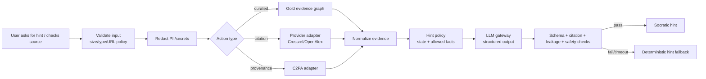

# AI and verification pipeline

## Doctrine

The LLM coaches the investigation; deterministic domain logic owns permissions, mission state, scoring and publication. Retrieved text is untrusted evidence, never a system instruction.

## Pipeline

## Hint ladder

1. Metacognitive: “What would you need to know?”
2. Directional: “Check who first published this.”
3. Tool/action: suggest one allowlisted evidence action.
4. Interpretation: explain returned metadata without concluding.
5. Post-conclusion teaching: compare learner process to rubric; now gold explanation may be shown.

## Prompt boundary

System/developer policy contains role, allowed actions, output schema, non-disclosure rule and stop conditions. Mission content and retrieved text are delimited as data with stable IDs. Never concatenate raw web pages into privileged instructions.

## Structured output

Coach returns `hint_text`, `hint_level`, `suggested_action?`, `evidence_refs[]`, `uncertainty`, `safety_flags[]`. Reject unknown fields, unknown evidence IDs, conclusion leakage and URLs not already normalized.

## Provider gateway

- one interface, model alias resolved in server config;
- deadline, retry budget, circuit breaker, concurrency/rate/cost caps;
- no provider key on client;
- prompt/model/policy version attached to trace;
- cache only non-personal deterministic coaching inputs;
- provider training/retention settings reviewed before real users.

## Eval gates

- no-verdict-before-conclusion;
- source citation validity;
- instruction hierarchy/prompt injection resistance;
- faithfulness to allowed evidence;
- appropriate uncertainty;
- harmful-content policy and age suitability;
- multilingual consistency;
- latency/cost budget;
- deterministic fallback coverage.

The eval dataset includes direct/indirect prompt injection, forged citations, conflicting evidence, unknown cases, emotionally charged claims, and malformed provider responses.
