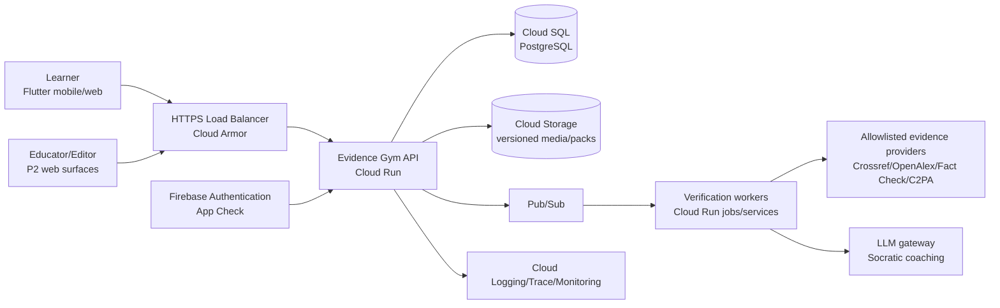

# Architecture

## Decision summary

Build the hackathon version as a **modular monolith** with a Flutter client and a FastAPI service on Google Cloud Run. Keep strict domain/module contracts, a transactional outbox, and stateless workers so high-load or separately owned modules can be extracted later without paying the microservice tax now.

## System context



## Runtime containers

| Container | Responsibility | Does not own |
|---|---|---|
| Flutter learner app | UI, local pack cache, optimistic presentation, accessibility | final XP, authorization, gold verdict |
| API modular monolith | authz, mission state, scoring, receipts, contracts | arbitrary web crawling, model training |
| Verification worker | provider adapters, evidence normalization, safe AI orchestration | product transactions, user authorization |
| PostgreSQL | authoritative users/progress/content/version/audit/outbox | raw large media |
| Cloud Storage | immutable media and pack artifacts | secrets, direct public write access |
| Pub/Sub | asynchronous work and domain-event delivery | source of truth |

## Backend modules

- `identity`: Firebase token verification, roles, consent state.
- `catalog`: published paths, missions and pack versions.
- `learning`: attempts, state machine, skill mastery, boosters.
- `evidence`: actions, normalized sources, evidence graph.
- `coach`: bounded hint policy and LLM gateway.
- `scoring`: process rubric, calibration, XP ledger.
- `receipt`: immutable learner-facing audit artifact.
- `content`: draft/review/publish/version workflow (initially seed scripts/admin API).
- `analytics`: privacy-safe event outbox and aggregates.
- `trust`: reports, case quarantine, corrections, audit.

Modules communicate through application interfaces and domain events, never by reaching into another module's tables directly from feature code.

## Critical request: complete mission

```mermaid
sequenceDiagram
  participant C as Flutter client
  participant A as API
  participant D as PostgreSQL
  participant O as Outbox
  C->>A: POST conclusion + Idempotency-Key
  A->>D: lock attempt; validate state/version
  A->>A: score evidence process and calibration
  A->>D: write conclusion, XP ledger, receipt, progress
  A->>O: write mission.completed event in same transaction
  D-->>A: commit
  A-->>C: receipt + progress + next activity
  O-->>O: async publish to Pub/Sub
```

## Consistency choices

- Strong transaction: attempt completion, XP ledger, progress pointer, receipt, outbox row.
- Eventual: analytics, notifications, recommendations, cohort aggregates.
- Immutable/versioned: published scenario pack and Evidence Receipt.
- Cacheable: public catalog, pack manifest, provider metadata with source-specific TTL.

## Deployment topology

Three isolated projects/environments: `dev`, `staging`, `prod`. Separate service accounts, secrets, databases, buckets, Firebase apps, budgets and logs. Production deploy uses immutable image digest and progressive traffic; migrations run as a gated job before traffic shift.

## Why this wins now

- one vertical slice is buildable by four people;
- offline deterministic demo does not depend on an LLM/provider;
- contracts and module boundaries support parallel work;
- managed services reduce operational load;
- Postgres models relational/versioned learning content cleanly;
- observability and outbox avoid a later rewrite of core trust paths.

See decisions in `docs/09-decisions/` and evolution in [Scaling roadmap](SCALING_ROADMAP.md).

# Extended architecture handbook

This extension turns the concise architecture into an implementation, review and operations handbook for a four-person team.

Requirement identifiers are stable review anchors. They do not claim the implementation already passes; every applicable item needs evidence in code, tests, dashboards, runbooks or reviewed content.

The machine-readable OpenAPI and scenario schemas remain normative for exact payloads.

# A1. Architecture north star

Architecture objective: make **Architecture north star** correct, safe, observable, accessible, reversible and affordable across local, staging and production environments.
Accountable owner: Architecture lead.
Primary elements: `product thesis`, `core loop`, `three-axis model`, `deterministic fallback`, `reviewed content`, `measured learning`.

## A1.1 Responsibilities and boundaries

For Architecture north star, the team must define named ownership, inputs, outputs and forbidden shortcuts.

- **ARC-01-01-01 — product thesis:** must expose an explicit contract and representative fixture; acceptance must include the learner, operator and failure perspective.
- **ARC-01-01-02 — core loop:** must reject unauthorized, unknown or illegal transitions; acceptance must include the learner, operator and failure perspective.
- **ARC-01-01-03 — three-axis model:** must support a deterministic test and demo path; acceptance must include the learner, operator and failure perspective.
- **ARC-01-01-04 — deterministic fallback:** must bound time, size, concurrency, retry and cost; acceptance must include the learner, operator and failure perspective.
- **ARC-01-01-05 — reviewed content:** must propagate correlation context without sensitive content; acceptance must include the learner, operator and failure perspective.
- **ARC-01-01-06 — measured learning:** must provide rollback, kill switch or compatible forward recovery; acceptance must include the learner, operator and failure perspective.

Verification evidence: architecture review covering product thesis and core loop.
Failure signal: boundary violation; containment and recovery must be named before release.
Operational metric: ownership coverage, segmented by environment and version without learner PII.

## A1.2 Interfaces and contracts

For Architecture north star, the team must publish versioned schemas, examples and compatibility windows.

- **ARC-01-02-01 — core loop:** must expose an explicit contract and representative fixture; acceptance must include the learner, operator and failure perspective.
- **ARC-01-02-02 — three-axis model:** must reject unauthorized, unknown or illegal transitions; acceptance must include the learner, operator and failure perspective.
- **ARC-01-02-03 — deterministic fallback:** must support a deterministic test and demo path; acceptance must include the learner, operator and failure perspective.
- **ARC-01-02-04 — reviewed content:** must bound time, size, concurrency, retry and cost; acceptance must include the learner, operator and failure perspective.
- **ARC-01-02-05 — measured learning:** must propagate correlation context without sensitive content; acceptance must include the learner, operator and failure perspective.
- **ARC-01-02-06 — product thesis:** must provide rollback, kill switch or compatible forward recovery; acceptance must include the learner, operator and failure perspective.

Verification evidence: contract test covering core loop and three-axis model.
Failure signal: consumer breakage; containment and recovery must be named before release.
Operational metric: contract pass rate, segmented by environment and version without learner PII.

## A1.3 Data and state

For Architecture north star, the team must declare authority, consistency, lifecycle, retention and correction semantics.

- **ARC-01-03-01 — three-axis model:** must expose an explicit contract and representative fixture; acceptance must include the learner, operator and failure perspective.
- **ARC-01-03-02 — deterministic fallback:** must reject unauthorized, unknown or illegal transitions; acceptance must include the learner, operator and failure perspective.
- **ARC-01-03-03 — reviewed content:** must support a deterministic test and demo path; acceptance must include the learner, operator and failure perspective.
- **ARC-01-03-04 — measured learning:** must bound time, size, concurrency, retry and cost; acceptance must include the learner, operator and failure perspective.
- **ARC-01-03-05 — product thesis:** must propagate correlation context without sensitive content; acceptance must include the learner, operator and failure perspective.
- **ARC-01-03-06 — core loop:** must provide rollback, kill switch or compatible forward recovery; acceptance must include the learner, operator and failure perspective.

Verification evidence: invariant and migration test covering three-axis model and deterministic fallback.
Failure signal: contradictory state; containment and recovery must be named before release.
Operational metric: data correctness, segmented by environment and version without learner PII.

## A1.4 Security and privacy

For Architecture north star, the team must apply least privilege, validation, redaction, consent and audit.

- **ARC-01-04-01 — deterministic fallback:** must expose an explicit contract and representative fixture; acceptance must include the learner, operator and failure perspective.
- **ARC-01-04-02 — reviewed content:** must reject unauthorized, unknown or illegal transitions; acceptance must include the learner, operator and failure perspective.
- **ARC-01-04-03 — measured learning:** must support a deterministic test and demo path; acceptance must include the learner, operator and failure perspective.
- **ARC-01-04-04 — product thesis:** must bound time, size, concurrency, retry and cost; acceptance must include the learner, operator and failure perspective.
- **ARC-01-04-05 — core loop:** must propagate correlation context without sensitive content; acceptance must include the learner, operator and failure perspective.
- **ARC-01-04-06 — three-axis model:** must provide rollback, kill switch or compatible forward recovery; acceptance must include the learner, operator and failure perspective.

Verification evidence: negative security test covering deterministic fallback and reviewed content.
Failure signal: unauthorized access or leakage; containment and recovery must be named before release.
Operational metric: security gate status, segmented by environment and version without learner PII.

## A1.5 Reliability and degraded mode

For Architecture north star, the team must bound timeout, retry, idempotency, backpressure, fallback and recovery.

- **ARC-01-05-01 — reviewed content:** must expose an explicit contract and representative fixture; acceptance must include the learner, operator and failure perspective.
- **ARC-01-05-02 — measured learning:** must reject unauthorized, unknown or illegal transitions; acceptance must include the learner, operator and failure perspective.
- **ARC-01-05-03 — product thesis:** must support a deterministic test and demo path; acceptance must include the learner, operator and failure perspective.
- **ARC-01-05-04 — core loop:** must bound time, size, concurrency, retry and cost; acceptance must include the learner, operator and failure perspective.
- **ARC-01-05-05 — three-axis model:** must propagate correlation context without sensitive content; acceptance must include the learner, operator and failure perspective.
- **ARC-01-05-06 — deterministic fallback:** must provide rollback, kill switch or compatible forward recovery; acceptance must include the learner, operator and failure perspective.

Verification evidence: fault injection covering reviewed content and measured learning.
Failure signal: cascading failure; containment and recovery must be named before release.
Operational metric: degraded completion rate, segmented by environment and version without learner PII.

## A1.6 Observability and operations

For Architecture north star, the team must emit safe traces, metrics, logs, alerts and runbook links.

- **ARC-01-06-01 — measured learning:** must expose an explicit contract and representative fixture; acceptance must include the learner, operator and failure perspective.
- **ARC-01-06-02 — product thesis:** must reject unauthorized, unknown or illegal transitions; acceptance must include the learner, operator and failure perspective.
- **ARC-01-06-03 — core loop:** must support a deterministic test and demo path; acceptance must include the learner, operator and failure perspective.
- **ARC-01-06-04 — three-axis model:** must bound time, size, concurrency, retry and cost; acceptance must include the learner, operator and failure perspective.
- **ARC-01-06-05 — deterministic fallback:** must propagate correlation context without sensitive content; acceptance must include the learner, operator and failure perspective.
- **ARC-01-06-06 — reviewed content:** must provide rollback, kill switch or compatible forward recovery; acceptance must include the learner, operator and failure perspective.

Verification evidence: alert drill covering measured learning and product thesis.
Failure signal: silent failure; containment and recovery must be named before release.
Operational metric: SLO coverage, segmented by environment and version without learner PII.

## A1.7 Testing and acceptance

For Architecture north star, the team must cover domain, contract, integration, E2E and manual risk checks.

- **ARC-01-07-01 — product thesis:** must expose an explicit contract and representative fixture; acceptance must include the learner, operator and failure perspective.
- **ARC-01-07-02 — core loop:** must reject unauthorized, unknown or illegal transitions; acceptance must include the learner, operator and failure perspective.
- **ARC-01-07-03 — three-axis model:** must support a deterministic test and demo path; acceptance must include the learner, operator and failure perspective.
- **ARC-01-07-04 — deterministic fallback:** must bound time, size, concurrency, retry and cost; acceptance must include the learner, operator and failure perspective.
- **ARC-01-07-05 — reviewed content:** must propagate correlation context without sensitive content; acceptance must include the learner, operator and failure perspective.
- **ARC-01-07-06 — measured learning:** must provide rollback, kill switch or compatible forward recovery; acceptance must include the learner, operator and failure perspective.

Verification evidence: release test matrix covering product thesis and core loop.
Failure signal: escaped regression; containment and recovery must be named before release.
Operational metric: test effectiveness, segmented by environment and version without learner PII.

## A1.8 Evolution and decisions

For Architecture north star, the team must name scale triggers, reversible paths, ADRs and deprecation policy.

- **ARC-01-08-01 — core loop:** must expose an explicit contract and representative fixture; acceptance must include the learner, operator and failure perspective.
- **ARC-01-08-02 — three-axis model:** must reject unauthorized, unknown or illegal transitions; acceptance must include the learner, operator and failure perspective.
- **ARC-01-08-03 — deterministic fallback:** must support a deterministic test and demo path; acceptance must include the learner, operator and failure perspective.
- **ARC-01-08-04 — reviewed content:** must bound time, size, concurrency, retry and cost; acceptance must include the learner, operator and failure perspective.
- **ARC-01-08-05 — measured learning:** must propagate correlation context without sensitive content; acceptance must include the learner, operator and failure perspective.
- **ARC-01-08-06 — product thesis:** must provide rollback, kill switch or compatible forward recovery; acceptance must include the learner, operator and failure perspective.

Verification evidence: ADR and capacity review covering core loop and three-axis model.
Failure signal: premature complexity; containment and recovery must be named before release.
Operational metric: decision freshness, segmented by environment and version without learner PII.


# A2. Requirements and constraints

Architecture objective: make **Requirements and constraints** correct, safe, observable, accessible, reversible and affordable across local, staging and production environments.
Accountable owner: All four owners.
Primary elements: `P0 scope`, `quality attributes`, `deadline`, `team capacity`, `external dependencies`, `ethical constraints`.

## A2.1 Responsibilities and boundaries

For Requirements and constraints, the team must define named ownership, inputs, outputs and forbidden shortcuts.

- **ARC-02-01-01 — P0 scope:** must expose an explicit contract and representative fixture; acceptance must include the learner, operator and failure perspective.
- **ARC-02-01-02 — quality attributes:** must reject unauthorized, unknown or illegal transitions; acceptance must include the learner, operator and failure perspective.
- **ARC-02-01-03 — deadline:** must support a deterministic test and demo path; acceptance must include the learner, operator and failure perspective.
- **ARC-02-01-04 — team capacity:** must bound time, size, concurrency, retry and cost; acceptance must include the learner, operator and failure perspective.
- **ARC-02-01-05 — external dependencies:** must propagate correlation context without sensitive content; acceptance must include the learner, operator and failure perspective.
- **ARC-02-01-06 — ethical constraints:** must provide rollback, kill switch or compatible forward recovery; acceptance must include the learner, operator and failure perspective.

Verification evidence: architecture review covering P0 scope and quality attributes.
Failure signal: boundary violation; containment and recovery must be named before release.
Operational metric: ownership coverage, segmented by environment and version without learner PII.

## A2.2 Interfaces and contracts

For Requirements and constraints, the team must publish versioned schemas, examples and compatibility windows.

- **ARC-02-02-01 — quality attributes:** must expose an explicit contract and representative fixture; acceptance must include the learner, operator and failure perspective.
- **ARC-02-02-02 — deadline:** must reject unauthorized, unknown or illegal transitions; acceptance must include the learner, operator and failure perspective.
- **ARC-02-02-03 — team capacity:** must support a deterministic test and demo path; acceptance must include the learner, operator and failure perspective.
- **ARC-02-02-04 — external dependencies:** must bound time, size, concurrency, retry and cost; acceptance must include the learner, operator and failure perspective.
- **ARC-02-02-05 — ethical constraints:** must propagate correlation context without sensitive content; acceptance must include the learner, operator and failure perspective.
- **ARC-02-02-06 — P0 scope:** must provide rollback, kill switch or compatible forward recovery; acceptance must include the learner, operator and failure perspective.

Verification evidence: contract test covering quality attributes and deadline.
Failure signal: consumer breakage; containment and recovery must be named before release.
Operational metric: contract pass rate, segmented by environment and version without learner PII.

## A2.3 Data and state

For Requirements and constraints, the team must declare authority, consistency, lifecycle, retention and correction semantics.

- **ARC-02-03-01 — deadline:** must expose an explicit contract and representative fixture; acceptance must include the learner, operator and failure perspective.
- **ARC-02-03-02 — team capacity:** must reject unauthorized, unknown or illegal transitions; acceptance must include the learner, operator and failure perspective.
- **ARC-02-03-03 — external dependencies:** must support a deterministic test and demo path; acceptance must include the learner, operator and failure perspective.
- **ARC-02-03-04 — ethical constraints:** must bound time, size, concurrency, retry and cost; acceptance must include the learner, operator and failure perspective.
- **ARC-02-03-05 — P0 scope:** must propagate correlation context without sensitive content; acceptance must include the learner, operator and failure perspective.
- **ARC-02-03-06 — quality attributes:** must provide rollback, kill switch or compatible forward recovery; acceptance must include the learner, operator and failure perspective.

Verification evidence: invariant and migration test covering deadline and team capacity.
Failure signal: contradictory state; containment and recovery must be named before release.
Operational metric: data correctness, segmented by environment and version without learner PII.

## A2.4 Security and privacy

For Requirements and constraints, the team must apply least privilege, validation, redaction, consent and audit.

- **ARC-02-04-01 — team capacity:** must expose an explicit contract and representative fixture; acceptance must include the learner, operator and failure perspective.
- **ARC-02-04-02 — external dependencies:** must reject unauthorized, unknown or illegal transitions; acceptance must include the learner, operator and failure perspective.
- **ARC-02-04-03 — ethical constraints:** must support a deterministic test and demo path; acceptance must include the learner, operator and failure perspective.
- **ARC-02-04-04 — P0 scope:** must bound time, size, concurrency, retry and cost; acceptance must include the learner, operator and failure perspective.
- **ARC-02-04-05 — quality attributes:** must propagate correlation context without sensitive content; acceptance must include the learner, operator and failure perspective.
- **ARC-02-04-06 — deadline:** must provide rollback, kill switch or compatible forward recovery; acceptance must include the learner, operator and failure perspective.

Verification evidence: negative security test covering team capacity and external dependencies.
Failure signal: unauthorized access or leakage; containment and recovery must be named before release.
Operational metric: security gate status, segmented by environment and version without learner PII.

## A2.5 Reliability and degraded mode

For Requirements and constraints, the team must bound timeout, retry, idempotency, backpressure, fallback and recovery.

- **ARC-02-05-01 — external dependencies:** must expose an explicit contract and representative fixture; acceptance must include the learner, operator and failure perspective.
- **ARC-02-05-02 — ethical constraints:** must reject unauthorized, unknown or illegal transitions; acceptance must include the learner, operator and failure perspective.
- **ARC-02-05-03 — P0 scope:** must support a deterministic test and demo path; acceptance must include the learner, operator and failure perspective.
- **ARC-02-05-04 — quality attributes:** must bound time, size, concurrency, retry and cost; acceptance must include the learner, operator and failure perspective.
- **ARC-02-05-05 — deadline:** must propagate correlation context without sensitive content; acceptance must include the learner, operator and failure perspective.
- **ARC-02-05-06 — team capacity:** must provide rollback, kill switch or compatible forward recovery; acceptance must include the learner, operator and failure perspective.

Verification evidence: fault injection covering external dependencies and ethical constraints.
Failure signal: cascading failure; containment and recovery must be named before release.
Operational metric: degraded completion rate, segmented by environment and version without learner PII.

## A2.6 Observability and operations

For Requirements and constraints, the team must emit safe traces, metrics, logs, alerts and runbook links.

- **ARC-02-06-01 — ethical constraints:** must expose an explicit contract and representative fixture; acceptance must include the learner, operator and failure perspective.
- **ARC-02-06-02 — P0 scope:** must reject unauthorized, unknown or illegal transitions; acceptance must include the learner, operator and failure perspective.
- **ARC-02-06-03 — quality attributes:** must support a deterministic test and demo path; acceptance must include the learner, operator and failure perspective.
- **ARC-02-06-04 — deadline:** must bound time, size, concurrency, retry and cost; acceptance must include the learner, operator and failure perspective.
- **ARC-02-06-05 — team capacity:** must propagate correlation context without sensitive content; acceptance must include the learner, operator and failure perspective.
- **ARC-02-06-06 — external dependencies:** must provide rollback, kill switch or compatible forward recovery; acceptance must include the learner, operator and failure perspective.

Verification evidence: alert drill covering ethical constraints and P0 scope.
Failure signal: silent failure; containment and recovery must be named before release.
Operational metric: SLO coverage, segmented by environment and version without learner PII.

## A2.7 Testing and acceptance

For Requirements and constraints, the team must cover domain, contract, integration, E2E and manual risk checks.

- **ARC-02-07-01 — P0 scope:** must expose an explicit contract and representative fixture; acceptance must include the learner, operator and failure perspective.
- **ARC-02-07-02 — quality attributes:** must reject unauthorized, unknown or illegal transitions; acceptance must include the learner, operator and failure perspective.
- **ARC-02-07-03 — deadline:** must support a deterministic test and demo path; acceptance must include the learner, operator and failure perspective.
- **ARC-02-07-04 — team capacity:** must bound time, size, concurrency, retry and cost; acceptance must include the learner, operator and failure perspective.
- **ARC-02-07-05 — external dependencies:** must propagate correlation context without sensitive content; acceptance must include the learner, operator and failure perspective.
- **ARC-02-07-06 — ethical constraints:** must provide rollback, kill switch or compatible forward recovery; acceptance must include the learner, operator and failure perspective.

Verification evidence: release test matrix covering P0 scope and quality attributes.
Failure signal: escaped regression; containment and recovery must be named before release.
Operational metric: test effectiveness, segmented by environment and version without learner PII.

## A2.8 Evolution and decisions

For Requirements and constraints, the team must name scale triggers, reversible paths, ADRs and deprecation policy.

- **ARC-02-08-01 — quality attributes:** must expose an explicit contract and representative fixture; acceptance must include the learner, operator and failure perspective.
- **ARC-02-08-02 — deadline:** must reject unauthorized, unknown or illegal transitions; acceptance must include the learner, operator and failure perspective.
- **ARC-02-08-03 — team capacity:** must support a deterministic test and demo path; acceptance must include the learner, operator and failure perspective.
- **ARC-02-08-04 — external dependencies:** must bound time, size, concurrency, retry and cost; acceptance must include the learner, operator and failure perspective.
- **ARC-02-08-05 — ethical constraints:** must propagate correlation context without sensitive content; acceptance must include the learner, operator and failure perspective.
- **ARC-02-08-06 — P0 scope:** must provide rollback, kill switch or compatible forward recovery; acceptance must include the learner, operator and failure perspective.

Verification evidence: ADR and capacity review covering quality attributes and deadline.
Failure signal: premature complexity; containment and recovery must be named before release.
Operational metric: decision freshness, segmented by environment and version without learner PII.


# A3. System context and actors

Architecture objective: make **System context and actors** correct, safe, observable, accessible, reversible and affordable across local, staging and production environments.
Accountable owner: Architecture lead.
Primary elements: `learner`, `guest`, `educator`, `editor`, `evidence provider`, `cloud operator`.

## A3.1 Responsibilities and boundaries

For System context and actors, the team must define named ownership, inputs, outputs and forbidden shortcuts.

- **ARC-03-01-01 — learner:** must expose an explicit contract and representative fixture; acceptance must include the learner, operator and failure perspective.
- **ARC-03-01-02 — guest:** must reject unauthorized, unknown or illegal transitions; acceptance must include the learner, operator and failure perspective.
- **ARC-03-01-03 — educator:** must support a deterministic test and demo path; acceptance must include the learner, operator and failure perspective.
- **ARC-03-01-04 — editor:** must bound time, size, concurrency, retry and cost; acceptance must include the learner, operator and failure perspective.
- **ARC-03-01-05 — evidence provider:** must propagate correlation context without sensitive content; acceptance must include the learner, operator and failure perspective.
- **ARC-03-01-06 — cloud operator:** must provide rollback, kill switch or compatible forward recovery; acceptance must include the learner, operator and failure perspective.

Verification evidence: architecture review covering learner and guest.
Failure signal: boundary violation; containment and recovery must be named before release.
Operational metric: ownership coverage, segmented by environment and version without learner PII.

## A3.2 Interfaces and contracts

For System context and actors, the team must publish versioned schemas, examples and compatibility windows.

- **ARC-03-02-01 — guest:** must expose an explicit contract and representative fixture; acceptance must include the learner, operator and failure perspective.
- **ARC-03-02-02 — educator:** must reject unauthorized, unknown or illegal transitions; acceptance must include the learner, operator and failure perspective.
- **ARC-03-02-03 — editor:** must support a deterministic test and demo path; acceptance must include the learner, operator and failure perspective.
- **ARC-03-02-04 — evidence provider:** must bound time, size, concurrency, retry and cost; acceptance must include the learner, operator and failure perspective.
- **ARC-03-02-05 — cloud operator:** must propagate correlation context without sensitive content; acceptance must include the learner, operator and failure perspective.
- **ARC-03-02-06 — learner:** must provide rollback, kill switch or compatible forward recovery; acceptance must include the learner, operator and failure perspective.

Verification evidence: contract test covering guest and educator.
Failure signal: consumer breakage; containment and recovery must be named before release.
Operational metric: contract pass rate, segmented by environment and version without learner PII.

## A3.3 Data and state

For System context and actors, the team must declare authority, consistency, lifecycle, retention and correction semantics.

- **ARC-03-03-01 — educator:** must expose an explicit contract and representative fixture; acceptance must include the learner, operator and failure perspective.
- **ARC-03-03-02 — editor:** must reject unauthorized, unknown or illegal transitions; acceptance must include the learner, operator and failure perspective.
- **ARC-03-03-03 — evidence provider:** must support a deterministic test and demo path; acceptance must include the learner, operator and failure perspective.
- **ARC-03-03-04 — cloud operator:** must bound time, size, concurrency, retry and cost; acceptance must include the learner, operator and failure perspective.
- **ARC-03-03-05 — learner:** must propagate correlation context without sensitive content; acceptance must include the learner, operator and failure perspective.
- **ARC-03-03-06 — guest:** must provide rollback, kill switch or compatible forward recovery; acceptance must include the learner, operator and failure perspective.

Verification evidence: invariant and migration test covering educator and editor.
Failure signal: contradictory state; containment and recovery must be named before release.
Operational metric: data correctness, segmented by environment and version without learner PII.

## A3.4 Security and privacy

For System context and actors, the team must apply least privilege, validation, redaction, consent and audit.

- **ARC-03-04-01 — editor:** must expose an explicit contract and representative fixture; acceptance must include the learner, operator and failure perspective.
- **ARC-03-04-02 — evidence provider:** must reject unauthorized, unknown or illegal transitions; acceptance must include the learner, operator and failure perspective.
- **ARC-03-04-03 — cloud operator:** must support a deterministic test and demo path; acceptance must include the learner, operator and failure perspective.
- **ARC-03-04-04 — learner:** must bound time, size, concurrency, retry and cost; acceptance must include the learner, operator and failure perspective.
- **ARC-03-04-05 — guest:** must propagate correlation context without sensitive content; acceptance must include the learner, operator and failure perspective.
- **ARC-03-04-06 — educator:** must provide rollback, kill switch or compatible forward recovery; acceptance must include the learner, operator and failure perspective.

Verification evidence: negative security test covering editor and evidence provider.
Failure signal: unauthorized access or leakage; containment and recovery must be named before release.
Operational metric: security gate status, segmented by environment and version without learner PII.

## A3.5 Reliability and degraded mode

For System context and actors, the team must bound timeout, retry, idempotency, backpressure, fallback and recovery.

- **ARC-03-05-01 — evidence provider:** must expose an explicit contract and representative fixture; acceptance must include the learner, operator and failure perspective.
- **ARC-03-05-02 — cloud operator:** must reject unauthorized, unknown or illegal transitions; acceptance must include the learner, operator and failure perspective.
- **ARC-03-05-03 — learner:** must support a deterministic test and demo path; acceptance must include the learner, operator and failure perspective.
- **ARC-03-05-04 — guest:** must bound time, size, concurrency, retry and cost; acceptance must include the learner, operator and failure perspective.
- **ARC-03-05-05 — educator:** must propagate correlation context without sensitive content; acceptance must include the learner, operator and failure perspective.
- **ARC-03-05-06 — editor:** must provide rollback, kill switch or compatible forward recovery; acceptance must include the learner, operator and failure perspective.

Verification evidence: fault injection covering evidence provider and cloud operator.
Failure signal: cascading failure; containment and recovery must be named before release.
Operational metric: degraded completion rate, segmented by environment and version without learner PII.

## A3.6 Observability and operations

For System context and actors, the team must emit safe traces, metrics, logs, alerts and runbook links.

- **ARC-03-06-01 — cloud operator:** must expose an explicit contract and representative fixture; acceptance must include the learner, operator and failure perspective.
- **ARC-03-06-02 — learner:** must reject unauthorized, unknown or illegal transitions; acceptance must include the learner, operator and failure perspective.
- **ARC-03-06-03 — guest:** must support a deterministic test and demo path; acceptance must include the learner, operator and failure perspective.
- **ARC-03-06-04 — educator:** must bound time, size, concurrency, retry and cost; acceptance must include the learner, operator and failure perspective.
- **ARC-03-06-05 — editor:** must propagate correlation context without sensitive content; acceptance must include the learner, operator and failure perspective.
- **ARC-03-06-06 — evidence provider:** must provide rollback, kill switch or compatible forward recovery; acceptance must include the learner, operator and failure perspective.

Verification evidence: alert drill covering cloud operator and learner.
Failure signal: silent failure; containment and recovery must be named before release.
Operational metric: SLO coverage, segmented by environment and version without learner PII.

## A3.7 Testing and acceptance

For System context and actors, the team must cover domain, contract, integration, E2E and manual risk checks.

- **ARC-03-07-01 — learner:** must expose an explicit contract and representative fixture; acceptance must include the learner, operator and failure perspective.
- **ARC-03-07-02 — guest:** must reject unauthorized, unknown or illegal transitions; acceptance must include the learner, operator and failure perspective.
- **ARC-03-07-03 — educator:** must support a deterministic test and demo path; acceptance must include the learner, operator and failure perspective.
- **ARC-03-07-04 — editor:** must bound time, size, concurrency, retry and cost; acceptance must include the learner, operator and failure perspective.
- **ARC-03-07-05 — evidence provider:** must propagate correlation context without sensitive content; acceptance must include the learner, operator and failure perspective.
- **ARC-03-07-06 — cloud operator:** must provide rollback, kill switch or compatible forward recovery; acceptance must include the learner, operator and failure perspective.

Verification evidence: release test matrix covering learner and guest.
Failure signal: escaped regression; containment and recovery must be named before release.
Operational metric: test effectiveness, segmented by environment and version without learner PII.

## A3.8 Evolution and decisions

For System context and actors, the team must name scale triggers, reversible paths, ADRs and deprecation policy.

- **ARC-03-08-01 — guest:** must expose an explicit contract and representative fixture; acceptance must include the learner, operator and failure perspective.
- **ARC-03-08-02 — educator:** must reject unauthorized, unknown or illegal transitions; acceptance must include the learner, operator and failure perspective.
- **ARC-03-08-03 — editor:** must support a deterministic test and demo path; acceptance must include the learner, operator and failure perspective.
- **ARC-03-08-04 — evidence provider:** must bound time, size, concurrency, retry and cost; acceptance must include the learner, operator and failure perspective.
- **ARC-03-08-05 — cloud operator:** must propagate correlation context without sensitive content; acceptance must include the learner, operator and failure perspective.
- **ARC-03-08-06 — learner:** must provide rollback, kill switch or compatible forward recovery; acceptance must include the learner, operator and failure perspective.

Verification evidence: ADR and capacity review covering guest and educator.
Failure signal: premature complexity; containment and recovery must be named before release.
Operational metric: decision freshness, segmented by environment and version without learner PII.


# A4. Platform boundary and modular monolith

Architecture objective: make **Platform boundary and modular monolith** correct, safe, observable, accessible, reversible and affordable across local, staging and production environments.
Accountable owner: Platform owner.
Primary elements: `identity`, `catalog`, `learning`, `evidence`, `coach`, `trust`.

## A4.1 Responsibilities and boundaries

For Platform boundary and modular monolith, the team must define named ownership, inputs, outputs and forbidden shortcuts.

- **ARC-04-01-01 — identity:** must expose an explicit contract and representative fixture; acceptance must include the learner, operator and failure perspective.
- **ARC-04-01-02 — catalog:** must reject unauthorized, unknown or illegal transitions; acceptance must include the learner, operator and failure perspective.
- **ARC-04-01-03 — learning:** must support a deterministic test and demo path; acceptance must include the learner, operator and failure perspective.
- **ARC-04-01-04 — evidence:** must bound time, size, concurrency, retry and cost; acceptance must include the learner, operator and failure perspective.
- **ARC-04-01-05 — coach:** must propagate correlation context without sensitive content; acceptance must include the learner, operator and failure perspective.
- **ARC-04-01-06 — trust:** must provide rollback, kill switch or compatible forward recovery; acceptance must include the learner, operator and failure perspective.

Verification evidence: architecture review covering identity and catalog.
Failure signal: boundary violation; containment and recovery must be named before release.
Operational metric: ownership coverage, segmented by environment and version without learner PII.

## A4.2 Interfaces and contracts

For Platform boundary and modular monolith, the team must publish versioned schemas, examples and compatibility windows.

- **ARC-04-02-01 — catalog:** must expose an explicit contract and representative fixture; acceptance must include the learner, operator and failure perspective.
- **ARC-04-02-02 — learning:** must reject unauthorized, unknown or illegal transitions; acceptance must include the learner, operator and failure perspective.
- **ARC-04-02-03 — evidence:** must support a deterministic test and demo path; acceptance must include the learner, operator and failure perspective.
- **ARC-04-02-04 — coach:** must bound time, size, concurrency, retry and cost; acceptance must include the learner, operator and failure perspective.
- **ARC-04-02-05 — trust:** must propagate correlation context without sensitive content; acceptance must include the learner, operator and failure perspective.
- **ARC-04-02-06 — identity:** must provide rollback, kill switch or compatible forward recovery; acceptance must include the learner, operator and failure perspective.

Verification evidence: contract test covering catalog and learning.
Failure signal: consumer breakage; containment and recovery must be named before release.
Operational metric: contract pass rate, segmented by environment and version without learner PII.

## A4.3 Data and state

For Platform boundary and modular monolith, the team must declare authority, consistency, lifecycle, retention and correction semantics.

- **ARC-04-03-01 — learning:** must expose an explicit contract and representative fixture; acceptance must include the learner, operator and failure perspective.
- **ARC-04-03-02 — evidence:** must reject unauthorized, unknown or illegal transitions; acceptance must include the learner, operator and failure perspective.
- **ARC-04-03-03 — coach:** must support a deterministic test and demo path; acceptance must include the learner, operator and failure perspective.
- **ARC-04-03-04 — trust:** must bound time, size, concurrency, retry and cost; acceptance must include the learner, operator and failure perspective.
- **ARC-04-03-05 — identity:** must propagate correlation context without sensitive content; acceptance must include the learner, operator and failure perspective.
- **ARC-04-03-06 — catalog:** must provide rollback, kill switch or compatible forward recovery; acceptance must include the learner, operator and failure perspective.

Verification evidence: invariant and migration test covering learning and evidence.
Failure signal: contradictory state; containment and recovery must be named before release.
Operational metric: data correctness, segmented by environment and version without learner PII.

## A4.4 Security and privacy

For Platform boundary and modular monolith, the team must apply least privilege, validation, redaction, consent and audit.

- **ARC-04-04-01 — evidence:** must expose an explicit contract and representative fixture; acceptance must include the learner, operator and failure perspective.
- **ARC-04-04-02 — coach:** must reject unauthorized, unknown or illegal transitions; acceptance must include the learner, operator and failure perspective.
- **ARC-04-04-03 — trust:** must support a deterministic test and demo path; acceptance must include the learner, operator and failure perspective.
- **ARC-04-04-04 — identity:** must bound time, size, concurrency, retry and cost; acceptance must include the learner, operator and failure perspective.
- **ARC-04-04-05 — catalog:** must propagate correlation context without sensitive content; acceptance must include the learner, operator and failure perspective.
- **ARC-04-04-06 — learning:** must provide rollback, kill switch or compatible forward recovery; acceptance must include the learner, operator and failure perspective.

Verification evidence: negative security test covering evidence and coach.
Failure signal: unauthorized access or leakage; containment and recovery must be named before release.
Operational metric: security gate status, segmented by environment and version without learner PII.

## A4.5 Reliability and degraded mode

For Platform boundary and modular monolith, the team must bound timeout, retry, idempotency, backpressure, fallback and recovery.

- **ARC-04-05-01 — coach:** must expose an explicit contract and representative fixture; acceptance must include the learner, operator and failure perspective.
- **ARC-04-05-02 — trust:** must reject unauthorized, unknown or illegal transitions; acceptance must include the learner, operator and failure perspective.
- **ARC-04-05-03 — identity:** must support a deterministic test and demo path; acceptance must include the learner, operator and failure perspective.
- **ARC-04-05-04 — catalog:** must bound time, size, concurrency, retry and cost; acceptance must include the learner, operator and failure perspective.
- **ARC-04-05-05 — learning:** must propagate correlation context without sensitive content; acceptance must include the learner, operator and failure perspective.
- **ARC-04-05-06 — evidence:** must provide rollback, kill switch or compatible forward recovery; acceptance must include the learner, operator and failure perspective.

Verification evidence: fault injection covering coach and trust.
Failure signal: cascading failure; containment and recovery must be named before release.
Operational metric: degraded completion rate, segmented by environment and version without learner PII.

## A4.6 Observability and operations

For Platform boundary and modular monolith, the team must emit safe traces, metrics, logs, alerts and runbook links.

- **ARC-04-06-01 — trust:** must expose an explicit contract and representative fixture; acceptance must include the learner, operator and failure perspective.
- **ARC-04-06-02 — identity:** must reject unauthorized, unknown or illegal transitions; acceptance must include the learner, operator and failure perspective.
- **ARC-04-06-03 — catalog:** must support a deterministic test and demo path; acceptance must include the learner, operator and failure perspective.
- **ARC-04-06-04 — learning:** must bound time, size, concurrency, retry and cost; acceptance must include the learner, operator and failure perspective.
- **ARC-04-06-05 — evidence:** must propagate correlation context without sensitive content; acceptance must include the learner, operator and failure perspective.
- **ARC-04-06-06 — coach:** must provide rollback, kill switch or compatible forward recovery; acceptance must include the learner, operator and failure perspective.

Verification evidence: alert drill covering trust and identity.
Failure signal: silent failure; containment and recovery must be named before release.
Operational metric: SLO coverage, segmented by environment and version without learner PII.

## A4.7 Testing and acceptance

For Platform boundary and modular monolith, the team must cover domain, contract, integration, E2E and manual risk checks.

- **ARC-04-07-01 — identity:** must expose an explicit contract and representative fixture; acceptance must include the learner, operator and failure perspective.
- **ARC-04-07-02 — catalog:** must reject unauthorized, unknown or illegal transitions; acceptance must include the learner, operator and failure perspective.
- **ARC-04-07-03 — learning:** must support a deterministic test and demo path; acceptance must include the learner, operator and failure perspective.
- **ARC-04-07-04 — evidence:** must bound time, size, concurrency, retry and cost; acceptance must include the learner, operator and failure perspective.
- **ARC-04-07-05 — coach:** must propagate correlation context without sensitive content; acceptance must include the learner, operator and failure perspective.
- **ARC-04-07-06 — trust:** must provide rollback, kill switch or compatible forward recovery; acceptance must include the learner, operator and failure perspective.

Verification evidence: release test matrix covering identity and catalog.
Failure signal: escaped regression; containment and recovery must be named before release.
Operational metric: test effectiveness, segmented by environment and version without learner PII.

## A4.8 Evolution and decisions

For Platform boundary and modular monolith, the team must name scale triggers, reversible paths, ADRs and deprecation policy.

- **ARC-04-08-01 — catalog:** must expose an explicit contract and representative fixture; acceptance must include the learner, operator and failure perspective.
- **ARC-04-08-02 — learning:** must reject unauthorized, unknown or illegal transitions; acceptance must include the learner, operator and failure perspective.
- **ARC-04-08-03 — evidence:** must support a deterministic test and demo path; acceptance must include the learner, operator and failure perspective.
- **ARC-04-08-04 — coach:** must bound time, size, concurrency, retry and cost; acceptance must include the learner, operator and failure perspective.
- **ARC-04-08-05 — trust:** must propagate correlation context without sensitive content; acceptance must include the learner, operator and failure perspective.
- **ARC-04-08-06 — identity:** must provide rollback, kill switch or compatible forward recovery; acceptance must include the learner, operator and failure perspective.

Verification evidence: ADR and capacity review covering catalog and learning.
Failure signal: premature complexity; containment and recovery must be named before release.
Operational metric: decision freshness, segmented by environment and version without learner PII.


# A5. Flutter client architecture

Architecture objective: make **Flutter client architecture** correct, safe, observable, accessible, reversible and affordable across local, staging and production environments.
Accountable owner: Frontend owner.
Primary elements: `application shell`, `feature modules`, `design system`, `API client`, `local cache`, `accessibility layer`.

## A5.1 Responsibilities and boundaries

For Flutter client architecture, the team must define named ownership, inputs, outputs and forbidden shortcuts.

- **ARC-05-01-01 — application shell:** must expose an explicit contract and representative fixture; acceptance must include the learner, operator and failure perspective.
- **ARC-05-01-02 — feature modules:** must reject unauthorized, unknown or illegal transitions; acceptance must include the learner, operator and failure perspective.
- **ARC-05-01-03 — design system:** must support a deterministic test and demo path; acceptance must include the learner, operator and failure perspective.
- **ARC-05-01-04 — API client:** must bound time, size, concurrency, retry and cost; acceptance must include the learner, operator and failure perspective.
- **ARC-05-01-05 — local cache:** must propagate correlation context without sensitive content; acceptance must include the learner, operator and failure perspective.
- **ARC-05-01-06 — accessibility layer:** must provide rollback, kill switch or compatible forward recovery; acceptance must include the learner, operator and failure perspective.

Verification evidence: architecture review covering application shell and feature modules.
Failure signal: boundary violation; containment and recovery must be named before release.
Operational metric: ownership coverage, segmented by environment and version without learner PII.

## A5.2 Interfaces and contracts

For Flutter client architecture, the team must publish versioned schemas, examples and compatibility windows.

- **ARC-05-02-01 — feature modules:** must expose an explicit contract and representative fixture; acceptance must include the learner, operator and failure perspective.
- **ARC-05-02-02 — design system:** must reject unauthorized, unknown or illegal transitions; acceptance must include the learner, operator and failure perspective.
- **ARC-05-02-03 — API client:** must support a deterministic test and demo path; acceptance must include the learner, operator and failure perspective.
- **ARC-05-02-04 — local cache:** must bound time, size, concurrency, retry and cost; acceptance must include the learner, operator and failure perspective.
- **ARC-05-02-05 — accessibility layer:** must propagate correlation context without sensitive content; acceptance must include the learner, operator and failure perspective.
- **ARC-05-02-06 — application shell:** must provide rollback, kill switch or compatible forward recovery; acceptance must include the learner, operator and failure perspective.

Verification evidence: contract test covering feature modules and design system.
Failure signal: consumer breakage; containment and recovery must be named before release.
Operational metric: contract pass rate, segmented by environment and version without learner PII.

## A5.3 Data and state

For Flutter client architecture, the team must declare authority, consistency, lifecycle, retention and correction semantics.

- **ARC-05-03-01 — design system:** must expose an explicit contract and representative fixture; acceptance must include the learner, operator and failure perspective.
- **ARC-05-03-02 — API client:** must reject unauthorized, unknown or illegal transitions; acceptance must include the learner, operator and failure perspective.
- **ARC-05-03-03 — local cache:** must support a deterministic test and demo path; acceptance must include the learner, operator and failure perspective.
- **ARC-05-03-04 — accessibility layer:** must bound time, size, concurrency, retry and cost; acceptance must include the learner, operator and failure perspective.
- **ARC-05-03-05 — application shell:** must propagate correlation context without sensitive content; acceptance must include the learner, operator and failure perspective.
- **ARC-05-03-06 — feature modules:** must provide rollback, kill switch or compatible forward recovery; acceptance must include the learner, operator and failure perspective.

Verification evidence: invariant and migration test covering design system and API client.
Failure signal: contradictory state; containment and recovery must be named before release.
Operational metric: data correctness, segmented by environment and version without learner PII.

## A5.4 Security and privacy

For Flutter client architecture, the team must apply least privilege, validation, redaction, consent and audit.

- **ARC-05-04-01 — API client:** must expose an explicit contract and representative fixture; acceptance must include the learner, operator and failure perspective.
- **ARC-05-04-02 — local cache:** must reject unauthorized, unknown or illegal transitions; acceptance must include the learner, operator and failure perspective.
- **ARC-05-04-03 — accessibility layer:** must support a deterministic test and demo path; acceptance must include the learner, operator and failure perspective.
- **ARC-05-04-04 — application shell:** must bound time, size, concurrency, retry and cost; acceptance must include the learner, operator and failure perspective.
- **ARC-05-04-05 — feature modules:** must propagate correlation context without sensitive content; acceptance must include the learner, operator and failure perspective.
- **ARC-05-04-06 — design system:** must provide rollback, kill switch or compatible forward recovery; acceptance must include the learner, operator and failure perspective.

Verification evidence: negative security test covering API client and local cache.
Failure signal: unauthorized access or leakage; containment and recovery must be named before release.
Operational metric: security gate status, segmented by environment and version without learner PII.

## A5.5 Reliability and degraded mode

For Flutter client architecture, the team must bound timeout, retry, idempotency, backpressure, fallback and recovery.

- **ARC-05-05-01 — local cache:** must expose an explicit contract and representative fixture; acceptance must include the learner, operator and failure perspective.
- **ARC-05-05-02 — accessibility layer:** must reject unauthorized, unknown or illegal transitions; acceptance must include the learner, operator and failure perspective.
- **ARC-05-05-03 — application shell:** must support a deterministic test and demo path; acceptance must include the learner, operator and failure perspective.
- **ARC-05-05-04 — feature modules:** must bound time, size, concurrency, retry and cost; acceptance must include the learner, operator and failure perspective.
- **ARC-05-05-05 — design system:** must propagate correlation context without sensitive content; acceptance must include the learner, operator and failure perspective.
- **ARC-05-05-06 — API client:** must provide rollback, kill switch or compatible forward recovery; acceptance must include the learner, operator and failure perspective.

Verification evidence: fault injection covering local cache and accessibility layer.
Failure signal: cascading failure; containment and recovery must be named before release.
Operational metric: degraded completion rate, segmented by environment and version without learner PII.

## A5.6 Observability and operations

For Flutter client architecture, the team must emit safe traces, metrics, logs, alerts and runbook links.

- **ARC-05-06-01 — accessibility layer:** must expose an explicit contract and representative fixture; acceptance must include the learner, operator and failure perspective.
- **ARC-05-06-02 — application shell:** must reject unauthorized, unknown or illegal transitions; acceptance must include the learner, operator and failure perspective.
- **ARC-05-06-03 — feature modules:** must support a deterministic test and demo path; acceptance must include the learner, operator and failure perspective.
- **ARC-05-06-04 — design system:** must bound time, size, concurrency, retry and cost; acceptance must include the learner, operator and failure perspective.
- **ARC-05-06-05 — API client:** must propagate correlation context without sensitive content; acceptance must include the learner, operator and failure perspective.
- **ARC-05-06-06 — local cache:** must provide rollback, kill switch or compatible forward recovery; acceptance must include the learner, operator and failure perspective.

Verification evidence: alert drill covering accessibility layer and application shell.
Failure signal: silent failure; containment and recovery must be named before release.
Operational metric: SLO coverage, segmented by environment and version without learner PII.

## A5.7 Testing and acceptance

For Flutter client architecture, the team must cover domain, contract, integration, E2E and manual risk checks.

- **ARC-05-07-01 — application shell:** must expose an explicit contract and representative fixture; acceptance must include the learner, operator and failure perspective.
- **ARC-05-07-02 — feature modules:** must reject unauthorized, unknown or illegal transitions; acceptance must include the learner, operator and failure perspective.
- **ARC-05-07-03 — design system:** must support a deterministic test and demo path; acceptance must include the learner, operator and failure perspective.
- **ARC-05-07-04 — API client:** must bound time, size, concurrency, retry and cost; acceptance must include the learner, operator and failure perspective.
- **ARC-05-07-05 — local cache:** must propagate correlation context without sensitive content; acceptance must include the learner, operator and failure perspective.
- **ARC-05-07-06 — accessibility layer:** must provide rollback, kill switch or compatible forward recovery; acceptance must include the learner, operator and failure perspective.

Verification evidence: release test matrix covering application shell and feature modules.
Failure signal: escaped regression; containment and recovery must be named before release.
Operational metric: test effectiveness, segmented by environment and version without learner PII.

## A5.8 Evolution and decisions

For Flutter client architecture, the team must name scale triggers, reversible paths, ADRs and deprecation policy.

- **ARC-05-08-01 — feature modules:** must expose an explicit contract and representative fixture; acceptance must include the learner, operator and failure perspective.
- **ARC-05-08-02 — design system:** must reject unauthorized, unknown or illegal transitions; acceptance must include the learner, operator and failure perspective.
- **ARC-05-08-03 — API client:** must support a deterministic test and demo path; acceptance must include the learner, operator and failure perspective.
- **ARC-05-08-04 — local cache:** must bound time, size, concurrency, retry and cost; acceptance must include the learner, operator and failure perspective.
- **ARC-05-08-05 — accessibility layer:** must propagate correlation context without sensitive content; acceptance must include the learner, operator and failure perspective.
- **ARC-05-08-06 — application shell:** must provide rollback, kill switch or compatible forward recovery; acceptance must include the learner, operator and failure perspective.

Verification evidence: ADR and capacity review covering feature modules and design system.
Failure signal: premature complexity; containment and recovery must be named before release.
Operational metric: decision freshness, segmented by environment and version without learner PII.


# A6. Offline packs and synchronization

Architecture objective: make **Offline packs and synchronization** correct, safe, observable, accessible, reversible and affordable across local, staging and production environments.
Accountable owner: Frontend + platform.
Primary elements: `pack cache`, `sync queue`, `conflict resolver`, `connectivity state`, `asset cache`, `progress projection`.

## A6.1 Responsibilities and boundaries

For Offline packs and synchronization, the team must define named ownership, inputs, outputs and forbidden shortcuts.

- **ARC-06-01-01 — pack cache:** must expose an explicit contract and representative fixture; acceptance must include the learner, operator and failure perspective.
- **ARC-06-01-02 — sync queue:** must reject unauthorized, unknown or illegal transitions; acceptance must include the learner, operator and failure perspective.
- **ARC-06-01-03 — conflict resolver:** must support a deterministic test and demo path; acceptance must include the learner, operator and failure perspective.
- **ARC-06-01-04 — connectivity state:** must bound time, size, concurrency, retry and cost; acceptance must include the learner, operator and failure perspective.
- **ARC-06-01-05 — asset cache:** must propagate correlation context without sensitive content; acceptance must include the learner, operator and failure perspective.
- **ARC-06-01-06 — progress projection:** must provide rollback, kill switch or compatible forward recovery; acceptance must include the learner, operator and failure perspective.

Verification evidence: architecture review covering pack cache and sync queue.
Failure signal: boundary violation; containment and recovery must be named before release.
Operational metric: ownership coverage, segmented by environment and version without learner PII.

## A6.2 Interfaces and contracts

For Offline packs and synchronization, the team must publish versioned schemas, examples and compatibility windows.

- **ARC-06-02-01 — sync queue:** must expose an explicit contract and representative fixture; acceptance must include the learner, operator and failure perspective.
- **ARC-06-02-02 — conflict resolver:** must reject unauthorized, unknown or illegal transitions; acceptance must include the learner, operator and failure perspective.
- **ARC-06-02-03 — connectivity state:** must support a deterministic test and demo path; acceptance must include the learner, operator and failure perspective.
- **ARC-06-02-04 — asset cache:** must bound time, size, concurrency, retry and cost; acceptance must include the learner, operator and failure perspective.
- **ARC-06-02-05 — progress projection:** must propagate correlation context without sensitive content; acceptance must include the learner, operator and failure perspective.
- **ARC-06-02-06 — pack cache:** must provide rollback, kill switch or compatible forward recovery; acceptance must include the learner, operator and failure perspective.

Verification evidence: contract test covering sync queue and conflict resolver.
Failure signal: consumer breakage; containment and recovery must be named before release.
Operational metric: contract pass rate, segmented by environment and version without learner PII.

## A6.3 Data and state

For Offline packs and synchronization, the team must declare authority, consistency, lifecycle, retention and correction semantics.

- **ARC-06-03-01 — conflict resolver:** must expose an explicit contract and representative fixture; acceptance must include the learner, operator and failure perspective.
- **ARC-06-03-02 — connectivity state:** must reject unauthorized, unknown or illegal transitions; acceptance must include the learner, operator and failure perspective.
- **ARC-06-03-03 — asset cache:** must support a deterministic test and demo path; acceptance must include the learner, operator and failure perspective.
- **ARC-06-03-04 — progress projection:** must bound time, size, concurrency, retry and cost; acceptance must include the learner, operator and failure perspective.
- **ARC-06-03-05 — pack cache:** must propagate correlation context without sensitive content; acceptance must include the learner, operator and failure perspective.
- **ARC-06-03-06 — sync queue:** must provide rollback, kill switch or compatible forward recovery; acceptance must include the learner, operator and failure perspective.

Verification evidence: invariant and migration test covering conflict resolver and connectivity state.
Failure signal: contradictory state; containment and recovery must be named before release.
Operational metric: data correctness, segmented by environment and version without learner PII.

## A6.4 Security and privacy

For Offline packs and synchronization, the team must apply least privilege, validation, redaction, consent and audit.

- **ARC-06-04-01 — connectivity state:** must expose an explicit contract and representative fixture; acceptance must include the learner, operator and failure perspective.
- **ARC-06-04-02 — asset cache:** must reject unauthorized, unknown or illegal transitions; acceptance must include the learner, operator and failure perspective.
- **ARC-06-04-03 — progress projection:** must support a deterministic test and demo path; acceptance must include the learner, operator and failure perspective.
- **ARC-06-04-04 — pack cache:** must bound time, size, concurrency, retry and cost; acceptance must include the learner, operator and failure perspective.
- **ARC-06-04-05 — sync queue:** must propagate correlation context without sensitive content; acceptance must include the learner, operator and failure perspective.
- **ARC-06-04-06 — conflict resolver:** must provide rollback, kill switch or compatible forward recovery; acceptance must include the learner, operator and failure perspective.

Verification evidence: negative security test covering connectivity state and asset cache.
Failure signal: unauthorized access or leakage; containment and recovery must be named before release.
Operational metric: security gate status, segmented by environment and version without learner PII.

## A6.5 Reliability and degraded mode

For Offline packs and synchronization, the team must bound timeout, retry, idempotency, backpressure, fallback and recovery.

- **ARC-06-05-01 — asset cache:** must expose an explicit contract and representative fixture; acceptance must include the learner, operator and failure perspective.
- **ARC-06-05-02 — progress projection:** must reject unauthorized, unknown or illegal transitions; acceptance must include the learner, operator and failure perspective.
- **ARC-06-05-03 — pack cache:** must support a deterministic test and demo path; acceptance must include the learner, operator and failure perspective.
- **ARC-06-05-04 — sync queue:** must bound time, size, concurrency, retry and cost; acceptance must include the learner, operator and failure perspective.
- **ARC-06-05-05 — conflict resolver:** must propagate correlation context without sensitive content; acceptance must include the learner, operator and failure perspective.
- **ARC-06-05-06 — connectivity state:** must provide rollback, kill switch or compatible forward recovery; acceptance must include the learner, operator and failure perspective.

Verification evidence: fault injection covering asset cache and progress projection.
Failure signal: cascading failure; containment and recovery must be named before release.
Operational metric: degraded completion rate, segmented by environment and version without learner PII.

## A6.6 Observability and operations

For Offline packs and synchronization, the team must emit safe traces, metrics, logs, alerts and runbook links.

- **ARC-06-06-01 — progress projection:** must expose an explicit contract and representative fixture; acceptance must include the learner, operator and failure perspective.
- **ARC-06-06-02 — pack cache:** must reject unauthorized, unknown or illegal transitions; acceptance must include the learner, operator and failure perspective.
- **ARC-06-06-03 — sync queue:** must support a deterministic test and demo path; acceptance must include the learner, operator and failure perspective.
- **ARC-06-06-04 — conflict resolver:** must bound time, size, concurrency, retry and cost; acceptance must include the learner, operator and failure perspective.
- **ARC-06-06-05 — connectivity state:** must propagate correlation context without sensitive content; acceptance must include the learner, operator and failure perspective.
- **ARC-06-06-06 — asset cache:** must provide rollback, kill switch or compatible forward recovery; acceptance must include the learner, operator and failure perspective.

Verification evidence: alert drill covering progress projection and pack cache.
Failure signal: silent failure; containment and recovery must be named before release.
Operational metric: SLO coverage, segmented by environment and version without learner PII.

## A6.7 Testing and acceptance

For Offline packs and synchronization, the team must cover domain, contract, integration, E2E and manual risk checks.

- **ARC-06-07-01 — pack cache:** must expose an explicit contract and representative fixture; acceptance must include the learner, operator and failure perspective.
- **ARC-06-07-02 — sync queue:** must reject unauthorized, unknown or illegal transitions; acceptance must include the learner, operator and failure perspective.
- **ARC-06-07-03 — conflict resolver:** must support a deterministic test and demo path; acceptance must include the learner, operator and failure perspective.
- **ARC-06-07-04 — connectivity state:** must bound time, size, concurrency, retry and cost; acceptance must include the learner, operator and failure perspective.
- **ARC-06-07-05 — asset cache:** must propagate correlation context without sensitive content; acceptance must include the learner, operator and failure perspective.
- **ARC-06-07-06 — progress projection:** must provide rollback, kill switch or compatible forward recovery; acceptance must include the learner, operator and failure perspective.

Verification evidence: release test matrix covering pack cache and sync queue.
Failure signal: escaped regression; containment and recovery must be named before release.
Operational metric: test effectiveness, segmented by environment and version without learner PII.

## A6.8 Evolution and decisions

For Offline packs and synchronization, the team must name scale triggers, reversible paths, ADRs and deprecation policy.

- **ARC-06-08-01 — sync queue:** must expose an explicit contract and representative fixture; acceptance must include the learner, operator and failure perspective.
- **ARC-06-08-02 — conflict resolver:** must reject unauthorized, unknown or illegal transitions; acceptance must include the learner, operator and failure perspective.
- **ARC-06-08-03 — connectivity state:** must support a deterministic test and demo path; acceptance must include the learner, operator and failure perspective.
- **ARC-06-08-04 — asset cache:** must bound time, size, concurrency, retry and cost; acceptance must include the learner, operator and failure perspective.
- **ARC-06-08-05 — progress projection:** must propagate correlation context without sensitive content; acceptance must include the learner, operator and failure perspective.
- **ARC-06-08-06 — pack cache:** must provide rollback, kill switch or compatible forward recovery; acceptance must include the learner, operator and failure perspective.

Verification evidence: ADR and capacity review covering sync queue and conflict resolver.
Failure signal: premature complexity; containment and recovery must be named before release.
Operational metric: decision freshness, segmented by environment and version without learner PII.


# A7. Edge and traffic management

Architecture objective: make **Edge and traffic management** correct, safe, observable, accessible, reversible and affordable across local, staging and production environments.
Accountable owner: Platform + security.
Primary elements: `HTTPS load balancer`, `Cloud Armor`, `CDN`, `rate limiter`, `ingress policy`, `TLS policy`.

## A7.1 Responsibilities and boundaries

For Edge and traffic management, the team must define named ownership, inputs, outputs and forbidden shortcuts.

- **ARC-07-01-01 — HTTPS load balancer:** must expose an explicit contract and representative fixture; acceptance must include the learner, operator and failure perspective.
- **ARC-07-01-02 — Cloud Armor:** must reject unauthorized, unknown or illegal transitions; acceptance must include the learner, operator and failure perspective.
- **ARC-07-01-03 — CDN:** must support a deterministic test and demo path; acceptance must include the learner, operator and failure perspective.
- **ARC-07-01-04 — rate limiter:** must bound time, size, concurrency, retry and cost; acceptance must include the learner, operator and failure perspective.
- **ARC-07-01-05 — ingress policy:** must propagate correlation context without sensitive content; acceptance must include the learner, operator and failure perspective.
- **ARC-07-01-06 — TLS policy:** must provide rollback, kill switch or compatible forward recovery; acceptance must include the learner, operator and failure perspective.

Verification evidence: architecture review covering HTTPS load balancer and Cloud Armor.
Failure signal: boundary violation; containment and recovery must be named before release.
Operational metric: ownership coverage, segmented by environment and version without learner PII.

## A7.2 Interfaces and contracts

For Edge and traffic management, the team must publish versioned schemas, examples and compatibility windows.

- **ARC-07-02-01 — Cloud Armor:** must expose an explicit contract and representative fixture; acceptance must include the learner, operator and failure perspective.
- **ARC-07-02-02 — CDN:** must reject unauthorized, unknown or illegal transitions; acceptance must include the learner, operator and failure perspective.
- **ARC-07-02-03 — rate limiter:** must support a deterministic test and demo path; acceptance must include the learner, operator and failure perspective.
- **ARC-07-02-04 — ingress policy:** must bound time, size, concurrency, retry and cost; acceptance must include the learner, operator and failure perspective.
- **ARC-07-02-05 — TLS policy:** must propagate correlation context without sensitive content; acceptance must include the learner, operator and failure perspective.
- **ARC-07-02-06 — HTTPS load balancer:** must provide rollback, kill switch or compatible forward recovery; acceptance must include the learner, operator and failure perspective.

Verification evidence: contract test covering Cloud Armor and CDN.
Failure signal: consumer breakage; containment and recovery must be named before release.
Operational metric: contract pass rate, segmented by environment and version without learner PII.

## A7.3 Data and state

For Edge and traffic management, the team must declare authority, consistency, lifecycle, retention and correction semantics.

- **ARC-07-03-01 — CDN:** must expose an explicit contract and representative fixture; acceptance must include the learner, operator and failure perspective.
- **ARC-07-03-02 — rate limiter:** must reject unauthorized, unknown or illegal transitions; acceptance must include the learner, operator and failure perspective.
- **ARC-07-03-03 — ingress policy:** must support a deterministic test and demo path; acceptance must include the learner, operator and failure perspective.
- **ARC-07-03-04 — TLS policy:** must bound time, size, concurrency, retry and cost; acceptance must include the learner, operator and failure perspective.
- **ARC-07-03-05 — HTTPS load balancer:** must propagate correlation context without sensitive content; acceptance must include the learner, operator and failure perspective.
- **ARC-07-03-06 — Cloud Armor:** must provide rollback, kill switch or compatible forward recovery; acceptance must include the learner, operator and failure perspective.

Verification evidence: invariant and migration test covering CDN and rate limiter.
Failure signal: contradictory state; containment and recovery must be named before release.
Operational metric: data correctness, segmented by environment and version without learner PII.

## A7.4 Security and privacy

For Edge and traffic management, the team must apply least privilege, validation, redaction, consent and audit.

- **ARC-07-04-01 — rate limiter:** must expose an explicit contract and representative fixture; acceptance must include the learner, operator and failure perspective.
- **ARC-07-04-02 — ingress policy:** must reject unauthorized, unknown or illegal transitions; acceptance must include the learner, operator and failure perspective.
- **ARC-07-04-03 — TLS policy:** must support a deterministic test and demo path; acceptance must include the learner, operator and failure perspective.
- **ARC-07-04-04 — HTTPS load balancer:** must bound time, size, concurrency, retry and cost; acceptance must include the learner, operator and failure perspective.
- **ARC-07-04-05 — Cloud Armor:** must propagate correlation context without sensitive content; acceptance must include the learner, operator and failure perspective.
- **ARC-07-04-06 — CDN:** must provide rollback, kill switch or compatible forward recovery; acceptance must include the learner, operator and failure perspective.

Verification evidence: negative security test covering rate limiter and ingress policy.
Failure signal: unauthorized access or leakage; containment and recovery must be named before release.
Operational metric: security gate status, segmented by environment and version without learner PII.

## A7.5 Reliability and degraded mode

For Edge and traffic management, the team must bound timeout, retry, idempotency, backpressure, fallback and recovery.

- **ARC-07-05-01 — ingress policy:** must expose an explicit contract and representative fixture; acceptance must include the learner, operator and failure perspective.
- **ARC-07-05-02 — TLS policy:** must reject unauthorized, unknown or illegal transitions; acceptance must include the learner, operator and failure perspective.
- **ARC-07-05-03 — HTTPS load balancer:** must support a deterministic test and demo path; acceptance must include the learner, operator and failure perspective.
- **ARC-07-05-04 — Cloud Armor:** must bound time, size, concurrency, retry and cost; acceptance must include the learner, operator and failure perspective.
- **ARC-07-05-05 — CDN:** must propagate correlation context without sensitive content; acceptance must include the learner, operator and failure perspective.
- **ARC-07-05-06 — rate limiter:** must provide rollback, kill switch or compatible forward recovery; acceptance must include the learner, operator and failure perspective.

Verification evidence: fault injection covering ingress policy and TLS policy.
Failure signal: cascading failure; containment and recovery must be named before release.
Operational metric: degraded completion rate, segmented by environment and version without learner PII.

## A7.6 Observability and operations

For Edge and traffic management, the team must emit safe traces, metrics, logs, alerts and runbook links.

- **ARC-07-06-01 — TLS policy:** must expose an explicit contract and representative fixture; acceptance must include the learner, operator and failure perspective.
- **ARC-07-06-02 — HTTPS load balancer:** must reject unauthorized, unknown or illegal transitions; acceptance must include the learner, operator and failure perspective.
- **ARC-07-06-03 — Cloud Armor:** must support a deterministic test and demo path; acceptance must include the learner, operator and failure perspective.
- **ARC-07-06-04 — CDN:** must bound time, size, concurrency, retry and cost; acceptance must include the learner, operator and failure perspective.
- **ARC-07-06-05 — rate limiter:** must propagate correlation context without sensitive content; acceptance must include the learner, operator and failure perspective.
- **ARC-07-06-06 — ingress policy:** must provide rollback, kill switch or compatible forward recovery; acceptance must include the learner, operator and failure perspective.

Verification evidence: alert drill covering TLS policy and HTTPS load balancer.
Failure signal: silent failure; containment and recovery must be named before release.
Operational metric: SLO coverage, segmented by environment and version without learner PII.

## A7.7 Testing and acceptance

For Edge and traffic management, the team must cover domain, contract, integration, E2E and manual risk checks.

- **ARC-07-07-01 — HTTPS load balancer:** must expose an explicit contract and representative fixture; acceptance must include the learner, operator and failure perspective.
- **ARC-07-07-02 — Cloud Armor:** must reject unauthorized, unknown or illegal transitions; acceptance must include the learner, operator and failure perspective.
- **ARC-07-07-03 — CDN:** must support a deterministic test and demo path; acceptance must include the learner, operator and failure perspective.
- **ARC-07-07-04 — rate limiter:** must bound time, size, concurrency, retry and cost; acceptance must include the learner, operator and failure perspective.
- **ARC-07-07-05 — ingress policy:** must propagate correlation context without sensitive content; acceptance must include the learner, operator and failure perspective.
- **ARC-07-07-06 — TLS policy:** must provide rollback, kill switch or compatible forward recovery; acceptance must include the learner, operator and failure perspective.

Verification evidence: release test matrix covering HTTPS load balancer and Cloud Armor.
Failure signal: escaped regression; containment and recovery must be named before release.
Operational metric: test effectiveness, segmented by environment and version without learner PII.

## A7.8 Evolution and decisions

For Edge and traffic management, the team must name scale triggers, reversible paths, ADRs and deprecation policy.

- **ARC-07-08-01 — Cloud Armor:** must expose an explicit contract and representative fixture; acceptance must include the learner, operator and failure perspective.
- **ARC-07-08-02 — CDN:** must reject unauthorized, unknown or illegal transitions; acceptance must include the learner, operator and failure perspective.
- **ARC-07-08-03 — rate limiter:** must support a deterministic test and demo path; acceptance must include the learner, operator and failure perspective.
- **ARC-07-08-04 — ingress policy:** must bound time, size, concurrency, retry and cost; acceptance must include the learner, operator and failure perspective.
- **ARC-07-08-05 — TLS policy:** must propagate correlation context without sensitive content; acceptance must include the learner, operator and failure perspective.
- **ARC-07-08-06 — HTTPS load balancer:** must provide rollback, kill switch or compatible forward recovery; acceptance must include the learner, operator and failure perspective.

Verification evidence: ADR and capacity review covering Cloud Armor and CDN.
Failure signal: premature complexity; containment and recovery must be named before release.
Operational metric: decision freshness, segmented by environment and version without learner PII.


# A8. Identity authorization and consent

Architecture objective: make **Identity authorization and consent** correct, safe, observable, accessible, reversible and affordable across local, staging and production environments.
Accountable owner: Platform + security.
Primary elements: `Firebase Authentication`, `token verifier`, `policy engine`, `consent ledger`, `admin MFA`, `service identity`.

## A8.1 Responsibilities and boundaries

For Identity authorization and consent, the team must define named ownership, inputs, outputs and forbidden shortcuts.

- **ARC-08-01-01 — Firebase Authentication:** must expose an explicit contract and representative fixture; acceptance must include the learner, operator and failure perspective.
- **ARC-08-01-02 — token verifier:** must reject unauthorized, unknown or illegal transitions; acceptance must include the learner, operator and failure perspective.
- **ARC-08-01-03 — policy engine:** must support a deterministic test and demo path; acceptance must include the learner, operator and failure perspective.
- **ARC-08-01-04 — consent ledger:** must bound time, size, concurrency, retry and cost; acceptance must include the learner, operator and failure perspective.
- **ARC-08-01-05 — admin MFA:** must propagate correlation context without sensitive content; acceptance must include the learner, operator and failure perspective.
- **ARC-08-01-06 — service identity:** must provide rollback, kill switch or compatible forward recovery; acceptance must include the learner, operator and failure perspective.

Verification evidence: architecture review covering Firebase Authentication and token verifier.
Failure signal: boundary violation; containment and recovery must be named before release.
Operational metric: ownership coverage, segmented by environment and version without learner PII.

## A8.2 Interfaces and contracts

For Identity authorization and consent, the team must publish versioned schemas, examples and compatibility windows.

- **ARC-08-02-01 — token verifier:** must expose an explicit contract and representative fixture; acceptance must include the learner, operator and failure perspective.
- **ARC-08-02-02 — policy engine:** must reject unauthorized, unknown or illegal transitions; acceptance must include the learner, operator and failure perspective.
- **ARC-08-02-03 — consent ledger:** must support a deterministic test and demo path; acceptance must include the learner, operator and failure perspective.
- **ARC-08-02-04 — admin MFA:** must bound time, size, concurrency, retry and cost; acceptance must include the learner, operator and failure perspective.
- **ARC-08-02-05 — service identity:** must propagate correlation context without sensitive content; acceptance must include the learner, operator and failure perspective.
- **ARC-08-02-06 — Firebase Authentication:** must provide rollback, kill switch or compatible forward recovery; acceptance must include the learner, operator and failure perspective.

Verification evidence: contract test covering token verifier and policy engine.
Failure signal: consumer breakage; containment and recovery must be named before release.
Operational metric: contract pass rate, segmented by environment and version without learner PII.

## A8.3 Data and state

For Identity authorization and consent, the team must declare authority, consistency, lifecycle, retention and correction semantics.

- **ARC-08-03-01 — policy engine:** must expose an explicit contract and representative fixture; acceptance must include the learner, operator and failure perspective.
- **ARC-08-03-02 — consent ledger:** must reject unauthorized, unknown or illegal transitions; acceptance must include the learner, operator and failure perspective.
- **ARC-08-03-03 — admin MFA:** must support a deterministic test and demo path; acceptance must include the learner, operator and failure perspective.
- **ARC-08-03-04 — service identity:** must bound time, size, concurrency, retry and cost; acceptance must include the learner, operator and failure perspective.
- **ARC-08-03-05 — Firebase Authentication:** must propagate correlation context without sensitive content; acceptance must include the learner, operator and failure perspective.
- **ARC-08-03-06 — token verifier:** must provide rollback, kill switch or compatible forward recovery; acceptance must include the learner, operator and failure perspective.

Verification evidence: invariant and migration test covering policy engine and consent ledger.
Failure signal: contradictory state; containment and recovery must be named before release.
Operational metric: data correctness, segmented by environment and version without learner PII.

## A8.4 Security and privacy

For Identity authorization and consent, the team must apply least privilege, validation, redaction, consent and audit.

- **ARC-08-04-01 — consent ledger:** must expose an explicit contract and representative fixture; acceptance must include the learner, operator and failure perspective.
- **ARC-08-04-02 — admin MFA:** must reject unauthorized, unknown or illegal transitions; acceptance must include the learner, operator and failure perspective.
- **ARC-08-04-03 — service identity:** must support a deterministic test and demo path; acceptance must include the learner, operator and failure perspective.
- **ARC-08-04-04 — Firebase Authentication:** must bound time, size, concurrency, retry and cost; acceptance must include the learner, operator and failure perspective.
- **ARC-08-04-05 — token verifier:** must propagate correlation context without sensitive content; acceptance must include the learner, operator and failure perspective.
- **ARC-08-04-06 — policy engine:** must provide rollback, kill switch or compatible forward recovery; acceptance must include the learner, operator and failure perspective.

Verification evidence: negative security test covering consent ledger and admin MFA.
Failure signal: unauthorized access or leakage; containment and recovery must be named before release.
Operational metric: security gate status, segmented by environment and version without learner PII.

## A8.5 Reliability and degraded mode

For Identity authorization and consent, the team must bound timeout, retry, idempotency, backpressure, fallback and recovery.

- **ARC-08-05-01 — admin MFA:** must expose an explicit contract and representative fixture; acceptance must include the learner, operator and failure perspective.
- **ARC-08-05-02 — service identity:** must reject unauthorized, unknown or illegal transitions; acceptance must include the learner, operator and failure perspective.
- **ARC-08-05-03 — Firebase Authentication:** must support a deterministic test and demo path; acceptance must include the learner, operator and failure perspective.
- **ARC-08-05-04 — token verifier:** must bound time, size, concurrency, retry and cost; acceptance must include the learner, operator and failure perspective.
- **ARC-08-05-05 — policy engine:** must propagate correlation context without sensitive content; acceptance must include the learner, operator and failure perspective.
- **ARC-08-05-06 — consent ledger:** must provide rollback, kill switch or compatible forward recovery; acceptance must include the learner, operator and failure perspective.

Verification evidence: fault injection covering admin MFA and service identity.
Failure signal: cascading failure; containment and recovery must be named before release.
Operational metric: degraded completion rate, segmented by environment and version without learner PII.

## A8.6 Observability and operations

For Identity authorization and consent, the team must emit safe traces, metrics, logs, alerts and runbook links.

- **ARC-08-06-01 — service identity:** must expose an explicit contract and representative fixture; acceptance must include the learner, operator and failure perspective.
- **ARC-08-06-02 — Firebase Authentication:** must reject unauthorized, unknown or illegal transitions; acceptance must include the learner, operator and failure perspective.
- **ARC-08-06-03 — token verifier:** must support a deterministic test and demo path; acceptance must include the learner, operator and failure perspective.
- **ARC-08-06-04 — policy engine:** must bound time, size, concurrency, retry and cost; acceptance must include the learner, operator and failure perspective.
- **ARC-08-06-05 — consent ledger:** must propagate correlation context without sensitive content; acceptance must include the learner, operator and failure perspective.
- **ARC-08-06-06 — admin MFA:** must provide rollback, kill switch or compatible forward recovery; acceptance must include the learner, operator and failure perspective.

Verification evidence: alert drill covering service identity and Firebase Authentication.
Failure signal: silent failure; containment and recovery must be named before release.
Operational metric: SLO coverage, segmented by environment and version without learner PII.

## A8.7 Testing and acceptance

For Identity authorization and consent, the team must cover domain, contract, integration, E2E and manual risk checks.

- **ARC-08-07-01 — Firebase Authentication:** must expose an explicit contract and representative fixture; acceptance must include the learner, operator and failure perspective.
- **ARC-08-07-02 — token verifier:** must reject unauthorized, unknown or illegal transitions; acceptance must include the learner, operator and failure perspective.
- **ARC-08-07-03 — policy engine:** must support a deterministic test and demo path; acceptance must include the learner, operator and failure perspective.
- **ARC-08-07-04 — consent ledger:** must bound time, size, concurrency, retry and cost; acceptance must include the learner, operator and failure perspective.
- **ARC-08-07-05 — admin MFA:** must propagate correlation context without sensitive content; acceptance must include the learner, operator and failure perspective.
- **ARC-08-07-06 — service identity:** must provide rollback, kill switch or compatible forward recovery; acceptance must include the learner, operator and failure perspective.

Verification evidence: release test matrix covering Firebase Authentication and token verifier.
Failure signal: escaped regression; containment and recovery must be named before release.
Operational metric: test effectiveness, segmented by environment and version without learner PII.

## A8.8 Evolution and decisions

For Identity authorization and consent, the team must name scale triggers, reversible paths, ADRs and deprecation policy.

- **ARC-08-08-01 — token verifier:** must expose an explicit contract and representative fixture; acceptance must include the learner, operator and failure perspective.
- **ARC-08-08-02 — policy engine:** must reject unauthorized, unknown or illegal transitions; acceptance must include the learner, operator and failure perspective.
- **ARC-08-08-03 — consent ledger:** must support a deterministic test and demo path; acceptance must include the learner, operator and failure perspective.
- **ARC-08-08-04 — admin MFA:** must bound time, size, concurrency, retry and cost; acceptance must include the learner, operator and failure perspective.
- **ARC-08-08-05 — service identity:** must propagate correlation context without sensitive content; acceptance must include the learner, operator and failure perspective.
- **ARC-08-08-06 — Firebase Authentication:** must provide rollback, kill switch or compatible forward recovery; acceptance must include the learner, operator and failure perspective.

Verification evidence: ADR and capacity review covering token verifier and policy engine.
Failure signal: premature complexity; containment and recovery must be named before release.
Operational metric: decision freshness, segmented by environment and version without learner PII.


# A9. API application layer

Architecture objective: make **API application layer** correct, safe, observable, accessible, reversible and affordable across local, staging and production environments.
Accountable owner: Platform owner.
Primary elements: `FastAPI routers`, `application services`, `Pydantic schemas`, `idempotency store`, `error mapper`, `generated clients`.

## A9.1 Responsibilities and boundaries

For API application layer, the team must define named ownership, inputs, outputs and forbidden shortcuts.

- **ARC-09-01-01 — FastAPI routers:** must expose an explicit contract and representative fixture; acceptance must include the learner, operator and failure perspective.
- **ARC-09-01-02 — application services:** must reject unauthorized, unknown or illegal transitions; acceptance must include the learner, operator and failure perspective.
- **ARC-09-01-03 — Pydantic schemas:** must support a deterministic test and demo path; acceptance must include the learner, operator and failure perspective.
- **ARC-09-01-04 — idempotency store:** must bound time, size, concurrency, retry and cost; acceptance must include the learner, operator and failure perspective.
- **ARC-09-01-05 — error mapper:** must propagate correlation context without sensitive content; acceptance must include the learner, operator and failure perspective.
- **ARC-09-01-06 — generated clients:** must provide rollback, kill switch or compatible forward recovery; acceptance must include the learner, operator and failure perspective.

Verification evidence: architecture review covering FastAPI routers and application services.
Failure signal: boundary violation; containment and recovery must be named before release.
Operational metric: ownership coverage, segmented by environment and version without learner PII.

## A9.2 Interfaces and contracts

For API application layer, the team must publish versioned schemas, examples and compatibility windows.

- **ARC-09-02-01 — application services:** must expose an explicit contract and representative fixture; acceptance must include the learner, operator and failure perspective.
- **ARC-09-02-02 — Pydantic schemas:** must reject unauthorized, unknown or illegal transitions; acceptance must include the learner, operator and failure perspective.
- **ARC-09-02-03 — idempotency store:** must support a deterministic test and demo path; acceptance must include the learner, operator and failure perspective.
- **ARC-09-02-04 — error mapper:** must bound time, size, concurrency, retry and cost; acceptance must include the learner, operator and failure perspective.
- **ARC-09-02-05 — generated clients:** must propagate correlation context without sensitive content; acceptance must include the learner, operator and failure perspective.
- **ARC-09-02-06 — FastAPI routers:** must provide rollback, kill switch or compatible forward recovery; acceptance must include the learner, operator and failure perspective.

Verification evidence: contract test covering application services and Pydantic schemas.
Failure signal: consumer breakage; containment and recovery must be named before release.
Operational metric: contract pass rate, segmented by environment and version without learner PII.

## A9.3 Data and state

For API application layer, the team must declare authority, consistency, lifecycle, retention and correction semantics.

- **ARC-09-03-01 — Pydantic schemas:** must expose an explicit contract and representative fixture; acceptance must include the learner, operator and failure perspective.
- **ARC-09-03-02 — idempotency store:** must reject unauthorized, unknown or illegal transitions; acceptance must include the learner, operator and failure perspective.
- **ARC-09-03-03 — error mapper:** must support a deterministic test and demo path; acceptance must include the learner, operator and failure perspective.
- **ARC-09-03-04 — generated clients:** must bound time, size, concurrency, retry and cost; acceptance must include the learner, operator and failure perspective.
- **ARC-09-03-05 — FastAPI routers:** must propagate correlation context without sensitive content; acceptance must include the learner, operator and failure perspective.
- **ARC-09-03-06 — application services:** must provide rollback, kill switch or compatible forward recovery; acceptance must include the learner, operator and failure perspective.

Verification evidence: invariant and migration test covering Pydantic schemas and idempotency store.
Failure signal: contradictory state; containment and recovery must be named before release.
Operational metric: data correctness, segmented by environment and version without learner PII.

## A9.4 Security and privacy

For API application layer, the team must apply least privilege, validation, redaction, consent and audit.

- **ARC-09-04-01 — idempotency store:** must expose an explicit contract and representative fixture; acceptance must include the learner, operator and failure perspective.
- **ARC-09-04-02 — error mapper:** must reject unauthorized, unknown or illegal transitions; acceptance must include the learner, operator and failure perspective.
- **ARC-09-04-03 — generated clients:** must support a deterministic test and demo path; acceptance must include the learner, operator and failure perspective.
- **ARC-09-04-04 — FastAPI routers:** must bound time, size, concurrency, retry and cost; acceptance must include the learner, operator and failure perspective.
- **ARC-09-04-05 — application services:** must propagate correlation context without sensitive content; acceptance must include the learner, operator and failure perspective.
- **ARC-09-04-06 — Pydantic schemas:** must provide rollback, kill switch or compatible forward recovery; acceptance must include the learner, operator and failure perspective.

Verification evidence: negative security test covering idempotency store and error mapper.
Failure signal: unauthorized access or leakage; containment and recovery must be named before release.
Operational metric: security gate status, segmented by environment and version without learner PII.

## A9.5 Reliability and degraded mode

For API application layer, the team must bound timeout, retry, idempotency, backpressure, fallback and recovery.

- **ARC-09-05-01 — error mapper:** must expose an explicit contract and representative fixture; acceptance must include the learner, operator and failure perspective.
- **ARC-09-05-02 — generated clients:** must reject unauthorized, unknown or illegal transitions; acceptance must include the learner, operator and failure perspective.
- **ARC-09-05-03 — FastAPI routers:** must support a deterministic test and demo path; acceptance must include the learner, operator and failure perspective.
- **ARC-09-05-04 — application services:** must bound time, size, concurrency, retry and cost; acceptance must include the learner, operator and failure perspective.
- **ARC-09-05-05 — Pydantic schemas:** must propagate correlation context without sensitive content; acceptance must include the learner, operator and failure perspective.
- **ARC-09-05-06 — idempotency store:** must provide rollback, kill switch or compatible forward recovery; acceptance must include the learner, operator and failure perspective.

Verification evidence: fault injection covering error mapper and generated clients.
Failure signal: cascading failure; containment and recovery must be named before release.
Operational metric: degraded completion rate, segmented by environment and version without learner PII.

## A9.6 Observability and operations

For API application layer, the team must emit safe traces, metrics, logs, alerts and runbook links.

- **ARC-09-06-01 — generated clients:** must expose an explicit contract and representative fixture; acceptance must include the learner, operator and failure perspective.
- **ARC-09-06-02 — FastAPI routers:** must reject unauthorized, unknown or illegal transitions; acceptance must include the learner, operator and failure perspective.
- **ARC-09-06-03 — application services:** must support a deterministic test and demo path; acceptance must include the learner, operator and failure perspective.
- **ARC-09-06-04 — Pydantic schemas:** must bound time, size, concurrency, retry and cost; acceptance must include the learner, operator and failure perspective.
- **ARC-09-06-05 — idempotency store:** must propagate correlation context without sensitive content; acceptance must include the learner, operator and failure perspective.
- **ARC-09-06-06 — error mapper:** must provide rollback, kill switch or compatible forward recovery; acceptance must include the learner, operator and failure perspective.

Verification evidence: alert drill covering generated clients and FastAPI routers.
Failure signal: silent failure; containment and recovery must be named before release.
Operational metric: SLO coverage, segmented by environment and version without learner PII.

## A9.7 Testing and acceptance

For API application layer, the team must cover domain, contract, integration, E2E and manual risk checks.

- **ARC-09-07-01 — FastAPI routers:** must expose an explicit contract and representative fixture; acceptance must include the learner, operator and failure perspective.
- **ARC-09-07-02 — application services:** must reject unauthorized, unknown or illegal transitions; acceptance must include the learner, operator and failure perspective.
- **ARC-09-07-03 — Pydantic schemas:** must support a deterministic test and demo path; acceptance must include the learner, operator and failure perspective.
- **ARC-09-07-04 — idempotency store:** must bound time, size, concurrency, retry and cost; acceptance must include the learner, operator and failure perspective.
- **ARC-09-07-05 — error mapper:** must propagate correlation context without sensitive content; acceptance must include the learner, operator and failure perspective.
- **ARC-09-07-06 — generated clients:** must provide rollback, kill switch or compatible forward recovery; acceptance must include the learner, operator and failure perspective.

Verification evidence: release test matrix covering FastAPI routers and application services.
Failure signal: escaped regression; containment and recovery must be named before release.
Operational metric: test effectiveness, segmented by environment and version without learner PII.

## A9.8 Evolution and decisions

For API application layer, the team must name scale triggers, reversible paths, ADRs and deprecation policy.

- **ARC-09-08-01 — application services:** must expose an explicit contract and representative fixture; acceptance must include the learner, operator and failure perspective.
- **ARC-09-08-02 — Pydantic schemas:** must reject unauthorized, unknown or illegal transitions; acceptance must include the learner, operator and failure perspective.
- **ARC-09-08-03 — idempotency store:** must support a deterministic test and demo path; acceptance must include the learner, operator and failure perspective.
- **ARC-09-08-04 — error mapper:** must bound time, size, concurrency, retry and cost; acceptance must include the learner, operator and failure perspective.
- **ARC-09-08-05 — generated clients:** must propagate correlation context without sensitive content; acceptance must include the learner, operator and failure perspective.
- **ARC-09-08-06 — FastAPI routers:** must provide rollback, kill switch or compatible forward recovery; acceptance must include the learner, operator and failure perspective.

Verification evidence: ADR and capacity review covering application services and Pydantic schemas.
Failure signal: premature complexity; containment and recovery must be named before release.
Operational metric: decision freshness, segmented by environment and version without learner PII.


# A10. Content catalog and learning path

Architecture objective: make **Content catalog and learning path** correct, safe, observable, accessible, reversible and affordable across local, staging and production environments.
Accountable owner: Platform + AI/content.
Primary elements: `catalog index`, `pack manifest`, `mission projection`, `path selector`, `locale resolver`, `content cache`.

## A10.1 Responsibilities and boundaries

For Content catalog and learning path, the team must define named ownership, inputs, outputs and forbidden shortcuts.

- **ARC-10-01-01 — catalog index:** must expose an explicit contract and representative fixture; acceptance must include the learner, operator and failure perspective.
- **ARC-10-01-02 — pack manifest:** must reject unauthorized, unknown or illegal transitions; acceptance must include the learner, operator and failure perspective.
- **ARC-10-01-03 — mission projection:** must support a deterministic test and demo path; acceptance must include the learner, operator and failure perspective.
- **ARC-10-01-04 — path selector:** must bound time, size, concurrency, retry and cost; acceptance must include the learner, operator and failure perspective.
- **ARC-10-01-05 — locale resolver:** must propagate correlation context without sensitive content; acceptance must include the learner, operator and failure perspective.
- **ARC-10-01-06 — content cache:** must provide rollback, kill switch or compatible forward recovery; acceptance must include the learner, operator and failure perspective.

Verification evidence: architecture review covering catalog index and pack manifest.
Failure signal: boundary violation; containment and recovery must be named before release.
Operational metric: ownership coverage, segmented by environment and version without learner PII.

## A10.2 Interfaces and contracts

For Content catalog and learning path, the team must publish versioned schemas, examples and compatibility windows.

- **ARC-10-02-01 — pack manifest:** must expose an explicit contract and representative fixture; acceptance must include the learner, operator and failure perspective.
- **ARC-10-02-02 — mission projection:** must reject unauthorized, unknown or illegal transitions; acceptance must include the learner, operator and failure perspective.
- **ARC-10-02-03 — path selector:** must support a deterministic test and demo path; acceptance must include the learner, operator and failure perspective.
- **ARC-10-02-04 — locale resolver:** must bound time, size, concurrency, retry and cost; acceptance must include the learner, operator and failure perspective.
- **ARC-10-02-05 — content cache:** must propagate correlation context without sensitive content; acceptance must include the learner, operator and failure perspective.
- **ARC-10-02-06 — catalog index:** must provide rollback, kill switch or compatible forward recovery; acceptance must include the learner, operator and failure perspective.

Verification evidence: contract test covering pack manifest and mission projection.
Failure signal: consumer breakage; containment and recovery must be named before release.
Operational metric: contract pass rate, segmented by environment and version without learner PII.

## A10.3 Data and state

For Content catalog and learning path, the team must declare authority, consistency, lifecycle, retention and correction semantics.

- **ARC-10-03-01 — mission projection:** must expose an explicit contract and representative fixture; acceptance must include the learner, operator and failure perspective.
- **ARC-10-03-02 — path selector:** must reject unauthorized, unknown or illegal transitions; acceptance must include the learner, operator and failure perspective.
- **ARC-10-03-03 — locale resolver:** must support a deterministic test and demo path; acceptance must include the learner, operator and failure perspective.
- **ARC-10-03-04 — content cache:** must bound time, size, concurrency, retry and cost; acceptance must include the learner, operator and failure perspective.
- **ARC-10-03-05 — catalog index:** must propagate correlation context without sensitive content; acceptance must include the learner, operator and failure perspective.
- **ARC-10-03-06 — pack manifest:** must provide rollback, kill switch or compatible forward recovery; acceptance must include the learner, operator and failure perspective.

Verification evidence: invariant and migration test covering mission projection and path selector.
Failure signal: contradictory state; containment and recovery must be named before release.
Operational metric: data correctness, segmented by environment and version without learner PII.

## A10.4 Security and privacy

For Content catalog and learning path, the team must apply least privilege, validation, redaction, consent and audit.

- **ARC-10-04-01 — path selector:** must expose an explicit contract and representative fixture; acceptance must include the learner, operator and failure perspective.
- **ARC-10-04-02 — locale resolver:** must reject unauthorized, unknown or illegal transitions; acceptance must include the learner, operator and failure perspective.
- **ARC-10-04-03 — content cache:** must support a deterministic test and demo path; acceptance must include the learner, operator and failure perspective.
- **ARC-10-04-04 — catalog index:** must bound time, size, concurrency, retry and cost; acceptance must include the learner, operator and failure perspective.
- **ARC-10-04-05 — pack manifest:** must propagate correlation context without sensitive content; acceptance must include the learner, operator and failure perspective.
- **ARC-10-04-06 — mission projection:** must provide rollback, kill switch or compatible forward recovery; acceptance must include the learner, operator and failure perspective.

Verification evidence: negative security test covering path selector and locale resolver.
Failure signal: unauthorized access or leakage; containment and recovery must be named before release.
Operational metric: security gate status, segmented by environment and version without learner PII.

## A10.5 Reliability and degraded mode

For Content catalog and learning path, the team must bound timeout, retry, idempotency, backpressure, fallback and recovery.

- **ARC-10-05-01 — locale resolver:** must expose an explicit contract and representative fixture; acceptance must include the learner, operator and failure perspective.
- **ARC-10-05-02 — content cache:** must reject unauthorized, unknown or illegal transitions; acceptance must include the learner, operator and failure perspective.
- **ARC-10-05-03 — catalog index:** must support a deterministic test and demo path; acceptance must include the learner, operator and failure perspective.
- **ARC-10-05-04 — pack manifest:** must bound time, size, concurrency, retry and cost; acceptance must include the learner, operator and failure perspective.
- **ARC-10-05-05 — mission projection:** must propagate correlation context without sensitive content; acceptance must include the learner, operator and failure perspective.
- **ARC-10-05-06 — path selector:** must provide rollback, kill switch or compatible forward recovery; acceptance must include the learner, operator and failure perspective.

Verification evidence: fault injection covering locale resolver and content cache.
Failure signal: cascading failure; containment and recovery must be named before release.
Operational metric: degraded completion rate, segmented by environment and version without learner PII.

## A10.6 Observability and operations

For Content catalog and learning path, the team must emit safe traces, metrics, logs, alerts and runbook links.

- **ARC-10-06-01 — content cache:** must expose an explicit contract and representative fixture; acceptance must include the learner, operator and failure perspective.
- **ARC-10-06-02 — catalog index:** must reject unauthorized, unknown or illegal transitions; acceptance must include the learner, operator and failure perspective.
- **ARC-10-06-03 — pack manifest:** must support a deterministic test and demo path; acceptance must include the learner, operator and failure perspective.
- **ARC-10-06-04 — mission projection:** must bound time, size, concurrency, retry and cost; acceptance must include the learner, operator and failure perspective.
- **ARC-10-06-05 — path selector:** must propagate correlation context without sensitive content; acceptance must include the learner, operator and failure perspective.
- **ARC-10-06-06 — locale resolver:** must provide rollback, kill switch or compatible forward recovery; acceptance must include the learner, operator and failure perspective.

Verification evidence: alert drill covering content cache and catalog index.
Failure signal: silent failure; containment and recovery must be named before release.
Operational metric: SLO coverage, segmented by environment and version without learner PII.

## A10.7 Testing and acceptance

For Content catalog and learning path, the team must cover domain, contract, integration, E2E and manual risk checks.

- **ARC-10-07-01 — catalog index:** must expose an explicit contract and representative fixture; acceptance must include the learner, operator and failure perspective.
- **ARC-10-07-02 — pack manifest:** must reject unauthorized, unknown or illegal transitions; acceptance must include the learner, operator and failure perspective.
- **ARC-10-07-03 — mission projection:** must support a deterministic test and demo path; acceptance must include the learner, operator and failure perspective.
- **ARC-10-07-04 — path selector:** must bound time, size, concurrency, retry and cost; acceptance must include the learner, operator and failure perspective.
- **ARC-10-07-05 — locale resolver:** must propagate correlation context without sensitive content; acceptance must include the learner, operator and failure perspective.
- **ARC-10-07-06 — content cache:** must provide rollback, kill switch or compatible forward recovery; acceptance must include the learner, operator and failure perspective.

Verification evidence: release test matrix covering catalog index and pack manifest.
Failure signal: escaped regression; containment and recovery must be named before release.
Operational metric: test effectiveness, segmented by environment and version without learner PII.

## A10.8 Evolution and decisions

For Content catalog and learning path, the team must name scale triggers, reversible paths, ADRs and deprecation policy.

- **ARC-10-08-01 — pack manifest:** must expose an explicit contract and representative fixture; acceptance must include the learner, operator and failure perspective.
- **ARC-10-08-02 — mission projection:** must reject unauthorized, unknown or illegal transitions; acceptance must include the learner, operator and failure perspective.
- **ARC-10-08-03 — path selector:** must support a deterministic test and demo path; acceptance must include the learner, operator and failure perspective.
- **ARC-10-08-04 — locale resolver:** must bound time, size, concurrency, retry and cost; acceptance must include the learner, operator and failure perspective.
- **ARC-10-08-05 — content cache:** must propagate correlation context without sensitive content; acceptance must include the learner, operator and failure perspective.
- **ARC-10-08-06 — catalog index:** must provide rollback, kill switch or compatible forward recovery; acceptance must include the learner, operator and failure perspective.

Verification evidence: ADR and capacity review covering pack manifest and mission projection.
Failure signal: premature complexity; containment and recovery must be named before release.
Operational metric: decision freshness, segmented by environment and version without learner PII.


# A11. Learning attempts and progression

Architecture objective: make **Learning attempts and progression** correct, safe, observable, accessible, reversible and affordable across local, staging and production environments.
Accountable owner: Platform owner.
Primary elements: `attempt aggregate`, `transition guard`, `progress projection`, `skill state`, `booster scheduler`, `completion service`.

## A11.1 Responsibilities and boundaries

For Learning attempts and progression, the team must define named ownership, inputs, outputs and forbidden shortcuts.

- **ARC-11-01-01 — attempt aggregate:** must expose an explicit contract and representative fixture; acceptance must include the learner, operator and failure perspective.
- **ARC-11-01-02 — transition guard:** must reject unauthorized, unknown or illegal transitions; acceptance must include the learner, operator and failure perspective.
- **ARC-11-01-03 — progress projection:** must support a deterministic test and demo path; acceptance must include the learner, operator and failure perspective.
- **ARC-11-01-04 — skill state:** must bound time, size, concurrency, retry and cost; acceptance must include the learner, operator and failure perspective.
- **ARC-11-01-05 — booster scheduler:** must propagate correlation context without sensitive content; acceptance must include the learner, operator and failure perspective.
- **ARC-11-01-06 — completion service:** must provide rollback, kill switch or compatible forward recovery; acceptance must include the learner, operator and failure perspective.

Verification evidence: architecture review covering attempt aggregate and transition guard.
Failure signal: boundary violation; containment and recovery must be named before release.
Operational metric: ownership coverage, segmented by environment and version without learner PII.

## A11.2 Interfaces and contracts

For Learning attempts and progression, the team must publish versioned schemas, examples and compatibility windows.

- **ARC-11-02-01 — transition guard:** must expose an explicit contract and representative fixture; acceptance must include the learner, operator and failure perspective.
- **ARC-11-02-02 — progress projection:** must reject unauthorized, unknown or illegal transitions; acceptance must include the learner, operator and failure perspective.
- **ARC-11-02-03 — skill state:** must support a deterministic test and demo path; acceptance must include the learner, operator and failure perspective.
- **ARC-11-02-04 — booster scheduler:** must bound time, size, concurrency, retry and cost; acceptance must include the learner, operator and failure perspective.
- **ARC-11-02-05 — completion service:** must propagate correlation context without sensitive content; acceptance must include the learner, operator and failure perspective.
- **ARC-11-02-06 — attempt aggregate:** must provide rollback, kill switch or compatible forward recovery; acceptance must include the learner, operator and failure perspective.

Verification evidence: contract test covering transition guard and progress projection.
Failure signal: consumer breakage; containment and recovery must be named before release.
Operational metric: contract pass rate, segmented by environment and version without learner PII.

## A11.3 Data and state

For Learning attempts and progression, the team must declare authority, consistency, lifecycle, retention and correction semantics.

- **ARC-11-03-01 — progress projection:** must expose an explicit contract and representative fixture; acceptance must include the learner, operator and failure perspective.
- **ARC-11-03-02 — skill state:** must reject unauthorized, unknown or illegal transitions; acceptance must include the learner, operator and failure perspective.
- **ARC-11-03-03 — booster scheduler:** must support a deterministic test and demo path; acceptance must include the learner, operator and failure perspective.
- **ARC-11-03-04 — completion service:** must bound time, size, concurrency, retry and cost; acceptance must include the learner, operator and failure perspective.
- **ARC-11-03-05 — attempt aggregate:** must propagate correlation context without sensitive content; acceptance must include the learner, operator and failure perspective.
- **ARC-11-03-06 — transition guard:** must provide rollback, kill switch or compatible forward recovery; acceptance must include the learner, operator and failure perspective.

Verification evidence: invariant and migration test covering progress projection and skill state.
Failure signal: contradictory state; containment and recovery must be named before release.
Operational metric: data correctness, segmented by environment and version without learner PII.

## A11.4 Security and privacy

For Learning attempts and progression, the team must apply least privilege, validation, redaction, consent and audit.

- **ARC-11-04-01 — skill state:** must expose an explicit contract and representative fixture; acceptance must include the learner, operator and failure perspective.
- **ARC-11-04-02 — booster scheduler:** must reject unauthorized, unknown or illegal transitions; acceptance must include the learner, operator and failure perspective.
- **ARC-11-04-03 — completion service:** must support a deterministic test and demo path; acceptance must include the learner, operator and failure perspective.
- **ARC-11-04-04 — attempt aggregate:** must bound time, size, concurrency, retry and cost; acceptance must include the learner, operator and failure perspective.
- **ARC-11-04-05 — transition guard:** must propagate correlation context without sensitive content; acceptance must include the learner, operator and failure perspective.
- **ARC-11-04-06 — progress projection:** must provide rollback, kill switch or compatible forward recovery; acceptance must include the learner, operator and failure perspective.

Verification evidence: negative security test covering skill state and booster scheduler.
Failure signal: unauthorized access or leakage; containment and recovery must be named before release.
Operational metric: security gate status, segmented by environment and version without learner PII.

## A11.5 Reliability and degraded mode

For Learning attempts and progression, the team must bound timeout, retry, idempotency, backpressure, fallback and recovery.

- **ARC-11-05-01 — booster scheduler:** must expose an explicit contract and representative fixture; acceptance must include the learner, operator and failure perspective.
- **ARC-11-05-02 — completion service:** must reject unauthorized, unknown or illegal transitions; acceptance must include the learner, operator and failure perspective.
- **ARC-11-05-03 — attempt aggregate:** must support a deterministic test and demo path; acceptance must include the learner, operator and failure perspective.
- **ARC-11-05-04 — transition guard:** must bound time, size, concurrency, retry and cost; acceptance must include the learner, operator and failure perspective.
- **ARC-11-05-05 — progress projection:** must propagate correlation context without sensitive content; acceptance must include the learner, operator and failure perspective.
- **ARC-11-05-06 — skill state:** must provide rollback, kill switch or compatible forward recovery; acceptance must include the learner, operator and failure perspective.

Verification evidence: fault injection covering booster scheduler and completion service.
Failure signal: cascading failure; containment and recovery must be named before release.
Operational metric: degraded completion rate, segmented by environment and version without learner PII.

## A11.6 Observability and operations

For Learning attempts and progression, the team must emit safe traces, metrics, logs, alerts and runbook links.

- **ARC-11-06-01 — completion service:** must expose an explicit contract and representative fixture; acceptance must include the learner, operator and failure perspective.
- **ARC-11-06-02 — attempt aggregate:** must reject unauthorized, unknown or illegal transitions; acceptance must include the learner, operator and failure perspective.
- **ARC-11-06-03 — transition guard:** must support a deterministic test and demo path; acceptance must include the learner, operator and failure perspective.
- **ARC-11-06-04 — progress projection:** must bound time, size, concurrency, retry and cost; acceptance must include the learner, operator and failure perspective.
- **ARC-11-06-05 — skill state:** must propagate correlation context without sensitive content; acceptance must include the learner, operator and failure perspective.
- **ARC-11-06-06 — booster scheduler:** must provide rollback, kill switch or compatible forward recovery; acceptance must include the learner, operator and failure perspective.

Verification evidence: alert drill covering completion service and attempt aggregate.
Failure signal: silent failure; containment and recovery must be named before release.
Operational metric: SLO coverage, segmented by environment and version without learner PII.

## A11.7 Testing and acceptance

For Learning attempts and progression, the team must cover domain, contract, integration, E2E and manual risk checks.

- **ARC-11-07-01 — attempt aggregate:** must expose an explicit contract and representative fixture; acceptance must include the learner, operator and failure perspective.
- **ARC-11-07-02 — transition guard:** must reject unauthorized, unknown or illegal transitions; acceptance must include the learner, operator and failure perspective.
- **ARC-11-07-03 — progress projection:** must support a deterministic test and demo path; acceptance must include the learner, operator and failure perspective.
- **ARC-11-07-04 — skill state:** must bound time, size, concurrency, retry and cost; acceptance must include the learner, operator and failure perspective.
- **ARC-11-07-05 — booster scheduler:** must propagate correlation context without sensitive content; acceptance must include the learner, operator and failure perspective.
- **ARC-11-07-06 — completion service:** must provide rollback, kill switch or compatible forward recovery; acceptance must include the learner, operator and failure perspective.

Verification evidence: release test matrix covering attempt aggregate and transition guard.
Failure signal: escaped regression; containment and recovery must be named before release.
Operational metric: test effectiveness, segmented by environment and version without learner PII.

## A11.8 Evolution and decisions

For Learning attempts and progression, the team must name scale triggers, reversible paths, ADRs and deprecation policy.

- **ARC-11-08-01 — transition guard:** must expose an explicit contract and representative fixture; acceptance must include the learner, operator and failure perspective.
- **ARC-11-08-02 — progress projection:** must reject unauthorized, unknown or illegal transitions; acceptance must include the learner, operator and failure perspective.
- **ARC-11-08-03 — skill state:** must support a deterministic test and demo path; acceptance must include the learner, operator and failure perspective.
- **ARC-11-08-04 — booster scheduler:** must bound time, size, concurrency, retry and cost; acceptance must include the learner, operator and failure perspective.
- **ARC-11-08-05 — completion service:** must propagate correlation context without sensitive content; acceptance must include the learner, operator and failure perspective.
- **ARC-11-08-06 — attempt aggregate:** must provide rollback, kill switch or compatible forward recovery; acceptance must include the learner, operator and failure perspective.

Verification evidence: ADR and capacity review covering transition guard and progress projection.
Failure signal: premature complexity; containment and recovery must be named before release.
Operational metric: decision freshness, segmented by environment and version without learner PII.


# A12. Evidence model and actions

Architecture objective: make **Evidence model and actions** correct, safe, observable, accessible, reversible and affordable across local, staging and production environments.
Accountable owner: AI/content + platform.
Primary elements: `evidence graph`, `source record`, `action registry`, `normalizer`, `provenance record`, `limitation model`.

## A12.1 Responsibilities and boundaries

For Evidence model and actions, the team must define named ownership, inputs, outputs and forbidden shortcuts.

- **ARC-12-01-01 — evidence graph:** must expose an explicit contract and representative fixture; acceptance must include the learner, operator and failure perspective.
- **ARC-12-01-02 — source record:** must reject unauthorized, unknown or illegal transitions; acceptance must include the learner, operator and failure perspective.
- **ARC-12-01-03 — action registry:** must support a deterministic test and demo path; acceptance must include the learner, operator and failure perspective.
- **ARC-12-01-04 — normalizer:** must bound time, size, concurrency, retry and cost; acceptance must include the learner, operator and failure perspective.
- **ARC-12-01-05 — provenance record:** must propagate correlation context without sensitive content; acceptance must include the learner, operator and failure perspective.
- **ARC-12-01-06 — limitation model:** must provide rollback, kill switch or compatible forward recovery; acceptance must include the learner, operator and failure perspective.

Verification evidence: architecture review covering evidence graph and source record.
Failure signal: boundary violation; containment and recovery must be named before release.
Operational metric: ownership coverage, segmented by environment and version without learner PII.

## A12.2 Interfaces and contracts

For Evidence model and actions, the team must publish versioned schemas, examples and compatibility windows.

- **ARC-12-02-01 — source record:** must expose an explicit contract and representative fixture; acceptance must include the learner, operator and failure perspective.
- **ARC-12-02-02 — action registry:** must reject unauthorized, unknown or illegal transitions; acceptance must include the learner, operator and failure perspective.
- **ARC-12-02-03 — normalizer:** must support a deterministic test and demo path; acceptance must include the learner, operator and failure perspective.
- **ARC-12-02-04 — provenance record:** must bound time, size, concurrency, retry and cost; acceptance must include the learner, operator and failure perspective.
- **ARC-12-02-05 — limitation model:** must propagate correlation context without sensitive content; acceptance must include the learner, operator and failure perspective.
- **ARC-12-02-06 — evidence graph:** must provide rollback, kill switch or compatible forward recovery; acceptance must include the learner, operator and failure perspective.

Verification evidence: contract test covering source record and action registry.
Failure signal: consumer breakage; containment and recovery must be named before release.
Operational metric: contract pass rate, segmented by environment and version without learner PII.

## A12.3 Data and state

For Evidence model and actions, the team must declare authority, consistency, lifecycle, retention and correction semantics.

- **ARC-12-03-01 — action registry:** must expose an explicit contract and representative fixture; acceptance must include the learner, operator and failure perspective.
- **ARC-12-03-02 — normalizer:** must reject unauthorized, unknown or illegal transitions; acceptance must include the learner, operator and failure perspective.
- **ARC-12-03-03 — provenance record:** must support a deterministic test and demo path; acceptance must include the learner, operator and failure perspective.
- **ARC-12-03-04 — limitation model:** must bound time, size, concurrency, retry and cost; acceptance must include the learner, operator and failure perspective.
- **ARC-12-03-05 — evidence graph:** must propagate correlation context without sensitive content; acceptance must include the learner, operator and failure perspective.
- **ARC-12-03-06 — source record:** must provide rollback, kill switch or compatible forward recovery; acceptance must include the learner, operator and failure perspective.

Verification evidence: invariant and migration test covering action registry and normalizer.
Failure signal: contradictory state; containment and recovery must be named before release.
Operational metric: data correctness, segmented by environment and version without learner PII.

## A12.4 Security and privacy

For Evidence model and actions, the team must apply least privilege, validation, redaction, consent and audit.

- **ARC-12-04-01 — normalizer:** must expose an explicit contract and representative fixture; acceptance must include the learner, operator and failure perspective.
- **ARC-12-04-02 — provenance record:** must reject unauthorized, unknown or illegal transitions; acceptance must include the learner, operator and failure perspective.
- **ARC-12-04-03 — limitation model:** must support a deterministic test and demo path; acceptance must include the learner, operator and failure perspective.
- **ARC-12-04-04 — evidence graph:** must bound time, size, concurrency, retry and cost; acceptance must include the learner, operator and failure perspective.
- **ARC-12-04-05 — source record:** must propagate correlation context without sensitive content; acceptance must include the learner, operator and failure perspective.
- **ARC-12-04-06 — action registry:** must provide rollback, kill switch or compatible forward recovery; acceptance must include the learner, operator and failure perspective.

Verification evidence: negative security test covering normalizer and provenance record.
Failure signal: unauthorized access or leakage; containment and recovery must be named before release.
Operational metric: security gate status, segmented by environment and version without learner PII.

## A12.5 Reliability and degraded mode

For Evidence model and actions, the team must bound timeout, retry, idempotency, backpressure, fallback and recovery.

- **ARC-12-05-01 — provenance record:** must expose an explicit contract and representative fixture; acceptance must include the learner, operator and failure perspective.
- **ARC-12-05-02 — limitation model:** must reject unauthorized, unknown or illegal transitions; acceptance must include the learner, operator and failure perspective.
- **ARC-12-05-03 — evidence graph:** must support a deterministic test and demo path; acceptance must include the learner, operator and failure perspective.
- **ARC-12-05-04 — source record:** must bound time, size, concurrency, retry and cost; acceptance must include the learner, operator and failure perspective.
- **ARC-12-05-05 — action registry:** must propagate correlation context without sensitive content; acceptance must include the learner, operator and failure perspective.
- **ARC-12-05-06 — normalizer:** must provide rollback, kill switch or compatible forward recovery; acceptance must include the learner, operator and failure perspective.

Verification evidence: fault injection covering provenance record and limitation model.
Failure signal: cascading failure; containment and recovery must be named before release.
Operational metric: degraded completion rate, segmented by environment and version without learner PII.

## A12.6 Observability and operations

For Evidence model and actions, the team must emit safe traces, metrics, logs, alerts and runbook links.

- **ARC-12-06-01 — limitation model:** must expose an explicit contract and representative fixture; acceptance must include the learner, operator and failure perspective.
- **ARC-12-06-02 — evidence graph:** must reject unauthorized, unknown or illegal transitions; acceptance must include the learner, operator and failure perspective.
- **ARC-12-06-03 — source record:** must support a deterministic test and demo path; acceptance must include the learner, operator and failure perspective.
- **ARC-12-06-04 — action registry:** must bound time, size, concurrency, retry and cost; acceptance must include the learner, operator and failure perspective.
- **ARC-12-06-05 — normalizer:** must propagate correlation context without sensitive content; acceptance must include the learner, operator and failure perspective.
- **ARC-12-06-06 — provenance record:** must provide rollback, kill switch or compatible forward recovery; acceptance must include the learner, operator and failure perspective.

Verification evidence: alert drill covering limitation model and evidence graph.
Failure signal: silent failure; containment and recovery must be named before release.
Operational metric: SLO coverage, segmented by environment and version without learner PII.

## A12.7 Testing and acceptance

For Evidence model and actions, the team must cover domain, contract, integration, E2E and manual risk checks.

- **ARC-12-07-01 — evidence graph:** must expose an explicit contract and representative fixture; acceptance must include the learner, operator and failure perspective.
- **ARC-12-07-02 — source record:** must reject unauthorized, unknown or illegal transitions; acceptance must include the learner, operator and failure perspective.
- **ARC-12-07-03 — action registry:** must support a deterministic test and demo path; acceptance must include the learner, operator and failure perspective.
- **ARC-12-07-04 — normalizer:** must bound time, size, concurrency, retry and cost; acceptance must include the learner, operator and failure perspective.
- **ARC-12-07-05 — provenance record:** must propagate correlation context without sensitive content; acceptance must include the learner, operator and failure perspective.
- **ARC-12-07-06 — limitation model:** must provide rollback, kill switch or compatible forward recovery; acceptance must include the learner, operator and failure perspective.

Verification evidence: release test matrix covering evidence graph and source record.
Failure signal: escaped regression; containment and recovery must be named before release.
Operational metric: test effectiveness, segmented by environment and version without learner PII.

## A12.8 Evolution and decisions

For Evidence model and actions, the team must name scale triggers, reversible paths, ADRs and deprecation policy.

- **ARC-12-08-01 — source record:** must expose an explicit contract and representative fixture; acceptance must include the learner, operator and failure perspective.
- **ARC-12-08-02 — action registry:** must reject unauthorized, unknown or illegal transitions; acceptance must include the learner, operator and failure perspective.
- **ARC-12-08-03 — normalizer:** must support a deterministic test and demo path; acceptance must include the learner, operator and failure perspective.
- **ARC-12-08-04 — provenance record:** must bound time, size, concurrency, retry and cost; acceptance must include the learner, operator and failure perspective.
- **ARC-12-08-05 — limitation model:** must propagate correlation context without sensitive content; acceptance must include the learner, operator and failure perspective.
- **ARC-12-08-06 — evidence graph:** must provide rollback, kill switch or compatible forward recovery; acceptance must include the learner, operator and failure perspective.

Verification evidence: ADR and capacity review covering source record and action registry.
Failure signal: premature complexity; containment and recovery must be named before release.
Operational metric: decision freshness, segmented by environment and version without learner PII.


# A13. Socratic coach and LLM gateway

Architecture objective: make **Socratic coach and LLM gateway** correct, safe, observable, accessible, reversible and affordable across local, staging and production environments.
Accountable owner: AI/content owner.
Primary elements: `hint policy`, `prompt builder`, `LLM gateway`, `structured validator`, `deterministic hints`, `eval harness`.

## A13.1 Responsibilities and boundaries

For Socratic coach and LLM gateway, the team must define named ownership, inputs, outputs and forbidden shortcuts.

- **ARC-13-01-01 — hint policy:** must expose an explicit contract and representative fixture; acceptance must include the learner, operator and failure perspective.
- **ARC-13-01-02 — prompt builder:** must reject unauthorized, unknown or illegal transitions; acceptance must include the learner, operator and failure perspective.
- **ARC-13-01-03 — LLM gateway:** must support a deterministic test and demo path; acceptance must include the learner, operator and failure perspective.
- **ARC-13-01-04 — structured validator:** must bound time, size, concurrency, retry and cost; acceptance must include the learner, operator and failure perspective.
- **ARC-13-01-05 — deterministic hints:** must propagate correlation context without sensitive content; acceptance must include the learner, operator and failure perspective.
- **ARC-13-01-06 — eval harness:** must provide rollback, kill switch or compatible forward recovery; acceptance must include the learner, operator and failure perspective.

Verification evidence: architecture review covering hint policy and prompt builder.
Failure signal: boundary violation; containment and recovery must be named before release.
Operational metric: ownership coverage, segmented by environment and version without learner PII.

## A13.2 Interfaces and contracts

For Socratic coach and LLM gateway, the team must publish versioned schemas, examples and compatibility windows.

- **ARC-13-02-01 — prompt builder:** must expose an explicit contract and representative fixture; acceptance must include the learner, operator and failure perspective.
- **ARC-13-02-02 — LLM gateway:** must reject unauthorized, unknown or illegal transitions; acceptance must include the learner, operator and failure perspective.
- **ARC-13-02-03 — structured validator:** must support a deterministic test and demo path; acceptance must include the learner, operator and failure perspective.
- **ARC-13-02-04 — deterministic hints:** must bound time, size, concurrency, retry and cost; acceptance must include the learner, operator and failure perspective.
- **ARC-13-02-05 — eval harness:** must propagate correlation context without sensitive content; acceptance must include the learner, operator and failure perspective.
- **ARC-13-02-06 — hint policy:** must provide rollback, kill switch or compatible forward recovery; acceptance must include the learner, operator and failure perspective.

Verification evidence: contract test covering prompt builder and LLM gateway.
Failure signal: consumer breakage; containment and recovery must be named before release.
Operational metric: contract pass rate, segmented by environment and version without learner PII.

## A13.3 Data and state

For Socratic coach and LLM gateway, the team must declare authority, consistency, lifecycle, retention and correction semantics.

- **ARC-13-03-01 — LLM gateway:** must expose an explicit contract and representative fixture; acceptance must include the learner, operator and failure perspective.
- **ARC-13-03-02 — structured validator:** must reject unauthorized, unknown or illegal transitions; acceptance must include the learner, operator and failure perspective.
- **ARC-13-03-03 — deterministic hints:** must support a deterministic test and demo path; acceptance must include the learner, operator and failure perspective.
- **ARC-13-03-04 — eval harness:** must bound time, size, concurrency, retry and cost; acceptance must include the learner, operator and failure perspective.
- **ARC-13-03-05 — hint policy:** must propagate correlation context without sensitive content; acceptance must include the learner, operator and failure perspective.
- **ARC-13-03-06 — prompt builder:** must provide rollback, kill switch or compatible forward recovery; acceptance must include the learner, operator and failure perspective.

Verification evidence: invariant and migration test covering LLM gateway and structured validator.
Failure signal: contradictory state; containment and recovery must be named before release.
Operational metric: data correctness, segmented by environment and version without learner PII.

## A13.4 Security and privacy

For Socratic coach and LLM gateway, the team must apply least privilege, validation, redaction, consent and audit.

- **ARC-13-04-01 — structured validator:** must expose an explicit contract and representative fixture; acceptance must include the learner, operator and failure perspective.
- **ARC-13-04-02 — deterministic hints:** must reject unauthorized, unknown or illegal transitions; acceptance must include the learner, operator and failure perspective.
- **ARC-13-04-03 — eval harness:** must support a deterministic test and demo path; acceptance must include the learner, operator and failure perspective.
- **ARC-13-04-04 — hint policy:** must bound time, size, concurrency, retry and cost; acceptance must include the learner, operator and failure perspective.
- **ARC-13-04-05 — prompt builder:** must propagate correlation context without sensitive content; acceptance must include the learner, operator and failure perspective.
- **ARC-13-04-06 — LLM gateway:** must provide rollback, kill switch or compatible forward recovery; acceptance must include the learner, operator and failure perspective.

Verification evidence: negative security test covering structured validator and deterministic hints.
Failure signal: unauthorized access or leakage; containment and recovery must be named before release.
Operational metric: security gate status, segmented by environment and version without learner PII.

## A13.5 Reliability and degraded mode

For Socratic coach and LLM gateway, the team must bound timeout, retry, idempotency, backpressure, fallback and recovery.

- **ARC-13-05-01 — deterministic hints:** must expose an explicit contract and representative fixture; acceptance must include the learner, operator and failure perspective.
- **ARC-13-05-02 — eval harness:** must reject unauthorized, unknown or illegal transitions; acceptance must include the learner, operator and failure perspective.
- **ARC-13-05-03 — hint policy:** must support a deterministic test and demo path; acceptance must include the learner, operator and failure perspective.
- **ARC-13-05-04 — prompt builder:** must bound time, size, concurrency, retry and cost; acceptance must include the learner, operator and failure perspective.
- **ARC-13-05-05 — LLM gateway:** must propagate correlation context without sensitive content; acceptance must include the learner, operator and failure perspective.
- **ARC-13-05-06 — structured validator:** must provide rollback, kill switch or compatible forward recovery; acceptance must include the learner, operator and failure perspective.

Verification evidence: fault injection covering deterministic hints and eval harness.
Failure signal: cascading failure; containment and recovery must be named before release.
Operational metric: degraded completion rate, segmented by environment and version without learner PII.

## A13.6 Observability and operations

For Socratic coach and LLM gateway, the team must emit safe traces, metrics, logs, alerts and runbook links.

- **ARC-13-06-01 — eval harness:** must expose an explicit contract and representative fixture; acceptance must include the learner, operator and failure perspective.
- **ARC-13-06-02 — hint policy:** must reject unauthorized, unknown or illegal transitions; acceptance must include the learner, operator and failure perspective.
- **ARC-13-06-03 — prompt builder:** must support a deterministic test and demo path; acceptance must include the learner, operator and failure perspective.
- **ARC-13-06-04 — LLM gateway:** must bound time, size, concurrency, retry and cost; acceptance must include the learner, operator and failure perspective.
- **ARC-13-06-05 — structured validator:** must propagate correlation context without sensitive content; acceptance must include the learner, operator and failure perspective.
- **ARC-13-06-06 — deterministic hints:** must provide rollback, kill switch or compatible forward recovery; acceptance must include the learner, operator and failure perspective.

Verification evidence: alert drill covering eval harness and hint policy.
Failure signal: silent failure; containment and recovery must be named before release.
Operational metric: SLO coverage, segmented by environment and version without learner PII.

## A13.7 Testing and acceptance

For Socratic coach and LLM gateway, the team must cover domain, contract, integration, E2E and manual risk checks.

- **ARC-13-07-01 — hint policy:** must expose an explicit contract and representative fixture; acceptance must include the learner, operator and failure perspective.
- **ARC-13-07-02 — prompt builder:** must reject unauthorized, unknown or illegal transitions; acceptance must include the learner, operator and failure perspective.
- **ARC-13-07-03 — LLM gateway:** must support a deterministic test and demo path; acceptance must include the learner, operator and failure perspective.
- **ARC-13-07-04 — structured validator:** must bound time, size, concurrency, retry and cost; acceptance must include the learner, operator and failure perspective.
- **ARC-13-07-05 — deterministic hints:** must propagate correlation context without sensitive content; acceptance must include the learner, operator and failure perspective.
- **ARC-13-07-06 — eval harness:** must provide rollback, kill switch or compatible forward recovery; acceptance must include the learner, operator and failure perspective.

Verification evidence: release test matrix covering hint policy and prompt builder.
Failure signal: escaped regression; containment and recovery must be named before release.
Operational metric: test effectiveness, segmented by environment and version without learner PII.

## A13.8 Evolution and decisions

For Socratic coach and LLM gateway, the team must name scale triggers, reversible paths, ADRs and deprecation policy.

- **ARC-13-08-01 — prompt builder:** must expose an explicit contract and representative fixture; acceptance must include the learner, operator and failure perspective.
- **ARC-13-08-02 — LLM gateway:** must reject unauthorized, unknown or illegal transitions; acceptance must include the learner, operator and failure perspective.
- **ARC-13-08-03 — structured validator:** must support a deterministic test and demo path; acceptance must include the learner, operator and failure perspective.
- **ARC-13-08-04 — deterministic hints:** must bound time, size, concurrency, retry and cost; acceptance must include the learner, operator and failure perspective.
- **ARC-13-08-05 — eval harness:** must propagate correlation context without sensitive content; acceptance must include the learner, operator and failure perspective.
- **ARC-13-08-06 — hint policy:** must provide rollback, kill switch or compatible forward recovery; acceptance must include the learner, operator and failure perspective.

Verification evidence: ADR and capacity review covering prompt builder and LLM gateway.
Failure signal: premature complexity; containment and recovery must be named before release.
Operational metric: decision freshness, segmented by environment and version without learner PII.


# A14. Scoring calibration and XP ledger

Architecture objective: make **Scoring calibration and XP ledger** correct, safe, observable, accessible, reversible and affordable across local, staging and production environments.
Accountable owner: Platform + AI/content.
Primary elements: `process rubric`, `calibration calculator`, `XP rules`, `XP ledger`, `mastery updater`, `anti-gaming checks`.

## A14.1 Responsibilities and boundaries

For Scoring calibration and XP ledger, the team must define named ownership, inputs, outputs and forbidden shortcuts.

- **ARC-14-01-01 — process rubric:** must expose an explicit contract and representative fixture; acceptance must include the learner, operator and failure perspective.
- **ARC-14-01-02 — calibration calculator:** must reject unauthorized, unknown or illegal transitions; acceptance must include the learner, operator and failure perspective.
- **ARC-14-01-03 — XP rules:** must support a deterministic test and demo path; acceptance must include the learner, operator and failure perspective.
- **ARC-14-01-04 — XP ledger:** must bound time, size, concurrency, retry and cost; acceptance must include the learner, operator and failure perspective.
- **ARC-14-01-05 — mastery updater:** must propagate correlation context without sensitive content; acceptance must include the learner, operator and failure perspective.
- **ARC-14-01-06 — anti-gaming checks:** must provide rollback, kill switch or compatible forward recovery; acceptance must include the learner, operator and failure perspective.

Verification evidence: architecture review covering process rubric and calibration calculator.
Failure signal: boundary violation; containment and recovery must be named before release.
Operational metric: ownership coverage, segmented by environment and version without learner PII.

## A14.2 Interfaces and contracts

For Scoring calibration and XP ledger, the team must publish versioned schemas, examples and compatibility windows.

- **ARC-14-02-01 — calibration calculator:** must expose an explicit contract and representative fixture; acceptance must include the learner, operator and failure perspective.
- **ARC-14-02-02 — XP rules:** must reject unauthorized, unknown or illegal transitions; acceptance must include the learner, operator and failure perspective.
- **ARC-14-02-03 — XP ledger:** must support a deterministic test and demo path; acceptance must include the learner, operator and failure perspective.
- **ARC-14-02-04 — mastery updater:** must bound time, size, concurrency, retry and cost; acceptance must include the learner, operator and failure perspective.
- **ARC-14-02-05 — anti-gaming checks:** must propagate correlation context without sensitive content; acceptance must include the learner, operator and failure perspective.
- **ARC-14-02-06 — process rubric:** must provide rollback, kill switch or compatible forward recovery; acceptance must include the learner, operator and failure perspective.

Verification evidence: contract test covering calibration calculator and XP rules.
Failure signal: consumer breakage; containment and recovery must be named before release.
Operational metric: contract pass rate, segmented by environment and version without learner PII.

## A14.3 Data and state

For Scoring calibration and XP ledger, the team must declare authority, consistency, lifecycle, retention and correction semantics.

- **ARC-14-03-01 — XP rules:** must expose an explicit contract and representative fixture; acceptance must include the learner, operator and failure perspective.
- **ARC-14-03-02 — XP ledger:** must reject unauthorized, unknown or illegal transitions; acceptance must include the learner, operator and failure perspective.
- **ARC-14-03-03 — mastery updater:** must support a deterministic test and demo path; acceptance must include the learner, operator and failure perspective.
- **ARC-14-03-04 — anti-gaming checks:** must bound time, size, concurrency, retry and cost; acceptance must include the learner, operator and failure perspective.
- **ARC-14-03-05 — process rubric:** must propagate correlation context without sensitive content; acceptance must include the learner, operator and failure perspective.
- **ARC-14-03-06 — calibration calculator:** must provide rollback, kill switch or compatible forward recovery; acceptance must include the learner, operator and failure perspective.

Verification evidence: invariant and migration test covering XP rules and XP ledger.
Failure signal: contradictory state; containment and recovery must be named before release.
Operational metric: data correctness, segmented by environment and version without learner PII.

## A14.4 Security and privacy

For Scoring calibration and XP ledger, the team must apply least privilege, validation, redaction, consent and audit.

- **ARC-14-04-01 — XP ledger:** must expose an explicit contract and representative fixture; acceptance must include the learner, operator and failure perspective.
- **ARC-14-04-02 — mastery updater:** must reject unauthorized, unknown or illegal transitions; acceptance must include the learner, operator and failure perspective.
- **ARC-14-04-03 — anti-gaming checks:** must support a deterministic test and demo path; acceptance must include the learner, operator and failure perspective.
- **ARC-14-04-04 — process rubric:** must bound time, size, concurrency, retry and cost; acceptance must include the learner, operator and failure perspective.
- **ARC-14-04-05 — calibration calculator:** must propagate correlation context without sensitive content; acceptance must include the learner, operator and failure perspective.
- **ARC-14-04-06 — XP rules:** must provide rollback, kill switch or compatible forward recovery; acceptance must include the learner, operator and failure perspective.

Verification evidence: negative security test covering XP ledger and mastery updater.
Failure signal: unauthorized access or leakage; containment and recovery must be named before release.
Operational metric: security gate status, segmented by environment and version without learner PII.

## A14.5 Reliability and degraded mode

For Scoring calibration and XP ledger, the team must bound timeout, retry, idempotency, backpressure, fallback and recovery.

- **ARC-14-05-01 — mastery updater:** must expose an explicit contract and representative fixture; acceptance must include the learner, operator and failure perspective.
- **ARC-14-05-02 — anti-gaming checks:** must reject unauthorized, unknown or illegal transitions; acceptance must include the learner, operator and failure perspective.
- **ARC-14-05-03 — process rubric:** must support a deterministic test and demo path; acceptance must include the learner, operator and failure perspective.
- **ARC-14-05-04 — calibration calculator:** must bound time, size, concurrency, retry and cost; acceptance must include the learner, operator and failure perspective.
- **ARC-14-05-05 — XP rules:** must propagate correlation context without sensitive content; acceptance must include the learner, operator and failure perspective.
- **ARC-14-05-06 — XP ledger:** must provide rollback, kill switch or compatible forward recovery; acceptance must include the learner, operator and failure perspective.

Verification evidence: fault injection covering mastery updater and anti-gaming checks.
Failure signal: cascading failure; containment and recovery must be named before release.
Operational metric: degraded completion rate, segmented by environment and version without learner PII.

## A14.6 Observability and operations

For Scoring calibration and XP ledger, the team must emit safe traces, metrics, logs, alerts and runbook links.

- **ARC-14-06-01 — anti-gaming checks:** must expose an explicit contract and representative fixture; acceptance must include the learner, operator and failure perspective.
- **ARC-14-06-02 — process rubric:** must reject unauthorized, unknown or illegal transitions; acceptance must include the learner, operator and failure perspective.
- **ARC-14-06-03 — calibration calculator:** must support a deterministic test and demo path; acceptance must include the learner, operator and failure perspective.
- **ARC-14-06-04 — XP rules:** must bound time, size, concurrency, retry and cost; acceptance must include the learner, operator and failure perspective.
- **ARC-14-06-05 — XP ledger:** must propagate correlation context without sensitive content; acceptance must include the learner, operator and failure perspective.
- **ARC-14-06-06 — mastery updater:** must provide rollback, kill switch or compatible forward recovery; acceptance must include the learner, operator and failure perspective.

Verification evidence: alert drill covering anti-gaming checks and process rubric.
Failure signal: silent failure; containment and recovery must be named before release.
Operational metric: SLO coverage, segmented by environment and version without learner PII.

## A14.7 Testing and acceptance

For Scoring calibration and XP ledger, the team must cover domain, contract, integration, E2E and manual risk checks.

- **ARC-14-07-01 — process rubric:** must expose an explicit contract and representative fixture; acceptance must include the learner, operator and failure perspective.
- **ARC-14-07-02 — calibration calculator:** must reject unauthorized, unknown or illegal transitions; acceptance must include the learner, operator and failure perspective.
- **ARC-14-07-03 — XP rules:** must support a deterministic test and demo path; acceptance must include the learner, operator and failure perspective.
- **ARC-14-07-04 — XP ledger:** must bound time, size, concurrency, retry and cost; acceptance must include the learner, operator and failure perspective.
- **ARC-14-07-05 — mastery updater:** must propagate correlation context without sensitive content; acceptance must include the learner, operator and failure perspective.
- **ARC-14-07-06 — anti-gaming checks:** must provide rollback, kill switch or compatible forward recovery; acceptance must include the learner, operator and failure perspective.

Verification evidence: release test matrix covering process rubric and calibration calculator.
Failure signal: escaped regression; containment and recovery must be named before release.
Operational metric: test effectiveness, segmented by environment and version without learner PII.

## A14.8 Evolution and decisions

For Scoring calibration and XP ledger, the team must name scale triggers, reversible paths, ADRs and deprecation policy.

- **ARC-14-08-01 — calibration calculator:** must expose an explicit contract and representative fixture; acceptance must include the learner, operator and failure perspective.
- **ARC-14-08-02 — XP rules:** must reject unauthorized, unknown or illegal transitions; acceptance must include the learner, operator and failure perspective.
- **ARC-14-08-03 — XP ledger:** must support a deterministic test and demo path; acceptance must include the learner, operator and failure perspective.
- **ARC-14-08-04 — mastery updater:** must bound time, size, concurrency, retry and cost; acceptance must include the learner, operator and failure perspective.
- **ARC-14-08-05 — anti-gaming checks:** must propagate correlation context without sensitive content; acceptance must include the learner, operator and failure perspective.
- **ARC-14-08-06 — process rubric:** must provide rollback, kill switch or compatible forward recovery; acceptance must include the learner, operator and failure perspective.

Verification evidence: ADR and capacity review covering calibration calculator and XP rules.
Failure signal: premature complexity; containment and recovery must be named before release.
Operational metric: decision freshness, segmented by environment and version without learner PII.


# A15. Evidence Receipt

Architecture objective: make **Evidence Receipt** correct, safe, observable, accessible, reversible and affordable across local, staging and production environments.
Accountable owner: Platform owner.
Primary elements: `receipt builder`, `receipt snapshot`, `hash service`, `source timeline`, `correction link`, `privacy-safe export`.

## A15.1 Responsibilities and boundaries

For Evidence Receipt, the team must define named ownership, inputs, outputs and forbidden shortcuts.

- **ARC-15-01-01 — receipt builder:** must expose an explicit contract and representative fixture; acceptance must include the learner, operator and failure perspective.
- **ARC-15-01-02 — receipt snapshot:** must reject unauthorized, unknown or illegal transitions; acceptance must include the learner, operator and failure perspective.
- **ARC-15-01-03 — hash service:** must support a deterministic test and demo path; acceptance must include the learner, operator and failure perspective.
- **ARC-15-01-04 — source timeline:** must bound time, size, concurrency, retry and cost; acceptance must include the learner, operator and failure perspective.
- **ARC-15-01-05 — correction link:** must propagate correlation context without sensitive content; acceptance must include the learner, operator and failure perspective.
- **ARC-15-01-06 — privacy-safe export:** must provide rollback, kill switch or compatible forward recovery; acceptance must include the learner, operator and failure perspective.

Verification evidence: architecture review covering receipt builder and receipt snapshot.
Failure signal: boundary violation; containment and recovery must be named before release.
Operational metric: ownership coverage, segmented by environment and version without learner PII.

## A15.2 Interfaces and contracts

For Evidence Receipt, the team must publish versioned schemas, examples and compatibility windows.

- **ARC-15-02-01 — receipt snapshot:** must expose an explicit contract and representative fixture; acceptance must include the learner, operator and failure perspective.
- **ARC-15-02-02 — hash service:** must reject unauthorized, unknown or illegal transitions; acceptance must include the learner, operator and failure perspective.
- **ARC-15-02-03 — source timeline:** must support a deterministic test and demo path; acceptance must include the learner, operator and failure perspective.
- **ARC-15-02-04 — correction link:** must bound time, size, concurrency, retry and cost; acceptance must include the learner, operator and failure perspective.
- **ARC-15-02-05 — privacy-safe export:** must propagate correlation context without sensitive content; acceptance must include the learner, operator and failure perspective.
- **ARC-15-02-06 — receipt builder:** must provide rollback, kill switch or compatible forward recovery; acceptance must include the learner, operator and failure perspective.

Verification evidence: contract test covering receipt snapshot and hash service.
Failure signal: consumer breakage; containment and recovery must be named before release.
Operational metric: contract pass rate, segmented by environment and version without learner PII.

## A15.3 Data and state

For Evidence Receipt, the team must declare authority, consistency, lifecycle, retention and correction semantics.

- **ARC-15-03-01 — hash service:** must expose an explicit contract and representative fixture; acceptance must include the learner, operator and failure perspective.
- **ARC-15-03-02 — source timeline:** must reject unauthorized, unknown or illegal transitions; acceptance must include the learner, operator and failure perspective.
- **ARC-15-03-03 — correction link:** must support a deterministic test and demo path; acceptance must include the learner, operator and failure perspective.
- **ARC-15-03-04 — privacy-safe export:** must bound time, size, concurrency, retry and cost; acceptance must include the learner, operator and failure perspective.
- **ARC-15-03-05 — receipt builder:** must propagate correlation context without sensitive content; acceptance must include the learner, operator and failure perspective.
- **ARC-15-03-06 — receipt snapshot:** must provide rollback, kill switch or compatible forward recovery; acceptance must include the learner, operator and failure perspective.

Verification evidence: invariant and migration test covering hash service and source timeline.
Failure signal: contradictory state; containment and recovery must be named before release.
Operational metric: data correctness, segmented by environment and version without learner PII.

## A15.4 Security and privacy

For Evidence Receipt, the team must apply least privilege, validation, redaction, consent and audit.

- **ARC-15-04-01 — source timeline:** must expose an explicit contract and representative fixture; acceptance must include the learner, operator and failure perspective.
- **ARC-15-04-02 — correction link:** must reject unauthorized, unknown or illegal transitions; acceptance must include the learner, operator and failure perspective.
- **ARC-15-04-03 — privacy-safe export:** must support a deterministic test and demo path; acceptance must include the learner, operator and failure perspective.
- **ARC-15-04-04 — receipt builder:** must bound time, size, concurrency, retry and cost; acceptance must include the learner, operator and failure perspective.
- **ARC-15-04-05 — receipt snapshot:** must propagate correlation context without sensitive content; acceptance must include the learner, operator and failure perspective.
- **ARC-15-04-06 — hash service:** must provide rollback, kill switch or compatible forward recovery; acceptance must include the learner, operator and failure perspective.

Verification evidence: negative security test covering source timeline and correction link.
Failure signal: unauthorized access or leakage; containment and recovery must be named before release.
Operational metric: security gate status, segmented by environment and version without learner PII.

## A15.5 Reliability and degraded mode

For Evidence Receipt, the team must bound timeout, retry, idempotency, backpressure, fallback and recovery.

- **ARC-15-05-01 — correction link:** must expose an explicit contract and representative fixture; acceptance must include the learner, operator and failure perspective.
- **ARC-15-05-02 — privacy-safe export:** must reject unauthorized, unknown or illegal transitions; acceptance must include the learner, operator and failure perspective.
- **ARC-15-05-03 — receipt builder:** must support a deterministic test and demo path; acceptance must include the learner, operator and failure perspective.
- **ARC-15-05-04 — receipt snapshot:** must bound time, size, concurrency, retry and cost; acceptance must include the learner, operator and failure perspective.
- **ARC-15-05-05 — hash service:** must propagate correlation context without sensitive content; acceptance must include the learner, operator and failure perspective.
- **ARC-15-05-06 — source timeline:** must provide rollback, kill switch or compatible forward recovery; acceptance must include the learner, operator and failure perspective.

Verification evidence: fault injection covering correction link and privacy-safe export.
Failure signal: cascading failure; containment and recovery must be named before release.
Operational metric: degraded completion rate, segmented by environment and version without learner PII.

## A15.6 Observability and operations

For Evidence Receipt, the team must emit safe traces, metrics, logs, alerts and runbook links.

- **ARC-15-06-01 — privacy-safe export:** must expose an explicit contract and representative fixture; acceptance must include the learner, operator and failure perspective.
- **ARC-15-06-02 — receipt builder:** must reject unauthorized, unknown or illegal transitions; acceptance must include the learner, operator and failure perspective.
- **ARC-15-06-03 — receipt snapshot:** must support a deterministic test and demo path; acceptance must include the learner, operator and failure perspective.
- **ARC-15-06-04 — hash service:** must bound time, size, concurrency, retry and cost; acceptance must include the learner, operator and failure perspective.
- **ARC-15-06-05 — source timeline:** must propagate correlation context without sensitive content; acceptance must include the learner, operator and failure perspective.
- **ARC-15-06-06 — correction link:** must provide rollback, kill switch or compatible forward recovery; acceptance must include the learner, operator and failure perspective.

Verification evidence: alert drill covering privacy-safe export and receipt builder.
Failure signal: silent failure; containment and recovery must be named before release.
Operational metric: SLO coverage, segmented by environment and version without learner PII.

## A15.7 Testing and acceptance

For Evidence Receipt, the team must cover domain, contract, integration, E2E and manual risk checks.

- **ARC-15-07-01 — receipt builder:** must expose an explicit contract and representative fixture; acceptance must include the learner, operator and failure perspective.
- **ARC-15-07-02 — receipt snapshot:** must reject unauthorized, unknown or illegal transitions; acceptance must include the learner, operator and failure perspective.
- **ARC-15-07-03 — hash service:** must support a deterministic test and demo path; acceptance must include the learner, operator and failure perspective.
- **ARC-15-07-04 — source timeline:** must bound time, size, concurrency, retry and cost; acceptance must include the learner, operator and failure perspective.
- **ARC-15-07-05 — correction link:** must propagate correlation context without sensitive content; acceptance must include the learner, operator and failure perspective.
- **ARC-15-07-06 — privacy-safe export:** must provide rollback, kill switch or compatible forward recovery; acceptance must include the learner, operator and failure perspective.

Verification evidence: release test matrix covering receipt builder and receipt snapshot.
Failure signal: escaped regression; containment and recovery must be named before release.
Operational metric: test effectiveness, segmented by environment and version without learner PII.

## A15.8 Evolution and decisions

For Evidence Receipt, the team must name scale triggers, reversible paths, ADRs and deprecation policy.

- **ARC-15-08-01 — receipt snapshot:** must expose an explicit contract and representative fixture; acceptance must include the learner, operator and failure perspective.
- **ARC-15-08-02 — hash service:** must reject unauthorized, unknown or illegal transitions; acceptance must include the learner, operator and failure perspective.
- **ARC-15-08-03 — source timeline:** must support a deterministic test and demo path; acceptance must include the learner, operator and failure perspective.
- **ARC-15-08-04 — correction link:** must bound time, size, concurrency, retry and cost; acceptance must include the learner, operator and failure perspective.
- **ARC-15-08-05 — privacy-safe export:** must propagate correlation context without sensitive content; acceptance must include the learner, operator and failure perspective.
- **ARC-15-08-06 — receipt builder:** must provide rollback, kill switch or compatible forward recovery; acceptance must include the learner, operator and failure perspective.

Verification evidence: ADR and capacity review covering receipt snapshot and hash service.
Failure signal: premature complexity; containment and recovery must be named before release.
Operational metric: decision freshness, segmented by environment and version without learner PII.


# A16. Content authoring and editorial governance

Architecture objective: make **Content authoring and editorial governance** correct, safe, observable, accessible, reversible and affordable across local, staging and production environments.
Accountable owner: AI/content + security.
Primary elements: `draft workspace`, `review queue`, `license inventory`, `accessibility metadata`, `publisher gate`, `expiry scheduler`.

## A16.1 Responsibilities and boundaries

For Content authoring and editorial governance, the team must define named ownership, inputs, outputs and forbidden shortcuts.

- **ARC-16-01-01 — draft workspace:** must expose an explicit contract and representative fixture; acceptance must include the learner, operator and failure perspective.
- **ARC-16-01-02 — review queue:** must reject unauthorized, unknown or illegal transitions; acceptance must include the learner, operator and failure perspective.
- **ARC-16-01-03 — license inventory:** must support a deterministic test and demo path; acceptance must include the learner, operator and failure perspective.
- **ARC-16-01-04 — accessibility metadata:** must bound time, size, concurrency, retry and cost; acceptance must include the learner, operator and failure perspective.
- **ARC-16-01-05 — publisher gate:** must propagate correlation context without sensitive content; acceptance must include the learner, operator and failure perspective.
- **ARC-16-01-06 — expiry scheduler:** must provide rollback, kill switch or compatible forward recovery; acceptance must include the learner, operator and failure perspective.

Verification evidence: architecture review covering draft workspace and review queue.
Failure signal: boundary violation; containment and recovery must be named before release.
Operational metric: ownership coverage, segmented by environment and version without learner PII.

## A16.2 Interfaces and contracts

For Content authoring and editorial governance, the team must publish versioned schemas, examples and compatibility windows.

- **ARC-16-02-01 — review queue:** must expose an explicit contract and representative fixture; acceptance must include the learner, operator and failure perspective.
- **ARC-16-02-02 — license inventory:** must reject unauthorized, unknown or illegal transitions; acceptance must include the learner, operator and failure perspective.
- **ARC-16-02-03 — accessibility metadata:** must support a deterministic test and demo path; acceptance must include the learner, operator and failure perspective.
- **ARC-16-02-04 — publisher gate:** must bound time, size, concurrency, retry and cost; acceptance must include the learner, operator and failure perspective.
- **ARC-16-02-05 — expiry scheduler:** must propagate correlation context without sensitive content; acceptance must include the learner, operator and failure perspective.
- **ARC-16-02-06 — draft workspace:** must provide rollback, kill switch or compatible forward recovery; acceptance must include the learner, operator and failure perspective.

Verification evidence: contract test covering review queue and license inventory.
Failure signal: consumer breakage; containment and recovery must be named before release.
Operational metric: contract pass rate, segmented by environment and version without learner PII.

## A16.3 Data and state

For Content authoring and editorial governance, the team must declare authority, consistency, lifecycle, retention and correction semantics.

- **ARC-16-03-01 — license inventory:** must expose an explicit contract and representative fixture; acceptance must include the learner, operator and failure perspective.
- **ARC-16-03-02 — accessibility metadata:** must reject unauthorized, unknown or illegal transitions; acceptance must include the learner, operator and failure perspective.
- **ARC-16-03-03 — publisher gate:** must support a deterministic test and demo path; acceptance must include the learner, operator and failure perspective.
- **ARC-16-03-04 — expiry scheduler:** must bound time, size, concurrency, retry and cost; acceptance must include the learner, operator and failure perspective.
- **ARC-16-03-05 — draft workspace:** must propagate correlation context without sensitive content; acceptance must include the learner, operator and failure perspective.
- **ARC-16-03-06 — review queue:** must provide rollback, kill switch or compatible forward recovery; acceptance must include the learner, operator and failure perspective.

Verification evidence: invariant and migration test covering license inventory and accessibility metadata.
Failure signal: contradictory state; containment and recovery must be named before release.
Operational metric: data correctness, segmented by environment and version without learner PII.

## A16.4 Security and privacy

For Content authoring and editorial governance, the team must apply least privilege, validation, redaction, consent and audit.

- **ARC-16-04-01 — accessibility metadata:** must expose an explicit contract and representative fixture; acceptance must include the learner, operator and failure perspective.
- **ARC-16-04-02 — publisher gate:** must reject unauthorized, unknown or illegal transitions; acceptance must include the learner, operator and failure perspective.
- **ARC-16-04-03 — expiry scheduler:** must support a deterministic test and demo path; acceptance must include the learner, operator and failure perspective.
- **ARC-16-04-04 — draft workspace:** must bound time, size, concurrency, retry and cost; acceptance must include the learner, operator and failure perspective.
- **ARC-16-04-05 — review queue:** must propagate correlation context without sensitive content; acceptance must include the learner, operator and failure perspective.
- **ARC-16-04-06 — license inventory:** must provide rollback, kill switch or compatible forward recovery; acceptance must include the learner, operator and failure perspective.

Verification evidence: negative security test covering accessibility metadata and publisher gate.
Failure signal: unauthorized access or leakage; containment and recovery must be named before release.
Operational metric: security gate status, segmented by environment and version without learner PII.

## A16.5 Reliability and degraded mode

For Content authoring and editorial governance, the team must bound timeout, retry, idempotency, backpressure, fallback and recovery.

- **ARC-16-05-01 — publisher gate:** must expose an explicit contract and representative fixture; acceptance must include the learner, operator and failure perspective.
- **ARC-16-05-02 — expiry scheduler:** must reject unauthorized, unknown or illegal transitions; acceptance must include the learner, operator and failure perspective.
- **ARC-16-05-03 — draft workspace:** must support a deterministic test and demo path; acceptance must include the learner, operator and failure perspective.
- **ARC-16-05-04 — review queue:** must bound time, size, concurrency, retry and cost; acceptance must include the learner, operator and failure perspective.
- **ARC-16-05-05 — license inventory:** must propagate correlation context without sensitive content; acceptance must include the learner, operator and failure perspective.
- **ARC-16-05-06 — accessibility metadata:** must provide rollback, kill switch or compatible forward recovery; acceptance must include the learner, operator and failure perspective.

Verification evidence: fault injection covering publisher gate and expiry scheduler.
Failure signal: cascading failure; containment and recovery must be named before release.
Operational metric: degraded completion rate, segmented by environment and version without learner PII.

## A16.6 Observability and operations

For Content authoring and editorial governance, the team must emit safe traces, metrics, logs, alerts and runbook links.

- **ARC-16-06-01 — expiry scheduler:** must expose an explicit contract and representative fixture; acceptance must include the learner, operator and failure perspective.
- **ARC-16-06-02 — draft workspace:** must reject unauthorized, unknown or illegal transitions; acceptance must include the learner, operator and failure perspective.
- **ARC-16-06-03 — review queue:** must support a deterministic test and demo path; acceptance must include the learner, operator and failure perspective.
- **ARC-16-06-04 — license inventory:** must bound time, size, concurrency, retry and cost; acceptance must include the learner, operator and failure perspective.
- **ARC-16-06-05 — accessibility metadata:** must propagate correlation context without sensitive content; acceptance must include the learner, operator and failure perspective.
- **ARC-16-06-06 — publisher gate:** must provide rollback, kill switch or compatible forward recovery; acceptance must include the learner, operator and failure perspective.

Verification evidence: alert drill covering expiry scheduler and draft workspace.
Failure signal: silent failure; containment and recovery must be named before release.
Operational metric: SLO coverage, segmented by environment and version without learner PII.

## A16.7 Testing and acceptance

For Content authoring and editorial governance, the team must cover domain, contract, integration, E2E and manual risk checks.

- **ARC-16-07-01 — draft workspace:** must expose an explicit contract and representative fixture; acceptance must include the learner, operator and failure perspective.
- **ARC-16-07-02 — review queue:** must reject unauthorized, unknown or illegal transitions; acceptance must include the learner, operator and failure perspective.
- **ARC-16-07-03 — license inventory:** must support a deterministic test and demo path; acceptance must include the learner, operator and failure perspective.
- **ARC-16-07-04 — accessibility metadata:** must bound time, size, concurrency, retry and cost; acceptance must include the learner, operator and failure perspective.
- **ARC-16-07-05 — publisher gate:** must propagate correlation context without sensitive content; acceptance must include the learner, operator and failure perspective.
- **ARC-16-07-06 — expiry scheduler:** must provide rollback, kill switch or compatible forward recovery; acceptance must include the learner, operator and failure perspective.

Verification evidence: release test matrix covering draft workspace and review queue.
Failure signal: escaped regression; containment and recovery must be named before release.
Operational metric: test effectiveness, segmented by environment and version without learner PII.

## A16.8 Evolution and decisions

For Content authoring and editorial governance, the team must name scale triggers, reversible paths, ADRs and deprecation policy.

- **ARC-16-08-01 — review queue:** must expose an explicit contract and representative fixture; acceptance must include the learner, operator and failure perspective.
- **ARC-16-08-02 — license inventory:** must reject unauthorized, unknown or illegal transitions; acceptance must include the learner, operator and failure perspective.
- **ARC-16-08-03 — accessibility metadata:** must support a deterministic test and demo path; acceptance must include the learner, operator and failure perspective.
- **ARC-16-08-04 — publisher gate:** must bound time, size, concurrency, retry and cost; acceptance must include the learner, operator and failure perspective.
- **ARC-16-08-05 — expiry scheduler:** must propagate correlation context without sensitive content; acceptance must include the learner, operator and failure perspective.
- **ARC-16-08-06 — draft workspace:** must provide rollback, kill switch or compatible forward recovery; acceptance must include the learner, operator and failure perspective.

Verification evidence: ADR and capacity review covering review queue and license inventory.
Failure signal: premature complexity; containment and recovery must be named before release.
Operational metric: decision freshness, segmented by environment and version without learner PII.


# A17. Trust reporting moderation and corrections

Architecture objective: make **Trust reporting moderation and corrections** correct, safe, observable, accessible, reversible and affordable across local, staging and production environments.
Accountable owner: Security/quality owner.
Primary elements: `report intake`, `triage queue`, `quarantine switch`, `correction workflow`, `appeal record`, `audit trail`.

## A17.1 Responsibilities and boundaries

For Trust reporting moderation and corrections, the team must define named ownership, inputs, outputs and forbidden shortcuts.

- **ARC-17-01-01 — report intake:** must expose an explicit contract and representative fixture; acceptance must include the learner, operator and failure perspective.
- **ARC-17-01-02 — triage queue:** must reject unauthorized, unknown or illegal transitions; acceptance must include the learner, operator and failure perspective.
- **ARC-17-01-03 — quarantine switch:** must support a deterministic test and demo path; acceptance must include the learner, operator and failure perspective.
- **ARC-17-01-04 — correction workflow:** must bound time, size, concurrency, retry and cost; acceptance must include the learner, operator and failure perspective.
- **ARC-17-01-05 — appeal record:** must propagate correlation context without sensitive content; acceptance must include the learner, operator and failure perspective.
- **ARC-17-01-06 — audit trail:** must provide rollback, kill switch or compatible forward recovery; acceptance must include the learner, operator and failure perspective.

Verification evidence: architecture review covering report intake and triage queue.
Failure signal: boundary violation; containment and recovery must be named before release.
Operational metric: ownership coverage, segmented by environment and version without learner PII.

## A17.2 Interfaces and contracts

For Trust reporting moderation and corrections, the team must publish versioned schemas, examples and compatibility windows.

- **ARC-17-02-01 — triage queue:** must expose an explicit contract and representative fixture; acceptance must include the learner, operator and failure perspective.
- **ARC-17-02-02 — quarantine switch:** must reject unauthorized, unknown or illegal transitions; acceptance must include the learner, operator and failure perspective.
- **ARC-17-02-03 — correction workflow:** must support a deterministic test and demo path; acceptance must include the learner, operator and failure perspective.
- **ARC-17-02-04 — appeal record:** must bound time, size, concurrency, retry and cost; acceptance must include the learner, operator and failure perspective.
- **ARC-17-02-05 — audit trail:** must propagate correlation context without sensitive content; acceptance must include the learner, operator and failure perspective.
- **ARC-17-02-06 — report intake:** must provide rollback, kill switch or compatible forward recovery; acceptance must include the learner, operator and failure perspective.

Verification evidence: contract test covering triage queue and quarantine switch.
Failure signal: consumer breakage; containment and recovery must be named before release.
Operational metric: contract pass rate, segmented by environment and version without learner PII.

## A17.3 Data and state

For Trust reporting moderation and corrections, the team must declare authority, consistency, lifecycle, retention and correction semantics.

- **ARC-17-03-01 — quarantine switch:** must expose an explicit contract and representative fixture; acceptance must include the learner, operator and failure perspective.
- **ARC-17-03-02 — correction workflow:** must reject unauthorized, unknown or illegal transitions; acceptance must include the learner, operator and failure perspective.
- **ARC-17-03-03 — appeal record:** must support a deterministic test and demo path; acceptance must include the learner, operator and failure perspective.
- **ARC-17-03-04 — audit trail:** must bound time, size, concurrency, retry and cost; acceptance must include the learner, operator and failure perspective.
- **ARC-17-03-05 — report intake:** must propagate correlation context without sensitive content; acceptance must include the learner, operator and failure perspective.
- **ARC-17-03-06 — triage queue:** must provide rollback, kill switch or compatible forward recovery; acceptance must include the learner, operator and failure perspective.

Verification evidence: invariant and migration test covering quarantine switch and correction workflow.
Failure signal: contradictory state; containment and recovery must be named before release.
Operational metric: data correctness, segmented by environment and version without learner PII.

## A17.4 Security and privacy

For Trust reporting moderation and corrections, the team must apply least privilege, validation, redaction, consent and audit.

- **ARC-17-04-01 — correction workflow:** must expose an explicit contract and representative fixture; acceptance must include the learner, operator and failure perspective.
- **ARC-17-04-02 — appeal record:** must reject unauthorized, unknown or illegal transitions; acceptance must include the learner, operator and failure perspective.
- **ARC-17-04-03 — audit trail:** must support a deterministic test and demo path; acceptance must include the learner, operator and failure perspective.
- **ARC-17-04-04 — report intake:** must bound time, size, concurrency, retry and cost; acceptance must include the learner, operator and failure perspective.
- **ARC-17-04-05 — triage queue:** must propagate correlation context without sensitive content; acceptance must include the learner, operator and failure perspective.
- **ARC-17-04-06 — quarantine switch:** must provide rollback, kill switch or compatible forward recovery; acceptance must include the learner, operator and failure perspective.

Verification evidence: negative security test covering correction workflow and appeal record.
Failure signal: unauthorized access or leakage; containment and recovery must be named before release.
Operational metric: security gate status, segmented by environment and version without learner PII.

## A17.5 Reliability and degraded mode

For Trust reporting moderation and corrections, the team must bound timeout, retry, idempotency, backpressure, fallback and recovery.

- **ARC-17-05-01 — appeal record:** must expose an explicit contract and representative fixture; acceptance must include the learner, operator and failure perspective.
- **ARC-17-05-02 — audit trail:** must reject unauthorized, unknown or illegal transitions; acceptance must include the learner, operator and failure perspective.
- **ARC-17-05-03 — report intake:** must support a deterministic test and demo path; acceptance must include the learner, operator and failure perspective.
- **ARC-17-05-04 — triage queue:** must bound time, size, concurrency, retry and cost; acceptance must include the learner, operator and failure perspective.
- **ARC-17-05-05 — quarantine switch:** must propagate correlation context without sensitive content; acceptance must include the learner, operator and failure perspective.
- **ARC-17-05-06 — correction workflow:** must provide rollback, kill switch or compatible forward recovery; acceptance must include the learner, operator and failure perspective.

Verification evidence: fault injection covering appeal record and audit trail.
Failure signal: cascading failure; containment and recovery must be named before release.
Operational metric: degraded completion rate, segmented by environment and version without learner PII.

## A17.6 Observability and operations

For Trust reporting moderation and corrections, the team must emit safe traces, metrics, logs, alerts and runbook links.

- **ARC-17-06-01 — audit trail:** must expose an explicit contract and representative fixture; acceptance must include the learner, operator and failure perspective.
- **ARC-17-06-02 — report intake:** must reject unauthorized, unknown or illegal transitions; acceptance must include the learner, operator and failure perspective.
- **ARC-17-06-03 — triage queue:** must support a deterministic test and demo path; acceptance must include the learner, operator and failure perspective.
- **ARC-17-06-04 — quarantine switch:** must bound time, size, concurrency, retry and cost; acceptance must include the learner, operator and failure perspective.
- **ARC-17-06-05 — correction workflow:** must propagate correlation context without sensitive content; acceptance must include the learner, operator and failure perspective.
- **ARC-17-06-06 — appeal record:** must provide rollback, kill switch or compatible forward recovery; acceptance must include the learner, operator and failure perspective.

Verification evidence: alert drill covering audit trail and report intake.
Failure signal: silent failure; containment and recovery must be named before release.
Operational metric: SLO coverage, segmented by environment and version without learner PII.

## A17.7 Testing and acceptance

For Trust reporting moderation and corrections, the team must cover domain, contract, integration, E2E and manual risk checks.

- **ARC-17-07-01 — report intake:** must expose an explicit contract and representative fixture; acceptance must include the learner, operator and failure perspective.
- **ARC-17-07-02 — triage queue:** must reject unauthorized, unknown or illegal transitions; acceptance must include the learner, operator and failure perspective.
- **ARC-17-07-03 — quarantine switch:** must support a deterministic test and demo path; acceptance must include the learner, operator and failure perspective.
- **ARC-17-07-04 — correction workflow:** must bound time, size, concurrency, retry and cost; acceptance must include the learner, operator and failure perspective.
- **ARC-17-07-05 — appeal record:** must propagate correlation context without sensitive content; acceptance must include the learner, operator and failure perspective.
- **ARC-17-07-06 — audit trail:** must provide rollback, kill switch or compatible forward recovery; acceptance must include the learner, operator and failure perspective.

Verification evidence: release test matrix covering report intake and triage queue.
Failure signal: escaped regression; containment and recovery must be named before release.
Operational metric: test effectiveness, segmented by environment and version without learner PII.

## A17.8 Evolution and decisions

For Trust reporting moderation and corrections, the team must name scale triggers, reversible paths, ADRs and deprecation policy.

- **ARC-17-08-01 — triage queue:** must expose an explicit contract and representative fixture; acceptance must include the learner, operator and failure perspective.
- **ARC-17-08-02 — quarantine switch:** must reject unauthorized, unknown or illegal transitions; acceptance must include the learner, operator and failure perspective.
- **ARC-17-08-03 — correction workflow:** must support a deterministic test and demo path; acceptance must include the learner, operator and failure perspective.
- **ARC-17-08-04 — appeal record:** must bound time, size, concurrency, retry and cost; acceptance must include the learner, operator and failure perspective.
- **ARC-17-08-05 — audit trail:** must propagate correlation context without sensitive content; acceptance must include the learner, operator and failure perspective.
- **ARC-17-08-06 — report intake:** must provide rollback, kill switch or compatible forward recovery; acceptance must include the learner, operator and failure perspective.

Verification evidence: ADR and capacity review covering triage queue and quarantine switch.
Failure signal: premature complexity; containment and recovery must be named before release.
Operational metric: decision freshness, segmented by environment and version without learner PII.


# A18. Analytics experimentation and impact

Architecture objective: make **Analytics experimentation and impact** correct, safe, observable, accessible, reversible and affordable across local, staging and production environments.
Accountable owner: Platform + research.
Primary elements: `event envelope`, `outbox consumer`, `aggregate metrics`, `experiment assignment`, `guardrail metrics`, `research export`.

## A18.1 Responsibilities and boundaries

For Analytics experimentation and impact, the team must define named ownership, inputs, outputs and forbidden shortcuts.

- **ARC-18-01-01 — event envelope:** must expose an explicit contract and representative fixture; acceptance must include the learner, operator and failure perspective.
- **ARC-18-01-02 — outbox consumer:** must reject unauthorized, unknown or illegal transitions; acceptance must include the learner, operator and failure perspective.
- **ARC-18-01-03 — aggregate metrics:** must support a deterministic test and demo path; acceptance must include the learner, operator and failure perspective.
- **ARC-18-01-04 — experiment assignment:** must bound time, size, concurrency, retry and cost; acceptance must include the learner, operator and failure perspective.
- **ARC-18-01-05 — guardrail metrics:** must propagate correlation context without sensitive content; acceptance must include the learner, operator and failure perspective.
- **ARC-18-01-06 — research export:** must provide rollback, kill switch or compatible forward recovery; acceptance must include the learner, operator and failure perspective.

Verification evidence: architecture review covering event envelope and outbox consumer.
Failure signal: boundary violation; containment and recovery must be named before release.
Operational metric: ownership coverage, segmented by environment and version without learner PII.

## A18.2 Interfaces and contracts

For Analytics experimentation and impact, the team must publish versioned schemas, examples and compatibility windows.

- **ARC-18-02-01 — outbox consumer:** must expose an explicit contract and representative fixture; acceptance must include the learner, operator and failure perspective.
- **ARC-18-02-02 — aggregate metrics:** must reject unauthorized, unknown or illegal transitions; acceptance must include the learner, operator and failure perspective.
- **ARC-18-02-03 — experiment assignment:** must support a deterministic test and demo path; acceptance must include the learner, operator and failure perspective.
- **ARC-18-02-04 — guardrail metrics:** must bound time, size, concurrency, retry and cost; acceptance must include the learner, operator and failure perspective.
- **ARC-18-02-05 — research export:** must propagate correlation context without sensitive content; acceptance must include the learner, operator and failure perspective.
- **ARC-18-02-06 — event envelope:** must provide rollback, kill switch or compatible forward recovery; acceptance must include the learner, operator and failure perspective.

Verification evidence: contract test covering outbox consumer and aggregate metrics.
Failure signal: consumer breakage; containment and recovery must be named before release.
Operational metric: contract pass rate, segmented by environment and version without learner PII.

## A18.3 Data and state

For Analytics experimentation and impact, the team must declare authority, consistency, lifecycle, retention and correction semantics.

- **ARC-18-03-01 — aggregate metrics:** must expose an explicit contract and representative fixture; acceptance must include the learner, operator and failure perspective.
- **ARC-18-03-02 — experiment assignment:** must reject unauthorized, unknown or illegal transitions; acceptance must include the learner, operator and failure perspective.
- **ARC-18-03-03 — guardrail metrics:** must support a deterministic test and demo path; acceptance must include the learner, operator and failure perspective.
- **ARC-18-03-04 — research export:** must bound time, size, concurrency, retry and cost; acceptance must include the learner, operator and failure perspective.
- **ARC-18-03-05 — event envelope:** must propagate correlation context without sensitive content; acceptance must include the learner, operator and failure perspective.
- **ARC-18-03-06 — outbox consumer:** must provide rollback, kill switch or compatible forward recovery; acceptance must include the learner, operator and failure perspective.

Verification evidence: invariant and migration test covering aggregate metrics and experiment assignment.
Failure signal: contradictory state; containment and recovery must be named before release.
Operational metric: data correctness, segmented by environment and version without learner PII.

## A18.4 Security and privacy

For Analytics experimentation and impact, the team must apply least privilege, validation, redaction, consent and audit.

- **ARC-18-04-01 — experiment assignment:** must expose an explicit contract and representative fixture; acceptance must include the learner, operator and failure perspective.
- **ARC-18-04-02 — guardrail metrics:** must reject unauthorized, unknown or illegal transitions; acceptance must include the learner, operator and failure perspective.
- **ARC-18-04-03 — research export:** must support a deterministic test and demo path; acceptance must include the learner, operator and failure perspective.
- **ARC-18-04-04 — event envelope:** must bound time, size, concurrency, retry and cost; acceptance must include the learner, operator and failure perspective.
- **ARC-18-04-05 — outbox consumer:** must propagate correlation context without sensitive content; acceptance must include the learner, operator and failure perspective.
- **ARC-18-04-06 — aggregate metrics:** must provide rollback, kill switch or compatible forward recovery; acceptance must include the learner, operator and failure perspective.

Verification evidence: negative security test covering experiment assignment and guardrail metrics.
Failure signal: unauthorized access or leakage; containment and recovery must be named before release.
Operational metric: security gate status, segmented by environment and version without learner PII.

## A18.5 Reliability and degraded mode

For Analytics experimentation and impact, the team must bound timeout, retry, idempotency, backpressure, fallback and recovery.

- **ARC-18-05-01 — guardrail metrics:** must expose an explicit contract and representative fixture; acceptance must include the learner, operator and failure perspective.
- **ARC-18-05-02 — research export:** must reject unauthorized, unknown or illegal transitions; acceptance must include the learner, operator and failure perspective.
- **ARC-18-05-03 — event envelope:** must support a deterministic test and demo path; acceptance must include the learner, operator and failure perspective.
- **ARC-18-05-04 — outbox consumer:** must bound time, size, concurrency, retry and cost; acceptance must include the learner, operator and failure perspective.
- **ARC-18-05-05 — aggregate metrics:** must propagate correlation context without sensitive content; acceptance must include the learner, operator and failure perspective.
- **ARC-18-05-06 — experiment assignment:** must provide rollback, kill switch or compatible forward recovery; acceptance must include the learner, operator and failure perspective.

Verification evidence: fault injection covering guardrail metrics and research export.
Failure signal: cascading failure; containment and recovery must be named before release.
Operational metric: degraded completion rate, segmented by environment and version without learner PII.

## A18.6 Observability and operations

For Analytics experimentation and impact, the team must emit safe traces, metrics, logs, alerts and runbook links.

- **ARC-18-06-01 — research export:** must expose an explicit contract and representative fixture; acceptance must include the learner, operator and failure perspective.
- **ARC-18-06-02 — event envelope:** must reject unauthorized, unknown or illegal transitions; acceptance must include the learner, operator and failure perspective.
- **ARC-18-06-03 — outbox consumer:** must support a deterministic test and demo path; acceptance must include the learner, operator and failure perspective.
- **ARC-18-06-04 — aggregate metrics:** must bound time, size, concurrency, retry and cost; acceptance must include the learner, operator and failure perspective.
- **ARC-18-06-05 — experiment assignment:** must propagate correlation context without sensitive content; acceptance must include the learner, operator and failure perspective.
- **ARC-18-06-06 — guardrail metrics:** must provide rollback, kill switch or compatible forward recovery; acceptance must include the learner, operator and failure perspective.

Verification evidence: alert drill covering research export and event envelope.
Failure signal: silent failure; containment and recovery must be named before release.
Operational metric: SLO coverage, segmented by environment and version without learner PII.

## A18.7 Testing and acceptance

For Analytics experimentation and impact, the team must cover domain, contract, integration, E2E and manual risk checks.

- **ARC-18-07-01 — event envelope:** must expose an explicit contract and representative fixture; acceptance must include the learner, operator and failure perspective.
- **ARC-18-07-02 — outbox consumer:** must reject unauthorized, unknown or illegal transitions; acceptance must include the learner, operator and failure perspective.
- **ARC-18-07-03 — aggregate metrics:** must support a deterministic test and demo path; acceptance must include the learner, operator and failure perspective.
- **ARC-18-07-04 — experiment assignment:** must bound time, size, concurrency, retry and cost; acceptance must include the learner, operator and failure perspective.
- **ARC-18-07-05 — guardrail metrics:** must propagate correlation context without sensitive content; acceptance must include the learner, operator and failure perspective.
- **ARC-18-07-06 — research export:** must provide rollback, kill switch or compatible forward recovery; acceptance must include the learner, operator and failure perspective.

Verification evidence: release test matrix covering event envelope and outbox consumer.
Failure signal: escaped regression; containment and recovery must be named before release.
Operational metric: test effectiveness, segmented by environment and version without learner PII.

## A18.8 Evolution and decisions

For Analytics experimentation and impact, the team must name scale triggers, reversible paths, ADRs and deprecation policy.

- **ARC-18-08-01 — outbox consumer:** must expose an explicit contract and representative fixture; acceptance must include the learner, operator and failure perspective.
- **ARC-18-08-02 — aggregate metrics:** must reject unauthorized, unknown or illegal transitions; acceptance must include the learner, operator and failure perspective.
- **ARC-18-08-03 — experiment assignment:** must support a deterministic test and demo path; acceptance must include the learner, operator and failure perspective.
- **ARC-18-08-04 — guardrail metrics:** must bound time, size, concurrency, retry and cost; acceptance must include the learner, operator and failure perspective.
- **ARC-18-08-05 — research export:** must propagate correlation context without sensitive content; acceptance must include the learner, operator and failure perspective.
- **ARC-18-08-06 — event envelope:** must provide rollback, kill switch or compatible forward recovery; acceptance must include the learner, operator and failure perspective.

Verification evidence: ADR and capacity review covering outbox consumer and aggregate metrics.
Failure signal: premature complexity; containment and recovery must be named before release.
Operational metric: decision freshness, segmented by environment and version without learner PII.


# A19. PostgreSQL data architecture

Architecture objective: make **PostgreSQL data architecture** correct, safe, observable, accessible, reversible and affordable across local, staging and production environments.
Accountable owner: Platform owner.
Primary elements: `Cloud SQL PostgreSQL`, `schema modules`, `indexes`, `connection pool`, `backup policy`, `migration runner`.

## A19.1 Responsibilities and boundaries

For PostgreSQL data architecture, the team must define named ownership, inputs, outputs and forbidden shortcuts.

- **ARC-19-01-01 — Cloud SQL PostgreSQL:** must expose an explicit contract and representative fixture; acceptance must include the learner, operator and failure perspective.
- **ARC-19-01-02 — schema modules:** must reject unauthorized, unknown or illegal transitions; acceptance must include the learner, operator and failure perspective.
- **ARC-19-01-03 — indexes:** must support a deterministic test and demo path; acceptance must include the learner, operator and failure perspective.
- **ARC-19-01-04 — connection pool:** must bound time, size, concurrency, retry and cost; acceptance must include the learner, operator and failure perspective.
- **ARC-19-01-05 — backup policy:** must propagate correlation context without sensitive content; acceptance must include the learner, operator and failure perspective.
- **ARC-19-01-06 — migration runner:** must provide rollback, kill switch or compatible forward recovery; acceptance must include the learner, operator and failure perspective.

Verification evidence: architecture review covering Cloud SQL PostgreSQL and schema modules.
Failure signal: boundary violation; containment and recovery must be named before release.
Operational metric: ownership coverage, segmented by environment and version without learner PII.

## A19.2 Interfaces and contracts

For PostgreSQL data architecture, the team must publish versioned schemas, examples and compatibility windows.

- **ARC-19-02-01 — schema modules:** must expose an explicit contract and representative fixture; acceptance must include the learner, operator and failure perspective.
- **ARC-19-02-02 — indexes:** must reject unauthorized, unknown or illegal transitions; acceptance must include the learner, operator and failure perspective.
- **ARC-19-02-03 — connection pool:** must support a deterministic test and demo path; acceptance must include the learner, operator and failure perspective.
- **ARC-19-02-04 — backup policy:** must bound time, size, concurrency, retry and cost; acceptance must include the learner, operator and failure perspective.
- **ARC-19-02-05 — migration runner:** must propagate correlation context without sensitive content; acceptance must include the learner, operator and failure perspective.
- **ARC-19-02-06 — Cloud SQL PostgreSQL:** must provide rollback, kill switch or compatible forward recovery; acceptance must include the learner, operator and failure perspective.

Verification evidence: contract test covering schema modules and indexes.
Failure signal: consumer breakage; containment and recovery must be named before release.
Operational metric: contract pass rate, segmented by environment and version without learner PII.

## A19.3 Data and state

For PostgreSQL data architecture, the team must declare authority, consistency, lifecycle, retention and correction semantics.

- **ARC-19-03-01 — indexes:** must expose an explicit contract and representative fixture; acceptance must include the learner, operator and failure perspective.
- **ARC-19-03-02 — connection pool:** must reject unauthorized, unknown or illegal transitions; acceptance must include the learner, operator and failure perspective.
- **ARC-19-03-03 — backup policy:** must support a deterministic test and demo path; acceptance must include the learner, operator and failure perspective.
- **ARC-19-03-04 — migration runner:** must bound time, size, concurrency, retry and cost; acceptance must include the learner, operator and failure perspective.
- **ARC-19-03-05 — Cloud SQL PostgreSQL:** must propagate correlation context without sensitive content; acceptance must include the learner, operator and failure perspective.
- **ARC-19-03-06 — schema modules:** must provide rollback, kill switch or compatible forward recovery; acceptance must include the learner, operator and failure perspective.

Verification evidence: invariant and migration test covering indexes and connection pool.
Failure signal: contradictory state; containment and recovery must be named before release.
Operational metric: data correctness, segmented by environment and version without learner PII.

## A19.4 Security and privacy

For PostgreSQL data architecture, the team must apply least privilege, validation, redaction, consent and audit.

- **ARC-19-04-01 — connection pool:** must expose an explicit contract and representative fixture; acceptance must include the learner, operator and failure perspective.
- **ARC-19-04-02 — backup policy:** must reject unauthorized, unknown or illegal transitions; acceptance must include the learner, operator and failure perspective.
- **ARC-19-04-03 — migration runner:** must support a deterministic test and demo path; acceptance must include the learner, operator and failure perspective.
- **ARC-19-04-04 — Cloud SQL PostgreSQL:** must bound time, size, concurrency, retry and cost; acceptance must include the learner, operator and failure perspective.
- **ARC-19-04-05 — schema modules:** must propagate correlation context without sensitive content; acceptance must include the learner, operator and failure perspective.
- **ARC-19-04-06 — indexes:** must provide rollback, kill switch or compatible forward recovery; acceptance must include the learner, operator and failure perspective.

Verification evidence: negative security test covering connection pool and backup policy.
Failure signal: unauthorized access or leakage; containment and recovery must be named before release.
Operational metric: security gate status, segmented by environment and version without learner PII.

## A19.5 Reliability and degraded mode

For PostgreSQL data architecture, the team must bound timeout, retry, idempotency, backpressure, fallback and recovery.

- **ARC-19-05-01 — backup policy:** must expose an explicit contract and representative fixture; acceptance must include the learner, operator and failure perspective.
- **ARC-19-05-02 — migration runner:** must reject unauthorized, unknown or illegal transitions; acceptance must include the learner, operator and failure perspective.
- **ARC-19-05-03 — Cloud SQL PostgreSQL:** must support a deterministic test and demo path; acceptance must include the learner, operator and failure perspective.
- **ARC-19-05-04 — schema modules:** must bound time, size, concurrency, retry and cost; acceptance must include the learner, operator and failure perspective.
- **ARC-19-05-05 — indexes:** must propagate correlation context without sensitive content; acceptance must include the learner, operator and failure perspective.
- **ARC-19-05-06 — connection pool:** must provide rollback, kill switch or compatible forward recovery; acceptance must include the learner, operator and failure perspective.

Verification evidence: fault injection covering backup policy and migration runner.
Failure signal: cascading failure; containment and recovery must be named before release.
Operational metric: degraded completion rate, segmented by environment and version without learner PII.

## A19.6 Observability and operations

For PostgreSQL data architecture, the team must emit safe traces, metrics, logs, alerts and runbook links.

- **ARC-19-06-01 — migration runner:** must expose an explicit contract and representative fixture; acceptance must include the learner, operator and failure perspective.
- **ARC-19-06-02 — Cloud SQL PostgreSQL:** must reject unauthorized, unknown or illegal transitions; acceptance must include the learner, operator and failure perspective.
- **ARC-19-06-03 — schema modules:** must support a deterministic test and demo path; acceptance must include the learner, operator and failure perspective.
- **ARC-19-06-04 — indexes:** must bound time, size, concurrency, retry and cost; acceptance must include the learner, operator and failure perspective.
- **ARC-19-06-05 — connection pool:** must propagate correlation context without sensitive content; acceptance must include the learner, operator and failure perspective.
- **ARC-19-06-06 — backup policy:** must provide rollback, kill switch or compatible forward recovery; acceptance must include the learner, operator and failure perspective.

Verification evidence: alert drill covering migration runner and Cloud SQL PostgreSQL.
Failure signal: silent failure; containment and recovery must be named before release.
Operational metric: SLO coverage, segmented by environment and version without learner PII.

## A19.7 Testing and acceptance

For PostgreSQL data architecture, the team must cover domain, contract, integration, E2E and manual risk checks.

- **ARC-19-07-01 — Cloud SQL PostgreSQL:** must expose an explicit contract and representative fixture; acceptance must include the learner, operator and failure perspective.
- **ARC-19-07-02 — schema modules:** must reject unauthorized, unknown or illegal transitions; acceptance must include the learner, operator and failure perspective.
- **ARC-19-07-03 — indexes:** must support a deterministic test and demo path; acceptance must include the learner, operator and failure perspective.
- **ARC-19-07-04 — connection pool:** must bound time, size, concurrency, retry and cost; acceptance must include the learner, operator and failure perspective.
- **ARC-19-07-05 — backup policy:** must propagate correlation context without sensitive content; acceptance must include the learner, operator and failure perspective.
- **ARC-19-07-06 — migration runner:** must provide rollback, kill switch or compatible forward recovery; acceptance must include the learner, operator and failure perspective.

Verification evidence: release test matrix covering Cloud SQL PostgreSQL and schema modules.
Failure signal: escaped regression; containment and recovery must be named before release.
Operational metric: test effectiveness, segmented by environment and version without learner PII.

## A19.8 Evolution and decisions

For PostgreSQL data architecture, the team must name scale triggers, reversible paths, ADRs and deprecation policy.

- **ARC-19-08-01 — schema modules:** must expose an explicit contract and representative fixture; acceptance must include the learner, operator and failure perspective.
- **ARC-19-08-02 — indexes:** must reject unauthorized, unknown or illegal transitions; acceptance must include the learner, operator and failure perspective.
- **ARC-19-08-03 — connection pool:** must support a deterministic test and demo path; acceptance must include the learner, operator and failure perspective.
- **ARC-19-08-04 — backup policy:** must bound time, size, concurrency, retry and cost; acceptance must include the learner, operator and failure perspective.
- **ARC-19-08-05 — migration runner:** must propagate correlation context without sensitive content; acceptance must include the learner, operator and failure perspective.
- **ARC-19-08-06 — Cloud SQL PostgreSQL:** must provide rollback, kill switch or compatible forward recovery; acceptance must include the learner, operator and failure perspective.

Verification evidence: ADR and capacity review covering schema modules and indexes.
Failure signal: premature complexity; containment and recovery must be named before release.
Operational metric: decision freshness, segmented by environment and version without learner PII.


# A20. Object storage media and pack distribution

Architecture objective: make **Object storage media and pack distribution** correct, safe, observable, accessible, reversible and affordable across local, staging and production environments.
Accountable owner: Platform + content.
Primary elements: `Cloud Storage`, `object manifest`, `signed URL`, `CDN cache`, `lifecycle rules`, `malware quarantine`.

## A20.1 Responsibilities and boundaries

For Object storage media and pack distribution, the team must define named ownership, inputs, outputs and forbidden shortcuts.

- **ARC-20-01-01 — Cloud Storage:** must expose an explicit contract and representative fixture; acceptance must include the learner, operator and failure perspective.
- **ARC-20-01-02 — object manifest:** must reject unauthorized, unknown or illegal transitions; acceptance must include the learner, operator and failure perspective.
- **ARC-20-01-03 — signed URL:** must support a deterministic test and demo path; acceptance must include the learner, operator and failure perspective.
- **ARC-20-01-04 — CDN cache:** must bound time, size, concurrency, retry and cost; acceptance must include the learner, operator and failure perspective.
- **ARC-20-01-05 — lifecycle rules:** must propagate correlation context without sensitive content; acceptance must include the learner, operator and failure perspective.
- **ARC-20-01-06 — malware quarantine:** must provide rollback, kill switch or compatible forward recovery; acceptance must include the learner, operator and failure perspective.

Verification evidence: architecture review covering Cloud Storage and object manifest.
Failure signal: boundary violation; containment and recovery must be named before release.
Operational metric: ownership coverage, segmented by environment and version without learner PII.

## A20.2 Interfaces and contracts

For Object storage media and pack distribution, the team must publish versioned schemas, examples and compatibility windows.

- **ARC-20-02-01 — object manifest:** must expose an explicit contract and representative fixture; acceptance must include the learner, operator and failure perspective.
- **ARC-20-02-02 — signed URL:** must reject unauthorized, unknown or illegal transitions; acceptance must include the learner, operator and failure perspective.
- **ARC-20-02-03 — CDN cache:** must support a deterministic test and demo path; acceptance must include the learner, operator and failure perspective.
- **ARC-20-02-04 — lifecycle rules:** must bound time, size, concurrency, retry and cost; acceptance must include the learner, operator and failure perspective.
- **ARC-20-02-05 — malware quarantine:** must propagate correlation context without sensitive content; acceptance must include the learner, operator and failure perspective.
- **ARC-20-02-06 — Cloud Storage:** must provide rollback, kill switch or compatible forward recovery; acceptance must include the learner, operator and failure perspective.

Verification evidence: contract test covering object manifest and signed URL.
Failure signal: consumer breakage; containment and recovery must be named before release.
Operational metric: contract pass rate, segmented by environment and version without learner PII.

## A20.3 Data and state

For Object storage media and pack distribution, the team must declare authority, consistency, lifecycle, retention and correction semantics.

- **ARC-20-03-01 — signed URL:** must expose an explicit contract and representative fixture; acceptance must include the learner, operator and failure perspective.
- **ARC-20-03-02 — CDN cache:** must reject unauthorized, unknown or illegal transitions; acceptance must include the learner, operator and failure perspective.
- **ARC-20-03-03 — lifecycle rules:** must support a deterministic test and demo path; acceptance must include the learner, operator and failure perspective.
- **ARC-20-03-04 — malware quarantine:** must bound time, size, concurrency, retry and cost; acceptance must include the learner, operator and failure perspective.
- **ARC-20-03-05 — Cloud Storage:** must propagate correlation context without sensitive content; acceptance must include the learner, operator and failure perspective.
- **ARC-20-03-06 — object manifest:** must provide rollback, kill switch or compatible forward recovery; acceptance must include the learner, operator and failure perspective.

Verification evidence: invariant and migration test covering signed URL and CDN cache.
Failure signal: contradictory state; containment and recovery must be named before release.
Operational metric: data correctness, segmented by environment and version without learner PII.

## A20.4 Security and privacy

For Object storage media and pack distribution, the team must apply least privilege, validation, redaction, consent and audit.

- **ARC-20-04-01 — CDN cache:** must expose an explicit contract and representative fixture; acceptance must include the learner, operator and failure perspective.
- **ARC-20-04-02 — lifecycle rules:** must reject unauthorized, unknown or illegal transitions; acceptance must include the learner, operator and failure perspective.
- **ARC-20-04-03 — malware quarantine:** must support a deterministic test and demo path; acceptance must include the learner, operator and failure perspective.
- **ARC-20-04-04 — Cloud Storage:** must bound time, size, concurrency, retry and cost; acceptance must include the learner, operator and failure perspective.
- **ARC-20-04-05 — object manifest:** must propagate correlation context without sensitive content; acceptance must include the learner, operator and failure perspective.
- **ARC-20-04-06 — signed URL:** must provide rollback, kill switch or compatible forward recovery; acceptance must include the learner, operator and failure perspective.

Verification evidence: negative security test covering CDN cache and lifecycle rules.
Failure signal: unauthorized access or leakage; containment and recovery must be named before release.
Operational metric: security gate status, segmented by environment and version without learner PII.

## A20.5 Reliability and degraded mode

For Object storage media and pack distribution, the team must bound timeout, retry, idempotency, backpressure, fallback and recovery.

- **ARC-20-05-01 — lifecycle rules:** must expose an explicit contract and representative fixture; acceptance must include the learner, operator and failure perspective.
- **ARC-20-05-02 — malware quarantine:** must reject unauthorized, unknown or illegal transitions; acceptance must include the learner, operator and failure perspective.
- **ARC-20-05-03 — Cloud Storage:** must support a deterministic test and demo path; acceptance must include the learner, operator and failure perspective.
- **ARC-20-05-04 — object manifest:** must bound time, size, concurrency, retry and cost; acceptance must include the learner, operator and failure perspective.
- **ARC-20-05-05 — signed URL:** must propagate correlation context without sensitive content; acceptance must include the learner, operator and failure perspective.
- **ARC-20-05-06 — CDN cache:** must provide rollback, kill switch or compatible forward recovery; acceptance must include the learner, operator and failure perspective.

Verification evidence: fault injection covering lifecycle rules and malware quarantine.
Failure signal: cascading failure; containment and recovery must be named before release.
Operational metric: degraded completion rate, segmented by environment and version without learner PII.

## A20.6 Observability and operations

For Object storage media and pack distribution, the team must emit safe traces, metrics, logs, alerts and runbook links.

- **ARC-20-06-01 — malware quarantine:** must expose an explicit contract and representative fixture; acceptance must include the learner, operator and failure perspective.
- **ARC-20-06-02 — Cloud Storage:** must reject unauthorized, unknown or illegal transitions; acceptance must include the learner, operator and failure perspective.
- **ARC-20-06-03 — object manifest:** must support a deterministic test and demo path; acceptance must include the learner, operator and failure perspective.
- **ARC-20-06-04 — signed URL:** must bound time, size, concurrency, retry and cost; acceptance must include the learner, operator and failure perspective.
- **ARC-20-06-05 — CDN cache:** must propagate correlation context without sensitive content; acceptance must include the learner, operator and failure perspective.
- **ARC-20-06-06 — lifecycle rules:** must provide rollback, kill switch or compatible forward recovery; acceptance must include the learner, operator and failure perspective.

Verification evidence: alert drill covering malware quarantine and Cloud Storage.
Failure signal: silent failure; containment and recovery must be named before release.
Operational metric: SLO coverage, segmented by environment and version without learner PII.

## A20.7 Testing and acceptance

For Object storage media and pack distribution, the team must cover domain, contract, integration, E2E and manual risk checks.

- **ARC-20-07-01 — Cloud Storage:** must expose an explicit contract and representative fixture; acceptance must include the learner, operator and failure perspective.
- **ARC-20-07-02 — object manifest:** must reject unauthorized, unknown or illegal transitions; acceptance must include the learner, operator and failure perspective.
- **ARC-20-07-03 — signed URL:** must support a deterministic test and demo path; acceptance must include the learner, operator and failure perspective.
- **ARC-20-07-04 — CDN cache:** must bound time, size, concurrency, retry and cost; acceptance must include the learner, operator and failure perspective.
- **ARC-20-07-05 — lifecycle rules:** must propagate correlation context without sensitive content; acceptance must include the learner, operator and failure perspective.
- **ARC-20-07-06 — malware quarantine:** must provide rollback, kill switch or compatible forward recovery; acceptance must include the learner, operator and failure perspective.

Verification evidence: release test matrix covering Cloud Storage and object manifest.
Failure signal: escaped regression; containment and recovery must be named before release.
Operational metric: test effectiveness, segmented by environment and version without learner PII.

## A20.8 Evolution and decisions

For Object storage media and pack distribution, the team must name scale triggers, reversible paths, ADRs and deprecation policy.

- **ARC-20-08-01 — object manifest:** must expose an explicit contract and representative fixture; acceptance must include the learner, operator and failure perspective.
- **ARC-20-08-02 — signed URL:** must reject unauthorized, unknown or illegal transitions; acceptance must include the learner, operator and failure perspective.
- **ARC-20-08-03 — CDN cache:** must support a deterministic test and demo path; acceptance must include the learner, operator and failure perspective.
- **ARC-20-08-04 — lifecycle rules:** must bound time, size, concurrency, retry and cost; acceptance must include the learner, operator and failure perspective.
- **ARC-20-08-05 — malware quarantine:** must propagate correlation context without sensitive content; acceptance must include the learner, operator and failure perspective.
- **ARC-20-08-06 — Cloud Storage:** must provide rollback, kill switch or compatible forward recovery; acceptance must include the learner, operator and failure perspective.

Verification evidence: ADR and capacity review covering object manifest and signed URL.
Failure signal: premature complexity; containment and recovery must be named before release.
Operational metric: decision freshness, segmented by environment and version without learner PII.


# A21. Async processing and transactional outbox

Architecture objective: make **Async processing and transactional outbox** correct, safe, observable, accessible, reversible and affordable across local, staging and production environments.
Accountable owner: Platform owner.
Primary elements: `outbox table`, `publisher`, `Pub/Sub`, `worker`, `inbox deduplication`, `dead-letter topic`.

## A21.1 Responsibilities and boundaries

For Async processing and transactional outbox, the team must define named ownership, inputs, outputs and forbidden shortcuts.

- **ARC-21-01-01 — outbox table:** must expose an explicit contract and representative fixture; acceptance must include the learner, operator and failure perspective.
- **ARC-21-01-02 — publisher:** must reject unauthorized, unknown or illegal transitions; acceptance must include the learner, operator and failure perspective.
- **ARC-21-01-03 — Pub/Sub:** must support a deterministic test and demo path; acceptance must include the learner, operator and failure perspective.
- **ARC-21-01-04 — worker:** must bound time, size, concurrency, retry and cost; acceptance must include the learner, operator and failure perspective.
- **ARC-21-01-05 — inbox deduplication:** must propagate correlation context without sensitive content; acceptance must include the learner, operator and failure perspective.
- **ARC-21-01-06 — dead-letter topic:** must provide rollback, kill switch or compatible forward recovery; acceptance must include the learner, operator and failure perspective.

Verification evidence: architecture review covering outbox table and publisher.
Failure signal: boundary violation; containment and recovery must be named before release.
Operational metric: ownership coverage, segmented by environment and version without learner PII.

## A21.2 Interfaces and contracts

For Async processing and transactional outbox, the team must publish versioned schemas, examples and compatibility windows.

- **ARC-21-02-01 — publisher:** must expose an explicit contract and representative fixture; acceptance must include the learner, operator and failure perspective.
- **ARC-21-02-02 — Pub/Sub:** must reject unauthorized, unknown or illegal transitions; acceptance must include the learner, operator and failure perspective.
- **ARC-21-02-03 — worker:** must support a deterministic test and demo path; acceptance must include the learner, operator and failure perspective.
- **ARC-21-02-04 — inbox deduplication:** must bound time, size, concurrency, retry and cost; acceptance must include the learner, operator and failure perspective.
- **ARC-21-02-05 — dead-letter topic:** must propagate correlation context without sensitive content; acceptance must include the learner, operator and failure perspective.
- **ARC-21-02-06 — outbox table:** must provide rollback, kill switch or compatible forward recovery; acceptance must include the learner, operator and failure perspective.

Verification evidence: contract test covering publisher and Pub/Sub.
Failure signal: consumer breakage; containment and recovery must be named before release.
Operational metric: contract pass rate, segmented by environment and version without learner PII.

## A21.3 Data and state

For Async processing and transactional outbox, the team must declare authority, consistency, lifecycle, retention and correction semantics.

- **ARC-21-03-01 — Pub/Sub:** must expose an explicit contract and representative fixture; acceptance must include the learner, operator and failure perspective.
- **ARC-21-03-02 — worker:** must reject unauthorized, unknown or illegal transitions; acceptance must include the learner, operator and failure perspective.
- **ARC-21-03-03 — inbox deduplication:** must support a deterministic test and demo path; acceptance must include the learner, operator and failure perspective.
- **ARC-21-03-04 — dead-letter topic:** must bound time, size, concurrency, retry and cost; acceptance must include the learner, operator and failure perspective.
- **ARC-21-03-05 — outbox table:** must propagate correlation context without sensitive content; acceptance must include the learner, operator and failure perspective.
- **ARC-21-03-06 — publisher:** must provide rollback, kill switch or compatible forward recovery; acceptance must include the learner, operator and failure perspective.

Verification evidence: invariant and migration test covering Pub/Sub and worker.
Failure signal: contradictory state; containment and recovery must be named before release.
Operational metric: data correctness, segmented by environment and version without learner PII.

## A21.4 Security and privacy

For Async processing and transactional outbox, the team must apply least privilege, validation, redaction, consent and audit.

- **ARC-21-04-01 — worker:** must expose an explicit contract and representative fixture; acceptance must include the learner, operator and failure perspective.
- **ARC-21-04-02 — inbox deduplication:** must reject unauthorized, unknown or illegal transitions; acceptance must include the learner, operator and failure perspective.
- **ARC-21-04-03 — dead-letter topic:** must support a deterministic test and demo path; acceptance must include the learner, operator and failure perspective.
- **ARC-21-04-04 — outbox table:** must bound time, size, concurrency, retry and cost; acceptance must include the learner, operator and failure perspective.
- **ARC-21-04-05 — publisher:** must propagate correlation context without sensitive content; acceptance must include the learner, operator and failure perspective.
- **ARC-21-04-06 — Pub/Sub:** must provide rollback, kill switch or compatible forward recovery; acceptance must include the learner, operator and failure perspective.

Verification evidence: negative security test covering worker and inbox deduplication.
Failure signal: unauthorized access or leakage; containment and recovery must be named before release.
Operational metric: security gate status, segmented by environment and version without learner PII.

## A21.5 Reliability and degraded mode

For Async processing and transactional outbox, the team must bound timeout, retry, idempotency, backpressure, fallback and recovery.

- **ARC-21-05-01 — inbox deduplication:** must expose an explicit contract and representative fixture; acceptance must include the learner, operator and failure perspective.
- **ARC-21-05-02 — dead-letter topic:** must reject unauthorized, unknown or illegal transitions; acceptance must include the learner, operator and failure perspective.
- **ARC-21-05-03 — outbox table:** must support a deterministic test and demo path; acceptance must include the learner, operator and failure perspective.
- **ARC-21-05-04 — publisher:** must bound time, size, concurrency, retry and cost; acceptance must include the learner, operator and failure perspective.
- **ARC-21-05-05 — Pub/Sub:** must propagate correlation context without sensitive content; acceptance must include the learner, operator and failure perspective.
- **ARC-21-05-06 — worker:** must provide rollback, kill switch or compatible forward recovery; acceptance must include the learner, operator and failure perspective.

Verification evidence: fault injection covering inbox deduplication and dead-letter topic.
Failure signal: cascading failure; containment and recovery must be named before release.
Operational metric: degraded completion rate, segmented by environment and version without learner PII.

## A21.6 Observability and operations

For Async processing and transactional outbox, the team must emit safe traces, metrics, logs, alerts and runbook links.

- **ARC-21-06-01 — dead-letter topic:** must expose an explicit contract and representative fixture; acceptance must include the learner, operator and failure perspective.
- **ARC-21-06-02 — outbox table:** must reject unauthorized, unknown or illegal transitions; acceptance must include the learner, operator and failure perspective.
- **ARC-21-06-03 — publisher:** must support a deterministic test and demo path; acceptance must include the learner, operator and failure perspective.
- **ARC-21-06-04 — Pub/Sub:** must bound time, size, concurrency, retry and cost; acceptance must include the learner, operator and failure perspective.
- **ARC-21-06-05 — worker:** must propagate correlation context without sensitive content; acceptance must include the learner, operator and failure perspective.
- **ARC-21-06-06 — inbox deduplication:** must provide rollback, kill switch or compatible forward recovery; acceptance must include the learner, operator and failure perspective.

Verification evidence: alert drill covering dead-letter topic and outbox table.
Failure signal: silent failure; containment and recovery must be named before release.
Operational metric: SLO coverage, segmented by environment and version without learner PII.

## A21.7 Testing and acceptance

For Async processing and transactional outbox, the team must cover domain, contract, integration, E2E and manual risk checks.

- **ARC-21-07-01 — outbox table:** must expose an explicit contract and representative fixture; acceptance must include the learner, operator and failure perspective.
- **ARC-21-07-02 — publisher:** must reject unauthorized, unknown or illegal transitions; acceptance must include the learner, operator and failure perspective.
- **ARC-21-07-03 — Pub/Sub:** must support a deterministic test and demo path; acceptance must include the learner, operator and failure perspective.
- **ARC-21-07-04 — worker:** must bound time, size, concurrency, retry and cost; acceptance must include the learner, operator and failure perspective.
- **ARC-21-07-05 — inbox deduplication:** must propagate correlation context without sensitive content; acceptance must include the learner, operator and failure perspective.
- **ARC-21-07-06 — dead-letter topic:** must provide rollback, kill switch or compatible forward recovery; acceptance must include the learner, operator and failure perspective.

Verification evidence: release test matrix covering outbox table and publisher.
Failure signal: escaped regression; containment and recovery must be named before release.
Operational metric: test effectiveness, segmented by environment and version without learner PII.

## A21.8 Evolution and decisions

For Async processing and transactional outbox, the team must name scale triggers, reversible paths, ADRs and deprecation policy.

- **ARC-21-08-01 — publisher:** must expose an explicit contract and representative fixture; acceptance must include the learner, operator and failure perspective.
- **ARC-21-08-02 — Pub/Sub:** must reject unauthorized, unknown or illegal transitions; acceptance must include the learner, operator and failure perspective.
- **ARC-21-08-03 — worker:** must support a deterministic test and demo path; acceptance must include the learner, operator and failure perspective.
- **ARC-21-08-04 — inbox deduplication:** must bound time, size, concurrency, retry and cost; acceptance must include the learner, operator and failure perspective.
- **ARC-21-08-05 — dead-letter topic:** must propagate correlation context without sensitive content; acceptance must include the learner, operator and failure perspective.
- **ARC-21-08-06 — outbox table:** must provide rollback, kill switch or compatible forward recovery; acceptance must include the learner, operator and failure perspective.

Verification evidence: ADR and capacity review covering publisher and Pub/Sub.
Failure signal: premature complexity; containment and recovery must be named before release.
Operational metric: decision freshness, segmented by environment and version without learner PII.


# A22. External evidence providers and adapters

Architecture objective: make **External evidence providers and adapters** correct, safe, observable, accessible, reversible and affordable across local, staging and production environments.
Accountable owner: AI/content + platform.
Primary elements: `provider interface`, `Crossref adapter`, `OpenAlex adapter`, `C2PA adapter`, `cache`, `circuit breaker`.

## A22.1 Responsibilities and boundaries

For External evidence providers and adapters, the team must define named ownership, inputs, outputs and forbidden shortcuts.

- **ARC-22-01-01 — provider interface:** must expose an explicit contract and representative fixture; acceptance must include the learner, operator and failure perspective.
- **ARC-22-01-02 — Crossref adapter:** must reject unauthorized, unknown or illegal transitions; acceptance must include the learner, operator and failure perspective.
- **ARC-22-01-03 — OpenAlex adapter:** must support a deterministic test and demo path; acceptance must include the learner, operator and failure perspective.
- **ARC-22-01-04 — C2PA adapter:** must bound time, size, concurrency, retry and cost; acceptance must include the learner, operator and failure perspective.
- **ARC-22-01-05 — cache:** must propagate correlation context without sensitive content; acceptance must include the learner, operator and failure perspective.
- **ARC-22-01-06 — circuit breaker:** must provide rollback, kill switch or compatible forward recovery; acceptance must include the learner, operator and failure perspective.

Verification evidence: architecture review covering provider interface and Crossref adapter.
Failure signal: boundary violation; containment and recovery must be named before release.
Operational metric: ownership coverage, segmented by environment and version without learner PII.

## A22.2 Interfaces and contracts

For External evidence providers and adapters, the team must publish versioned schemas, examples and compatibility windows.

- **ARC-22-02-01 — Crossref adapter:** must expose an explicit contract and representative fixture; acceptance must include the learner, operator and failure perspective.
- **ARC-22-02-02 — OpenAlex adapter:** must reject unauthorized, unknown or illegal transitions; acceptance must include the learner, operator and failure perspective.
- **ARC-22-02-03 — C2PA adapter:** must support a deterministic test and demo path; acceptance must include the learner, operator and failure perspective.
- **ARC-22-02-04 — cache:** must bound time, size, concurrency, retry and cost; acceptance must include the learner, operator and failure perspective.
- **ARC-22-02-05 — circuit breaker:** must propagate correlation context without sensitive content; acceptance must include the learner, operator and failure perspective.
- **ARC-22-02-06 — provider interface:** must provide rollback, kill switch or compatible forward recovery; acceptance must include the learner, operator and failure perspective.

Verification evidence: contract test covering Crossref adapter and OpenAlex adapter.
Failure signal: consumer breakage; containment and recovery must be named before release.
Operational metric: contract pass rate, segmented by environment and version without learner PII.

## A22.3 Data and state

For External evidence providers and adapters, the team must declare authority, consistency, lifecycle, retention and correction semantics.

- **ARC-22-03-01 — OpenAlex adapter:** must expose an explicit contract and representative fixture; acceptance must include the learner, operator and failure perspective.
- **ARC-22-03-02 — C2PA adapter:** must reject unauthorized, unknown or illegal transitions; acceptance must include the learner, operator and failure perspective.
- **ARC-22-03-03 — cache:** must support a deterministic test and demo path; acceptance must include the learner, operator and failure perspective.
- **ARC-22-03-04 — circuit breaker:** must bound time, size, concurrency, retry and cost; acceptance must include the learner, operator and failure perspective.
- **ARC-22-03-05 — provider interface:** must propagate correlation context without sensitive content; acceptance must include the learner, operator and failure perspective.
- **ARC-22-03-06 — Crossref adapter:** must provide rollback, kill switch or compatible forward recovery; acceptance must include the learner, operator and failure perspective.

Verification evidence: invariant and migration test covering OpenAlex adapter and C2PA adapter.
Failure signal: contradictory state; containment and recovery must be named before release.
Operational metric: data correctness, segmented by environment and version without learner PII.

## A22.4 Security and privacy

For External evidence providers and adapters, the team must apply least privilege, validation, redaction, consent and audit.

- **ARC-22-04-01 — C2PA adapter:** must expose an explicit contract and representative fixture; acceptance must include the learner, operator and failure perspective.
- **ARC-22-04-02 — cache:** must reject unauthorized, unknown or illegal transitions; acceptance must include the learner, operator and failure perspective.
- **ARC-22-04-03 — circuit breaker:** must support a deterministic test and demo path; acceptance must include the learner, operator and failure perspective.
- **ARC-22-04-04 — provider interface:** must bound time, size, concurrency, retry and cost; acceptance must include the learner, operator and failure perspective.
- **ARC-22-04-05 — Crossref adapter:** must propagate correlation context without sensitive content; acceptance must include the learner, operator and failure perspective.
- **ARC-22-04-06 — OpenAlex adapter:** must provide rollback, kill switch or compatible forward recovery; acceptance must include the learner, operator and failure perspective.

Verification evidence: negative security test covering C2PA adapter and cache.
Failure signal: unauthorized access or leakage; containment and recovery must be named before release.
Operational metric: security gate status, segmented by environment and version without learner PII.

## A22.5 Reliability and degraded mode

For External evidence providers and adapters, the team must bound timeout, retry, idempotency, backpressure, fallback and recovery.

- **ARC-22-05-01 — cache:** must expose an explicit contract and representative fixture; acceptance must include the learner, operator and failure perspective.
- **ARC-22-05-02 — circuit breaker:** must reject unauthorized, unknown or illegal transitions; acceptance must include the learner, operator and failure perspective.
- **ARC-22-05-03 — provider interface:** must support a deterministic test and demo path; acceptance must include the learner, operator and failure perspective.
- **ARC-22-05-04 — Crossref adapter:** must bound time, size, concurrency, retry and cost; acceptance must include the learner, operator and failure perspective.
- **ARC-22-05-05 — OpenAlex adapter:** must propagate correlation context without sensitive content; acceptance must include the learner, operator and failure perspective.
- **ARC-22-05-06 — C2PA adapter:** must provide rollback, kill switch or compatible forward recovery; acceptance must include the learner, operator and failure perspective.

Verification evidence: fault injection covering cache and circuit breaker.
Failure signal: cascading failure; containment and recovery must be named before release.
Operational metric: degraded completion rate, segmented by environment and version without learner PII.

## A22.6 Observability and operations

For External evidence providers and adapters, the team must emit safe traces, metrics, logs, alerts and runbook links.

- **ARC-22-06-01 — circuit breaker:** must expose an explicit contract and representative fixture; acceptance must include the learner, operator and failure perspective.
- **ARC-22-06-02 — provider interface:** must reject unauthorized, unknown or illegal transitions; acceptance must include the learner, operator and failure perspective.
- **ARC-22-06-03 — Crossref adapter:** must support a deterministic test and demo path; acceptance must include the learner, operator and failure perspective.
- **ARC-22-06-04 — OpenAlex adapter:** must bound time, size, concurrency, retry and cost; acceptance must include the learner, operator and failure perspective.
- **ARC-22-06-05 — C2PA adapter:** must propagate correlation context without sensitive content; acceptance must include the learner, operator and failure perspective.
- **ARC-22-06-06 — cache:** must provide rollback, kill switch or compatible forward recovery; acceptance must include the learner, operator and failure perspective.

Verification evidence: alert drill covering circuit breaker and provider interface.
Failure signal: silent failure; containment and recovery must be named before release.
Operational metric: SLO coverage, segmented by environment and version without learner PII.

## A22.7 Testing and acceptance

For External evidence providers and adapters, the team must cover domain, contract, integration, E2E and manual risk checks.

- **ARC-22-07-01 — provider interface:** must expose an explicit contract and representative fixture; acceptance must include the learner, operator and failure perspective.
- **ARC-22-07-02 — Crossref adapter:** must reject unauthorized, unknown or illegal transitions; acceptance must include the learner, operator and failure perspective.
- **ARC-22-07-03 — OpenAlex adapter:** must support a deterministic test and demo path; acceptance must include the learner, operator and failure perspective.
- **ARC-22-07-04 — C2PA adapter:** must bound time, size, concurrency, retry and cost; acceptance must include the learner, operator and failure perspective.
- **ARC-22-07-05 — cache:** must propagate correlation context without sensitive content; acceptance must include the learner, operator and failure perspective.
- **ARC-22-07-06 — circuit breaker:** must provide rollback, kill switch or compatible forward recovery; acceptance must include the learner, operator and failure perspective.

Verification evidence: release test matrix covering provider interface and Crossref adapter.
Failure signal: escaped regression; containment and recovery must be named before release.
Operational metric: test effectiveness, segmented by environment and version without learner PII.

## A22.8 Evolution and decisions

For External evidence providers and adapters, the team must name scale triggers, reversible paths, ADRs and deprecation policy.

- **ARC-22-08-01 — Crossref adapter:** must expose an explicit contract and representative fixture; acceptance must include the learner, operator and failure perspective.
- **ARC-22-08-02 — OpenAlex adapter:** must reject unauthorized, unknown or illegal transitions; acceptance must include the learner, operator and failure perspective.
- **ARC-22-08-03 — C2PA adapter:** must support a deterministic test and demo path; acceptance must include the learner, operator and failure perspective.
- **ARC-22-08-04 — cache:** must bound time, size, concurrency, retry and cost; acceptance must include the learner, operator and failure perspective.
- **ARC-22-08-05 — circuit breaker:** must propagate correlation context without sensitive content; acceptance must include the learner, operator and failure perspective.
- **ARC-22-08-06 — provider interface:** must provide rollback, kill switch or compatible forward recovery; acceptance must include the learner, operator and failure perspective.

Verification evidence: ADR and capacity review covering Crossref adapter and OpenAlex adapter.
Failure signal: premature complexity; containment and recovery must be named before release.
Operational metric: decision freshness, segmented by environment and version without learner PII.


# A23. Google Cloud deployment and IAM

Architecture objective: make **Google Cloud deployment and IAM** correct, safe, observable, accessible, reversible and affordable across local, staging and production environments.
Accountable owner: Platform + security.
Primary elements: `GCP projects`, `Cloud Run`, `Secret Manager`, `Workload Identity`, `IaC`, `state backend`.

## A23.1 Responsibilities and boundaries

For Google Cloud deployment and IAM, the team must define named ownership, inputs, outputs and forbidden shortcuts.

- **ARC-23-01-01 — GCP projects:** must expose an explicit contract and representative fixture; acceptance must include the learner, operator and failure perspective.
- **ARC-23-01-02 — Cloud Run:** must reject unauthorized, unknown or illegal transitions; acceptance must include the learner, operator and failure perspective.
- **ARC-23-01-03 — Secret Manager:** must support a deterministic test and demo path; acceptance must include the learner, operator and failure perspective.
- **ARC-23-01-04 — Workload Identity:** must bound time, size, concurrency, retry and cost; acceptance must include the learner, operator and failure perspective.
- **ARC-23-01-05 — IaC:** must propagate correlation context without sensitive content; acceptance must include the learner, operator and failure perspective.
- **ARC-23-01-06 — state backend:** must provide rollback, kill switch or compatible forward recovery; acceptance must include the learner, operator and failure perspective.

Verification evidence: architecture review covering GCP projects and Cloud Run.
Failure signal: boundary violation; containment and recovery must be named before release.
Operational metric: ownership coverage, segmented by environment and version without learner PII.

## A23.2 Interfaces and contracts

For Google Cloud deployment and IAM, the team must publish versioned schemas, examples and compatibility windows.

- **ARC-23-02-01 — Cloud Run:** must expose an explicit contract and representative fixture; acceptance must include the learner, operator and failure perspective.
- **ARC-23-02-02 — Secret Manager:** must reject unauthorized, unknown or illegal transitions; acceptance must include the learner, operator and failure perspective.
- **ARC-23-02-03 — Workload Identity:** must support a deterministic test and demo path; acceptance must include the learner, operator and failure perspective.
- **ARC-23-02-04 — IaC:** must bound time, size, concurrency, retry and cost; acceptance must include the learner, operator and failure perspective.
- **ARC-23-02-05 — state backend:** must propagate correlation context without sensitive content; acceptance must include the learner, operator and failure perspective.
- **ARC-23-02-06 — GCP projects:** must provide rollback, kill switch or compatible forward recovery; acceptance must include the learner, operator and failure perspective.

Verification evidence: contract test covering Cloud Run and Secret Manager.
Failure signal: consumer breakage; containment and recovery must be named before release.
Operational metric: contract pass rate, segmented by environment and version without learner PII.

## A23.3 Data and state

For Google Cloud deployment and IAM, the team must declare authority, consistency, lifecycle, retention and correction semantics.

- **ARC-23-03-01 — Secret Manager:** must expose an explicit contract and representative fixture; acceptance must include the learner, operator and failure perspective.
- **ARC-23-03-02 — Workload Identity:** must reject unauthorized, unknown or illegal transitions; acceptance must include the learner, operator and failure perspective.
- **ARC-23-03-03 — IaC:** must support a deterministic test and demo path; acceptance must include the learner, operator and failure perspective.
- **ARC-23-03-04 — state backend:** must bound time, size, concurrency, retry and cost; acceptance must include the learner, operator and failure perspective.
- **ARC-23-03-05 — GCP projects:** must propagate correlation context without sensitive content; acceptance must include the learner, operator and failure perspective.
- **ARC-23-03-06 — Cloud Run:** must provide rollback, kill switch or compatible forward recovery; acceptance must include the learner, operator and failure perspective.

Verification evidence: invariant and migration test covering Secret Manager and Workload Identity.
Failure signal: contradictory state; containment and recovery must be named before release.
Operational metric: data correctness, segmented by environment and version without learner PII.

## A23.4 Security and privacy

For Google Cloud deployment and IAM, the team must apply least privilege, validation, redaction, consent and audit.

- **ARC-23-04-01 — Workload Identity:** must expose an explicit contract and representative fixture; acceptance must include the learner, operator and failure perspective.
- **ARC-23-04-02 — IaC:** must reject unauthorized, unknown or illegal transitions; acceptance must include the learner, operator and failure perspective.
- **ARC-23-04-03 — state backend:** must support a deterministic test and demo path; acceptance must include the learner, operator and failure perspective.
- **ARC-23-04-04 — GCP projects:** must bound time, size, concurrency, retry and cost; acceptance must include the learner, operator and failure perspective.
- **ARC-23-04-05 — Cloud Run:** must propagate correlation context without sensitive content; acceptance must include the learner, operator and failure perspective.
- **ARC-23-04-06 — Secret Manager:** must provide rollback, kill switch or compatible forward recovery; acceptance must include the learner, operator and failure perspective.

Verification evidence: negative security test covering Workload Identity and IaC.
Failure signal: unauthorized access or leakage; containment and recovery must be named before release.
Operational metric: security gate status, segmented by environment and version without learner PII.

## A23.5 Reliability and degraded mode

For Google Cloud deployment and IAM, the team must bound timeout, retry, idempotency, backpressure, fallback and recovery.

- **ARC-23-05-01 — IaC:** must expose an explicit contract and representative fixture; acceptance must include the learner, operator and failure perspective.
- **ARC-23-05-02 — state backend:** must reject unauthorized, unknown or illegal transitions; acceptance must include the learner, operator and failure perspective.
- **ARC-23-05-03 — GCP projects:** must support a deterministic test and demo path; acceptance must include the learner, operator and failure perspective.
- **ARC-23-05-04 — Cloud Run:** must bound time, size, concurrency, retry and cost; acceptance must include the learner, operator and failure perspective.
- **ARC-23-05-05 — Secret Manager:** must propagate correlation context without sensitive content; acceptance must include the learner, operator and failure perspective.
- **ARC-23-05-06 — Workload Identity:** must provide rollback, kill switch or compatible forward recovery; acceptance must include the learner, operator and failure perspective.

Verification evidence: fault injection covering IaC and state backend.
Failure signal: cascading failure; containment and recovery must be named before release.
Operational metric: degraded completion rate, segmented by environment and version without learner PII.

## A23.6 Observability and operations

For Google Cloud deployment and IAM, the team must emit safe traces, metrics, logs, alerts and runbook links.

- **ARC-23-06-01 — state backend:** must expose an explicit contract and representative fixture; acceptance must include the learner, operator and failure perspective.
- **ARC-23-06-02 — GCP projects:** must reject unauthorized, unknown or illegal transitions; acceptance must include the learner, operator and failure perspective.
- **ARC-23-06-03 — Cloud Run:** must support a deterministic test and demo path; acceptance must include the learner, operator and failure perspective.
- **ARC-23-06-04 — Secret Manager:** must bound time, size, concurrency, retry and cost; acceptance must include the learner, operator and failure perspective.
- **ARC-23-06-05 — Workload Identity:** must propagate correlation context without sensitive content; acceptance must include the learner, operator and failure perspective.
- **ARC-23-06-06 — IaC:** must provide rollback, kill switch or compatible forward recovery; acceptance must include the learner, operator and failure perspective.

Verification evidence: alert drill covering state backend and GCP projects.
Failure signal: silent failure; containment and recovery must be named before release.
Operational metric: SLO coverage, segmented by environment and version without learner PII.

## A23.7 Testing and acceptance

For Google Cloud deployment and IAM, the team must cover domain, contract, integration, E2E and manual risk checks.

- **ARC-23-07-01 — GCP projects:** must expose an explicit contract and representative fixture; acceptance must include the learner, operator and failure perspective.
- **ARC-23-07-02 — Cloud Run:** must reject unauthorized, unknown or illegal transitions; acceptance must include the learner, operator and failure perspective.
- **ARC-23-07-03 — Secret Manager:** must support a deterministic test and demo path; acceptance must include the learner, operator and failure perspective.
- **ARC-23-07-04 — Workload Identity:** must bound time, size, concurrency, retry and cost; acceptance must include the learner, operator and failure perspective.
- **ARC-23-07-05 — IaC:** must propagate correlation context without sensitive content; acceptance must include the learner, operator and failure perspective.
- **ARC-23-07-06 — state backend:** must provide rollback, kill switch or compatible forward recovery; acceptance must include the learner, operator and failure perspective.

Verification evidence: release test matrix covering GCP projects and Cloud Run.
Failure signal: escaped regression; containment and recovery must be named before release.
Operational metric: test effectiveness, segmented by environment and version without learner PII.

## A23.8 Evolution and decisions

For Google Cloud deployment and IAM, the team must name scale triggers, reversible paths, ADRs and deprecation policy.

- **ARC-23-08-01 — Cloud Run:** must expose an explicit contract and representative fixture; acceptance must include the learner, operator and failure perspective.
- **ARC-23-08-02 — Secret Manager:** must reject unauthorized, unknown or illegal transitions; acceptance must include the learner, operator and failure perspective.
- **ARC-23-08-03 — Workload Identity:** must support a deterministic test and demo path; acceptance must include the learner, operator and failure perspective.
- **ARC-23-08-04 — IaC:** must bound time, size, concurrency, retry and cost; acceptance must include the learner, operator and failure perspective.
- **ARC-23-08-05 — state backend:** must propagate correlation context without sensitive content; acceptance must include the learner, operator and failure perspective.
- **ARC-23-08-06 — GCP projects:** must provide rollback, kill switch or compatible forward recovery; acceptance must include the learner, operator and failure perspective.

Verification evidence: ADR and capacity review covering Cloud Run and Secret Manager.
Failure signal: premature complexity; containment and recovery must be named before release.
Operational metric: decision freshness, segmented by environment and version without learner PII.


# A24. Application and AI security

Architecture objective: make **Application and AI security** correct, safe, observable, accessible, reversible and affordable across local, staging and production environments.
Accountable owner: Security owner.
Primary elements: `threat model`, `authorization controls`, `input validation`, `prompt boundary`, `supply-chain controls`, `detection rules`.

## A24.1 Responsibilities and boundaries

For Application and AI security, the team must define named ownership, inputs, outputs and forbidden shortcuts.

- **ARC-24-01-01 — threat model:** must expose an explicit contract and representative fixture; acceptance must include the learner, operator and failure perspective.
- **ARC-24-01-02 — authorization controls:** must reject unauthorized, unknown or illegal transitions; acceptance must include the learner, operator and failure perspective.
- **ARC-24-01-03 — input validation:** must support a deterministic test and demo path; acceptance must include the learner, operator and failure perspective.
- **ARC-24-01-04 — prompt boundary:** must bound time, size, concurrency, retry and cost; acceptance must include the learner, operator and failure perspective.
- **ARC-24-01-05 — supply-chain controls:** must propagate correlation context without sensitive content; acceptance must include the learner, operator and failure perspective.
- **ARC-24-01-06 — detection rules:** must provide rollback, kill switch or compatible forward recovery; acceptance must include the learner, operator and failure perspective.

Verification evidence: architecture review covering threat model and authorization controls.
Failure signal: boundary violation; containment and recovery must be named before release.
Operational metric: ownership coverage, segmented by environment and version without learner PII.

## A24.2 Interfaces and contracts

For Application and AI security, the team must publish versioned schemas, examples and compatibility windows.

- **ARC-24-02-01 — authorization controls:** must expose an explicit contract and representative fixture; acceptance must include the learner, operator and failure perspective.
- **ARC-24-02-02 — input validation:** must reject unauthorized, unknown or illegal transitions; acceptance must include the learner, operator and failure perspective.
- **ARC-24-02-03 — prompt boundary:** must support a deterministic test and demo path; acceptance must include the learner, operator and failure perspective.
- **ARC-24-02-04 — supply-chain controls:** must bound time, size, concurrency, retry and cost; acceptance must include the learner, operator and failure perspective.
- **ARC-24-02-05 — detection rules:** must propagate correlation context without sensitive content; acceptance must include the learner, operator and failure perspective.
- **ARC-24-02-06 — threat model:** must provide rollback, kill switch or compatible forward recovery; acceptance must include the learner, operator and failure perspective.

Verification evidence: contract test covering authorization controls and input validation.
Failure signal: consumer breakage; containment and recovery must be named before release.
Operational metric: contract pass rate, segmented by environment and version without learner PII.

## A24.3 Data and state

For Application and AI security, the team must declare authority, consistency, lifecycle, retention and correction semantics.

- **ARC-24-03-01 — input validation:** must expose an explicit contract and representative fixture; acceptance must include the learner, operator and failure perspective.
- **ARC-24-03-02 — prompt boundary:** must reject unauthorized, unknown or illegal transitions; acceptance must include the learner, operator and failure perspective.
- **ARC-24-03-03 — supply-chain controls:** must support a deterministic test and demo path; acceptance must include the learner, operator and failure perspective.
- **ARC-24-03-04 — detection rules:** must bound time, size, concurrency, retry and cost; acceptance must include the learner, operator and failure perspective.
- **ARC-24-03-05 — threat model:** must propagate correlation context without sensitive content; acceptance must include the learner, operator and failure perspective.
- **ARC-24-03-06 — authorization controls:** must provide rollback, kill switch or compatible forward recovery; acceptance must include the learner, operator and failure perspective.

Verification evidence: invariant and migration test covering input validation and prompt boundary.
Failure signal: contradictory state; containment and recovery must be named before release.
Operational metric: data correctness, segmented by environment and version without learner PII.

## A24.4 Security and privacy

For Application and AI security, the team must apply least privilege, validation, redaction, consent and audit.

- **ARC-24-04-01 — prompt boundary:** must expose an explicit contract and representative fixture; acceptance must include the learner, operator and failure perspective.
- **ARC-24-04-02 — supply-chain controls:** must reject unauthorized, unknown or illegal transitions; acceptance must include the learner, operator and failure perspective.
- **ARC-24-04-03 — detection rules:** must support a deterministic test and demo path; acceptance must include the learner, operator and failure perspective.
- **ARC-24-04-04 — threat model:** must bound time, size, concurrency, retry and cost; acceptance must include the learner, operator and failure perspective.
- **ARC-24-04-05 — authorization controls:** must propagate correlation context without sensitive content; acceptance must include the learner, operator and failure perspective.
- **ARC-24-04-06 — input validation:** must provide rollback, kill switch or compatible forward recovery; acceptance must include the learner, operator and failure perspective.

Verification evidence: negative security test covering prompt boundary and supply-chain controls.
Failure signal: unauthorized access or leakage; containment and recovery must be named before release.
Operational metric: security gate status, segmented by environment and version without learner PII.

## A24.5 Reliability and degraded mode

For Application and AI security, the team must bound timeout, retry, idempotency, backpressure, fallback and recovery.

- **ARC-24-05-01 — supply-chain controls:** must expose an explicit contract and representative fixture; acceptance must include the learner, operator and failure perspective.
- **ARC-24-05-02 — detection rules:** must reject unauthorized, unknown or illegal transitions; acceptance must include the learner, operator and failure perspective.
- **ARC-24-05-03 — threat model:** must support a deterministic test and demo path; acceptance must include the learner, operator and failure perspective.
- **ARC-24-05-04 — authorization controls:** must bound time, size, concurrency, retry and cost; acceptance must include the learner, operator and failure perspective.
- **ARC-24-05-05 — input validation:** must propagate correlation context without sensitive content; acceptance must include the learner, operator and failure perspective.
- **ARC-24-05-06 — prompt boundary:** must provide rollback, kill switch or compatible forward recovery; acceptance must include the learner, operator and failure perspective.

Verification evidence: fault injection covering supply-chain controls and detection rules.
Failure signal: cascading failure; containment and recovery must be named before release.
Operational metric: degraded completion rate, segmented by environment and version without learner PII.

## A24.6 Observability and operations

For Application and AI security, the team must emit safe traces, metrics, logs, alerts and runbook links.

- **ARC-24-06-01 — detection rules:** must expose an explicit contract and representative fixture; acceptance must include the learner, operator and failure perspective.
- **ARC-24-06-02 — threat model:** must reject unauthorized, unknown or illegal transitions; acceptance must include the learner, operator and failure perspective.
- **ARC-24-06-03 — authorization controls:** must support a deterministic test and demo path; acceptance must include the learner, operator and failure perspective.
- **ARC-24-06-04 — input validation:** must bound time, size, concurrency, retry and cost; acceptance must include the learner, operator and failure perspective.
- **ARC-24-06-05 — prompt boundary:** must propagate correlation context without sensitive content; acceptance must include the learner, operator and failure perspective.
- **ARC-24-06-06 — supply-chain controls:** must provide rollback, kill switch or compatible forward recovery; acceptance must include the learner, operator and failure perspective.

Verification evidence: alert drill covering detection rules and threat model.
Failure signal: silent failure; containment and recovery must be named before release.
Operational metric: SLO coverage, segmented by environment and version without learner PII.

## A24.7 Testing and acceptance

For Application and AI security, the team must cover domain, contract, integration, E2E and manual risk checks.

- **ARC-24-07-01 — threat model:** must expose an explicit contract and representative fixture; acceptance must include the learner, operator and failure perspective.
- **ARC-24-07-02 — authorization controls:** must reject unauthorized, unknown or illegal transitions; acceptance must include the learner, operator and failure perspective.
- **ARC-24-07-03 — input validation:** must support a deterministic test and demo path; acceptance must include the learner, operator and failure perspective.
- **ARC-24-07-04 — prompt boundary:** must bound time, size, concurrency, retry and cost; acceptance must include the learner, operator and failure perspective.
- **ARC-24-07-05 — supply-chain controls:** must propagate correlation context without sensitive content; acceptance must include the learner, operator and failure perspective.
- **ARC-24-07-06 — detection rules:** must provide rollback, kill switch or compatible forward recovery; acceptance must include the learner, operator and failure perspective.

Verification evidence: release test matrix covering threat model and authorization controls.
Failure signal: escaped regression; containment and recovery must be named before release.
Operational metric: test effectiveness, segmented by environment and version without learner PII.

## A24.8 Evolution and decisions

For Application and AI security, the team must name scale triggers, reversible paths, ADRs and deprecation policy.

- **ARC-24-08-01 — authorization controls:** must expose an explicit contract and representative fixture; acceptance must include the learner, operator and failure perspective.
- **ARC-24-08-02 — input validation:** must reject unauthorized, unknown or illegal transitions; acceptance must include the learner, operator and failure perspective.
- **ARC-24-08-03 — prompt boundary:** must support a deterministic test and demo path; acceptance must include the learner, operator and failure perspective.
- **ARC-24-08-04 — supply-chain controls:** must bound time, size, concurrency, retry and cost; acceptance must include the learner, operator and failure perspective.
- **ARC-24-08-05 — detection rules:** must propagate correlation context without sensitive content; acceptance must include the learner, operator and failure perspective.
- **ARC-24-08-06 — threat model:** must provide rollback, kill switch or compatible forward recovery; acceptance must include the learner, operator and failure perspective.

Verification evidence: ADR and capacity review covering authorization controls and input validation.
Failure signal: premature complexity; containment and recovery must be named before release.
Operational metric: decision freshness, segmented by environment and version without learner PII.


# A25. Privacy minors and data governance

Architecture objective: make **Privacy minors and data governance** correct, safe, observable, accessible, reversible and affordable across local, staging and production environments.
Accountable owner: Security + product.
Primary elements: `data inventory`, `consent policy`, `retention jobs`, `deletion export`, `subprocessor register`, `cohort privacy`.

## A25.1 Responsibilities and boundaries

For Privacy minors and data governance, the team must define named ownership, inputs, outputs and forbidden shortcuts.

- **ARC-25-01-01 — data inventory:** must expose an explicit contract and representative fixture; acceptance must include the learner, operator and failure perspective.
- **ARC-25-01-02 — consent policy:** must reject unauthorized, unknown or illegal transitions; acceptance must include the learner, operator and failure perspective.
- **ARC-25-01-03 — retention jobs:** must support a deterministic test and demo path; acceptance must include the learner, operator and failure perspective.
- **ARC-25-01-04 — deletion export:** must bound time, size, concurrency, retry and cost; acceptance must include the learner, operator and failure perspective.
- **ARC-25-01-05 — subprocessor register:** must propagate correlation context without sensitive content; acceptance must include the learner, operator and failure perspective.
- **ARC-25-01-06 — cohort privacy:** must provide rollback, kill switch or compatible forward recovery; acceptance must include the learner, operator and failure perspective.

Verification evidence: architecture review covering data inventory and consent policy.
Failure signal: boundary violation; containment and recovery must be named before release.
Operational metric: ownership coverage, segmented by environment and version without learner PII.

## A25.2 Interfaces and contracts

For Privacy minors and data governance, the team must publish versioned schemas, examples and compatibility windows.

- **ARC-25-02-01 — consent policy:** must expose an explicit contract and representative fixture; acceptance must include the learner, operator and failure perspective.
- **ARC-25-02-02 — retention jobs:** must reject unauthorized, unknown or illegal transitions; acceptance must include the learner, operator and failure perspective.
- **ARC-25-02-03 — deletion export:** must support a deterministic test and demo path; acceptance must include the learner, operator and failure perspective.
- **ARC-25-02-04 — subprocessor register:** must bound time, size, concurrency, retry and cost; acceptance must include the learner, operator and failure perspective.
- **ARC-25-02-05 — cohort privacy:** must propagate correlation context without sensitive content; acceptance must include the learner, operator and failure perspective.
- **ARC-25-02-06 — data inventory:** must provide rollback, kill switch or compatible forward recovery; acceptance must include the learner, operator and failure perspective.

Verification evidence: contract test covering consent policy and retention jobs.
Failure signal: consumer breakage; containment and recovery must be named before release.
Operational metric: contract pass rate, segmented by environment and version without learner PII.

## A25.3 Data and state

For Privacy minors and data governance, the team must declare authority, consistency, lifecycle, retention and correction semantics.

- **ARC-25-03-01 — retention jobs:** must expose an explicit contract and representative fixture; acceptance must include the learner, operator and failure perspective.
- **ARC-25-03-02 — deletion export:** must reject unauthorized, unknown or illegal transitions; acceptance must include the learner, operator and failure perspective.
- **ARC-25-03-03 — subprocessor register:** must support a deterministic test and demo path; acceptance must include the learner, operator and failure perspective.
- **ARC-25-03-04 — cohort privacy:** must bound time, size, concurrency, retry and cost; acceptance must include the learner, operator and failure perspective.
- **ARC-25-03-05 — data inventory:** must propagate correlation context without sensitive content; acceptance must include the learner, operator and failure perspective.
- **ARC-25-03-06 — consent policy:** must provide rollback, kill switch or compatible forward recovery; acceptance must include the learner, operator and failure perspective.

Verification evidence: invariant and migration test covering retention jobs and deletion export.
Failure signal: contradictory state; containment and recovery must be named before release.
Operational metric: data correctness, segmented by environment and version without learner PII.

## A25.4 Security and privacy

For Privacy minors and data governance, the team must apply least privilege, validation, redaction, consent and audit.

- **ARC-25-04-01 — deletion export:** must expose an explicit contract and representative fixture; acceptance must include the learner, operator and failure perspective.
- **ARC-25-04-02 — subprocessor register:** must reject unauthorized, unknown or illegal transitions; acceptance must include the learner, operator and failure perspective.
- **ARC-25-04-03 — cohort privacy:** must support a deterministic test and demo path; acceptance must include the learner, operator and failure perspective.
- **ARC-25-04-04 — data inventory:** must bound time, size, concurrency, retry and cost; acceptance must include the learner, operator and failure perspective.
- **ARC-25-04-05 — consent policy:** must propagate correlation context without sensitive content; acceptance must include the learner, operator and failure perspective.
- **ARC-25-04-06 — retention jobs:** must provide rollback, kill switch or compatible forward recovery; acceptance must include the learner, operator and failure perspective.

Verification evidence: negative security test covering deletion export and subprocessor register.
Failure signal: unauthorized access or leakage; containment and recovery must be named before release.
Operational metric: security gate status, segmented by environment and version without learner PII.

## A25.5 Reliability and degraded mode

For Privacy minors and data governance, the team must bound timeout, retry, idempotency, backpressure, fallback and recovery.

- **ARC-25-05-01 — subprocessor register:** must expose an explicit contract and representative fixture; acceptance must include the learner, operator and failure perspective.
- **ARC-25-05-02 — cohort privacy:** must reject unauthorized, unknown or illegal transitions; acceptance must include the learner, operator and failure perspective.
- **ARC-25-05-03 — data inventory:** must support a deterministic test and demo path; acceptance must include the learner, operator and failure perspective.
- **ARC-25-05-04 — consent policy:** must bound time, size, concurrency, retry and cost; acceptance must include the learner, operator and failure perspective.
- **ARC-25-05-05 — retention jobs:** must propagate correlation context without sensitive content; acceptance must include the learner, operator and failure perspective.
- **ARC-25-05-06 — deletion export:** must provide rollback, kill switch or compatible forward recovery; acceptance must include the learner, operator and failure perspective.

Verification evidence: fault injection covering subprocessor register and cohort privacy.
Failure signal: cascading failure; containment and recovery must be named before release.
Operational metric: degraded completion rate, segmented by environment and version without learner PII.

## A25.6 Observability and operations

For Privacy minors and data governance, the team must emit safe traces, metrics, logs, alerts and runbook links.

- **ARC-25-06-01 — cohort privacy:** must expose an explicit contract and representative fixture; acceptance must include the learner, operator and failure perspective.
- **ARC-25-06-02 — data inventory:** must reject unauthorized, unknown or illegal transitions; acceptance must include the learner, operator and failure perspective.
- **ARC-25-06-03 — consent policy:** must support a deterministic test and demo path; acceptance must include the learner, operator and failure perspective.
- **ARC-25-06-04 — retention jobs:** must bound time, size, concurrency, retry and cost; acceptance must include the learner, operator and failure perspective.
- **ARC-25-06-05 — deletion export:** must propagate correlation context without sensitive content; acceptance must include the learner, operator and failure perspective.
- **ARC-25-06-06 — subprocessor register:** must provide rollback, kill switch or compatible forward recovery; acceptance must include the learner, operator and failure perspective.

Verification evidence: alert drill covering cohort privacy and data inventory.
Failure signal: silent failure; containment and recovery must be named before release.
Operational metric: SLO coverage, segmented by environment and version without learner PII.

## A25.7 Testing and acceptance

For Privacy minors and data governance, the team must cover domain, contract, integration, E2E and manual risk checks.

- **ARC-25-07-01 — data inventory:** must expose an explicit contract and representative fixture; acceptance must include the learner, operator and failure perspective.
- **ARC-25-07-02 — consent policy:** must reject unauthorized, unknown or illegal transitions; acceptance must include the learner, operator and failure perspective.
- **ARC-25-07-03 — retention jobs:** must support a deterministic test and demo path; acceptance must include the learner, operator and failure perspective.
- **ARC-25-07-04 — deletion export:** must bound time, size, concurrency, retry and cost; acceptance must include the learner, operator and failure perspective.
- **ARC-25-07-05 — subprocessor register:** must propagate correlation context without sensitive content; acceptance must include the learner, operator and failure perspective.
- **ARC-25-07-06 — cohort privacy:** must provide rollback, kill switch or compatible forward recovery; acceptance must include the learner, operator and failure perspective.

Verification evidence: release test matrix covering data inventory and consent policy.
Failure signal: escaped regression; containment and recovery must be named before release.
Operational metric: test effectiveness, segmented by environment and version without learner PII.

## A25.8 Evolution and decisions

For Privacy minors and data governance, the team must name scale triggers, reversible paths, ADRs and deprecation policy.

- **ARC-25-08-01 — consent policy:** must expose an explicit contract and representative fixture; acceptance must include the learner, operator and failure perspective.
- **ARC-25-08-02 — retention jobs:** must reject unauthorized, unknown or illegal transitions; acceptance must include the learner, operator and failure perspective.
- **ARC-25-08-03 — deletion export:** must support a deterministic test and demo path; acceptance must include the learner, operator and failure perspective.
- **ARC-25-08-04 — subprocessor register:** must bound time, size, concurrency, retry and cost; acceptance must include the learner, operator and failure perspective.
- **ARC-25-08-05 — cohort privacy:** must propagate correlation context without sensitive content; acceptance must include the learner, operator and failure perspective.
- **ARC-25-08-06 — data inventory:** must provide rollback, kill switch or compatible forward recovery; acceptance must include the learner, operator and failure perspective.

Verification evidence: ADR and capacity review covering consent policy and retention jobs.
Failure signal: premature complexity; containment and recovery must be named before release.
Operational metric: decision freshness, segmented by environment and version without learner PII.


# A26. Reliability graceful degradation and recovery

Architecture objective: make **Reliability graceful degradation and recovery** correct, safe, observable, accessible, reversible and affordable across local, staging and production environments.
Accountable owner: Platform + security.
Primary elements: `SLOs`, `error budgets`, `kill switches`, `offline fallback`, `backup restore`, `disaster recovery`.

## A26.1 Responsibilities and boundaries

For Reliability graceful degradation and recovery, the team must define named ownership, inputs, outputs and forbidden shortcuts.

- **ARC-26-01-01 — SLOs:** must expose an explicit contract and representative fixture; acceptance must include the learner, operator and failure perspective.
- **ARC-26-01-02 — error budgets:** must reject unauthorized, unknown or illegal transitions; acceptance must include the learner, operator and failure perspective.
- **ARC-26-01-03 — kill switches:** must support a deterministic test and demo path; acceptance must include the learner, operator and failure perspective.
- **ARC-26-01-04 — offline fallback:** must bound time, size, concurrency, retry and cost; acceptance must include the learner, operator and failure perspective.
- **ARC-26-01-05 — backup restore:** must propagate correlation context without sensitive content; acceptance must include the learner, operator and failure perspective.
- **ARC-26-01-06 — disaster recovery:** must provide rollback, kill switch or compatible forward recovery; acceptance must include the learner, operator and failure perspective.

Verification evidence: architecture review covering SLOs and error budgets.
Failure signal: boundary violation; containment and recovery must be named before release.
Operational metric: ownership coverage, segmented by environment and version without learner PII.

## A26.2 Interfaces and contracts

For Reliability graceful degradation and recovery, the team must publish versioned schemas, examples and compatibility windows.

- **ARC-26-02-01 — error budgets:** must expose an explicit contract and representative fixture; acceptance must include the learner, operator and failure perspective.
- **ARC-26-02-02 — kill switches:** must reject unauthorized, unknown or illegal transitions; acceptance must include the learner, operator and failure perspective.
- **ARC-26-02-03 — offline fallback:** must support a deterministic test and demo path; acceptance must include the learner, operator and failure perspective.
- **ARC-26-02-04 — backup restore:** must bound time, size, concurrency, retry and cost; acceptance must include the learner, operator and failure perspective.
- **ARC-26-02-05 — disaster recovery:** must propagate correlation context without sensitive content; acceptance must include the learner, operator and failure perspective.
- **ARC-26-02-06 — SLOs:** must provide rollback, kill switch or compatible forward recovery; acceptance must include the learner, operator and failure perspective.

Verification evidence: contract test covering error budgets and kill switches.
Failure signal: consumer breakage; containment and recovery must be named before release.
Operational metric: contract pass rate, segmented by environment and version without learner PII.

## A26.3 Data and state

For Reliability graceful degradation and recovery, the team must declare authority, consistency, lifecycle, retention and correction semantics.

- **ARC-26-03-01 — kill switches:** must expose an explicit contract and representative fixture; acceptance must include the learner, operator and failure perspective.
- **ARC-26-03-02 — offline fallback:** must reject unauthorized, unknown or illegal transitions; acceptance must include the learner, operator and failure perspective.
- **ARC-26-03-03 — backup restore:** must support a deterministic test and demo path; acceptance must include the learner, operator and failure perspective.
- **ARC-26-03-04 — disaster recovery:** must bound time, size, concurrency, retry and cost; acceptance must include the learner, operator and failure perspective.
- **ARC-26-03-05 — SLOs:** must propagate correlation context without sensitive content; acceptance must include the learner, operator and failure perspective.
- **ARC-26-03-06 — error budgets:** must provide rollback, kill switch or compatible forward recovery; acceptance must include the learner, operator and failure perspective.

Verification evidence: invariant and migration test covering kill switches and offline fallback.
Failure signal: contradictory state; containment and recovery must be named before release.
Operational metric: data correctness, segmented by environment and version without learner PII.

## A26.4 Security and privacy

For Reliability graceful degradation and recovery, the team must apply least privilege, validation, redaction, consent and audit.

- **ARC-26-04-01 — offline fallback:** must expose an explicit contract and representative fixture; acceptance must include the learner, operator and failure perspective.
- **ARC-26-04-02 — backup restore:** must reject unauthorized, unknown or illegal transitions; acceptance must include the learner, operator and failure perspective.
- **ARC-26-04-03 — disaster recovery:** must support a deterministic test and demo path; acceptance must include the learner, operator and failure perspective.
- **ARC-26-04-04 — SLOs:** must bound time, size, concurrency, retry and cost; acceptance must include the learner, operator and failure perspective.
- **ARC-26-04-05 — error budgets:** must propagate correlation context without sensitive content; acceptance must include the learner, operator and failure perspective.
- **ARC-26-04-06 — kill switches:** must provide rollback, kill switch or compatible forward recovery; acceptance must include the learner, operator and failure perspective.

Verification evidence: negative security test covering offline fallback and backup restore.
Failure signal: unauthorized access or leakage; containment and recovery must be named before release.
Operational metric: security gate status, segmented by environment and version without learner PII.

## A26.5 Reliability and degraded mode

For Reliability graceful degradation and recovery, the team must bound timeout, retry, idempotency, backpressure, fallback and recovery.

- **ARC-26-05-01 — backup restore:** must expose an explicit contract and representative fixture; acceptance must include the learner, operator and failure perspective.
- **ARC-26-05-02 — disaster recovery:** must reject unauthorized, unknown or illegal transitions; acceptance must include the learner, operator and failure perspective.
- **ARC-26-05-03 — SLOs:** must support a deterministic test and demo path; acceptance must include the learner, operator and failure perspective.
- **ARC-26-05-04 — error budgets:** must bound time, size, concurrency, retry and cost; acceptance must include the learner, operator and failure perspective.
- **ARC-26-05-05 — kill switches:** must propagate correlation context without sensitive content; acceptance must include the learner, operator and failure perspective.
- **ARC-26-05-06 — offline fallback:** must provide rollback, kill switch or compatible forward recovery; acceptance must include the learner, operator and failure perspective.

Verification evidence: fault injection covering backup restore and disaster recovery.
Failure signal: cascading failure; containment and recovery must be named before release.
Operational metric: degraded completion rate, segmented by environment and version without learner PII.

## A26.6 Observability and operations

For Reliability graceful degradation and recovery, the team must emit safe traces, metrics, logs, alerts and runbook links.

- **ARC-26-06-01 — disaster recovery:** must expose an explicit contract and representative fixture; acceptance must include the learner, operator and failure perspective.
- **ARC-26-06-02 — SLOs:** must reject unauthorized, unknown or illegal transitions; acceptance must include the learner, operator and failure perspective.
- **ARC-26-06-03 — error budgets:** must support a deterministic test and demo path; acceptance must include the learner, operator and failure perspective.
- **ARC-26-06-04 — kill switches:** must bound time, size, concurrency, retry and cost; acceptance must include the learner, operator and failure perspective.
- **ARC-26-06-05 — offline fallback:** must propagate correlation context without sensitive content; acceptance must include the learner, operator and failure perspective.
- **ARC-26-06-06 — backup restore:** must provide rollback, kill switch or compatible forward recovery; acceptance must include the learner, operator and failure perspective.

Verification evidence: alert drill covering disaster recovery and SLOs.
Failure signal: silent failure; containment and recovery must be named before release.
Operational metric: SLO coverage, segmented by environment and version without learner PII.

## A26.7 Testing and acceptance

For Reliability graceful degradation and recovery, the team must cover domain, contract, integration, E2E and manual risk checks.

- **ARC-26-07-01 — SLOs:** must expose an explicit contract and representative fixture; acceptance must include the learner, operator and failure perspective.
- **ARC-26-07-02 — error budgets:** must reject unauthorized, unknown or illegal transitions; acceptance must include the learner, operator and failure perspective.
- **ARC-26-07-03 — kill switches:** must support a deterministic test and demo path; acceptance must include the learner, operator and failure perspective.
- **ARC-26-07-04 — offline fallback:** must bound time, size, concurrency, retry and cost; acceptance must include the learner, operator and failure perspective.
- **ARC-26-07-05 — backup restore:** must propagate correlation context without sensitive content; acceptance must include the learner, operator and failure perspective.
- **ARC-26-07-06 — disaster recovery:** must provide rollback, kill switch or compatible forward recovery; acceptance must include the learner, operator and failure perspective.

Verification evidence: release test matrix covering SLOs and error budgets.
Failure signal: escaped regression; containment and recovery must be named before release.
Operational metric: test effectiveness, segmented by environment and version without learner PII.

## A26.8 Evolution and decisions

For Reliability graceful degradation and recovery, the team must name scale triggers, reversible paths, ADRs and deprecation policy.

- **ARC-26-08-01 — error budgets:** must expose an explicit contract and representative fixture; acceptance must include the learner, operator and failure perspective.
- **ARC-26-08-02 — kill switches:** must reject unauthorized, unknown or illegal transitions; acceptance must include the learner, operator and failure perspective.
- **ARC-26-08-03 — offline fallback:** must support a deterministic test and demo path; acceptance must include the learner, operator and failure perspective.
- **ARC-26-08-04 — backup restore:** must bound time, size, concurrency, retry and cost; acceptance must include the learner, operator and failure perspective.
- **ARC-26-08-05 — disaster recovery:** must propagate correlation context without sensitive content; acceptance must include the learner, operator and failure perspective.
- **ARC-26-08-06 — SLOs:** must provide rollback, kill switch or compatible forward recovery; acceptance must include the learner, operator and failure perspective.

Verification evidence: ADR and capacity review covering error budgets and kill switches.
Failure signal: premature complexity; containment and recovery must be named before release.
Operational metric: decision freshness, segmented by environment and version without learner PII.


# A27. Observability and operational intelligence

Architecture objective: make **Observability and operational intelligence** correct, safe, observable, accessible, reversible and affordable across local, staging and production environments.
Accountable owner: Platform + security.
Primary elements: `OpenTelemetry`, `Cloud Logging`, `Cloud Trace`, `metrics dashboards`, `alerts`, `runbooks`.

## A27.1 Responsibilities and boundaries

For Observability and operational intelligence, the team must define named ownership, inputs, outputs and forbidden shortcuts.

- **ARC-27-01-01 — OpenTelemetry:** must expose an explicit contract and representative fixture; acceptance must include the learner, operator and failure perspective.
- **ARC-27-01-02 — Cloud Logging:** must reject unauthorized, unknown or illegal transitions; acceptance must include the learner, operator and failure perspective.
- **ARC-27-01-03 — Cloud Trace:** must support a deterministic test and demo path; acceptance must include the learner, operator and failure perspective.
- **ARC-27-01-04 — metrics dashboards:** must bound time, size, concurrency, retry and cost; acceptance must include the learner, operator and failure perspective.
- **ARC-27-01-05 — alerts:** must propagate correlation context without sensitive content; acceptance must include the learner, operator and failure perspective.
- **ARC-27-01-06 — runbooks:** must provide rollback, kill switch or compatible forward recovery; acceptance must include the learner, operator and failure perspective.

Verification evidence: architecture review covering OpenTelemetry and Cloud Logging.
Failure signal: boundary violation; containment and recovery must be named before release.
Operational metric: ownership coverage, segmented by environment and version without learner PII.

## A27.2 Interfaces and contracts

For Observability and operational intelligence, the team must publish versioned schemas, examples and compatibility windows.

- **ARC-27-02-01 — Cloud Logging:** must expose an explicit contract and representative fixture; acceptance must include the learner, operator and failure perspective.
- **ARC-27-02-02 — Cloud Trace:** must reject unauthorized, unknown or illegal transitions; acceptance must include the learner, operator and failure perspective.
- **ARC-27-02-03 — metrics dashboards:** must support a deterministic test and demo path; acceptance must include the learner, operator and failure perspective.
- **ARC-27-02-04 — alerts:** must bound time, size, concurrency, retry and cost; acceptance must include the learner, operator and failure perspective.
- **ARC-27-02-05 — runbooks:** must propagate correlation context without sensitive content; acceptance must include the learner, operator and failure perspective.
- **ARC-27-02-06 — OpenTelemetry:** must provide rollback, kill switch or compatible forward recovery; acceptance must include the learner, operator and failure perspective.

Verification evidence: contract test covering Cloud Logging and Cloud Trace.
Failure signal: consumer breakage; containment and recovery must be named before release.
Operational metric: contract pass rate, segmented by environment and version without learner PII.

## A27.3 Data and state

For Observability and operational intelligence, the team must declare authority, consistency, lifecycle, retention and correction semantics.

- **ARC-27-03-01 — Cloud Trace:** must expose an explicit contract and representative fixture; acceptance must include the learner, operator and failure perspective.
- **ARC-27-03-02 — metrics dashboards:** must reject unauthorized, unknown or illegal transitions; acceptance must include the learner, operator and failure perspective.
- **ARC-27-03-03 — alerts:** must support a deterministic test and demo path; acceptance must include the learner, operator and failure perspective.
- **ARC-27-03-04 — runbooks:** must bound time, size, concurrency, retry and cost; acceptance must include the learner, operator and failure perspective.
- **ARC-27-03-05 — OpenTelemetry:** must propagate correlation context without sensitive content; acceptance must include the learner, operator and failure perspective.
- **ARC-27-03-06 — Cloud Logging:** must provide rollback, kill switch or compatible forward recovery; acceptance must include the learner, operator and failure perspective.

Verification evidence: invariant and migration test covering Cloud Trace and metrics dashboards.
Failure signal: contradictory state; containment and recovery must be named before release.
Operational metric: data correctness, segmented by environment and version without learner PII.

## A27.4 Security and privacy

For Observability and operational intelligence, the team must apply least privilege, validation, redaction, consent and audit.

- **ARC-27-04-01 — metrics dashboards:** must expose an explicit contract and representative fixture; acceptance must include the learner, operator and failure perspective.
- **ARC-27-04-02 — alerts:** must reject unauthorized, unknown or illegal transitions; acceptance must include the learner, operator and failure perspective.
- **ARC-27-04-03 — runbooks:** must support a deterministic test and demo path; acceptance must include the learner, operator and failure perspective.
- **ARC-27-04-04 — OpenTelemetry:** must bound time, size, concurrency, retry and cost; acceptance must include the learner, operator and failure perspective.
- **ARC-27-04-05 — Cloud Logging:** must propagate correlation context without sensitive content; acceptance must include the learner, operator and failure perspective.
- **ARC-27-04-06 — Cloud Trace:** must provide rollback, kill switch or compatible forward recovery; acceptance must include the learner, operator and failure perspective.

Verification evidence: negative security test covering metrics dashboards and alerts.
Failure signal: unauthorized access or leakage; containment and recovery must be named before release.
Operational metric: security gate status, segmented by environment and version without learner PII.

## A27.5 Reliability and degraded mode

For Observability and operational intelligence, the team must bound timeout, retry, idempotency, backpressure, fallback and recovery.

- **ARC-27-05-01 — alerts:** must expose an explicit contract and representative fixture; acceptance must include the learner, operator and failure perspective.
- **ARC-27-05-02 — runbooks:** must reject unauthorized, unknown or illegal transitions; acceptance must include the learner, operator and failure perspective.
- **ARC-27-05-03 — OpenTelemetry:** must support a deterministic test and demo path; acceptance must include the learner, operator and failure perspective.
- **ARC-27-05-04 — Cloud Logging:** must bound time, size, concurrency, retry and cost; acceptance must include the learner, operator and failure perspective.
- **ARC-27-05-05 — Cloud Trace:** must propagate correlation context without sensitive content; acceptance must include the learner, operator and failure perspective.
- **ARC-27-05-06 — metrics dashboards:** must provide rollback, kill switch or compatible forward recovery; acceptance must include the learner, operator and failure perspective.

Verification evidence: fault injection covering alerts and runbooks.
Failure signal: cascading failure; containment and recovery must be named before release.
Operational metric: degraded completion rate, segmented by environment and version without learner PII.

## A27.6 Observability and operations

For Observability and operational intelligence, the team must emit safe traces, metrics, logs, alerts and runbook links.

- **ARC-27-06-01 — runbooks:** must expose an explicit contract and representative fixture; acceptance must include the learner, operator and failure perspective.
- **ARC-27-06-02 — OpenTelemetry:** must reject unauthorized, unknown or illegal transitions; acceptance must include the learner, operator and failure perspective.
- **ARC-27-06-03 — Cloud Logging:** must support a deterministic test and demo path; acceptance must include the learner, operator and failure perspective.
- **ARC-27-06-04 — Cloud Trace:** must bound time, size, concurrency, retry and cost; acceptance must include the learner, operator and failure perspective.
- **ARC-27-06-05 — metrics dashboards:** must propagate correlation context without sensitive content; acceptance must include the learner, operator and failure perspective.
- **ARC-27-06-06 — alerts:** must provide rollback, kill switch or compatible forward recovery; acceptance must include the learner, operator and failure perspective.

Verification evidence: alert drill covering runbooks and OpenTelemetry.
Failure signal: silent failure; containment and recovery must be named before release.
Operational metric: SLO coverage, segmented by environment and version without learner PII.

## A27.7 Testing and acceptance

For Observability and operational intelligence, the team must cover domain, contract, integration, E2E and manual risk checks.

- **ARC-27-07-01 — OpenTelemetry:** must expose an explicit contract and representative fixture; acceptance must include the learner, operator and failure perspective.
- **ARC-27-07-02 — Cloud Logging:** must reject unauthorized, unknown or illegal transitions; acceptance must include the learner, operator and failure perspective.
- **ARC-27-07-03 — Cloud Trace:** must support a deterministic test and demo path; acceptance must include the learner, operator and failure perspective.
- **ARC-27-07-04 — metrics dashboards:** must bound time, size, concurrency, retry and cost; acceptance must include the learner, operator and failure perspective.
- **ARC-27-07-05 — alerts:** must propagate correlation context without sensitive content; acceptance must include the learner, operator and failure perspective.
- **ARC-27-07-06 — runbooks:** must provide rollback, kill switch or compatible forward recovery; acceptance must include the learner, operator and failure perspective.

Verification evidence: release test matrix covering OpenTelemetry and Cloud Logging.
Failure signal: escaped regression; containment and recovery must be named before release.
Operational metric: test effectiveness, segmented by environment and version without learner PII.

## A27.8 Evolution and decisions

For Observability and operational intelligence, the team must name scale triggers, reversible paths, ADRs and deprecation policy.

- **ARC-27-08-01 — Cloud Logging:** must expose an explicit contract and representative fixture; acceptance must include the learner, operator and failure perspective.
- **ARC-27-08-02 — Cloud Trace:** must reject unauthorized, unknown or illegal transitions; acceptance must include the learner, operator and failure perspective.
- **ARC-27-08-03 — metrics dashboards:** must support a deterministic test and demo path; acceptance must include the learner, operator and failure perspective.
- **ARC-27-08-04 — alerts:** must bound time, size, concurrency, retry and cost; acceptance must include the learner, operator and failure perspective.
- **ARC-27-08-05 — runbooks:** must propagate correlation context without sensitive content; acceptance must include the learner, operator and failure perspective.
- **ARC-27-08-06 — OpenTelemetry:** must provide rollback, kill switch or compatible forward recovery; acceptance must include the learner, operator and failure perspective.

Verification evidence: ADR and capacity review covering Cloud Logging and Cloud Trace.
Failure signal: premature complexity; containment and recovery must be named before release.
Operational metric: decision freshness, segmented by environment and version without learner PII.


# A28. Performance capacity and backpressure

Architecture objective: make **Performance capacity and backpressure** correct, safe, observable, accessible, reversible and affordable across local, staging and production environments.
Accountable owner: Platform owner.
Primary elements: `latency budget`, `connection pool`, `concurrency limit`, `queue depth`, `cache policy`, `load shedding`.

## A28.1 Responsibilities and boundaries

For Performance capacity and backpressure, the team must define named ownership, inputs, outputs and forbidden shortcuts.

- **ARC-28-01-01 — latency budget:** must expose an explicit contract and representative fixture; acceptance must include the learner, operator and failure perspective.
- **ARC-28-01-02 — connection pool:** must reject unauthorized, unknown or illegal transitions; acceptance must include the learner, operator and failure perspective.
- **ARC-28-01-03 — concurrency limit:** must support a deterministic test and demo path; acceptance must include the learner, operator and failure perspective.
- **ARC-28-01-04 — queue depth:** must bound time, size, concurrency, retry and cost; acceptance must include the learner, operator and failure perspective.
- **ARC-28-01-05 — cache policy:** must propagate correlation context without sensitive content; acceptance must include the learner, operator and failure perspective.
- **ARC-28-01-06 — load shedding:** must provide rollback, kill switch or compatible forward recovery; acceptance must include the learner, operator and failure perspective.

Verification evidence: architecture review covering latency budget and connection pool.
Failure signal: boundary violation; containment and recovery must be named before release.
Operational metric: ownership coverage, segmented by environment and version without learner PII.

## A28.2 Interfaces and contracts

For Performance capacity and backpressure, the team must publish versioned schemas, examples and compatibility windows.

- **ARC-28-02-01 — connection pool:** must expose an explicit contract and representative fixture; acceptance must include the learner, operator and failure perspective.
- **ARC-28-02-02 — concurrency limit:** must reject unauthorized, unknown or illegal transitions; acceptance must include the learner, operator and failure perspective.
- **ARC-28-02-03 — queue depth:** must support a deterministic test and demo path; acceptance must include the learner, operator and failure perspective.
- **ARC-28-02-04 — cache policy:** must bound time, size, concurrency, retry and cost; acceptance must include the learner, operator and failure perspective.
- **ARC-28-02-05 — load shedding:** must propagate correlation context without sensitive content; acceptance must include the learner, operator and failure perspective.
- **ARC-28-02-06 — latency budget:** must provide rollback, kill switch or compatible forward recovery; acceptance must include the learner, operator and failure perspective.

Verification evidence: contract test covering connection pool and concurrency limit.
Failure signal: consumer breakage; containment and recovery must be named before release.
Operational metric: contract pass rate, segmented by environment and version without learner PII.

## A28.3 Data and state

For Performance capacity and backpressure, the team must declare authority, consistency, lifecycle, retention and correction semantics.

- **ARC-28-03-01 — concurrency limit:** must expose an explicit contract and representative fixture; acceptance must include the learner, operator and failure perspective.
- **ARC-28-03-02 — queue depth:** must reject unauthorized, unknown or illegal transitions; acceptance must include the learner, operator and failure perspective.
- **ARC-28-03-03 — cache policy:** must support a deterministic test and demo path; acceptance must include the learner, operator and failure perspective.
- **ARC-28-03-04 — load shedding:** must bound time, size, concurrency, retry and cost; acceptance must include the learner, operator and failure perspective.
- **ARC-28-03-05 — latency budget:** must propagate correlation context without sensitive content; acceptance must include the learner, operator and failure perspective.
- **ARC-28-03-06 — connection pool:** must provide rollback, kill switch or compatible forward recovery; acceptance must include the learner, operator and failure perspective.

Verification evidence: invariant and migration test covering concurrency limit and queue depth.
Failure signal: contradictory state; containment and recovery must be named before release.
Operational metric: data correctness, segmented by environment and version without learner PII.

## A28.4 Security and privacy

For Performance capacity and backpressure, the team must apply least privilege, validation, redaction, consent and audit.

- **ARC-28-04-01 — queue depth:** must expose an explicit contract and representative fixture; acceptance must include the learner, operator and failure perspective.
- **ARC-28-04-02 — cache policy:** must reject unauthorized, unknown or illegal transitions; acceptance must include the learner, operator and failure perspective.
- **ARC-28-04-03 — load shedding:** must support a deterministic test and demo path; acceptance must include the learner, operator and failure perspective.
- **ARC-28-04-04 — latency budget:** must bound time, size, concurrency, retry and cost; acceptance must include the learner, operator and failure perspective.
- **ARC-28-04-05 — connection pool:** must propagate correlation context without sensitive content; acceptance must include the learner, operator and failure perspective.
- **ARC-28-04-06 — concurrency limit:** must provide rollback, kill switch or compatible forward recovery; acceptance must include the learner, operator and failure perspective.

Verification evidence: negative security test covering queue depth and cache policy.
Failure signal: unauthorized access or leakage; containment and recovery must be named before release.
Operational metric: security gate status, segmented by environment and version without learner PII.

## A28.5 Reliability and degraded mode

For Performance capacity and backpressure, the team must bound timeout, retry, idempotency, backpressure, fallback and recovery.

- **ARC-28-05-01 — cache policy:** must expose an explicit contract and representative fixture; acceptance must include the learner, operator and failure perspective.
- **ARC-28-05-02 — load shedding:** must reject unauthorized, unknown or illegal transitions; acceptance must include the learner, operator and failure perspective.
- **ARC-28-05-03 — latency budget:** must support a deterministic test and demo path; acceptance must include the learner, operator and failure perspective.
- **ARC-28-05-04 — connection pool:** must bound time, size, concurrency, retry and cost; acceptance must include the learner, operator and failure perspective.
- **ARC-28-05-05 — concurrency limit:** must propagate correlation context without sensitive content; acceptance must include the learner, operator and failure perspective.
- **ARC-28-05-06 — queue depth:** must provide rollback, kill switch or compatible forward recovery; acceptance must include the learner, operator and failure perspective.

Verification evidence: fault injection covering cache policy and load shedding.
Failure signal: cascading failure; containment and recovery must be named before release.
Operational metric: degraded completion rate, segmented by environment and version without learner PII.

## A28.6 Observability and operations

For Performance capacity and backpressure, the team must emit safe traces, metrics, logs, alerts and runbook links.

- **ARC-28-06-01 — load shedding:** must expose an explicit contract and representative fixture; acceptance must include the learner, operator and failure perspective.
- **ARC-28-06-02 — latency budget:** must reject unauthorized, unknown or illegal transitions; acceptance must include the learner, operator and failure perspective.
- **ARC-28-06-03 — connection pool:** must support a deterministic test and demo path; acceptance must include the learner, operator and failure perspective.
- **ARC-28-06-04 — concurrency limit:** must bound time, size, concurrency, retry and cost; acceptance must include the learner, operator and failure perspective.
- **ARC-28-06-05 — queue depth:** must propagate correlation context without sensitive content; acceptance must include the learner, operator and failure perspective.
- **ARC-28-06-06 — cache policy:** must provide rollback, kill switch or compatible forward recovery; acceptance must include the learner, operator and failure perspective.

Verification evidence: alert drill covering load shedding and latency budget.
Failure signal: silent failure; containment and recovery must be named before release.
Operational metric: SLO coverage, segmented by environment and version without learner PII.

## A28.7 Testing and acceptance

For Performance capacity and backpressure, the team must cover domain, contract, integration, E2E and manual risk checks.

- **ARC-28-07-01 — latency budget:** must expose an explicit contract and representative fixture; acceptance must include the learner, operator and failure perspective.
- **ARC-28-07-02 — connection pool:** must reject unauthorized, unknown or illegal transitions; acceptance must include the learner, operator and failure perspective.
- **ARC-28-07-03 — concurrency limit:** must support a deterministic test and demo path; acceptance must include the learner, operator and failure perspective.
- **ARC-28-07-04 — queue depth:** must bound time, size, concurrency, retry and cost; acceptance must include the learner, operator and failure perspective.
- **ARC-28-07-05 — cache policy:** must propagate correlation context without sensitive content; acceptance must include the learner, operator and failure perspective.
- **ARC-28-07-06 — load shedding:** must provide rollback, kill switch or compatible forward recovery; acceptance must include the learner, operator and failure perspective.

Verification evidence: release test matrix covering latency budget and connection pool.
Failure signal: escaped regression; containment and recovery must be named before release.
Operational metric: test effectiveness, segmented by environment and version without learner PII.

## A28.8 Evolution and decisions

For Performance capacity and backpressure, the team must name scale triggers, reversible paths, ADRs and deprecation policy.

- **ARC-28-08-01 — connection pool:** must expose an explicit contract and representative fixture; acceptance must include the learner, operator and failure perspective.
- **ARC-28-08-02 — concurrency limit:** must reject unauthorized, unknown or illegal transitions; acceptance must include the learner, operator and failure perspective.
- **ARC-28-08-03 — queue depth:** must support a deterministic test and demo path; acceptance must include the learner, operator and failure perspective.
- **ARC-28-08-04 — cache policy:** must bound time, size, concurrency, retry and cost; acceptance must include the learner, operator and failure perspective.
- **ARC-28-08-05 — load shedding:** must propagate correlation context without sensitive content; acceptance must include the learner, operator and failure perspective.
- **ARC-28-08-06 — latency budget:** must provide rollback, kill switch or compatible forward recovery; acceptance must include the learner, operator and failure perspective.

Verification evidence: ADR and capacity review covering connection pool and concurrency limit.
Failure signal: premature complexity; containment and recovery must be named before release.
Operational metric: decision freshness, segmented by environment and version without learner PII.


# A29. Cost sustainability and FinOps

Architecture objective: make **Cost sustainability and FinOps** correct, safe, observable, accessible, reversible and affordable across local, staging and production environments.
Accountable owner: Platform + product.
Primary elements: `budgets`, `resource labels`, `AI cost meter`, `cache economics`, `storage lifecycle`, `cost dashboard`.

## A29.1 Responsibilities and boundaries

For Cost sustainability and FinOps, the team must define named ownership, inputs, outputs and forbidden shortcuts.

- **ARC-29-01-01 — budgets:** must expose an explicit contract and representative fixture; acceptance must include the learner, operator and failure perspective.
- **ARC-29-01-02 — resource labels:** must reject unauthorized, unknown or illegal transitions; acceptance must include the learner, operator and failure perspective.
- **ARC-29-01-03 — AI cost meter:** must support a deterministic test and demo path; acceptance must include the learner, operator and failure perspective.
- **ARC-29-01-04 — cache economics:** must bound time, size, concurrency, retry and cost; acceptance must include the learner, operator and failure perspective.
- **ARC-29-01-05 — storage lifecycle:** must propagate correlation context without sensitive content; acceptance must include the learner, operator and failure perspective.
- **ARC-29-01-06 — cost dashboard:** must provide rollback, kill switch or compatible forward recovery; acceptance must include the learner, operator and failure perspective.

Verification evidence: architecture review covering budgets and resource labels.
Failure signal: boundary violation; containment and recovery must be named before release.
Operational metric: ownership coverage, segmented by environment and version without learner PII.

## A29.2 Interfaces and contracts

For Cost sustainability and FinOps, the team must publish versioned schemas, examples and compatibility windows.

- **ARC-29-02-01 — resource labels:** must expose an explicit contract and representative fixture; acceptance must include the learner, operator and failure perspective.
- **ARC-29-02-02 — AI cost meter:** must reject unauthorized, unknown or illegal transitions; acceptance must include the learner, operator and failure perspective.
- **ARC-29-02-03 — cache economics:** must support a deterministic test and demo path; acceptance must include the learner, operator and failure perspective.
- **ARC-29-02-04 — storage lifecycle:** must bound time, size, concurrency, retry and cost; acceptance must include the learner, operator and failure perspective.
- **ARC-29-02-05 — cost dashboard:** must propagate correlation context without sensitive content; acceptance must include the learner, operator and failure perspective.
- **ARC-29-02-06 — budgets:** must provide rollback, kill switch or compatible forward recovery; acceptance must include the learner, operator and failure perspective.

Verification evidence: contract test covering resource labels and AI cost meter.
Failure signal: consumer breakage; containment and recovery must be named before release.
Operational metric: contract pass rate, segmented by environment and version without learner PII.

## A29.3 Data and state

For Cost sustainability and FinOps, the team must declare authority, consistency, lifecycle, retention and correction semantics.

- **ARC-29-03-01 — AI cost meter:** must expose an explicit contract and representative fixture; acceptance must include the learner, operator and failure perspective.
- **ARC-29-03-02 — cache economics:** must reject unauthorized, unknown or illegal transitions; acceptance must include the learner, operator and failure perspective.
- **ARC-29-03-03 — storage lifecycle:** must support a deterministic test and demo path; acceptance must include the learner, operator and failure perspective.
- **ARC-29-03-04 — cost dashboard:** must bound time, size, concurrency, retry and cost; acceptance must include the learner, operator and failure perspective.
- **ARC-29-03-05 — budgets:** must propagate correlation context without sensitive content; acceptance must include the learner, operator and failure perspective.
- **ARC-29-03-06 — resource labels:** must provide rollback, kill switch or compatible forward recovery; acceptance must include the learner, operator and failure perspective.

Verification evidence: invariant and migration test covering AI cost meter and cache economics.
Failure signal: contradictory state; containment and recovery must be named before release.
Operational metric: data correctness, segmented by environment and version without learner PII.

## A29.4 Security and privacy

For Cost sustainability and FinOps, the team must apply least privilege, validation, redaction, consent and audit.

- **ARC-29-04-01 — cache economics:** must expose an explicit contract and representative fixture; acceptance must include the learner, operator and failure perspective.
- **ARC-29-04-02 — storage lifecycle:** must reject unauthorized, unknown or illegal transitions; acceptance must include the learner, operator and failure perspective.
- **ARC-29-04-03 — cost dashboard:** must support a deterministic test and demo path; acceptance must include the learner, operator and failure perspective.
- **ARC-29-04-04 — budgets:** must bound time, size, concurrency, retry and cost; acceptance must include the learner, operator and failure perspective.
- **ARC-29-04-05 — resource labels:** must propagate correlation context without sensitive content; acceptance must include the learner, operator and failure perspective.
- **ARC-29-04-06 — AI cost meter:** must provide rollback, kill switch or compatible forward recovery; acceptance must include the learner, operator and failure perspective.

Verification evidence: negative security test covering cache economics and storage lifecycle.
Failure signal: unauthorized access or leakage; containment and recovery must be named before release.
Operational metric: security gate status, segmented by environment and version without learner PII.

## A29.5 Reliability and degraded mode

For Cost sustainability and FinOps, the team must bound timeout, retry, idempotency, backpressure, fallback and recovery.

- **ARC-29-05-01 — storage lifecycle:** must expose an explicit contract and representative fixture; acceptance must include the learner, operator and failure perspective.
- **ARC-29-05-02 — cost dashboard:** must reject unauthorized, unknown or illegal transitions; acceptance must include the learner, operator and failure perspective.
- **ARC-29-05-03 — budgets:** must support a deterministic test and demo path; acceptance must include the learner, operator and failure perspective.
- **ARC-29-05-04 — resource labels:** must bound time, size, concurrency, retry and cost; acceptance must include the learner, operator and failure perspective.
- **ARC-29-05-05 — AI cost meter:** must propagate correlation context without sensitive content; acceptance must include the learner, operator and failure perspective.
- **ARC-29-05-06 — cache economics:** must provide rollback, kill switch or compatible forward recovery; acceptance must include the learner, operator and failure perspective.

Verification evidence: fault injection covering storage lifecycle and cost dashboard.
Failure signal: cascading failure; containment and recovery must be named before release.
Operational metric: degraded completion rate, segmented by environment and version without learner PII.

## A29.6 Observability and operations

For Cost sustainability and FinOps, the team must emit safe traces, metrics, logs, alerts and runbook links.

- **ARC-29-06-01 — cost dashboard:** must expose an explicit contract and representative fixture; acceptance must include the learner, operator and failure perspective.
- **ARC-29-06-02 — budgets:** must reject unauthorized, unknown or illegal transitions; acceptance must include the learner, operator and failure perspective.
- **ARC-29-06-03 — resource labels:** must support a deterministic test and demo path; acceptance must include the learner, operator and failure perspective.
- **ARC-29-06-04 — AI cost meter:** must bound time, size, concurrency, retry and cost; acceptance must include the learner, operator and failure perspective.
- **ARC-29-06-05 — cache economics:** must propagate correlation context without sensitive content; acceptance must include the learner, operator and failure perspective.
- **ARC-29-06-06 — storage lifecycle:** must provide rollback, kill switch or compatible forward recovery; acceptance must include the learner, operator and failure perspective.

Verification evidence: alert drill covering cost dashboard and budgets.
Failure signal: silent failure; containment and recovery must be named before release.
Operational metric: SLO coverage, segmented by environment and version without learner PII.

## A29.7 Testing and acceptance

For Cost sustainability and FinOps, the team must cover domain, contract, integration, E2E and manual risk checks.

- **ARC-29-07-01 — budgets:** must expose an explicit contract and representative fixture; acceptance must include the learner, operator and failure perspective.
- **ARC-29-07-02 — resource labels:** must reject unauthorized, unknown or illegal transitions; acceptance must include the learner, operator and failure perspective.
- **ARC-29-07-03 — AI cost meter:** must support a deterministic test and demo path; acceptance must include the learner, operator and failure perspective.
- **ARC-29-07-04 — cache economics:** must bound time, size, concurrency, retry and cost; acceptance must include the learner, operator and failure perspective.
- **ARC-29-07-05 — storage lifecycle:** must propagate correlation context without sensitive content; acceptance must include the learner, operator and failure perspective.
- **ARC-29-07-06 — cost dashboard:** must provide rollback, kill switch or compatible forward recovery; acceptance must include the learner, operator and failure perspective.

Verification evidence: release test matrix covering budgets and resource labels.
Failure signal: escaped regression; containment and recovery must be named before release.
Operational metric: test effectiveness, segmented by environment and version without learner PII.

## A29.8 Evolution and decisions

For Cost sustainability and FinOps, the team must name scale triggers, reversible paths, ADRs and deprecation policy.

- **ARC-29-08-01 — resource labels:** must expose an explicit contract and representative fixture; acceptance must include the learner, operator and failure perspective.
- **ARC-29-08-02 — AI cost meter:** must reject unauthorized, unknown or illegal transitions; acceptance must include the learner, operator and failure perspective.
- **ARC-29-08-03 — cache economics:** must support a deterministic test and demo path; acceptance must include the learner, operator and failure perspective.
- **ARC-29-08-04 — storage lifecycle:** must bound time, size, concurrency, retry and cost; acceptance must include the learner, operator and failure perspective.
- **ARC-29-08-05 — cost dashboard:** must propagate correlation context without sensitive content; acceptance must include the learner, operator and failure perspective.
- **ARC-29-08-06 — budgets:** must provide rollback, kill switch or compatible forward recovery; acceptance must include the learner, operator and failure perspective.

Verification evidence: ADR and capacity review covering resource labels and AI cost meter.
Failure signal: premature complexity; containment and recovery must be named before release.
Operational metric: decision freshness, segmented by environment and version without learner PII.


# A30. Verification testing and quality gates

Architecture objective: make **Verification testing and quality gates** correct, safe, observable, accessible, reversible and affordable across local, staging and production environments.
Accountable owner: Security/quality + all.
Primary elements: `unit tests`, `contract tests`, `integration tests`, `E2E tests`, `security tests`, `AI evals`.

## A30.1 Responsibilities and boundaries

For Verification testing and quality gates, the team must define named ownership, inputs, outputs and forbidden shortcuts.

- **ARC-30-01-01 — unit tests:** must expose an explicit contract and representative fixture; acceptance must include the learner, operator and failure perspective.
- **ARC-30-01-02 — contract tests:** must reject unauthorized, unknown or illegal transitions; acceptance must include the learner, operator and failure perspective.
- **ARC-30-01-03 — integration tests:** must support a deterministic test and demo path; acceptance must include the learner, operator and failure perspective.
- **ARC-30-01-04 — E2E tests:** must bound time, size, concurrency, retry and cost; acceptance must include the learner, operator and failure perspective.
- **ARC-30-01-05 — security tests:** must propagate correlation context without sensitive content; acceptance must include the learner, operator and failure perspective.
- **ARC-30-01-06 — AI evals:** must provide rollback, kill switch or compatible forward recovery; acceptance must include the learner, operator and failure perspective.

Verification evidence: architecture review covering unit tests and contract tests.
Failure signal: boundary violation; containment and recovery must be named before release.
Operational metric: ownership coverage, segmented by environment and version without learner PII.

## A30.2 Interfaces and contracts

For Verification testing and quality gates, the team must publish versioned schemas, examples and compatibility windows.

- **ARC-30-02-01 — contract tests:** must expose an explicit contract and representative fixture; acceptance must include the learner, operator and failure perspective.
- **ARC-30-02-02 — integration tests:** must reject unauthorized, unknown or illegal transitions; acceptance must include the learner, operator and failure perspective.
- **ARC-30-02-03 — E2E tests:** must support a deterministic test and demo path; acceptance must include the learner, operator and failure perspective.
- **ARC-30-02-04 — security tests:** must bound time, size, concurrency, retry and cost; acceptance must include the learner, operator and failure perspective.
- **ARC-30-02-05 — AI evals:** must propagate correlation context without sensitive content; acceptance must include the learner, operator and failure perspective.
- **ARC-30-02-06 — unit tests:** must provide rollback, kill switch or compatible forward recovery; acceptance must include the learner, operator and failure perspective.

Verification evidence: contract test covering contract tests and integration tests.
Failure signal: consumer breakage; containment and recovery must be named before release.
Operational metric: contract pass rate, segmented by environment and version without learner PII.

## A30.3 Data and state

For Verification testing and quality gates, the team must declare authority, consistency, lifecycle, retention and correction semantics.

- **ARC-30-03-01 — integration tests:** must expose an explicit contract and representative fixture; acceptance must include the learner, operator and failure perspective.
- **ARC-30-03-02 — E2E tests:** must reject unauthorized, unknown or illegal transitions; acceptance must include the learner, operator and failure perspective.
- **ARC-30-03-03 — security tests:** must support a deterministic test and demo path; acceptance must include the learner, operator and failure perspective.
- **ARC-30-03-04 — AI evals:** must bound time, size, concurrency, retry and cost; acceptance must include the learner, operator and failure perspective.
- **ARC-30-03-05 — unit tests:** must propagate correlation context without sensitive content; acceptance must include the learner, operator and failure perspective.
- **ARC-30-03-06 — contract tests:** must provide rollback, kill switch or compatible forward recovery; acceptance must include the learner, operator and failure perspective.

Verification evidence: invariant and migration test covering integration tests and E2E tests.
Failure signal: contradictory state; containment and recovery must be named before release.
Operational metric: data correctness, segmented by environment and version without learner PII.

## A30.4 Security and privacy

For Verification testing and quality gates, the team must apply least privilege, validation, redaction, consent and audit.

- **ARC-30-04-01 — E2E tests:** must expose an explicit contract and representative fixture; acceptance must include the learner, operator and failure perspective.
- **ARC-30-04-02 — security tests:** must reject unauthorized, unknown or illegal transitions; acceptance must include the learner, operator and failure perspective.
- **ARC-30-04-03 — AI evals:** must support a deterministic test and demo path; acceptance must include the learner, operator and failure perspective.
- **ARC-30-04-04 — unit tests:** must bound time, size, concurrency, retry and cost; acceptance must include the learner, operator and failure perspective.
- **ARC-30-04-05 — contract tests:** must propagate correlation context without sensitive content; acceptance must include the learner, operator and failure perspective.
- **ARC-30-04-06 — integration tests:** must provide rollback, kill switch or compatible forward recovery; acceptance must include the learner, operator and failure perspective.

Verification evidence: negative security test covering E2E tests and security tests.
Failure signal: unauthorized access or leakage; containment and recovery must be named before release.
Operational metric: security gate status, segmented by environment and version without learner PII.

## A30.5 Reliability and degraded mode

For Verification testing and quality gates, the team must bound timeout, retry, idempotency, backpressure, fallback and recovery.

- **ARC-30-05-01 — security tests:** must expose an explicit contract and representative fixture; acceptance must include the learner, operator and failure perspective.
- **ARC-30-05-02 — AI evals:** must reject unauthorized, unknown or illegal transitions; acceptance must include the learner, operator and failure perspective.
- **ARC-30-05-03 — unit tests:** must support a deterministic test and demo path; acceptance must include the learner, operator and failure perspective.
- **ARC-30-05-04 — contract tests:** must bound time, size, concurrency, retry and cost; acceptance must include the learner, operator and failure perspective.
- **ARC-30-05-05 — integration tests:** must propagate correlation context without sensitive content; acceptance must include the learner, operator and failure perspective.
- **ARC-30-05-06 — E2E tests:** must provide rollback, kill switch or compatible forward recovery; acceptance must include the learner, operator and failure perspective.

Verification evidence: fault injection covering security tests and AI evals.
Failure signal: cascading failure; containment and recovery must be named before release.
Operational metric: degraded completion rate, segmented by environment and version without learner PII.

## A30.6 Observability and operations

For Verification testing and quality gates, the team must emit safe traces, metrics, logs, alerts and runbook links.

- **ARC-30-06-01 — AI evals:** must expose an explicit contract and representative fixture; acceptance must include the learner, operator and failure perspective.
- **ARC-30-06-02 — unit tests:** must reject unauthorized, unknown or illegal transitions; acceptance must include the learner, operator and failure perspective.
- **ARC-30-06-03 — contract tests:** must support a deterministic test and demo path; acceptance must include the learner, operator and failure perspective.
- **ARC-30-06-04 — integration tests:** must bound time, size, concurrency, retry and cost; acceptance must include the learner, operator and failure perspective.
- **ARC-30-06-05 — E2E tests:** must propagate correlation context without sensitive content; acceptance must include the learner, operator and failure perspective.
- **ARC-30-06-06 — security tests:** must provide rollback, kill switch or compatible forward recovery; acceptance must include the learner, operator and failure perspective.

Verification evidence: alert drill covering AI evals and unit tests.
Failure signal: silent failure; containment and recovery must be named before release.
Operational metric: SLO coverage, segmented by environment and version without learner PII.

## A30.7 Testing and acceptance

For Verification testing and quality gates, the team must cover domain, contract, integration, E2E and manual risk checks.

- **ARC-30-07-01 — unit tests:** must expose an explicit contract and representative fixture; acceptance must include the learner, operator and failure perspective.
- **ARC-30-07-02 — contract tests:** must reject unauthorized, unknown or illegal transitions; acceptance must include the learner, operator and failure perspective.
- **ARC-30-07-03 — integration tests:** must support a deterministic test and demo path; acceptance must include the learner, operator and failure perspective.
- **ARC-30-07-04 — E2E tests:** must bound time, size, concurrency, retry and cost; acceptance must include the learner, operator and failure perspective.
- **ARC-30-07-05 — security tests:** must propagate correlation context without sensitive content; acceptance must include the learner, operator and failure perspective.
- **ARC-30-07-06 — AI evals:** must provide rollback, kill switch or compatible forward recovery; acceptance must include the learner, operator and failure perspective.

Verification evidence: release test matrix covering unit tests and contract tests.
Failure signal: escaped regression; containment and recovery must be named before release.
Operational metric: test effectiveness, segmented by environment and version without learner PII.

## A30.8 Evolution and decisions

For Verification testing and quality gates, the team must name scale triggers, reversible paths, ADRs and deprecation policy.

- **ARC-30-08-01 — contract tests:** must expose an explicit contract and representative fixture; acceptance must include the learner, operator and failure perspective.
- **ARC-30-08-02 — integration tests:** must reject unauthorized, unknown or illegal transitions; acceptance must include the learner, operator and failure perspective.
- **ARC-30-08-03 — E2E tests:** must support a deterministic test and demo path; acceptance must include the learner, operator and failure perspective.
- **ARC-30-08-04 — security tests:** must bound time, size, concurrency, retry and cost; acceptance must include the learner, operator and failure perspective.
- **ARC-30-08-05 — AI evals:** must propagate correlation context without sensitive content; acceptance must include the learner, operator and failure perspective.
- **ARC-30-08-06 — unit tests:** must provide rollback, kill switch or compatible forward recovery; acceptance must include the learner, operator and failure perspective.

Verification evidence: ADR and capacity review covering contract tests and integration tests.
Failure signal: premature complexity; containment and recovery must be named before release.
Operational metric: decision freshness, segmented by environment and version without learner PII.


# A31. CI CD migrations and release engineering

Architecture objective: make **CI CD migrations and release engineering** correct, safe, observable, accessible, reversible and affordable across local, staging and production environments.
Accountable owner: Security/quality + platform.
Primary elements: `GitHub Actions`, `artifact provenance`, `SBOM`, `staging gates`, `migration job`, `progressive release`.

## A31.1 Responsibilities and boundaries

For CI CD migrations and release engineering, the team must define named ownership, inputs, outputs and forbidden shortcuts.

- **ARC-31-01-01 — GitHub Actions:** must expose an explicit contract and representative fixture; acceptance must include the learner, operator and failure perspective.
- **ARC-31-01-02 — artifact provenance:** must reject unauthorized, unknown or illegal transitions; acceptance must include the learner, operator and failure perspective.
- **ARC-31-01-03 — SBOM:** must support a deterministic test and demo path; acceptance must include the learner, operator and failure perspective.
- **ARC-31-01-04 — staging gates:** must bound time, size, concurrency, retry and cost; acceptance must include the learner, operator and failure perspective.
- **ARC-31-01-05 — migration job:** must propagate correlation context without sensitive content; acceptance must include the learner, operator and failure perspective.
- **ARC-31-01-06 — progressive release:** must provide rollback, kill switch or compatible forward recovery; acceptance must include the learner, operator and failure perspective.

Verification evidence: architecture review covering GitHub Actions and artifact provenance.
Failure signal: boundary violation; containment and recovery must be named before release.
Operational metric: ownership coverage, segmented by environment and version without learner PII.

## A31.2 Interfaces and contracts

For CI CD migrations and release engineering, the team must publish versioned schemas, examples and compatibility windows.

- **ARC-31-02-01 — artifact provenance:** must expose an explicit contract and representative fixture; acceptance must include the learner, operator and failure perspective.
- **ARC-31-02-02 — SBOM:** must reject unauthorized, unknown or illegal transitions; acceptance must include the learner, operator and failure perspective.
- **ARC-31-02-03 — staging gates:** must support a deterministic test and demo path; acceptance must include the learner, operator and failure perspective.
- **ARC-31-02-04 — migration job:** must bound time, size, concurrency, retry and cost; acceptance must include the learner, operator and failure perspective.
- **ARC-31-02-05 — progressive release:** must propagate correlation context without sensitive content; acceptance must include the learner, operator and failure perspective.
- **ARC-31-02-06 — GitHub Actions:** must provide rollback, kill switch or compatible forward recovery; acceptance must include the learner, operator and failure perspective.

Verification evidence: contract test covering artifact provenance and SBOM.
Failure signal: consumer breakage; containment and recovery must be named before release.
Operational metric: contract pass rate, segmented by environment and version without learner PII.

## A31.3 Data and state

For CI CD migrations and release engineering, the team must declare authority, consistency, lifecycle, retention and correction semantics.

- **ARC-31-03-01 — SBOM:** must expose an explicit contract and representative fixture; acceptance must include the learner, operator and failure perspective.
- **ARC-31-03-02 — staging gates:** must reject unauthorized, unknown or illegal transitions; acceptance must include the learner, operator and failure perspective.
- **ARC-31-03-03 — migration job:** must support a deterministic test and demo path; acceptance must include the learner, operator and failure perspective.
- **ARC-31-03-04 — progressive release:** must bound time, size, concurrency, retry and cost; acceptance must include the learner, operator and failure perspective.
- **ARC-31-03-05 — GitHub Actions:** must propagate correlation context without sensitive content; acceptance must include the learner, operator and failure perspective.
- **ARC-31-03-06 — artifact provenance:** must provide rollback, kill switch or compatible forward recovery; acceptance must include the learner, operator and failure perspective.

Verification evidence: invariant and migration test covering SBOM and staging gates.
Failure signal: contradictory state; containment and recovery must be named before release.
Operational metric: data correctness, segmented by environment and version without learner PII.

## A31.4 Security and privacy

For CI CD migrations and release engineering, the team must apply least privilege, validation, redaction, consent and audit.

- **ARC-31-04-01 — staging gates:** must expose an explicit contract and representative fixture; acceptance must include the learner, operator and failure perspective.
- **ARC-31-04-02 — migration job:** must reject unauthorized, unknown or illegal transitions; acceptance must include the learner, operator and failure perspective.
- **ARC-31-04-03 — progressive release:** must support a deterministic test and demo path; acceptance must include the learner, operator and failure perspective.
- **ARC-31-04-04 — GitHub Actions:** must bound time, size, concurrency, retry and cost; acceptance must include the learner, operator and failure perspective.
- **ARC-31-04-05 — artifact provenance:** must propagate correlation context without sensitive content; acceptance must include the learner, operator and failure perspective.
- **ARC-31-04-06 — SBOM:** must provide rollback, kill switch or compatible forward recovery; acceptance must include the learner, operator and failure perspective.

Verification evidence: negative security test covering staging gates and migration job.
Failure signal: unauthorized access or leakage; containment and recovery must be named before release.
Operational metric: security gate status, segmented by environment and version without learner PII.

## A31.5 Reliability and degraded mode

For CI CD migrations and release engineering, the team must bound timeout, retry, idempotency, backpressure, fallback and recovery.

- **ARC-31-05-01 — migration job:** must expose an explicit contract and representative fixture; acceptance must include the learner, operator and failure perspective.
- **ARC-31-05-02 — progressive release:** must reject unauthorized, unknown or illegal transitions; acceptance must include the learner, operator and failure perspective.
- **ARC-31-05-03 — GitHub Actions:** must support a deterministic test and demo path; acceptance must include the learner, operator and failure perspective.
- **ARC-31-05-04 — artifact provenance:** must bound time, size, concurrency, retry and cost; acceptance must include the learner, operator and failure perspective.
- **ARC-31-05-05 — SBOM:** must propagate correlation context without sensitive content; acceptance must include the learner, operator and failure perspective.
- **ARC-31-05-06 — staging gates:** must provide rollback, kill switch or compatible forward recovery; acceptance must include the learner, operator and failure perspective.

Verification evidence: fault injection covering migration job and progressive release.
Failure signal: cascading failure; containment and recovery must be named before release.
Operational metric: degraded completion rate, segmented by environment and version without learner PII.

## A31.6 Observability and operations

For CI CD migrations and release engineering, the team must emit safe traces, metrics, logs, alerts and runbook links.

- **ARC-31-06-01 — progressive release:** must expose an explicit contract and representative fixture; acceptance must include the learner, operator and failure perspective.
- **ARC-31-06-02 — GitHub Actions:** must reject unauthorized, unknown or illegal transitions; acceptance must include the learner, operator and failure perspective.
- **ARC-31-06-03 — artifact provenance:** must support a deterministic test and demo path; acceptance must include the learner, operator and failure perspective.
- **ARC-31-06-04 — SBOM:** must bound time, size, concurrency, retry and cost; acceptance must include the learner, operator and failure perspective.
- **ARC-31-06-05 — staging gates:** must propagate correlation context without sensitive content; acceptance must include the learner, operator and failure perspective.
- **ARC-31-06-06 — migration job:** must provide rollback, kill switch or compatible forward recovery; acceptance must include the learner, operator and failure perspective.

Verification evidence: alert drill covering progressive release and GitHub Actions.
Failure signal: silent failure; containment and recovery must be named before release.
Operational metric: SLO coverage, segmented by environment and version without learner PII.

## A31.7 Testing and acceptance

For CI CD migrations and release engineering, the team must cover domain, contract, integration, E2E and manual risk checks.

- **ARC-31-07-01 — GitHub Actions:** must expose an explicit contract and representative fixture; acceptance must include the learner, operator and failure perspective.
- **ARC-31-07-02 — artifact provenance:** must reject unauthorized, unknown or illegal transitions; acceptance must include the learner, operator and failure perspective.
- **ARC-31-07-03 — SBOM:** must support a deterministic test and demo path; acceptance must include the learner, operator and failure perspective.
- **ARC-31-07-04 — staging gates:** must bound time, size, concurrency, retry and cost; acceptance must include the learner, operator and failure perspective.
- **ARC-31-07-05 — migration job:** must propagate correlation context without sensitive content; acceptance must include the learner, operator and failure perspective.
- **ARC-31-07-06 — progressive release:** must provide rollback, kill switch or compatible forward recovery; acceptance must include the learner, operator and failure perspective.

Verification evidence: release test matrix covering GitHub Actions and artifact provenance.
Failure signal: escaped regression; containment and recovery must be named before release.
Operational metric: test effectiveness, segmented by environment and version without learner PII.

## A31.8 Evolution and decisions

For CI CD migrations and release engineering, the team must name scale triggers, reversible paths, ADRs and deprecation policy.

- **ARC-31-08-01 — artifact provenance:** must expose an explicit contract and representative fixture; acceptance must include the learner, operator and failure perspective.
- **ARC-31-08-02 — SBOM:** must reject unauthorized, unknown or illegal transitions; acceptance must include the learner, operator and failure perspective.
- **ARC-31-08-03 — staging gates:** must support a deterministic test and demo path; acceptance must include the learner, operator and failure perspective.
- **ARC-31-08-04 — migration job:** must bound time, size, concurrency, retry and cost; acceptance must include the learner, operator and failure perspective.
- **ARC-31-08-05 — progressive release:** must propagate correlation context without sensitive content; acceptance must include the learner, operator and failure perspective.
- **ARC-31-08-06 — GitHub Actions:** must provide rollback, kill switch or compatible forward recovery; acceptance must include the learner, operator and failure perspective.

Verification evidence: ADR and capacity review covering artifact provenance and SBOM.
Failure signal: premature complexity; containment and recovery must be named before release.
Operational metric: decision freshness, segmented by environment and version without learner PII.


# A32. Evolution scaling ownership and disaster scenarios

Architecture objective: make **Evolution scaling ownership and disaster scenarios** correct, safe, observable, accessible, reversible and affordable across local, staging and production environments.
Accountable owner: Architecture lead + all.
Primary elements: `extraction triggers`, `service boundaries`, `regional strategy`, `capacity plan`, `bus-factor map`, `scenario catalog`.

## A32.1 Responsibilities and boundaries

For Evolution scaling ownership and disaster scenarios, the team must define named ownership, inputs, outputs and forbidden shortcuts.

- **ARC-32-01-01 — extraction triggers:** must expose an explicit contract and representative fixture; acceptance must include the learner, operator and failure perspective.
- **ARC-32-01-02 — service boundaries:** must reject unauthorized, unknown or illegal transitions; acceptance must include the learner, operator and failure perspective.
- **ARC-32-01-03 — regional strategy:** must support a deterministic test and demo path; acceptance must include the learner, operator and failure perspective.
- **ARC-32-01-04 — capacity plan:** must bound time, size, concurrency, retry and cost; acceptance must include the learner, operator and failure perspective.
- **ARC-32-01-05 — bus-factor map:** must propagate correlation context without sensitive content; acceptance must include the learner, operator and failure perspective.
- **ARC-32-01-06 — scenario catalog:** must provide rollback, kill switch or compatible forward recovery; acceptance must include the learner, operator and failure perspective.

Verification evidence: architecture review covering extraction triggers and service boundaries.
Failure signal: boundary violation; containment and recovery must be named before release.
Operational metric: ownership coverage, segmented by environment and version without learner PII.

## A32.2 Interfaces and contracts

For Evolution scaling ownership and disaster scenarios, the team must publish versioned schemas, examples and compatibility windows.

- **ARC-32-02-01 — service boundaries:** must expose an explicit contract and representative fixture; acceptance must include the learner, operator and failure perspective.
- **ARC-32-02-02 — regional strategy:** must reject unauthorized, unknown or illegal transitions; acceptance must include the learner, operator and failure perspective.
- **ARC-32-02-03 — capacity plan:** must support a deterministic test and demo path; acceptance must include the learner, operator and failure perspective.
- **ARC-32-02-04 — bus-factor map:** must bound time, size, concurrency, retry and cost; acceptance must include the learner, operator and failure perspective.
- **ARC-32-02-05 — scenario catalog:** must propagate correlation context without sensitive content; acceptance must include the learner, operator and failure perspective.
- **ARC-32-02-06 — extraction triggers:** must provide rollback, kill switch or compatible forward recovery; acceptance must include the learner, operator and failure perspective.

Verification evidence: contract test covering service boundaries and regional strategy.
Failure signal: consumer breakage; containment and recovery must be named before release.
Operational metric: contract pass rate, segmented by environment and version without learner PII.

## A32.3 Data and state

For Evolution scaling ownership and disaster scenarios, the team must declare authority, consistency, lifecycle, retention and correction semantics.

- **ARC-32-03-01 — regional strategy:** must expose an explicit contract and representative fixture; acceptance must include the learner, operator and failure perspective.
- **ARC-32-03-02 — capacity plan:** must reject unauthorized, unknown or illegal transitions; acceptance must include the learner, operator and failure perspective.
- **ARC-32-03-03 — bus-factor map:** must support a deterministic test and demo path; acceptance must include the learner, operator and failure perspective.
- **ARC-32-03-04 — scenario catalog:** must bound time, size, concurrency, retry and cost; acceptance must include the learner, operator and failure perspective.
- **ARC-32-03-05 — extraction triggers:** must propagate correlation context without sensitive content; acceptance must include the learner, operator and failure perspective.
- **ARC-32-03-06 — service boundaries:** must provide rollback, kill switch or compatible forward recovery; acceptance must include the learner, operator and failure perspective.

Verification evidence: invariant and migration test covering regional strategy and capacity plan.
Failure signal: contradictory state; containment and recovery must be named before release.
Operational metric: data correctness, segmented by environment and version without learner PII.

## A32.4 Security and privacy

For Evolution scaling ownership and disaster scenarios, the team must apply least privilege, validation, redaction, consent and audit.

- **ARC-32-04-01 — capacity plan:** must expose an explicit contract and representative fixture; acceptance must include the learner, operator and failure perspective.
- **ARC-32-04-02 — bus-factor map:** must reject unauthorized, unknown or illegal transitions; acceptance must include the learner, operator and failure perspective.
- **ARC-32-04-03 — scenario catalog:** must support a deterministic test and demo path; acceptance must include the learner, operator and failure perspective.
- **ARC-32-04-04 — extraction triggers:** must bound time, size, concurrency, retry and cost; acceptance must include the learner, operator and failure perspective.
- **ARC-32-04-05 — service boundaries:** must propagate correlation context without sensitive content; acceptance must include the learner, operator and failure perspective.
- **ARC-32-04-06 — regional strategy:** must provide rollback, kill switch or compatible forward recovery; acceptance must include the learner, operator and failure perspective.

Verification evidence: negative security test covering capacity plan and bus-factor map.
Failure signal: unauthorized access or leakage; containment and recovery must be named before release.
Operational metric: security gate status, segmented by environment and version without learner PII.

## A32.5 Reliability and degraded mode

For Evolution scaling ownership and disaster scenarios, the team must bound timeout, retry, idempotency, backpressure, fallback and recovery.

- **ARC-32-05-01 — bus-factor map:** must expose an explicit contract and representative fixture; acceptance must include the learner, operator and failure perspective.
- **ARC-32-05-02 — scenario catalog:** must reject unauthorized, unknown or illegal transitions; acceptance must include the learner, operator and failure perspective.
- **ARC-32-05-03 — extraction triggers:** must support a deterministic test and demo path; acceptance must include the learner, operator and failure perspective.
- **ARC-32-05-04 — service boundaries:** must bound time, size, concurrency, retry and cost; acceptance must include the learner, operator and failure perspective.
- **ARC-32-05-05 — regional strategy:** must propagate correlation context without sensitive content; acceptance must include the learner, operator and failure perspective.
- **ARC-32-05-06 — capacity plan:** must provide rollback, kill switch or compatible forward recovery; acceptance must include the learner, operator and failure perspective.

Verification evidence: fault injection covering bus-factor map and scenario catalog.
Failure signal: cascading failure; containment and recovery must be named before release.
Operational metric: degraded completion rate, segmented by environment and version without learner PII.

## A32.6 Observability and operations

For Evolution scaling ownership and disaster scenarios, the team must emit safe traces, metrics, logs, alerts and runbook links.

- **ARC-32-06-01 — scenario catalog:** must expose an explicit contract and representative fixture; acceptance must include the learner, operator and failure perspective.
- **ARC-32-06-02 — extraction triggers:** must reject unauthorized, unknown or illegal transitions; acceptance must include the learner, operator and failure perspective.
- **ARC-32-06-03 — service boundaries:** must support a deterministic test and demo path; acceptance must include the learner, operator and failure perspective.
- **ARC-32-06-04 — regional strategy:** must bound time, size, concurrency, retry and cost; acceptance must include the learner, operator and failure perspective.
- **ARC-32-06-05 — capacity plan:** must propagate correlation context without sensitive content; acceptance must include the learner, operator and failure perspective.
- **ARC-32-06-06 — bus-factor map:** must provide rollback, kill switch or compatible forward recovery; acceptance must include the learner, operator and failure perspective.

Verification evidence: alert drill covering scenario catalog and extraction triggers.
Failure signal: silent failure; containment and recovery must be named before release.
Operational metric: SLO coverage, segmented by environment and version without learner PII.

## A32.7 Testing and acceptance

For Evolution scaling ownership and disaster scenarios, the team must cover domain, contract, integration, E2E and manual risk checks.

- **ARC-32-07-01 — extraction triggers:** must expose an explicit contract and representative fixture; acceptance must include the learner, operator and failure perspective.
- **ARC-32-07-02 — service boundaries:** must reject unauthorized, unknown or illegal transitions; acceptance must include the learner, operator and failure perspective.
- **ARC-32-07-03 — regional strategy:** must support a deterministic test and demo path; acceptance must include the learner, operator and failure perspective.
- **ARC-32-07-04 — capacity plan:** must bound time, size, concurrency, retry and cost; acceptance must include the learner, operator and failure perspective.
- **ARC-32-07-05 — bus-factor map:** must propagate correlation context without sensitive content; acceptance must include the learner, operator and failure perspective.
- **ARC-32-07-06 — scenario catalog:** must provide rollback, kill switch or compatible forward recovery; acceptance must include the learner, operator and failure perspective.

Verification evidence: release test matrix covering extraction triggers and service boundaries.
Failure signal: escaped regression; containment and recovery must be named before release.
Operational metric: test effectiveness, segmented by environment and version without learner PII.

## A32.8 Evolution and decisions

For Evolution scaling ownership and disaster scenarios, the team must name scale triggers, reversible paths, ADRs and deprecation policy.

- **ARC-32-08-01 — service boundaries:** must expose an explicit contract and representative fixture; acceptance must include the learner, operator and failure perspective.
- **ARC-32-08-02 — regional strategy:** must reject unauthorized, unknown or illegal transitions; acceptance must include the learner, operator and failure perspective.
- **ARC-32-08-03 — capacity plan:** must support a deterministic test and demo path; acceptance must include the learner, operator and failure perspective.
- **ARC-32-08-04 — bus-factor map:** must bound time, size, concurrency, retry and cost; acceptance must include the learner, operator and failure perspective.
- **ARC-32-08-05 — scenario catalog:** must propagate correlation context without sensitive content; acceptance must include the learner, operator and failure perspective.
- **ARC-32-08-06 — extraction triggers:** must provide rollback, kill switch or compatible forward recovery; acceptance must include the learner, operator and failure perspective.

Verification evidence: ADR and capacity review covering service boundaries and regional strategy.
Failure signal: premature complexity; containment and recovery must be named before release.
Operational metric: decision freshness, segmented by environment and version without learner PII.

# Master architecture traceability matrix

| Trace ID | Domain | Control question | Required evidence | Owner |
|---|---|---|---|---|
| ARC-TR-0001 | Architecture north star | Does retry or concurrency preserve the declared source of truth? | contract test and fixture | Architecture lead |
| ARC-TR-0002 | Requirements and constraints | Can consumers validate the contract without provider internals? | trace dashboard and alert drill | All four owners |
| ARC-TR-0003 | System context and actors | Is server-side authorization proven by negative ownership cases? | versioned AI safety eval | Architecture lead |
| ARC-TR-0004 | Platform boundary and modular monolith | Does the learner finish safely when a dependency is unavailable? | ADR with exit criterion | Platform owner |
| ARC-TR-0005 | Flutter client architecture | Can operators diagnose failure without secrets or raw learner content? | fault injection and fallback result | Frontend owner |
| ARC-TR-0006 | Offline packs and synchronization | Are purpose, retention, deletion and aggregation explicit? | accessibility and localization evidence | Frontend + platform |
| ARC-TR-0007 | Edge and traffic management | Is rollback, kill switch or forward recovery rehearsed? | load and cost budget report | Platform + security |
| ARC-TR-0008 | Identity authorization and consent | Are accessibility, localization and low-bandwidth states accepted? | negative authorization and audit test | Platform + security |
| ARC-TR-0009 | API application layer | Does a test reproduce the highest-risk invariant and failure? | migration or restore rehearsal | Platform owner |
| ARC-TR-0010 | Content catalog and learning path | Is added complexity gated by measurement, ADR, owner and cost? | source license and content review | Platform + AI/content |
| ARC-TR-0011 | Learning attempts and progression | Does retry or concurrency preserve the declared source of truth? | contract test and fixture | Platform owner |
| ARC-TR-0012 | Evidence model and actions | Can consumers validate the contract without provider internals? | trace dashboard and alert drill | AI/content + platform |
| ARC-TR-0013 | Socratic coach and LLM gateway | Is server-side authorization proven by negative ownership cases? | versioned AI safety eval | AI/content owner |
| ARC-TR-0014 | Scoring calibration and XP ledger | Does the learner finish safely when a dependency is unavailable? | ADR with exit criterion | Platform + AI/content |
| ARC-TR-0015 | Evidence Receipt | Can operators diagnose failure without secrets or raw learner content? | fault injection and fallback result | Platform owner |
| ARC-TR-0016 | Content authoring and editorial governance | Are purpose, retention, deletion and aggregation explicit? | accessibility and localization evidence | AI/content + security |
| ARC-TR-0017 | Trust reporting moderation and corrections | Is rollback, kill switch or forward recovery rehearsed? | load and cost budget report | Security/quality owner |
| ARC-TR-0018 | Analytics experimentation and impact | Are accessibility, localization and low-bandwidth states accepted? | negative authorization and audit test | Platform + research |
| ARC-TR-0019 | PostgreSQL data architecture | Does a test reproduce the highest-risk invariant and failure? | migration or restore rehearsal | Platform owner |
| ARC-TR-0020 | Object storage media and pack distribution | Is added complexity gated by measurement, ADR, owner and cost? | source license and content review | Platform + content |
| ARC-TR-0021 | Async processing and transactional outbox | Does retry or concurrency preserve the declared source of truth? | contract test and fixture | Platform owner |
| ARC-TR-0022 | External evidence providers and adapters | Can consumers validate the contract without provider internals? | trace dashboard and alert drill | AI/content + platform |
| ARC-TR-0023 | Google Cloud deployment and IAM | Is server-side authorization proven by negative ownership cases? | versioned AI safety eval | Platform + security |
| ARC-TR-0024 | Application and AI security | Does the learner finish safely when a dependency is unavailable? | ADR with exit criterion | Security owner |
| ARC-TR-0025 | Privacy minors and data governance | Can operators diagnose failure without secrets or raw learner content? | fault injection and fallback result | Security + product |
| ARC-TR-0026 | Reliability graceful degradation and recovery | Are purpose, retention, deletion and aggregation explicit? | accessibility and localization evidence | Platform + security |
| ARC-TR-0027 | Observability and operational intelligence | Is rollback, kill switch or forward recovery rehearsed? | load and cost budget report | Platform + security |
| ARC-TR-0028 | Performance capacity and backpressure | Are accessibility, localization and low-bandwidth states accepted? | negative authorization and audit test | Platform owner |
| ARC-TR-0029 | Cost sustainability and FinOps | Does a test reproduce the highest-risk invariant and failure? | migration or restore rehearsal | Platform + product |
| ARC-TR-0030 | Verification testing and quality gates | Is added complexity gated by measurement, ADR, owner and cost? | source license and content review | Security/quality + all |
| ARC-TR-0031 | CI CD migrations and release engineering | Does retry or concurrency preserve the declared source of truth? | contract test and fixture | Security/quality + platform |
| ARC-TR-0032 | Evolution scaling ownership and disaster scenarios | Can consumers validate the contract without provider internals? | trace dashboard and alert drill | Architecture lead + all |
| ARC-TR-0033 | Architecture north star | Is server-side authorization proven by negative ownership cases? | versioned AI safety eval | Architecture lead |
| ARC-TR-0034 | Requirements and constraints | Does the learner finish safely when a dependency is unavailable? | ADR with exit criterion | All four owners |
| ARC-TR-0035 | System context and actors | Can operators diagnose failure without secrets or raw learner content? | fault injection and fallback result | Architecture lead |
| ARC-TR-0036 | Platform boundary and modular monolith | Are purpose, retention, deletion and aggregation explicit? | accessibility and localization evidence | Platform owner |
| ARC-TR-0037 | Flutter client architecture | Is rollback, kill switch or forward recovery rehearsed? | load and cost budget report | Frontend owner |
| ARC-TR-0038 | Offline packs and synchronization | Are accessibility, localization and low-bandwidth states accepted? | negative authorization and audit test | Frontend + platform |
| ARC-TR-0039 | Edge and traffic management | Does a test reproduce the highest-risk invariant and failure? | migration or restore rehearsal | Platform + security |
| ARC-TR-0040 | Identity authorization and consent | Is added complexity gated by measurement, ADR, owner and cost? | source license and content review | Platform + security |
| ARC-TR-0041 | API application layer | Does retry or concurrency preserve the declared source of truth? | contract test and fixture | Platform owner |
| ARC-TR-0042 | Content catalog and learning path | Can consumers validate the contract without provider internals? | trace dashboard and alert drill | Platform + AI/content |
| ARC-TR-0043 | Learning attempts and progression | Is server-side authorization proven by negative ownership cases? | versioned AI safety eval | Platform owner |
| ARC-TR-0044 | Evidence model and actions | Does the learner finish safely when a dependency is unavailable? | ADR with exit criterion | AI/content + platform |
| ARC-TR-0045 | Socratic coach and LLM gateway | Can operators diagnose failure without secrets or raw learner content? | fault injection and fallback result | AI/content owner |
| ARC-TR-0046 | Scoring calibration and XP ledger | Are purpose, retention, deletion and aggregation explicit? | accessibility and localization evidence | Platform + AI/content |
| ARC-TR-0047 | Evidence Receipt | Is rollback, kill switch or forward recovery rehearsed? | load and cost budget report | Platform owner |
| ARC-TR-0048 | Content authoring and editorial governance | Are accessibility, localization and low-bandwidth states accepted? | negative authorization and audit test | AI/content + security |
| ARC-TR-0049 | Trust reporting moderation and corrections | Does a test reproduce the highest-risk invariant and failure? | migration or restore rehearsal | Security/quality owner |
| ARC-TR-0050 | Analytics experimentation and impact | Is added complexity gated by measurement, ADR, owner and cost? | source license and content review | Platform + research |
| ARC-TR-0051 | PostgreSQL data architecture | Does retry or concurrency preserve the declared source of truth? | contract test and fixture | Platform owner |
| ARC-TR-0052 | Object storage media and pack distribution | Can consumers validate the contract without provider internals? | trace dashboard and alert drill | Platform + content |
| ARC-TR-0053 | Async processing and transactional outbox | Is server-side authorization proven by negative ownership cases? | versioned AI safety eval | Platform owner |
| ARC-TR-0054 | External evidence providers and adapters | Does the learner finish safely when a dependency is unavailable? | ADR with exit criterion | AI/content + platform |
| ARC-TR-0055 | Google Cloud deployment and IAM | Can operators diagnose failure without secrets or raw learner content? | fault injection and fallback result | Platform + security |
| ARC-TR-0056 | Application and AI security | Are purpose, retention, deletion and aggregation explicit? | accessibility and localization evidence | Security owner |
| ARC-TR-0057 | Privacy minors and data governance | Is rollback, kill switch or forward recovery rehearsed? | load and cost budget report | Security + product |
| ARC-TR-0058 | Reliability graceful degradation and recovery | Are accessibility, localization and low-bandwidth states accepted? | negative authorization and audit test | Platform + security |
| ARC-TR-0059 | Observability and operational intelligence | Does a test reproduce the highest-risk invariant and failure? | migration or restore rehearsal | Platform + security |
| ARC-TR-0060 | Performance capacity and backpressure | Is added complexity gated by measurement, ADR, owner and cost? | source license and content review | Platform owner |
| ARC-TR-0061 | Cost sustainability and FinOps | Does retry or concurrency preserve the declared source of truth? | contract test and fixture | Platform + product |
| ARC-TR-0062 | Verification testing and quality gates | Can consumers validate the contract without provider internals? | trace dashboard and alert drill | Security/quality + all |
| ARC-TR-0063 | CI CD migrations and release engineering | Is server-side authorization proven by negative ownership cases? | versioned AI safety eval | Security/quality + platform |
| ARC-TR-0064 | Evolution scaling ownership and disaster scenarios | Does the learner finish safely when a dependency is unavailable? | ADR with exit criterion | Architecture lead + all |
| ARC-TR-0065 | Architecture north star | Can operators diagnose failure without secrets or raw learner content? | fault injection and fallback result | Architecture lead |
| ARC-TR-0066 | Requirements and constraints | Are purpose, retention, deletion and aggregation explicit? | accessibility and localization evidence | All four owners |
| ARC-TR-0067 | System context and actors | Is rollback, kill switch or forward recovery rehearsed? | load and cost budget report | Architecture lead |
| ARC-TR-0068 | Platform boundary and modular monolith | Are accessibility, localization and low-bandwidth states accepted? | negative authorization and audit test | Platform owner |
| ARC-TR-0069 | Flutter client architecture | Does a test reproduce the highest-risk invariant and failure? | migration or restore rehearsal | Frontend owner |
| ARC-TR-0070 | Offline packs and synchronization | Is added complexity gated by measurement, ADR, owner and cost? | source license and content review | Frontend + platform |
| ARC-TR-0071 | Edge and traffic management | Does retry or concurrency preserve the declared source of truth? | contract test and fixture | Platform + security |
| ARC-TR-0072 | Identity authorization and consent | Can consumers validate the contract without provider internals? | trace dashboard and alert drill | Platform + security |
| ARC-TR-0073 | API application layer | Is server-side authorization proven by negative ownership cases? | versioned AI safety eval | Platform owner |
| ARC-TR-0074 | Content catalog and learning path | Does the learner finish safely when a dependency is unavailable? | ADR with exit criterion | Platform + AI/content |
| ARC-TR-0075 | Learning attempts and progression | Can operators diagnose failure without secrets or raw learner content? | fault injection and fallback result | Platform owner |
| ARC-TR-0076 | Evidence model and actions | Are purpose, retention, deletion and aggregation explicit? | accessibility and localization evidence | AI/content + platform |
| ARC-TR-0077 | Socratic coach and LLM gateway | Is rollback, kill switch or forward recovery rehearsed? | load and cost budget report | AI/content owner |
| ARC-TR-0078 | Scoring calibration and XP ledger | Are accessibility, localization and low-bandwidth states accepted? | negative authorization and audit test | Platform + AI/content |
| ARC-TR-0079 | Evidence Receipt | Does a test reproduce the highest-risk invariant and failure? | migration or restore rehearsal | Platform owner |
| ARC-TR-0080 | Content authoring and editorial governance | Is added complexity gated by measurement, ADR, owner and cost? | source license and content review | AI/content + security |
| ARC-TR-0081 | Trust reporting moderation and corrections | Does retry or concurrency preserve the declared source of truth? | contract test and fixture | Security/quality owner |
| ARC-TR-0082 | Analytics experimentation and impact | Can consumers validate the contract without provider internals? | trace dashboard and alert drill | Platform + research |
| ARC-TR-0083 | PostgreSQL data architecture | Is server-side authorization proven by negative ownership cases? | versioned AI safety eval | Platform owner |
| ARC-TR-0084 | Object storage media and pack distribution | Does the learner finish safely when a dependency is unavailable? | ADR with exit criterion | Platform + content |
| ARC-TR-0085 | Async processing and transactional outbox | Can operators diagnose failure without secrets or raw learner content? | fault injection and fallback result | Platform owner |
| ARC-TR-0086 | External evidence providers and adapters | Are purpose, retention, deletion and aggregation explicit? | accessibility and localization evidence | AI/content + platform |
| ARC-TR-0087 | Google Cloud deployment and IAM | Is rollback, kill switch or forward recovery rehearsed? | load and cost budget report | Platform + security |
| ARC-TR-0088 | Application and AI security | Are accessibility, localization and low-bandwidth states accepted? | negative authorization and audit test | Security owner |
| ARC-TR-0089 | Privacy minors and data governance | Does a test reproduce the highest-risk invariant and failure? | migration or restore rehearsal | Security + product |
| ARC-TR-0090 | Reliability graceful degradation and recovery | Is added complexity gated by measurement, ADR, owner and cost? | source license and content review | Platform + security |
| ARC-TR-0091 | Observability and operational intelligence | Does retry or concurrency preserve the declared source of truth? | contract test and fixture | Platform + security |
| ARC-TR-0092 | Performance capacity and backpressure | Can consumers validate the contract without provider internals? | trace dashboard and alert drill | Platform owner |
| ARC-TR-0093 | Cost sustainability and FinOps | Is server-side authorization proven by negative ownership cases? | versioned AI safety eval | Platform + product |
| ARC-TR-0094 | Verification testing and quality gates | Does the learner finish safely when a dependency is unavailable? | ADR with exit criterion | Security/quality + all |
| ARC-TR-0095 | CI CD migrations and release engineering | Can operators diagnose failure without secrets or raw learner content? | fault injection and fallback result | Security/quality + platform |
| ARC-TR-0096 | Evolution scaling ownership and disaster scenarios | Are purpose, retention, deletion and aggregation explicit? | accessibility and localization evidence | Architecture lead + all |
| ARC-TR-0097 | Architecture north star | Is rollback, kill switch or forward recovery rehearsed? | load and cost budget report | Architecture lead |
| ARC-TR-0098 | Requirements and constraints | Are accessibility, localization and low-bandwidth states accepted? | negative authorization and audit test | All four owners |
| ARC-TR-0099 | System context and actors | Does a test reproduce the highest-risk invariant and failure? | migration or restore rehearsal | Architecture lead |
| ARC-TR-0100 | Platform boundary and modular monolith | Is added complexity gated by measurement, ADR, owner and cost? | source license and content review | Platform owner |
| ARC-TR-0101 | Flutter client architecture | Does retry or concurrency preserve the declared source of truth? | contract test and fixture | Frontend owner |
| ARC-TR-0102 | Offline packs and synchronization | Can consumers validate the contract without provider internals? | trace dashboard and alert drill | Frontend + platform |
| ARC-TR-0103 | Edge and traffic management | Is server-side authorization proven by negative ownership cases? | versioned AI safety eval | Platform + security |
| ARC-TR-0104 | Identity authorization and consent | Does the learner finish safely when a dependency is unavailable? | ADR with exit criterion | Platform + security |
| ARC-TR-0105 | API application layer | Can operators diagnose failure without secrets or raw learner content? | fault injection and fallback result | Platform owner |
| ARC-TR-0106 | Content catalog and learning path | Are purpose, retention, deletion and aggregation explicit? | accessibility and localization evidence | Platform + AI/content |
| ARC-TR-0107 | Learning attempts and progression | Is rollback, kill switch or forward recovery rehearsed? | load and cost budget report | Platform owner |
| ARC-TR-0108 | Evidence model and actions | Are accessibility, localization and low-bandwidth states accepted? | negative authorization and audit test | AI/content + platform |
| ARC-TR-0109 | Socratic coach and LLM gateway | Does a test reproduce the highest-risk invariant and failure? | migration or restore rehearsal | AI/content owner |
| ARC-TR-0110 | Scoring calibration and XP ledger | Is added complexity gated by measurement, ADR, owner and cost? | source license and content review | Platform + AI/content |
| ARC-TR-0111 | Evidence Receipt | Does retry or concurrency preserve the declared source of truth? | contract test and fixture | Platform owner |
| ARC-TR-0112 | Content authoring and editorial governance | Can consumers validate the contract without provider internals? | trace dashboard and alert drill | AI/content + security |
| ARC-TR-0113 | Trust reporting moderation and corrections | Is server-side authorization proven by negative ownership cases? | versioned AI safety eval | Security/quality owner |
| ARC-TR-0114 | Analytics experimentation and impact | Does the learner finish safely when a dependency is unavailable? | ADR with exit criterion | Platform + research |
| ARC-TR-0115 | PostgreSQL data architecture | Can operators diagnose failure without secrets or raw learner content? | fault injection and fallback result | Platform owner |
| ARC-TR-0116 | Object storage media and pack distribution | Are purpose, retention, deletion and aggregation explicit? | accessibility and localization evidence | Platform + content |
| ARC-TR-0117 | Async processing and transactional outbox | Is rollback, kill switch or forward recovery rehearsed? | load and cost budget report | Platform owner |
| ARC-TR-0118 | External evidence providers and adapters | Are accessibility, localization and low-bandwidth states accepted? | negative authorization and audit test | AI/content + platform |
| ARC-TR-0119 | Google Cloud deployment and IAM | Does a test reproduce the highest-risk invariant and failure? | migration or restore rehearsal | Platform + security |
| ARC-TR-0120 | Application and AI security | Is added complexity gated by measurement, ADR, owner and cost? | source license and content review | Security owner |
| ARC-TR-0121 | Privacy minors and data governance | Does retry or concurrency preserve the declared source of truth? | contract test and fixture | Security + product |
| ARC-TR-0122 | Reliability graceful degradation and recovery | Can consumers validate the contract without provider internals? | trace dashboard and alert drill | Platform + security |
| ARC-TR-0123 | Observability and operational intelligence | Is server-side authorization proven by negative ownership cases? | versioned AI safety eval | Platform + security |
| ARC-TR-0124 | Performance capacity and backpressure | Does the learner finish safely when a dependency is unavailable? | ADR with exit criterion | Platform owner |
| ARC-TR-0125 | Cost sustainability and FinOps | Can operators diagnose failure without secrets or raw learner content? | fault injection and fallback result | Platform + product |
| ARC-TR-0126 | Verification testing and quality gates | Are purpose, retention, deletion and aggregation explicit? | accessibility and localization evidence | Security/quality + all |
| ARC-TR-0127 | CI CD migrations and release engineering | Is rollback, kill switch or forward recovery rehearsed? | load and cost budget report | Security/quality + platform |
| ARC-TR-0128 | Evolution scaling ownership and disaster scenarios | Are accessibility, localization and low-bandwidth states accepted? | negative authorization and audit test | Architecture lead + all |
| ARC-TR-0129 | Architecture north star | Does a test reproduce the highest-risk invariant and failure? | migration or restore rehearsal | Architecture lead |
| ARC-TR-0130 | Requirements and constraints | Is added complexity gated by measurement, ADR, owner and cost? | source license and content review | All four owners |
| ARC-TR-0131 | System context and actors | Does retry or concurrency preserve the declared source of truth? | contract test and fixture | Architecture lead |
| ARC-TR-0132 | Platform boundary and modular monolith | Can consumers validate the contract without provider internals? | trace dashboard and alert drill | Platform owner |
| ARC-TR-0133 | Flutter client architecture | Is server-side authorization proven by negative ownership cases? | versioned AI safety eval | Frontend owner |
| ARC-TR-0134 | Offline packs and synchronization | Does the learner finish safely when a dependency is unavailable? | ADR with exit criterion | Frontend + platform |
| ARC-TR-0135 | Edge and traffic management | Can operators diagnose failure without secrets or raw learner content? | fault injection and fallback result | Platform + security |
| ARC-TR-0136 | Identity authorization and consent | Are purpose, retention, deletion and aggregation explicit? | accessibility and localization evidence | Platform + security |
| ARC-TR-0137 | API application layer | Is rollback, kill switch or forward recovery rehearsed? | load and cost budget report | Platform owner |
| ARC-TR-0138 | Content catalog and learning path | Are accessibility, localization and low-bandwidth states accepted? | negative authorization and audit test | Platform + AI/content |
| ARC-TR-0139 | Learning attempts and progression | Does a test reproduce the highest-risk invariant and failure? | migration or restore rehearsal | Platform owner |
| ARC-TR-0140 | Evidence model and actions | Is added complexity gated by measurement, ADR, owner and cost? | source license and content review | AI/content + platform |
| ARC-TR-0141 | Socratic coach and LLM gateway | Does retry or concurrency preserve the declared source of truth? | contract test and fixture | AI/content owner |
| ARC-TR-0142 | Scoring calibration and XP ledger | Can consumers validate the contract without provider internals? | trace dashboard and alert drill | Platform + AI/content |
| ARC-TR-0143 | Evidence Receipt | Is server-side authorization proven by negative ownership cases? | versioned AI safety eval | Platform owner |
| ARC-TR-0144 | Content authoring and editorial governance | Does the learner finish safely when a dependency is unavailable? | ADR with exit criterion | AI/content + security |
| ARC-TR-0145 | Trust reporting moderation and corrections | Can operators diagnose failure without secrets or raw learner content? | fault injection and fallback result | Security/quality owner |
| ARC-TR-0146 | Analytics experimentation and impact | Are purpose, retention, deletion and aggregation explicit? | accessibility and localization evidence | Platform + research |
| ARC-TR-0147 | PostgreSQL data architecture | Is rollback, kill switch or forward recovery rehearsed? | load and cost budget report | Platform owner |
| ARC-TR-0148 | Object storage media and pack distribution | Are accessibility, localization and low-bandwidth states accepted? | negative authorization and audit test | Platform + content |
| ARC-TR-0149 | Async processing and transactional outbox | Does a test reproduce the highest-risk invariant and failure? | migration or restore rehearsal | Platform owner |
| ARC-TR-0150 | External evidence providers and adapters | Is added complexity gated by measurement, ADR, owner and cost? | source license and content review | AI/content + platform |
| ARC-TR-0151 | Google Cloud deployment and IAM | Does retry or concurrency preserve the declared source of truth? | contract test and fixture | Platform + security |
| ARC-TR-0152 | Application and AI security | Can consumers validate the contract without provider internals? | trace dashboard and alert drill | Security owner |
| ARC-TR-0153 | Privacy minors and data governance | Is server-side authorization proven by negative ownership cases? | versioned AI safety eval | Security + product |
| ARC-TR-0154 | Reliability graceful degradation and recovery | Does the learner finish safely when a dependency is unavailable? | ADR with exit criterion | Platform + security |
| ARC-TR-0155 | Observability and operational intelligence | Can operators diagnose failure without secrets or raw learner content? | fault injection and fallback result | Platform + security |
| ARC-TR-0156 | Performance capacity and backpressure | Are purpose, retention, deletion and aggregation explicit? | accessibility and localization evidence | Platform owner |
| ARC-TR-0157 | Cost sustainability and FinOps | Is rollback, kill switch or forward recovery rehearsed? | load and cost budget report | Platform + product |
| ARC-TR-0158 | Verification testing and quality gates | Are accessibility, localization and low-bandwidth states accepted? | negative authorization and audit test | Security/quality + all |
| ARC-TR-0159 | CI CD migrations and release engineering | Does a test reproduce the highest-risk invariant and failure? | migration or restore rehearsal | Security/quality + platform |
| ARC-TR-0160 | Evolution scaling ownership and disaster scenarios | Is added complexity gated by measurement, ADR, owner and cost? | source license and content review | Architecture lead + all |
| ARC-TR-0161 | Architecture north star | Does retry or concurrency preserve the declared source of truth? | contract test and fixture | Architecture lead |
| ARC-TR-0162 | Requirements and constraints | Can consumers validate the contract without provider internals? | trace dashboard and alert drill | All four owners |
| ARC-TR-0163 | System context and actors | Is server-side authorization proven by negative ownership cases? | versioned AI safety eval | Architecture lead |
| ARC-TR-0164 | Platform boundary and modular monolith | Does the learner finish safely when a dependency is unavailable? | ADR with exit criterion | Platform owner |
| ARC-TR-0165 | Flutter client architecture | Can operators diagnose failure without secrets or raw learner content? | fault injection and fallback result | Frontend owner |
| ARC-TR-0166 | Offline packs and synchronization | Are purpose, retention, deletion and aggregation explicit? | accessibility and localization evidence | Frontend + platform |
| ARC-TR-0167 | Edge and traffic management | Is rollback, kill switch or forward recovery rehearsed? | load and cost budget report | Platform + security |
| ARC-TR-0168 | Identity authorization and consent | Are accessibility, localization and low-bandwidth states accepted? | negative authorization and audit test | Platform + security |
| ARC-TR-0169 | API application layer | Does a test reproduce the highest-risk invariant and failure? | migration or restore rehearsal | Platform owner |
| ARC-TR-0170 | Content catalog and learning path | Is added complexity gated by measurement, ADR, owner and cost? | source license and content review | Platform + AI/content |
| ARC-TR-0171 | Learning attempts and progression | Does retry or concurrency preserve the declared source of truth? | contract test and fixture | Platform owner |
| ARC-TR-0172 | Evidence model and actions | Can consumers validate the contract without provider internals? | trace dashboard and alert drill | AI/content + platform |
| ARC-TR-0173 | Socratic coach and LLM gateway | Is server-side authorization proven by negative ownership cases? | versioned AI safety eval | AI/content owner |
| ARC-TR-0174 | Scoring calibration and XP ledger | Does the learner finish safely when a dependency is unavailable? | ADR with exit criterion | Platform + AI/content |
| ARC-TR-0175 | Evidence Receipt | Can operators diagnose failure without secrets or raw learner content? | fault injection and fallback result | Platform owner |
| ARC-TR-0176 | Content authoring and editorial governance | Are purpose, retention, deletion and aggregation explicit? | accessibility and localization evidence | AI/content + security |
| ARC-TR-0177 | Trust reporting moderation and corrections | Is rollback, kill switch or forward recovery rehearsed? | load and cost budget report | Security/quality owner |
| ARC-TR-0178 | Analytics experimentation and impact | Are accessibility, localization and low-bandwidth states accepted? | negative authorization and audit test | Platform + research |
| ARC-TR-0179 | PostgreSQL data architecture | Does a test reproduce the highest-risk invariant and failure? | migration or restore rehearsal | Platform owner |
| ARC-TR-0180 | Object storage media and pack distribution | Is added complexity gated by measurement, ADR, owner and cost? | source license and content review | Platform + content |
| ARC-TR-0181 | Async processing and transactional outbox | Does retry or concurrency preserve the declared source of truth? | contract test and fixture | Platform owner |
| ARC-TR-0182 | External evidence providers and adapters | Can consumers validate the contract without provider internals? | trace dashboard and alert drill | AI/content + platform |
| ARC-TR-0183 | Google Cloud deployment and IAM | Is server-side authorization proven by negative ownership cases? | versioned AI safety eval | Platform + security |
| ARC-TR-0184 | Application and AI security | Does the learner finish safely when a dependency is unavailable? | ADR with exit criterion | Security owner |
| ARC-TR-0185 | Privacy minors and data governance | Can operators diagnose failure without secrets or raw learner content? | fault injection and fallback result | Security + product |
| ARC-TR-0186 | Reliability graceful degradation and recovery | Are purpose, retention, deletion and aggregation explicit? | accessibility and localization evidence | Platform + security |
| ARC-TR-0187 | Observability and operational intelligence | Is rollback, kill switch or forward recovery rehearsed? | load and cost budget report | Platform + security |
| ARC-TR-0188 | Performance capacity and backpressure | Are accessibility, localization and low-bandwidth states accepted? | negative authorization and audit test | Platform owner |
| ARC-TR-0189 | Cost sustainability and FinOps | Does a test reproduce the highest-risk invariant and failure? | migration or restore rehearsal | Platform + product |
| ARC-TR-0190 | Verification testing and quality gates | Is added complexity gated by measurement, ADR, owner and cost? | source license and content review | Security/quality + all |
| ARC-TR-0191 | CI CD migrations and release engineering | Does retry or concurrency preserve the declared source of truth? | contract test and fixture | Security/quality + platform |
| ARC-TR-0192 | Evolution scaling ownership and disaster scenarios | Can consumers validate the contract without provider internals? | trace dashboard and alert drill | Architecture lead + all |
| ARC-TR-0193 | Architecture north star | Is server-side authorization proven by negative ownership cases? | versioned AI safety eval | Architecture lead |
| ARC-TR-0194 | Requirements and constraints | Does the learner finish safely when a dependency is unavailable? | ADR with exit criterion | All four owners |
| ARC-TR-0195 | System context and actors | Can operators diagnose failure without secrets or raw learner content? | fault injection and fallback result | Architecture lead |
| ARC-TR-0196 | Platform boundary and modular monolith | Are purpose, retention, deletion and aggregation explicit? | accessibility and localization evidence | Platform owner |
| ARC-TR-0197 | Flutter client architecture | Is rollback, kill switch or forward recovery rehearsed? | load and cost budget report | Frontend owner |
| ARC-TR-0198 | Offline packs and synchronization | Are accessibility, localization and low-bandwidth states accepted? | negative authorization and audit test | Frontend + platform |
| ARC-TR-0199 | Edge and traffic management | Does a test reproduce the highest-risk invariant and failure? | migration or restore rehearsal | Platform + security |
| ARC-TR-0200 | Identity authorization and consent | Is added complexity gated by measurement, ADR, owner and cost? | source license and content review | Platform + security |
| ARC-TR-0201 | API application layer | Does retry or concurrency preserve the declared source of truth? | contract test and fixture | Platform owner |
| ARC-TR-0202 | Content catalog and learning path | Can consumers validate the contract without provider internals? | trace dashboard and alert drill | Platform + AI/content |
| ARC-TR-0203 | Learning attempts and progression | Is server-side authorization proven by negative ownership cases? | versioned AI safety eval | Platform owner |
| ARC-TR-0204 | Evidence model and actions | Does the learner finish safely when a dependency is unavailable? | ADR with exit criterion | AI/content + platform |
| ARC-TR-0205 | Socratic coach and LLM gateway | Can operators diagnose failure without secrets or raw learner content? | fault injection and fallback result | AI/content owner |
| ARC-TR-0206 | Scoring calibration and XP ledger | Are purpose, retention, deletion and aggregation explicit? | accessibility and localization evidence | Platform + AI/content |
| ARC-TR-0207 | Evidence Receipt | Is rollback, kill switch or forward recovery rehearsed? | load and cost budget report | Platform owner |
| ARC-TR-0208 | Content authoring and editorial governance | Are accessibility, localization and low-bandwidth states accepted? | negative authorization and audit test | AI/content + security |
| ARC-TR-0209 | Trust reporting moderation and corrections | Does a test reproduce the highest-risk invariant and failure? | migration or restore rehearsal | Security/quality owner |
| ARC-TR-0210 | Analytics experimentation and impact | Is added complexity gated by measurement, ADR, owner and cost? | source license and content review | Platform + research |
| ARC-TR-0211 | PostgreSQL data architecture | Does retry or concurrency preserve the declared source of truth? | contract test and fixture | Platform owner |
| ARC-TR-0212 | Object storage media and pack distribution | Can consumers validate the contract without provider internals? | trace dashboard and alert drill | Platform + content |
| ARC-TR-0213 | Async processing and transactional outbox | Is server-side authorization proven by negative ownership cases? | versioned AI safety eval | Platform owner |
| ARC-TR-0214 | External evidence providers and adapters | Does the learner finish safely when a dependency is unavailable? | ADR with exit criterion | AI/content + platform |
| ARC-TR-0215 | Google Cloud deployment and IAM | Can operators diagnose failure without secrets or raw learner content? | fault injection and fallback result | Platform + security |
| ARC-TR-0216 | Application and AI security | Are purpose, retention, deletion and aggregation explicit? | accessibility and localization evidence | Security owner |
| ARC-TR-0217 | Privacy minors and data governance | Is rollback, kill switch or forward recovery rehearsed? | load and cost budget report | Security + product |
| ARC-TR-0218 | Reliability graceful degradation and recovery | Are accessibility, localization and low-bandwidth states accepted? | negative authorization and audit test | Platform + security |
| ARC-TR-0219 | Observability and operational intelligence | Does a test reproduce the highest-risk invariant and failure? | migration or restore rehearsal | Platform + security |
| ARC-TR-0220 | Performance capacity and backpressure | Is added complexity gated by measurement, ADR, owner and cost? | source license and content review | Platform owner |
| ARC-TR-0221 | Cost sustainability and FinOps | Does retry or concurrency preserve the declared source of truth? | contract test and fixture | Platform + product |
| ARC-TR-0222 | Verification testing and quality gates | Can consumers validate the contract without provider internals? | trace dashboard and alert drill | Security/quality + all |
| ARC-TR-0223 | CI CD migrations and release engineering | Is server-side authorization proven by negative ownership cases? | versioned AI safety eval | Security/quality + platform |
| ARC-TR-0224 | Evolution scaling ownership and disaster scenarios | Does the learner finish safely when a dependency is unavailable? | ADR with exit criterion | Architecture lead + all |
| ARC-TR-0225 | Architecture north star | Can operators diagnose failure without secrets or raw learner content? | fault injection and fallback result | Architecture lead |
| ARC-TR-0226 | Requirements and constraints | Are purpose, retention, deletion and aggregation explicit? | accessibility and localization evidence | All four owners |
| ARC-TR-0227 | System context and actors | Is rollback, kill switch or forward recovery rehearsed? | load and cost budget report | Architecture lead |
| ARC-TR-0228 | Platform boundary and modular monolith | Are accessibility, localization and low-bandwidth states accepted? | negative authorization and audit test | Platform owner |
| ARC-TR-0229 | Flutter client architecture | Does a test reproduce the highest-risk invariant and failure? | migration or restore rehearsal | Frontend owner |
| ARC-TR-0230 | Offline packs and synchronization | Is added complexity gated by measurement, ADR, owner and cost? | source license and content review | Frontend + platform |
| ARC-TR-0231 | Edge and traffic management | Does retry or concurrency preserve the declared source of truth? | contract test and fixture | Platform + security |
| ARC-TR-0232 | Identity authorization and consent | Can consumers validate the contract without provider internals? | trace dashboard and alert drill | Platform + security |
| ARC-TR-0233 | API application layer | Is server-side authorization proven by negative ownership cases? | versioned AI safety eval | Platform owner |
| ARC-TR-0234 | Content catalog and learning path | Does the learner finish safely when a dependency is unavailable? | ADR with exit criterion | Platform + AI/content |
| ARC-TR-0235 | Learning attempts and progression | Can operators diagnose failure without secrets or raw learner content? | fault injection and fallback result | Platform owner |
| ARC-TR-0236 | Evidence model and actions | Are purpose, retention, deletion and aggregation explicit? | accessibility and localization evidence | AI/content + platform |
| ARC-TR-0237 | Socratic coach and LLM gateway | Is rollback, kill switch or forward recovery rehearsed? | load and cost budget report | AI/content owner |
| ARC-TR-0238 | Scoring calibration and XP ledger | Are accessibility, localization and low-bandwidth states accepted? | negative authorization and audit test | Platform + AI/content |
| ARC-TR-0239 | Evidence Receipt | Does a test reproduce the highest-risk invariant and failure? | migration or restore rehearsal | Platform owner |
| ARC-TR-0240 | Content authoring and editorial governance | Is added complexity gated by measurement, ADR, owner and cost? | source license and content review | AI/content + security |
| ARC-TR-0241 | Trust reporting moderation and corrections | Does retry or concurrency preserve the declared source of truth? | contract test and fixture | Security/quality owner |
| ARC-TR-0242 | Analytics experimentation and impact | Can consumers validate the contract without provider internals? | trace dashboard and alert drill | Platform + research |
| ARC-TR-0243 | PostgreSQL data architecture | Is server-side authorization proven by negative ownership cases? | versioned AI safety eval | Platform owner |
| ARC-TR-0244 | Object storage media and pack distribution | Does the learner finish safely when a dependency is unavailable? | ADR with exit criterion | Platform + content |
| ARC-TR-0245 | Async processing and transactional outbox | Can operators diagnose failure without secrets or raw learner content? | fault injection and fallback result | Platform owner |
| ARC-TR-0246 | External evidence providers and adapters | Are purpose, retention, deletion and aggregation explicit? | accessibility and localization evidence | AI/content + platform |
| ARC-TR-0247 | Google Cloud deployment and IAM | Is rollback, kill switch or forward recovery rehearsed? | load and cost budget report | Platform + security |
| ARC-TR-0248 | Application and AI security | Are accessibility, localization and low-bandwidth states accepted? | negative authorization and audit test | Security owner |
| ARC-TR-0249 | Privacy minors and data governance | Does a test reproduce the highest-risk invariant and failure? | migration or restore rehearsal | Security + product |
| ARC-TR-0250 | Reliability graceful degradation and recovery | Is added complexity gated by measurement, ADR, owner and cost? | source license and content review | Platform + security |
| ARC-TR-0251 | Observability and operational intelligence | Does retry or concurrency preserve the declared source of truth? | contract test and fixture | Platform + security |
| ARC-TR-0252 | Performance capacity and backpressure | Can consumers validate the contract without provider internals? | trace dashboard and alert drill | Platform owner |
| ARC-TR-0253 | Cost sustainability and FinOps | Is server-side authorization proven by negative ownership cases? | versioned AI safety eval | Platform + product |
| ARC-TR-0254 | Verification testing and quality gates | Does the learner finish safely when a dependency is unavailable? | ADR with exit criterion | Security/quality + all |
| ARC-TR-0255 | CI CD migrations and release engineering | Can operators diagnose failure without secrets or raw learner content? | fault injection and fallback result | Security/quality + platform |
| ARC-TR-0256 | Evolution scaling ownership and disaster scenarios | Are purpose, retention, deletion and aggregation explicit? | accessibility and localization evidence | Architecture lead + all |
| ARC-TR-0257 | Architecture north star | Is rollback, kill switch or forward recovery rehearsed? | load and cost budget report | Architecture lead |
| ARC-TR-0258 | Requirements and constraints | Are accessibility, localization and low-bandwidth states accepted? | negative authorization and audit test | All four owners |
| ARC-TR-0259 | System context and actors | Does a test reproduce the highest-risk invariant and failure? | migration or restore rehearsal | Architecture lead |
| ARC-TR-0260 | Platform boundary and modular monolith | Is added complexity gated by measurement, ADR, owner and cost? | source license and content review | Platform owner |
| ARC-TR-0261 | Flutter client architecture | Does retry or concurrency preserve the declared source of truth? | contract test and fixture | Frontend owner |
| ARC-TR-0262 | Offline packs and synchronization | Can consumers validate the contract without provider internals? | trace dashboard and alert drill | Frontend + platform |
| ARC-TR-0263 | Edge and traffic management | Is server-side authorization proven by negative ownership cases? | versioned AI safety eval | Platform + security |
| ARC-TR-0264 | Identity authorization and consent | Does the learner finish safely when a dependency is unavailable? | ADR with exit criterion | Platform + security |
| ARC-TR-0265 | API application layer | Can operators diagnose failure without secrets or raw learner content? | fault injection and fallback result | Platform owner |
| ARC-TR-0266 | Content catalog and learning path | Are purpose, retention, deletion and aggregation explicit? | accessibility and localization evidence | Platform + AI/content |
| ARC-TR-0267 | Learning attempts and progression | Is rollback, kill switch or forward recovery rehearsed? | load and cost budget report | Platform owner |
| ARC-TR-0268 | Evidence model and actions | Are accessibility, localization and low-bandwidth states accepted? | negative authorization and audit test | AI/content + platform |
| ARC-TR-0269 | Socratic coach and LLM gateway | Does a test reproduce the highest-risk invariant and failure? | migration or restore rehearsal | AI/content owner |
| ARC-TR-0270 | Scoring calibration and XP ledger | Is added complexity gated by measurement, ADR, owner and cost? | source license and content review | Platform + AI/content |
| ARC-TR-0271 | Evidence Receipt | Does retry or concurrency preserve the declared source of truth? | contract test and fixture | Platform owner |
| ARC-TR-0272 | Content authoring and editorial governance | Can consumers validate the contract without provider internals? | trace dashboard and alert drill | AI/content + security |
| ARC-TR-0273 | Trust reporting moderation and corrections | Is server-side authorization proven by negative ownership cases? | versioned AI safety eval | Security/quality owner |
| ARC-TR-0274 | Analytics experimentation and impact | Does the learner finish safely when a dependency is unavailable? | ADR with exit criterion | Platform + research |
| ARC-TR-0275 | PostgreSQL data architecture | Can operators diagnose failure without secrets or raw learner content? | fault injection and fallback result | Platform owner |
| ARC-TR-0276 | Object storage media and pack distribution | Are purpose, retention, deletion and aggregation explicit? | accessibility and localization evidence | Platform + content |
| ARC-TR-0277 | Async processing and transactional outbox | Is rollback, kill switch or forward recovery rehearsed? | load and cost budget report | Platform owner |
| ARC-TR-0278 | External evidence providers and adapters | Are accessibility, localization and low-bandwidth states accepted? | negative authorization and audit test | AI/content + platform |
| ARC-TR-0279 | Google Cloud deployment and IAM | Does a test reproduce the highest-risk invariant and failure? | migration or restore rehearsal | Platform + security |
| ARC-TR-0280 | Application and AI security | Is added complexity gated by measurement, ADR, owner and cost? | source license and content review | Security owner |
| ARC-TR-0281 | Privacy minors and data governance | Does retry or concurrency preserve the declared source of truth? | contract test and fixture | Security + product |
| ARC-TR-0282 | Reliability graceful degradation and recovery | Can consumers validate the contract without provider internals? | trace dashboard and alert drill | Platform + security |
| ARC-TR-0283 | Observability and operational intelligence | Is server-side authorization proven by negative ownership cases? | versioned AI safety eval | Platform + security |
| ARC-TR-0284 | Performance capacity and backpressure | Does the learner finish safely when a dependency is unavailable? | ADR with exit criterion | Platform owner |
| ARC-TR-0285 | Cost sustainability and FinOps | Can operators diagnose failure without secrets or raw learner content? | fault injection and fallback result | Platform + product |
| ARC-TR-0286 | Verification testing and quality gates | Are purpose, retention, deletion and aggregation explicit? | accessibility and localization evidence | Security/quality + all |
| ARC-TR-0287 | CI CD migrations and release engineering | Is rollback, kill switch or forward recovery rehearsed? | load and cost budget report | Security/quality + platform |
| ARC-TR-0288 | Evolution scaling ownership and disaster scenarios | Are accessibility, localization and low-bandwidth states accepted? | negative authorization and audit test | Architecture lead + all |
| ARC-TR-0289 | Architecture north star | Does a test reproduce the highest-risk invariant and failure? | migration or restore rehearsal | Architecture lead |
| ARC-TR-0290 | Requirements and constraints | Is added complexity gated by measurement, ADR, owner and cost? | source license and content review | All four owners |
| ARC-TR-0291 | System context and actors | Does retry or concurrency preserve the declared source of truth? | contract test and fixture | Architecture lead |
| ARC-TR-0292 | Platform boundary and modular monolith | Can consumers validate the contract without provider internals? | trace dashboard and alert drill | Platform owner |
| ARC-TR-0293 | Flutter client architecture | Is server-side authorization proven by negative ownership cases? | versioned AI safety eval | Frontend owner |
| ARC-TR-0294 | Offline packs and synchronization | Does the learner finish safely when a dependency is unavailable? | ADR with exit criterion | Frontend + platform |
| ARC-TR-0295 | Edge and traffic management | Can operators diagnose failure without secrets or raw learner content? | fault injection and fallback result | Platform + security |
| ARC-TR-0296 | Identity authorization and consent | Are purpose, retention, deletion and aggregation explicit? | accessibility and localization evidence | Platform + security |
| ARC-TR-0297 | API application layer | Is rollback, kill switch or forward recovery rehearsed? | load and cost budget report | Platform owner |
| ARC-TR-0298 | Content catalog and learning path | Are accessibility, localization and low-bandwidth states accepted? | negative authorization and audit test | Platform + AI/content |
| ARC-TR-0299 | Learning attempts and progression | Does a test reproduce the highest-risk invariant and failure? | migration or restore rehearsal | Platform owner |
| ARC-TR-0300 | Evidence model and actions | Is added complexity gated by measurement, ADR, owner and cost? | source license and content review | AI/content + platform |
| ARC-TR-0301 | Socratic coach and LLM gateway | Does retry or concurrency preserve the declared source of truth? | contract test and fixture | AI/content owner |
| ARC-TR-0302 | Scoring calibration and XP ledger | Can consumers validate the contract without provider internals? | trace dashboard and alert drill | Platform + AI/content |
| ARC-TR-0303 | Evidence Receipt | Is server-side authorization proven by negative ownership cases? | versioned AI safety eval | Platform owner |
| ARC-TR-0304 | Content authoring and editorial governance | Does the learner finish safely when a dependency is unavailable? | ADR with exit criterion | AI/content + security |
| ARC-TR-0305 | Trust reporting moderation and corrections | Can operators diagnose failure without secrets or raw learner content? | fault injection and fallback result | Security/quality owner |
| ARC-TR-0306 | Analytics experimentation and impact | Are purpose, retention, deletion and aggregation explicit? | accessibility and localization evidence | Platform + research |
| ARC-TR-0307 | PostgreSQL data architecture | Is rollback, kill switch or forward recovery rehearsed? | load and cost budget report | Platform owner |
| ARC-TR-0308 | Object storage media and pack distribution | Are accessibility, localization and low-bandwidth states accepted? | negative authorization and audit test | Platform + content |
| ARC-TR-0309 | Async processing and transactional outbox | Does a test reproduce the highest-risk invariant and failure? | migration or restore rehearsal | Platform owner |
| ARC-TR-0310 | External evidence providers and adapters | Is added complexity gated by measurement, ADR, owner and cost? | source license and content review | AI/content + platform |
| ARC-TR-0311 | Google Cloud deployment and IAM | Does retry or concurrency preserve the declared source of truth? | contract test and fixture | Platform + security |
| ARC-TR-0312 | Application and AI security | Can consumers validate the contract without provider internals? | trace dashboard and alert drill | Security owner |
| ARC-TR-0313 | Privacy minors and data governance | Is server-side authorization proven by negative ownership cases? | versioned AI safety eval | Security + product |
| ARC-TR-0314 | Reliability graceful degradation and recovery | Does the learner finish safely when a dependency is unavailable? | ADR with exit criterion | Platform + security |
| ARC-TR-0315 | Observability and operational intelligence | Can operators diagnose failure without secrets or raw learner content? | fault injection and fallback result | Platform + security |
| ARC-TR-0316 | Performance capacity and backpressure | Are purpose, retention, deletion and aggregation explicit? | accessibility and localization evidence | Platform owner |
| ARC-TR-0317 | Cost sustainability and FinOps | Is rollback, kill switch or forward recovery rehearsed? | load and cost budget report | Platform + product |
| ARC-TR-0318 | Verification testing and quality gates | Are accessibility, localization and low-bandwidth states accepted? | negative authorization and audit test | Security/quality + all |
| ARC-TR-0319 | CI CD migrations and release engineering | Does a test reproduce the highest-risk invariant and failure? | migration or restore rehearsal | Security/quality + platform |
| ARC-TR-0320 | Evolution scaling ownership and disaster scenarios | Is added complexity gated by measurement, ADR, owner and cost? | source license and content review | Architecture lead + all |
| ARC-TR-0321 | Architecture north star | Does retry or concurrency preserve the declared source of truth? | contract test and fixture | Architecture lead |
| ARC-TR-0322 | Requirements and constraints | Can consumers validate the contract without provider internals? | trace dashboard and alert drill | All four owners |
| ARC-TR-0323 | System context and actors | Is server-side authorization proven by negative ownership cases? | versioned AI safety eval | Architecture lead |
| ARC-TR-0324 | Platform boundary and modular monolith | Does the learner finish safely when a dependency is unavailable? | ADR with exit criterion | Platform owner |
| ARC-TR-0325 | Flutter client architecture | Can operators diagnose failure without secrets or raw learner content? | fault injection and fallback result | Frontend owner |
| ARC-TR-0326 | Offline packs and synchronization | Are purpose, retention, deletion and aggregation explicit? | accessibility and localization evidence | Frontend + platform |
| ARC-TR-0327 | Edge and traffic management | Is rollback, kill switch or forward recovery rehearsed? | load and cost budget report | Platform + security |
| ARC-TR-0328 | Identity authorization and consent | Are accessibility, localization and low-bandwidth states accepted? | negative authorization and audit test | Platform + security |
| ARC-TR-0329 | API application layer | Does a test reproduce the highest-risk invariant and failure? | migration or restore rehearsal | Platform owner |
| ARC-TR-0330 | Content catalog and learning path | Is added complexity gated by measurement, ADR, owner and cost? | source license and content review | Platform + AI/content |
| ARC-TR-0331 | Learning attempts and progression | Does retry or concurrency preserve the declared source of truth? | contract test and fixture | Platform owner |
| ARC-TR-0332 | Evidence model and actions | Can consumers validate the contract without provider internals? | trace dashboard and alert drill | AI/content + platform |
| ARC-TR-0333 | Socratic coach and LLM gateway | Is server-side authorization proven by negative ownership cases? | versioned AI safety eval | AI/content owner |
| ARC-TR-0334 | Scoring calibration and XP ledger | Does the learner finish safely when a dependency is unavailable? | ADR with exit criterion | Platform + AI/content |
| ARC-TR-0335 | Evidence Receipt | Can operators diagnose failure without secrets or raw learner content? | fault injection and fallback result | Platform owner |
| ARC-TR-0336 | Content authoring and editorial governance | Are purpose, retention, deletion and aggregation explicit? | accessibility and localization evidence | AI/content + security |
| ARC-TR-0337 | Trust reporting moderation and corrections | Is rollback, kill switch or forward recovery rehearsed? | load and cost budget report | Security/quality owner |
| ARC-TR-0338 | Analytics experimentation and impact | Are accessibility, localization and low-bandwidth states accepted? | negative authorization and audit test | Platform + research |
| ARC-TR-0339 | PostgreSQL data architecture | Does a test reproduce the highest-risk invariant and failure? | migration or restore rehearsal | Platform owner |
| ARC-TR-0340 | Object storage media and pack distribution | Is added complexity gated by measurement, ADR, owner and cost? | source license and content review | Platform + content |
| ARC-TR-0341 | Async processing and transactional outbox | Does retry or concurrency preserve the declared source of truth? | contract test and fixture | Platform owner |
| ARC-TR-0342 | External evidence providers and adapters | Can consumers validate the contract without provider internals? | trace dashboard and alert drill | AI/content + platform |
| ARC-TR-0343 | Google Cloud deployment and IAM | Is server-side authorization proven by negative ownership cases? | versioned AI safety eval | Platform + security |
| ARC-TR-0344 | Application and AI security | Does the learner finish safely when a dependency is unavailable? | ADR with exit criterion | Security owner |
| ARC-TR-0345 | Privacy minors and data governance | Can operators diagnose failure without secrets or raw learner content? | fault injection and fallback result | Security + product |
| ARC-TR-0346 | Reliability graceful degradation and recovery | Are purpose, retention, deletion and aggregation explicit? | accessibility and localization evidence | Platform + security |
| ARC-TR-0347 | Observability and operational intelligence | Is rollback, kill switch or forward recovery rehearsed? | load and cost budget report | Platform + security |
| ARC-TR-0348 | Performance capacity and backpressure | Are accessibility, localization and low-bandwidth states accepted? | negative authorization and audit test | Platform owner |
| ARC-TR-0349 | Cost sustainability and FinOps | Does a test reproduce the highest-risk invariant and failure? | migration or restore rehearsal | Platform + product |
| ARC-TR-0350 | Verification testing and quality gates | Is added complexity gated by measurement, ADR, owner and cost? | source license and content review | Security/quality + all |
| ARC-TR-0351 | CI CD migrations and release engineering | Does retry or concurrency preserve the declared source of truth? | contract test and fixture | Security/quality + platform |
| ARC-TR-0352 | Evolution scaling ownership and disaster scenarios | Can consumers validate the contract without provider internals? | trace dashboard and alert drill | Architecture lead + all |
| ARC-TR-0353 | Architecture north star | Is server-side authorization proven by negative ownership cases? | versioned AI safety eval | Architecture lead |
| ARC-TR-0354 | Requirements and constraints | Does the learner finish safely when a dependency is unavailable? | ADR with exit criterion | All four owners |
| ARC-TR-0355 | System context and actors | Can operators diagnose failure without secrets or raw learner content? | fault injection and fallback result | Architecture lead |
| ARC-TR-0356 | Platform boundary and modular monolith | Are purpose, retention, deletion and aggregation explicit? | accessibility and localization evidence | Platform owner |
| ARC-TR-0357 | Flutter client architecture | Is rollback, kill switch or forward recovery rehearsed? | load and cost budget report | Frontend owner |
| ARC-TR-0358 | Offline packs and synchronization | Are accessibility, localization and low-bandwidth states accepted? | negative authorization and audit test | Frontend + platform |
| ARC-TR-0359 | Edge and traffic management | Does a test reproduce the highest-risk invariant and failure? | migration or restore rehearsal | Platform + security |
| ARC-TR-0360 | Identity authorization and consent | Is added complexity gated by measurement, ADR, owner and cost? | source license and content review | Platform + security |
| ARC-TR-0361 | API application layer | Does retry or concurrency preserve the declared source of truth? | contract test and fixture | Platform owner |
| ARC-TR-0362 | Content catalog and learning path | Can consumers validate the contract without provider internals? | trace dashboard and alert drill | Platform + AI/content |
| ARC-TR-0363 | Learning attempts and progression | Is server-side authorization proven by negative ownership cases? | versioned AI safety eval | Platform owner |
| ARC-TR-0364 | Evidence model and actions | Does the learner finish safely when a dependency is unavailable? | ADR with exit criterion | AI/content + platform |
| ARC-TR-0365 | Socratic coach and LLM gateway | Can operators diagnose failure without secrets or raw learner content? | fault injection and fallback result | AI/content owner |
| ARC-TR-0366 | Scoring calibration and XP ledger | Are purpose, retention, deletion and aggregation explicit? | accessibility and localization evidence | Platform + AI/content |
| ARC-TR-0367 | Evidence Receipt | Is rollback, kill switch or forward recovery rehearsed? | load and cost budget report | Platform owner |
| ARC-TR-0368 | Content authoring and editorial governance | Are accessibility, localization and low-bandwidth states accepted? | negative authorization and audit test | AI/content + security |
| ARC-TR-0369 | Trust reporting moderation and corrections | Does a test reproduce the highest-risk invariant and failure? | migration or restore rehearsal | Security/quality owner |
| ARC-TR-0370 | Analytics experimentation and impact | Is added complexity gated by measurement, ADR, owner and cost? | source license and content review | Platform + research |
| ARC-TR-0371 | PostgreSQL data architecture | Does retry or concurrency preserve the declared source of truth? | contract test and fixture | Platform owner |
| ARC-TR-0372 | Object storage media and pack distribution | Can consumers validate the contract without provider internals? | trace dashboard and alert drill | Platform + content |
| ARC-TR-0373 | Async processing and transactional outbox | Is server-side authorization proven by negative ownership cases? | versioned AI safety eval | Platform owner |
| ARC-TR-0374 | External evidence providers and adapters | Does the learner finish safely when a dependency is unavailable? | ADR with exit criterion | AI/content + platform |
| ARC-TR-0375 | Google Cloud deployment and IAM | Can operators diagnose failure without secrets or raw learner content? | fault injection and fallback result | Platform + security |
| ARC-TR-0376 | Application and AI security | Are purpose, retention, deletion and aggregation explicit? | accessibility and localization evidence | Security owner |
| ARC-TR-0377 | Privacy minors and data governance | Is rollback, kill switch or forward recovery rehearsed? | load and cost budget report | Security + product |
| ARC-TR-0378 | Reliability graceful degradation and recovery | Are accessibility, localization and low-bandwidth states accepted? | negative authorization and audit test | Platform + security |
| ARC-TR-0379 | Observability and operational intelligence | Does a test reproduce the highest-risk invariant and failure? | migration or restore rehearsal | Platform + security |
| ARC-TR-0380 | Performance capacity and backpressure | Is added complexity gated by measurement, ADR, owner and cost? | source license and content review | Platform owner |
| ARC-TR-0381 | Cost sustainability and FinOps | Does retry or concurrency preserve the declared source of truth? | contract test and fixture | Platform + product |
| ARC-TR-0382 | Verification testing and quality gates | Can consumers validate the contract without provider internals? | trace dashboard and alert drill | Security/quality + all |
| ARC-TR-0383 | CI CD migrations and release engineering | Is server-side authorization proven by negative ownership cases? | versioned AI safety eval | Security/quality + platform |
| ARC-TR-0384 | Evolution scaling ownership and disaster scenarios | Does the learner finish safely when a dependency is unavailable? | ADR with exit criterion | Architecture lead + all |
| ARC-TR-0385 | Architecture north star | Can operators diagnose failure without secrets or raw learner content? | fault injection and fallback result | Architecture lead |
| ARC-TR-0386 | Requirements and constraints | Are purpose, retention, deletion and aggregation explicit? | accessibility and localization evidence | All four owners |
| ARC-TR-0387 | System context and actors | Is rollback, kill switch or forward recovery rehearsed? | load and cost budget report | Architecture lead |
| ARC-TR-0388 | Platform boundary and modular monolith | Are accessibility, localization and low-bandwidth states accepted? | negative authorization and audit test | Platform owner |
| ARC-TR-0389 | Flutter client architecture | Does a test reproduce the highest-risk invariant and failure? | migration or restore rehearsal | Frontend owner |
| ARC-TR-0390 | Offline packs and synchronization | Is added complexity gated by measurement, ADR, owner and cost? | source license and content review | Frontend + platform |
| ARC-TR-0391 | Edge and traffic management | Does retry or concurrency preserve the declared source of truth? | contract test and fixture | Platform + security |
| ARC-TR-0392 | Identity authorization and consent | Can consumers validate the contract without provider internals? | trace dashboard and alert drill | Platform + security |
| ARC-TR-0393 | API application layer | Is server-side authorization proven by negative ownership cases? | versioned AI safety eval | Platform owner |
| ARC-TR-0394 | Content catalog and learning path | Does the learner finish safely when a dependency is unavailable? | ADR with exit criterion | Platform + AI/content |
| ARC-TR-0395 | Learning attempts and progression | Can operators diagnose failure without secrets or raw learner content? | fault injection and fallback result | Platform owner |
| ARC-TR-0396 | Evidence model and actions | Are purpose, retention, deletion and aggregation explicit? | accessibility and localization evidence | AI/content + platform |
| ARC-TR-0397 | Socratic coach and LLM gateway | Is rollback, kill switch or forward recovery rehearsed? | load and cost budget report | AI/content owner |
| ARC-TR-0398 | Scoring calibration and XP ledger | Are accessibility, localization and low-bandwidth states accepted? | negative authorization and audit test | Platform + AI/content |
| ARC-TR-0399 | Evidence Receipt | Does a test reproduce the highest-risk invariant and failure? | migration or restore rehearsal | Platform owner |
| ARC-TR-0400 | Content authoring and editorial governance | Is added complexity gated by measurement, ADR, owner and cost? | source license and content review | AI/content + security |
| ARC-TR-0401 | Trust reporting moderation and corrections | Does retry or concurrency preserve the declared source of truth? | contract test and fixture | Security/quality owner |
| ARC-TR-0402 | Analytics experimentation and impact | Can consumers validate the contract without provider internals? | trace dashboard and alert drill | Platform + research |
| ARC-TR-0403 | PostgreSQL data architecture | Is server-side authorization proven by negative ownership cases? | versioned AI safety eval | Platform owner |
| ARC-TR-0404 | Object storage media and pack distribution | Does the learner finish safely when a dependency is unavailable? | ADR with exit criterion | Platform + content |
| ARC-TR-0405 | Async processing and transactional outbox | Can operators diagnose failure without secrets or raw learner content? | fault injection and fallback result | Platform owner |
| ARC-TR-0406 | External evidence providers and adapters | Are purpose, retention, deletion and aggregation explicit? | accessibility and localization evidence | AI/content + platform |
| ARC-TR-0407 | Google Cloud deployment and IAM | Is rollback, kill switch or forward recovery rehearsed? | load and cost budget report | Platform + security |
| ARC-TR-0408 | Application and AI security | Are accessibility, localization and low-bandwidth states accepted? | negative authorization and audit test | Security owner |
| ARC-TR-0409 | Privacy minors and data governance | Does a test reproduce the highest-risk invariant and failure? | migration or restore rehearsal | Security + product |
| ARC-TR-0410 | Reliability graceful degradation and recovery | Is added complexity gated by measurement, ADR, owner and cost? | source license and content review | Platform + security |
| ARC-TR-0411 | Observability and operational intelligence | Does retry or concurrency preserve the declared source of truth? | contract test and fixture | Platform + security |
| ARC-TR-0412 | Performance capacity and backpressure | Can consumers validate the contract without provider internals? | trace dashboard and alert drill | Platform owner |
| ARC-TR-0413 | Cost sustainability and FinOps | Is server-side authorization proven by negative ownership cases? | versioned AI safety eval | Platform + product |
| ARC-TR-0414 | Verification testing and quality gates | Does the learner finish safely when a dependency is unavailable? | ADR with exit criterion | Security/quality + all |
| ARC-TR-0415 | CI CD migrations and release engineering | Can operators diagnose failure without secrets or raw learner content? | fault injection and fallback result | Security/quality + platform |
| ARC-TR-0416 | Evolution scaling ownership and disaster scenarios | Are purpose, retention, deletion and aggregation explicit? | accessibility and localization evidence | Architecture lead + all |
| ARC-TR-0417 | Architecture north star | Is rollback, kill switch or forward recovery rehearsed? | load and cost budget report | Architecture lead |
| ARC-TR-0418 | Requirements and constraints | Are accessibility, localization and low-bandwidth states accepted? | negative authorization and audit test | All four owners |
| ARC-TR-0419 | System context and actors | Does a test reproduce the highest-risk invariant and failure? | migration or restore rehearsal | Architecture lead |
| ARC-TR-0420 | Platform boundary and modular monolith | Is added complexity gated by measurement, ADR, owner and cost? | source license and content review | Platform owner |
| ARC-TR-0421 | Flutter client architecture | Does retry or concurrency preserve the declared source of truth? | contract test and fixture | Frontend owner |
| ARC-TR-0422 | Offline packs and synchronization | Can consumers validate the contract without provider internals? | trace dashboard and alert drill | Frontend + platform |
| ARC-TR-0423 | Edge and traffic management | Is server-side authorization proven by negative ownership cases? | versioned AI safety eval | Platform + security |
| ARC-TR-0424 | Identity authorization and consent | Does the learner finish safely when a dependency is unavailable? | ADR with exit criterion | Platform + security |
| ARC-TR-0425 | API application layer | Can operators diagnose failure without secrets or raw learner content? | fault injection and fallback result | Platform owner |
| ARC-TR-0426 | Content catalog and learning path | Are purpose, retention, deletion and aggregation explicit? | accessibility and localization evidence | Platform + AI/content |
| ARC-TR-0427 | Learning attempts and progression | Is rollback, kill switch or forward recovery rehearsed? | load and cost budget report | Platform owner |
| ARC-TR-0428 | Evidence model and actions | Are accessibility, localization and low-bandwidth states accepted? | negative authorization and audit test | AI/content + platform |
| ARC-TR-0429 | Socratic coach and LLM gateway | Does a test reproduce the highest-risk invariant and failure? | migration or restore rehearsal | AI/content owner |
| ARC-TR-0430 | Scoring calibration and XP ledger | Is added complexity gated by measurement, ADR, owner and cost? | source license and content review | Platform + AI/content |
| ARC-TR-0431 | Evidence Receipt | Does retry or concurrency preserve the declared source of truth? | contract test and fixture | Platform owner |
| ARC-TR-0432 | Content authoring and editorial governance | Can consumers validate the contract without provider internals? | trace dashboard and alert drill | AI/content + security |
| ARC-TR-0433 | Trust reporting moderation and corrections | Is server-side authorization proven by negative ownership cases? | versioned AI safety eval | Security/quality owner |
| ARC-TR-0434 | Analytics experimentation and impact | Does the learner finish safely when a dependency is unavailable? | ADR with exit criterion | Platform + research |
| ARC-TR-0435 | PostgreSQL data architecture | Can operators diagnose failure without secrets or raw learner content? | fault injection and fallback result | Platform owner |
| ARC-TR-0436 | Object storage media and pack distribution | Are purpose, retention, deletion and aggregation explicit? | accessibility and localization evidence | Platform + content |
| ARC-TR-0437 | Async processing and transactional outbox | Is rollback, kill switch or forward recovery rehearsed? | load and cost budget report | Platform owner |
| ARC-TR-0438 | External evidence providers and adapters | Are accessibility, localization and low-bandwidth states accepted? | negative authorization and audit test | AI/content + platform |
| ARC-TR-0439 | Google Cloud deployment and IAM | Does a test reproduce the highest-risk invariant and failure? | migration or restore rehearsal | Platform + security |
| ARC-TR-0440 | Application and AI security | Is added complexity gated by measurement, ADR, owner and cost? | source license and content review | Security owner |
| ARC-TR-0441 | Privacy minors and data governance | Does retry or concurrency preserve the declared source of truth? | contract test and fixture | Security + product |
| ARC-TR-0442 | Reliability graceful degradation and recovery | Can consumers validate the contract without provider internals? | trace dashboard and alert drill | Platform + security |
| ARC-TR-0443 | Observability and operational intelligence | Is server-side authorization proven by negative ownership cases? | versioned AI safety eval | Platform + security |
| ARC-TR-0444 | Performance capacity and backpressure | Does the learner finish safely when a dependency is unavailable? | ADR with exit criterion | Platform owner |
| ARC-TR-0445 | Cost sustainability and FinOps | Can operators diagnose failure without secrets or raw learner content? | fault injection and fallback result | Platform + product |
| ARC-TR-0446 | Verification testing and quality gates | Are purpose, retention, deletion and aggregation explicit? | accessibility and localization evidence | Security/quality + all |
| ARC-TR-0447 | CI CD migrations and release engineering | Is rollback, kill switch or forward recovery rehearsed? | load and cost budget report | Security/quality + platform |
| ARC-TR-0448 | Evolution scaling ownership and disaster scenarios | Are accessibility, localization and low-bandwidth states accepted? | negative authorization and audit test | Architecture lead + all |
| ARC-TR-0449 | Architecture north star | Does a test reproduce the highest-risk invariant and failure? | migration or restore rehearsal | Architecture lead |
| ARC-TR-0450 | Requirements and constraints | Is added complexity gated by measurement, ADR, owner and cost? | source license and content review | All four owners |
| ARC-TR-0451 | System context and actors | Does retry or concurrency preserve the declared source of truth? | contract test and fixture | Architecture lead |
| ARC-TR-0452 | Platform boundary and modular monolith | Can consumers validate the contract without provider internals? | trace dashboard and alert drill | Platform owner |
| ARC-TR-0453 | Flutter client architecture | Is server-side authorization proven by negative ownership cases? | versioned AI safety eval | Frontend owner |
| ARC-TR-0454 | Offline packs and synchronization | Does the learner finish safely when a dependency is unavailable? | ADR with exit criterion | Frontend + platform |
| ARC-TR-0455 | Edge and traffic management | Can operators diagnose failure without secrets or raw learner content? | fault injection and fallback result | Platform + security |
| ARC-TR-0456 | Identity authorization and consent | Are purpose, retention, deletion and aggregation explicit? | accessibility and localization evidence | Platform + security |
| ARC-TR-0457 | API application layer | Is rollback, kill switch or forward recovery rehearsed? | load and cost budget report | Platform owner |
| ARC-TR-0458 | Content catalog and learning path | Are accessibility, localization and low-bandwidth states accepted? | negative authorization and audit test | Platform + AI/content |
| ARC-TR-0459 | Learning attempts and progression | Does a test reproduce the highest-risk invariant and failure? | migration or restore rehearsal | Platform owner |
| ARC-TR-0460 | Evidence model and actions | Is added complexity gated by measurement, ADR, owner and cost? | source license and content review | AI/content + platform |
| ARC-TR-0461 | Socratic coach and LLM gateway | Does retry or concurrency preserve the declared source of truth? | contract test and fixture | AI/content owner |
| ARC-TR-0462 | Scoring calibration and XP ledger | Can consumers validate the contract without provider internals? | trace dashboard and alert drill | Platform + AI/content |
| ARC-TR-0463 | Evidence Receipt | Is server-side authorization proven by negative ownership cases? | versioned AI safety eval | Platform owner |
| ARC-TR-0464 | Content authoring and editorial governance | Does the learner finish safely when a dependency is unavailable? | ADR with exit criterion | AI/content + security |
| ARC-TR-0465 | Trust reporting moderation and corrections | Can operators diagnose failure without secrets or raw learner content? | fault injection and fallback result | Security/quality owner |
| ARC-TR-0466 | Analytics experimentation and impact | Are purpose, retention, deletion and aggregation explicit? | accessibility and localization evidence | Platform + research |
| ARC-TR-0467 | PostgreSQL data architecture | Is rollback, kill switch or forward recovery rehearsed? | load and cost budget report | Platform owner |
| ARC-TR-0468 | Object storage media and pack distribution | Are accessibility, localization and low-bandwidth states accepted? | negative authorization and audit test | Platform + content |
| ARC-TR-0469 | Async processing and transactional outbox | Does a test reproduce the highest-risk invariant and failure? | migration or restore rehearsal | Platform owner |
| ARC-TR-0470 | External evidence providers and adapters | Is added complexity gated by measurement, ADR, owner and cost? | source license and content review | AI/content + platform |
| ARC-TR-0471 | Google Cloud deployment and IAM | Does retry or concurrency preserve the declared source of truth? | contract test and fixture | Platform + security |
| ARC-TR-0472 | Application and AI security | Can consumers validate the contract without provider internals? | trace dashboard and alert drill | Security owner |
| ARC-TR-0473 | Privacy minors and data governance | Is server-side authorization proven by negative ownership cases? | versioned AI safety eval | Security + product |
| ARC-TR-0474 | Reliability graceful degradation and recovery | Does the learner finish safely when a dependency is unavailable? | ADR with exit criterion | Platform + security |
| ARC-TR-0475 | Observability and operational intelligence | Can operators diagnose failure without secrets or raw learner content? | fault injection and fallback result | Platform + security |
| ARC-TR-0476 | Performance capacity and backpressure | Are purpose, retention, deletion and aggregation explicit? | accessibility and localization evidence | Platform owner |
| ARC-TR-0477 | Cost sustainability and FinOps | Is rollback, kill switch or forward recovery rehearsed? | load and cost budget report | Platform + product |
| ARC-TR-0478 | Verification testing and quality gates | Are accessibility, localization and low-bandwidth states accepted? | negative authorization and audit test | Security/quality + all |
| ARC-TR-0479 | CI CD migrations and release engineering | Does a test reproduce the highest-risk invariant and failure? | migration or restore rehearsal | Security/quality + platform |
| ARC-TR-0480 | Evolution scaling ownership and disaster scenarios | Is added complexity gated by measurement, ADR, owner and cost? | source license and content review | Architecture lead + all |
| ARC-TR-0481 | Architecture north star | Does retry or concurrency preserve the declared source of truth? | contract test and fixture | Architecture lead |
| ARC-TR-0482 | Requirements and constraints | Can consumers validate the contract without provider internals? | trace dashboard and alert drill | All four owners |
| ARC-TR-0483 | System context and actors | Is server-side authorization proven by negative ownership cases? | versioned AI safety eval | Architecture lead |
| ARC-TR-0484 | Platform boundary and modular monolith | Does the learner finish safely when a dependency is unavailable? | ADR with exit criterion | Platform owner |
| ARC-TR-0485 | Flutter client architecture | Can operators diagnose failure without secrets or raw learner content? | fault injection and fallback result | Frontend owner |
| ARC-TR-0486 | Offline packs and synchronization | Are purpose, retention, deletion and aggregation explicit? | accessibility and localization evidence | Frontend + platform |
| ARC-TR-0487 | Edge and traffic management | Is rollback, kill switch or forward recovery rehearsed? | load and cost budget report | Platform + security |
| ARC-TR-0488 | Identity authorization and consent | Are accessibility, localization and low-bandwidth states accepted? | negative authorization and audit test | Platform + security |
| ARC-TR-0489 | API application layer | Does a test reproduce the highest-risk invariant and failure? | migration or restore rehearsal | Platform owner |
| ARC-TR-0490 | Content catalog and learning path | Is added complexity gated by measurement, ADR, owner and cost? | source license and content review | Platform + AI/content |
| ARC-TR-0491 | Learning attempts and progression | Does retry or concurrency preserve the declared source of truth? | contract test and fixture | Platform owner |
| ARC-TR-0492 | Evidence model and actions | Can consumers validate the contract without provider internals? | trace dashboard and alert drill | AI/content + platform |
| ARC-TR-0493 | Socratic coach and LLM gateway | Is server-side authorization proven by negative ownership cases? | versioned AI safety eval | AI/content owner |
| ARC-TR-0494 | Scoring calibration and XP ledger | Does the learner finish safely when a dependency is unavailable? | ADR with exit criterion | Platform + AI/content |
| ARC-TR-0495 | Evidence Receipt | Can operators diagnose failure without secrets or raw learner content? | fault injection and fallback result | Platform owner |
| ARC-TR-0496 | Content authoring and editorial governance | Are purpose, retention, deletion and aggregation explicit? | accessibility and localization evidence | AI/content + security |
| ARC-TR-0497 | Trust reporting moderation and corrections | Is rollback, kill switch or forward recovery rehearsed? | load and cost budget report | Security/quality owner |
| ARC-TR-0498 | Analytics experimentation and impact | Are accessibility, localization and low-bandwidth states accepted? | negative authorization and audit test | Platform + research |
| ARC-TR-0499 | PostgreSQL data architecture | Does a test reproduce the highest-risk invariant and failure? | migration or restore rehearsal | Platform owner |
| ARC-TR-0500 | Object storage media and pack distribution | Is added complexity gated by measurement, ADR, owner and cost? | source license and content review | Platform + content |
| ARC-TR-0501 | Async processing and transactional outbox | Does retry or concurrency preserve the declared source of truth? | contract test and fixture | Platform owner |
| ARC-TR-0502 | External evidence providers and adapters | Can consumers validate the contract without provider internals? | trace dashboard and alert drill | AI/content + platform |
| ARC-TR-0503 | Google Cloud deployment and IAM | Is server-side authorization proven by negative ownership cases? | versioned AI safety eval | Platform + security |
| ARC-TR-0504 | Application and AI security | Does the learner finish safely when a dependency is unavailable? | ADR with exit criterion | Security owner |
| ARC-TR-0505 | Privacy minors and data governance | Can operators diagnose failure without secrets or raw learner content? | fault injection and fallback result | Security + product |
| ARC-TR-0506 | Reliability graceful degradation and recovery | Are purpose, retention, deletion and aggregation explicit? | accessibility and localization evidence | Platform + security |
| ARC-TR-0507 | Observability and operational intelligence | Is rollback, kill switch or forward recovery rehearsed? | load and cost budget report | Platform + security |
| ARC-TR-0508 | Performance capacity and backpressure | Are accessibility, localization and low-bandwidth states accepted? | negative authorization and audit test | Platform owner |
| ARC-TR-0509 | Cost sustainability and FinOps | Does a test reproduce the highest-risk invariant and failure? | migration or restore rehearsal | Platform + product |
| ARC-TR-0510 | Verification testing and quality gates | Is added complexity gated by measurement, ADR, owner and cost? | source license and content review | Security/quality + all |
| ARC-TR-0511 | CI CD migrations and release engineering | Does retry or concurrency preserve the declared source of truth? | contract test and fixture | Security/quality + platform |
| ARC-TR-0512 | Evolution scaling ownership and disaster scenarios | Can consumers validate the contract without provider internals? | trace dashboard and alert drill | Architecture lead + all |
| ARC-TR-0513 | Architecture north star | Is server-side authorization proven by negative ownership cases? | versioned AI safety eval | Architecture lead |
| ARC-TR-0514 | Requirements and constraints | Does the learner finish safely when a dependency is unavailable? | ADR with exit criterion | All four owners |
| ARC-TR-0515 | System context and actors | Can operators diagnose failure without secrets or raw learner content? | fault injection and fallback result | Architecture lead |
| ARC-TR-0516 | Platform boundary and modular monolith | Are purpose, retention, deletion and aggregation explicit? | accessibility and localization evidence | Platform owner |
| ARC-TR-0517 | Flutter client architecture | Is rollback, kill switch or forward recovery rehearsed? | load and cost budget report | Frontend owner |
| ARC-TR-0518 | Offline packs and synchronization | Are accessibility, localization and low-bandwidth states accepted? | negative authorization and audit test | Frontend + platform |
| ARC-TR-0519 | Edge and traffic management | Does a test reproduce the highest-risk invariant and failure? | migration or restore rehearsal | Platform + security |
| ARC-TR-0520 | Identity authorization and consent | Is added complexity gated by measurement, ADR, owner and cost? | source license and content review | Platform + security |
| ARC-TR-0521 | API application layer | Does retry or concurrency preserve the declared source of truth? | contract test and fixture | Platform owner |
| ARC-TR-0522 | Content catalog and learning path | Can consumers validate the contract without provider internals? | trace dashboard and alert drill | Platform + AI/content |
| ARC-TR-0523 | Learning attempts and progression | Is server-side authorization proven by negative ownership cases? | versioned AI safety eval | Platform owner |
| ARC-TR-0524 | Evidence model and actions | Does the learner finish safely when a dependency is unavailable? | ADR with exit criterion | AI/content + platform |
| ARC-TR-0525 | Socratic coach and LLM gateway | Can operators diagnose failure without secrets or raw learner content? | fault injection and fallback result | AI/content owner |
| ARC-TR-0526 | Scoring calibration and XP ledger | Are purpose, retention, deletion and aggregation explicit? | accessibility and localization evidence | Platform + AI/content |
| ARC-TR-0527 | Evidence Receipt | Is rollback, kill switch or forward recovery rehearsed? | load and cost budget report | Platform owner |
| ARC-TR-0528 | Content authoring and editorial governance | Are accessibility, localization and low-bandwidth states accepted? | negative authorization and audit test | AI/content + security |
| ARC-TR-0529 | Trust reporting moderation and corrections | Does a test reproduce the highest-risk invariant and failure? | migration or restore rehearsal | Security/quality owner |
| ARC-TR-0530 | Analytics experimentation and impact | Is added complexity gated by measurement, ADR, owner and cost? | source license and content review | Platform + research |
| ARC-TR-0531 | PostgreSQL data architecture | Does retry or concurrency preserve the declared source of truth? | contract test and fixture | Platform owner |
| ARC-TR-0532 | Object storage media and pack distribution | Can consumers validate the contract without provider internals? | trace dashboard and alert drill | Platform + content |
| ARC-TR-0533 | Async processing and transactional outbox | Is server-side authorization proven by negative ownership cases? | versioned AI safety eval | Platform owner |
| ARC-TR-0534 | External evidence providers and adapters | Does the learner finish safely when a dependency is unavailable? | ADR with exit criterion | AI/content + platform |
| ARC-TR-0535 | Google Cloud deployment and IAM | Can operators diagnose failure without secrets or raw learner content? | fault injection and fallback result | Platform + security |
| ARC-TR-0536 | Application and AI security | Are purpose, retention, deletion and aggregation explicit? | accessibility and localization evidence | Security owner |
| ARC-TR-0537 | Privacy minors and data governance | Is rollback, kill switch or forward recovery rehearsed? | load and cost budget report | Security + product |
| ARC-TR-0538 | Reliability graceful degradation and recovery | Are accessibility, localization and low-bandwidth states accepted? | negative authorization and audit test | Platform + security |
| ARC-TR-0539 | Observability and operational intelligence | Does a test reproduce the highest-risk invariant and failure? | migration or restore rehearsal | Platform + security |
| ARC-TR-0540 | Performance capacity and backpressure | Is added complexity gated by measurement, ADR, owner and cost? | source license and content review | Platform owner |
| ARC-TR-0541 | Cost sustainability and FinOps | Does retry or concurrency preserve the declared source of truth? | contract test and fixture | Platform + product |
| ARC-TR-0542 | Verification testing and quality gates | Can consumers validate the contract without provider internals? | trace dashboard and alert drill | Security/quality + all |
| ARC-TR-0543 | CI CD migrations and release engineering | Is server-side authorization proven by negative ownership cases? | versioned AI safety eval | Security/quality + platform |
| ARC-TR-0544 | Evolution scaling ownership and disaster scenarios | Does the learner finish safely when a dependency is unavailable? | ADR with exit criterion | Architecture lead + all |
| ARC-TR-0545 | Architecture north star | Can operators diagnose failure without secrets or raw learner content? | fault injection and fallback result | Architecture lead |
| ARC-TR-0546 | Requirements and constraints | Are purpose, retention, deletion and aggregation explicit? | accessibility and localization evidence | All four owners |
| ARC-TR-0547 | System context and actors | Is rollback, kill switch or forward recovery rehearsed? | load and cost budget report | Architecture lead |
| ARC-TR-0548 | Platform boundary and modular monolith | Are accessibility, localization and low-bandwidth states accepted? | negative authorization and audit test | Platform owner |
| ARC-TR-0549 | Flutter client architecture | Does a test reproduce the highest-risk invariant and failure? | migration or restore rehearsal | Frontend owner |
| ARC-TR-0550 | Offline packs and synchronization | Is added complexity gated by measurement, ADR, owner and cost? | source license and content review | Frontend + platform |
| ARC-TR-0551 | Edge and traffic management | Does retry or concurrency preserve the declared source of truth? | contract test and fixture | Platform + security |
| ARC-TR-0552 | Identity authorization and consent | Can consumers validate the contract without provider internals? | trace dashboard and alert drill | Platform + security |
| ARC-TR-0553 | API application layer | Is server-side authorization proven by negative ownership cases? | versioned AI safety eval | Platform owner |
| ARC-TR-0554 | Content catalog and learning path | Does the learner finish safely when a dependency is unavailable? | ADR with exit criterion | Platform + AI/content |
| ARC-TR-0555 | Learning attempts and progression | Can operators diagnose failure without secrets or raw learner content? | fault injection and fallback result | Platform owner |
| ARC-TR-0556 | Evidence model and actions | Are purpose, retention, deletion and aggregation explicit? | accessibility and localization evidence | AI/content + platform |
| ARC-TR-0557 | Socratic coach and LLM gateway | Is rollback, kill switch or forward recovery rehearsed? | load and cost budget report | AI/content owner |
| ARC-TR-0558 | Scoring calibration and XP ledger | Are accessibility, localization and low-bandwidth states accepted? | negative authorization and audit test | Platform + AI/content |
| ARC-TR-0559 | Evidence Receipt | Does a test reproduce the highest-risk invariant and failure? | migration or restore rehearsal | Platform owner |
| ARC-TR-0560 | Content authoring and editorial governance | Is added complexity gated by measurement, ADR, owner and cost? | source license and content review | AI/content + security |
| ARC-TR-0561 | Trust reporting moderation and corrections | Does retry or concurrency preserve the declared source of truth? | contract test and fixture | Security/quality owner |
| ARC-TR-0562 | Analytics experimentation and impact | Can consumers validate the contract without provider internals? | trace dashboard and alert drill | Platform + research |
| ARC-TR-0563 | PostgreSQL data architecture | Is server-side authorization proven by negative ownership cases? | versioned AI safety eval | Platform owner |
| ARC-TR-0564 | Object storage media and pack distribution | Does the learner finish safely when a dependency is unavailable? | ADR with exit criterion | Platform + content |
| ARC-TR-0565 | Async processing and transactional outbox | Can operators diagnose failure without secrets or raw learner content? | fault injection and fallback result | Platform owner |
| ARC-TR-0566 | External evidence providers and adapters | Are purpose, retention, deletion and aggregation explicit? | accessibility and localization evidence | AI/content + platform |
| ARC-TR-0567 | Google Cloud deployment and IAM | Is rollback, kill switch or forward recovery rehearsed? | load and cost budget report | Platform + security |
| ARC-TR-0568 | Application and AI security | Are accessibility, localization and low-bandwidth states accepted? | negative authorization and audit test | Security owner |
| ARC-TR-0569 | Privacy minors and data governance | Does a test reproduce the highest-risk invariant and failure? | migration or restore rehearsal | Security + product |
| ARC-TR-0570 | Reliability graceful degradation and recovery | Is added complexity gated by measurement, ADR, owner and cost? | source license and content review | Platform + security |
| ARC-TR-0571 | Observability and operational intelligence | Does retry or concurrency preserve the declared source of truth? | contract test and fixture | Platform + security |
| ARC-TR-0572 | Performance capacity and backpressure | Can consumers validate the contract without provider internals? | trace dashboard and alert drill | Platform owner |
| ARC-TR-0573 | Cost sustainability and FinOps | Is server-side authorization proven by negative ownership cases? | versioned AI safety eval | Platform + product |
| ARC-TR-0574 | Verification testing and quality gates | Does the learner finish safely when a dependency is unavailable? | ADR with exit criterion | Security/quality + all |
| ARC-TR-0575 | CI CD migrations and release engineering | Can operators diagnose failure without secrets or raw learner content? | fault injection and fallback result | Security/quality + platform |
| ARC-TR-0576 | Evolution scaling ownership and disaster scenarios | Are purpose, retention, deletion and aggregation explicit? | accessibility and localization evidence | Architecture lead + all |
| ARC-TR-0577 | Architecture north star | Is rollback, kill switch or forward recovery rehearsed? | load and cost budget report | Architecture lead |
| ARC-TR-0578 | Requirements and constraints | Are accessibility, localization and low-bandwidth states accepted? | negative authorization and audit test | All four owners |
| ARC-TR-0579 | System context and actors | Does a test reproduce the highest-risk invariant and failure? | migration or restore rehearsal | Architecture lead |
| ARC-TR-0580 | Platform boundary and modular monolith | Is added complexity gated by measurement, ADR, owner and cost? | source license and content review | Platform owner |
| ARC-TR-0581 | Flutter client architecture | Does retry or concurrency preserve the declared source of truth? | contract test and fixture | Frontend owner |
| ARC-TR-0582 | Offline packs and synchronization | Can consumers validate the contract without provider internals? | trace dashboard and alert drill | Frontend + platform |
| ARC-TR-0583 | Edge and traffic management | Is server-side authorization proven by negative ownership cases? | versioned AI safety eval | Platform + security |
| ARC-TR-0584 | Identity authorization and consent | Does the learner finish safely when a dependency is unavailable? | ADR with exit criterion | Platform + security |
| ARC-TR-0585 | API application layer | Can operators diagnose failure without secrets or raw learner content? | fault injection and fallback result | Platform owner |
| ARC-TR-0586 | Content catalog and learning path | Are purpose, retention, deletion and aggregation explicit? | accessibility and localization evidence | Platform + AI/content |
| ARC-TR-0587 | Learning attempts and progression | Is rollback, kill switch or forward recovery rehearsed? | load and cost budget report | Platform owner |
| ARC-TR-0588 | Evidence model and actions | Are accessibility, localization and low-bandwidth states accepted? | negative authorization and audit test | AI/content + platform |
| ARC-TR-0589 | Socratic coach and LLM gateway | Does a test reproduce the highest-risk invariant and failure? | migration or restore rehearsal | AI/content owner |
| ARC-TR-0590 | Scoring calibration and XP ledger | Is added complexity gated by measurement, ADR, owner and cost? | source license and content review | Platform + AI/content |
| ARC-TR-0591 | Evidence Receipt | Does retry or concurrency preserve the declared source of truth? | contract test and fixture | Platform owner |
| ARC-TR-0592 | Content authoring and editorial governance | Can consumers validate the contract without provider internals? | trace dashboard and alert drill | AI/content + security |
| ARC-TR-0593 | Trust reporting moderation and corrections | Is server-side authorization proven by negative ownership cases? | versioned AI safety eval | Security/quality owner |
| ARC-TR-0594 | Analytics experimentation and impact | Does the learner finish safely when a dependency is unavailable? | ADR with exit criterion | Platform + research |
| ARC-TR-0595 | PostgreSQL data architecture | Can operators diagnose failure without secrets or raw learner content? | fault injection and fallback result | Platform owner |
| ARC-TR-0596 | Object storage media and pack distribution | Are purpose, retention, deletion and aggregation explicit? | accessibility and localization evidence | Platform + content |
| ARC-TR-0597 | Async processing and transactional outbox | Is rollback, kill switch or forward recovery rehearsed? | load and cost budget report | Platform owner |
| ARC-TR-0598 | External evidence providers and adapters | Are accessibility, localization and low-bandwidth states accepted? | negative authorization and audit test | AI/content + platform |
| ARC-TR-0599 | Google Cloud deployment and IAM | Does a test reproduce the highest-risk invariant and failure? | migration or restore rehearsal | Platform + security |
| ARC-TR-0600 | Application and AI security | Is added complexity gated by measurement, ADR, owner and cost? | source license and content review | Security owner |
| ARC-TR-0601 | Privacy minors and data governance | Does retry or concurrency preserve the declared source of truth? | contract test and fixture | Security + product |
| ARC-TR-0602 | Reliability graceful degradation and recovery | Can consumers validate the contract without provider internals? | trace dashboard and alert drill | Platform + security |
| ARC-TR-0603 | Observability and operational intelligence | Is server-side authorization proven by negative ownership cases? | versioned AI safety eval | Platform + security |
| ARC-TR-0604 | Performance capacity and backpressure | Does the learner finish safely when a dependency is unavailable? | ADR with exit criterion | Platform owner |
| ARC-TR-0605 | Cost sustainability and FinOps | Can operators diagnose failure without secrets or raw learner content? | fault injection and fallback result | Platform + product |
| ARC-TR-0606 | Verification testing and quality gates | Are purpose, retention, deletion and aggregation explicit? | accessibility and localization evidence | Security/quality + all |
| ARC-TR-0607 | CI CD migrations and release engineering | Is rollback, kill switch or forward recovery rehearsed? | load and cost budget report | Security/quality + platform |
| ARC-TR-0608 | Evolution scaling ownership and disaster scenarios | Are accessibility, localization and low-bandwidth states accepted? | negative authorization and audit test | Architecture lead + all |
| ARC-TR-0609 | Architecture north star | Does a test reproduce the highest-risk invariant and failure? | migration or restore rehearsal | Architecture lead |
| ARC-TR-0610 | Requirements and constraints | Is added complexity gated by measurement, ADR, owner and cost? | source license and content review | All four owners |
| ARC-TR-0611 | System context and actors | Does retry or concurrency preserve the declared source of truth? | contract test and fixture | Architecture lead |
| ARC-TR-0612 | Platform boundary and modular monolith | Can consumers validate the contract without provider internals? | trace dashboard and alert drill | Platform owner |
| ARC-TR-0613 | Flutter client architecture | Is server-side authorization proven by negative ownership cases? | versioned AI safety eval | Frontend owner |
| ARC-TR-0614 | Offline packs and synchronization | Does the learner finish safely when a dependency is unavailable? | ADR with exit criterion | Frontend + platform |
| ARC-TR-0615 | Edge and traffic management | Can operators diagnose failure without secrets or raw learner content? | fault injection and fallback result | Platform + security |
| ARC-TR-0616 | Identity authorization and consent | Are purpose, retention, deletion and aggregation explicit? | accessibility and localization evidence | Platform + security |
| ARC-TR-0617 | API application layer | Is rollback, kill switch or forward recovery rehearsed? | load and cost budget report | Platform owner |
| ARC-TR-0618 | Content catalog and learning path | Are accessibility, localization and low-bandwidth states accepted? | negative authorization and audit test | Platform + AI/content |
| ARC-TR-0619 | Learning attempts and progression | Does a test reproduce the highest-risk invariant and failure? | migration or restore rehearsal | Platform owner |
| ARC-TR-0620 | Evidence model and actions | Is added complexity gated by measurement, ADR, owner and cost? | source license and content review | AI/content + platform |
| ARC-TR-0621 | Socratic coach and LLM gateway | Does retry or concurrency preserve the declared source of truth? | contract test and fixture | AI/content owner |
| ARC-TR-0622 | Scoring calibration and XP ledger | Can consumers validate the contract without provider internals? | trace dashboard and alert drill | Platform + AI/content |
| ARC-TR-0623 | Evidence Receipt | Is server-side authorization proven by negative ownership cases? | versioned AI safety eval | Platform owner |
| ARC-TR-0624 | Content authoring and editorial governance | Does the learner finish safely when a dependency is unavailable? | ADR with exit criterion | AI/content + security |
| ARC-TR-0625 | Trust reporting moderation and corrections | Can operators diagnose failure without secrets or raw learner content? | fault injection and fallback result | Security/quality owner |
| ARC-TR-0626 | Analytics experimentation and impact | Are purpose, retention, deletion and aggregation explicit? | accessibility and localization evidence | Platform + research |
| ARC-TR-0627 | PostgreSQL data architecture | Is rollback, kill switch or forward recovery rehearsed? | load and cost budget report | Platform owner |
| ARC-TR-0628 | Object storage media and pack distribution | Are accessibility, localization and low-bandwidth states accepted? | negative authorization and audit test | Platform + content |
| ARC-TR-0629 | Async processing and transactional outbox | Does a test reproduce the highest-risk invariant and failure? | migration or restore rehearsal | Platform owner |
| ARC-TR-0630 | External evidence providers and adapters | Is added complexity gated by measurement, ADR, owner and cost? | source license and content review | AI/content + platform |
| ARC-TR-0631 | Google Cloud deployment and IAM | Does retry or concurrency preserve the declared source of truth? | contract test and fixture | Platform + security |
| ARC-TR-0632 | Application and AI security | Can consumers validate the contract without provider internals? | trace dashboard and alert drill | Security owner |
| ARC-TR-0633 | Privacy minors and data governance | Is server-side authorization proven by negative ownership cases? | versioned AI safety eval | Security + product |
| ARC-TR-0634 | Reliability graceful degradation and recovery | Does the learner finish safely when a dependency is unavailable? | ADR with exit criterion | Platform + security |
| ARC-TR-0635 | Observability and operational intelligence | Can operators diagnose failure without secrets or raw learner content? | fault injection and fallback result | Platform + security |
| ARC-TR-0636 | Performance capacity and backpressure | Are purpose, retention, deletion and aggregation explicit? | accessibility and localization evidence | Platform owner |
| ARC-TR-0637 | Cost sustainability and FinOps | Is rollback, kill switch or forward recovery rehearsed? | load and cost budget report | Platform + product |
| ARC-TR-0638 | Verification testing and quality gates | Are accessibility, localization and low-bandwidth states accepted? | negative authorization and audit test | Security/quality + all |
| ARC-TR-0639 | CI CD migrations and release engineering | Does a test reproduce the highest-risk invariant and failure? | migration or restore rehearsal | Security/quality + platform |
| ARC-TR-0640 | Evolution scaling ownership and disaster scenarios | Is added complexity gated by measurement, ADR, owner and cost? | source license and content review | Architecture lead + all |
| ARC-TR-0641 | Architecture north star | Does retry or concurrency preserve the declared source of truth? | contract test and fixture | Architecture lead |
| ARC-TR-0642 | Requirements and constraints | Can consumers validate the contract without provider internals? | trace dashboard and alert drill | All four owners |
| ARC-TR-0643 | System context and actors | Is server-side authorization proven by negative ownership cases? | versioned AI safety eval | Architecture lead |
| ARC-TR-0644 | Platform boundary and modular monolith | Does the learner finish safely when a dependency is unavailable? | ADR with exit criterion | Platform owner |
| ARC-TR-0645 | Flutter client architecture | Can operators diagnose failure without secrets or raw learner content? | fault injection and fallback result | Frontend owner |
| ARC-TR-0646 | Offline packs and synchronization | Are purpose, retention, deletion and aggregation explicit? | accessibility and localization evidence | Frontend + platform |
| ARC-TR-0647 | Edge and traffic management | Is rollback, kill switch or forward recovery rehearsed? | load and cost budget report | Platform + security |
| ARC-TR-0648 | Identity authorization and consent | Are accessibility, localization and low-bandwidth states accepted? | negative authorization and audit test | Platform + security |
| ARC-TR-0649 | API application layer | Does a test reproduce the highest-risk invariant and failure? | migration or restore rehearsal | Platform owner |
| ARC-TR-0650 | Content catalog and learning path | Is added complexity gated by measurement, ADR, owner and cost? | source license and content review | Platform + AI/content |
| ARC-TR-0651 | Learning attempts and progression | Does retry or concurrency preserve the declared source of truth? | contract test and fixture | Platform owner |
| ARC-TR-0652 | Evidence model and actions | Can consumers validate the contract without provider internals? | trace dashboard and alert drill | AI/content + platform |
| ARC-TR-0653 | Socratic coach and LLM gateway | Is server-side authorization proven by negative ownership cases? | versioned AI safety eval | AI/content owner |
| ARC-TR-0654 | Scoring calibration and XP ledger | Does the learner finish safely when a dependency is unavailable? | ADR with exit criterion | Platform + AI/content |
| ARC-TR-0655 | Evidence Receipt | Can operators diagnose failure without secrets or raw learner content? | fault injection and fallback result | Platform owner |
| ARC-TR-0656 | Content authoring and editorial governance | Are purpose, retention, deletion and aggregation explicit? | accessibility and localization evidence | AI/content + security |
| ARC-TR-0657 | Trust reporting moderation and corrections | Is rollback, kill switch or forward recovery rehearsed? | load and cost budget report | Security/quality owner |
| ARC-TR-0658 | Analytics experimentation and impact | Are accessibility, localization and low-bandwidth states accepted? | negative authorization and audit test | Platform + research |
| ARC-TR-0659 | PostgreSQL data architecture | Does a test reproduce the highest-risk invariant and failure? | migration or restore rehearsal | Platform owner |
| ARC-TR-0660 | Object storage media and pack distribution | Is added complexity gated by measurement, ADR, owner and cost? | source license and content review | Platform + content |
| ARC-TR-0661 | Async processing and transactional outbox | Does retry or concurrency preserve the declared source of truth? | contract test and fixture | Platform owner |
| ARC-TR-0662 | External evidence providers and adapters | Can consumers validate the contract without provider internals? | trace dashboard and alert drill | AI/content + platform |
| ARC-TR-0663 | Google Cloud deployment and IAM | Is server-side authorization proven by negative ownership cases? | versioned AI safety eval | Platform + security |
| ARC-TR-0664 | Application and AI security | Does the learner finish safely when a dependency is unavailable? | ADR with exit criterion | Security owner |
| ARC-TR-0665 | Privacy minors and data governance | Can operators diagnose failure without secrets or raw learner content? | fault injection and fallback result | Security + product |
| ARC-TR-0666 | Reliability graceful degradation and recovery | Are purpose, retention, deletion and aggregation explicit? | accessibility and localization evidence | Platform + security |
| ARC-TR-0667 | Observability and operational intelligence | Is rollback, kill switch or forward recovery rehearsed? | load and cost budget report | Platform + security |
| ARC-TR-0668 | Performance capacity and backpressure | Are accessibility, localization and low-bandwidth states accepted? | negative authorization and audit test | Platform owner |
| ARC-TR-0669 | Cost sustainability and FinOps | Does a test reproduce the highest-risk invariant and failure? | migration or restore rehearsal | Platform + product |
| ARC-TR-0670 | Verification testing and quality gates | Is added complexity gated by measurement, ADR, owner and cost? | source license and content review | Security/quality + all |
| ARC-TR-0671 | CI CD migrations and release engineering | Does retry or concurrency preserve the declared source of truth? | contract test and fixture | Security/quality + platform |
| ARC-TR-0672 | Evolution scaling ownership and disaster scenarios | Can consumers validate the contract without provider internals? | trace dashboard and alert drill | Architecture lead + all |
| ARC-TR-0673 | Architecture north star | Is server-side authorization proven by negative ownership cases? | versioned AI safety eval | Architecture lead |
| ARC-TR-0674 | Requirements and constraints | Does the learner finish safely when a dependency is unavailable? | ADR with exit criterion | All four owners |
| ARC-TR-0675 | System context and actors | Can operators diagnose failure without secrets or raw learner content? | fault injection and fallback result | Architecture lead |
| ARC-TR-0676 | Platform boundary and modular monolith | Are purpose, retention, deletion and aggregation explicit? | accessibility and localization evidence | Platform owner |
| ARC-TR-0677 | Flutter client architecture | Is rollback, kill switch or forward recovery rehearsed? | load and cost budget report | Frontend owner |
| ARC-TR-0678 | Offline packs and synchronization | Are accessibility, localization and low-bandwidth states accepted? | negative authorization and audit test | Frontend + platform |
| ARC-TR-0679 | Edge and traffic management | Does a test reproduce the highest-risk invariant and failure? | migration or restore rehearsal | Platform + security |
| ARC-TR-0680 | Identity authorization and consent | Is added complexity gated by measurement, ADR, owner and cost? | source license and content review | Platform + security |
| ARC-TR-0681 | API application layer | Does retry or concurrency preserve the declared source of truth? | contract test and fixture | Platform owner |
| ARC-TR-0682 | Content catalog and learning path | Can consumers validate the contract without provider internals? | trace dashboard and alert drill | Platform + AI/content |
| ARC-TR-0683 | Learning attempts and progression | Is server-side authorization proven by negative ownership cases? | versioned AI safety eval | Platform owner |
| ARC-TR-0684 | Evidence model and actions | Does the learner finish safely when a dependency is unavailable? | ADR with exit criterion | AI/content + platform |
| ARC-TR-0685 | Socratic coach and LLM gateway | Can operators diagnose failure without secrets or raw learner content? | fault injection and fallback result | AI/content owner |
| ARC-TR-0686 | Scoring calibration and XP ledger | Are purpose, retention, deletion and aggregation explicit? | accessibility and localization evidence | Platform + AI/content |
| ARC-TR-0687 | Evidence Receipt | Is rollback, kill switch or forward recovery rehearsed? | load and cost budget report | Platform owner |
| ARC-TR-0688 | Content authoring and editorial governance | Are accessibility, localization and low-bandwidth states accepted? | negative authorization and audit test | AI/content + security |
| ARC-TR-0689 | Trust reporting moderation and corrections | Does a test reproduce the highest-risk invariant and failure? | migration or restore rehearsal | Security/quality owner |
| ARC-TR-0690 | Analytics experimentation and impact | Is added complexity gated by measurement, ADR, owner and cost? | source license and content review | Platform + research |
| ARC-TR-0691 | PostgreSQL data architecture | Does retry or concurrency preserve the declared source of truth? | contract test and fixture | Platform owner |
| ARC-TR-0692 | Object storage media and pack distribution | Can consumers validate the contract without provider internals? | trace dashboard and alert drill | Platform + content |
| ARC-TR-0693 | Async processing and transactional outbox | Is server-side authorization proven by negative ownership cases? | versioned AI safety eval | Platform owner |
| ARC-TR-0694 | External evidence providers and adapters | Does the learner finish safely when a dependency is unavailable? | ADR with exit criterion | AI/content + platform |
| ARC-TR-0695 | Google Cloud deployment and IAM | Can operators diagnose failure without secrets or raw learner content? | fault injection and fallback result | Platform + security |
| ARC-TR-0696 | Application and AI security | Are purpose, retention, deletion and aggregation explicit? | accessibility and localization evidence | Security owner |
| ARC-TR-0697 | Privacy minors and data governance | Is rollback, kill switch or forward recovery rehearsed? | load and cost budget report | Security + product |
| ARC-TR-0698 | Reliability graceful degradation and recovery | Are accessibility, localization and low-bandwidth states accepted? | negative authorization and audit test | Platform + security |
| ARC-TR-0699 | Observability and operational intelligence | Does a test reproduce the highest-risk invariant and failure? | migration or restore rehearsal | Platform + security |
| ARC-TR-0700 | Performance capacity and backpressure | Is added complexity gated by measurement, ADR, owner and cost? | source license and content review | Platform owner |
| ARC-TR-0701 | Cost sustainability and FinOps | Does retry or concurrency preserve the declared source of truth? | contract test and fixture | Platform + product |
| ARC-TR-0702 | Verification testing and quality gates | Can consumers validate the contract without provider internals? | trace dashboard and alert drill | Security/quality + all |
| ARC-TR-0703 | CI CD migrations and release engineering | Is server-side authorization proven by negative ownership cases? | versioned AI safety eval | Security/quality + platform |
| ARC-TR-0704 | Evolution scaling ownership and disaster scenarios | Does the learner finish safely when a dependency is unavailable? | ADR with exit criterion | Architecture lead + all |
| ARC-TR-0705 | Architecture north star | Can operators diagnose failure without secrets or raw learner content? | fault injection and fallback result | Architecture lead |
| ARC-TR-0706 | Requirements and constraints | Are purpose, retention, deletion and aggregation explicit? | accessibility and localization evidence | All four owners |
| ARC-TR-0707 | System context and actors | Is rollback, kill switch or forward recovery rehearsed? | load and cost budget report | Architecture lead |
| ARC-TR-0708 | Platform boundary and modular monolith | Are accessibility, localization and low-bandwidth states accepted? | negative authorization and audit test | Platform owner |
| ARC-TR-0709 | Flutter client architecture | Does a test reproduce the highest-risk invariant and failure? | migration or restore rehearsal | Frontend owner |
| ARC-TR-0710 | Offline packs and synchronization | Is added complexity gated by measurement, ADR, owner and cost? | source license and content review | Frontend + platform |
| ARC-TR-0711 | Edge and traffic management | Does retry or concurrency preserve the declared source of truth? | contract test and fixture | Platform + security |
| ARC-TR-0712 | Identity authorization and consent | Can consumers validate the contract without provider internals? | trace dashboard and alert drill | Platform + security |
| ARC-TR-0713 | API application layer | Is server-side authorization proven by negative ownership cases? | versioned AI safety eval | Platform owner |
| ARC-TR-0714 | Content catalog and learning path | Does the learner finish safely when a dependency is unavailable? | ADR with exit criterion | Platform + AI/content |
| ARC-TR-0715 | Learning attempts and progression | Can operators diagnose failure without secrets or raw learner content? | fault injection and fallback result | Platform owner |
| ARC-TR-0716 | Evidence model and actions | Are purpose, retention, deletion and aggregation explicit? | accessibility and localization evidence | AI/content + platform |
| ARC-TR-0717 | Socratic coach and LLM gateway | Is rollback, kill switch or forward recovery rehearsed? | load and cost budget report | AI/content owner |
| ARC-TR-0718 | Scoring calibration and XP ledger | Are accessibility, localization and low-bandwidth states accepted? | negative authorization and audit test | Platform + AI/content |
| ARC-TR-0719 | Evidence Receipt | Does a test reproduce the highest-risk invariant and failure? | migration or restore rehearsal | Platform owner |
| ARC-TR-0720 | Content authoring and editorial governance | Is added complexity gated by measurement, ADR, owner and cost? | source license and content review | AI/content + security |
| ARC-TR-0721 | Trust reporting moderation and corrections | Does retry or concurrency preserve the declared source of truth? | contract test and fixture | Security/quality owner |
| ARC-TR-0722 | Analytics experimentation and impact | Can consumers validate the contract without provider internals? | trace dashboard and alert drill | Platform + research |
| ARC-TR-0723 | PostgreSQL data architecture | Is server-side authorization proven by negative ownership cases? | versioned AI safety eval | Platform owner |
| ARC-TR-0724 | Object storage media and pack distribution | Does the learner finish safely when a dependency is unavailable? | ADR with exit criterion | Platform + content |
| ARC-TR-0725 | Async processing and transactional outbox | Can operators diagnose failure without secrets or raw learner content? | fault injection and fallback result | Platform owner |
| ARC-TR-0726 | External evidence providers and adapters | Are purpose, retention, deletion and aggregation explicit? | accessibility and localization evidence | AI/content + platform |
| ARC-TR-0727 | Google Cloud deployment and IAM | Is rollback, kill switch or forward recovery rehearsed? | load and cost budget report | Platform + security |
| ARC-TR-0728 | Application and AI security | Are accessibility, localization and low-bandwidth states accepted? | negative authorization and audit test | Security owner |
| ARC-TR-0729 | Privacy minors and data governance | Does a test reproduce the highest-risk invariant and failure? | migration or restore rehearsal | Security + product |
| ARC-TR-0730 | Reliability graceful degradation and recovery | Is added complexity gated by measurement, ADR, owner and cost? | source license and content review | Platform + security |
| ARC-TR-0731 | Observability and operational intelligence | Does retry or concurrency preserve the declared source of truth? | contract test and fixture | Platform + security |
| ARC-TR-0732 | Performance capacity and backpressure | Can consumers validate the contract without provider internals? | trace dashboard and alert drill | Platform owner |
| ARC-TR-0733 | Cost sustainability and FinOps | Is server-side authorization proven by negative ownership cases? | versioned AI safety eval | Platform + product |
| ARC-TR-0734 | Verification testing and quality gates | Does the learner finish safely when a dependency is unavailable? | ADR with exit criterion | Security/quality + all |
| ARC-TR-0735 | CI CD migrations and release engineering | Can operators diagnose failure without secrets or raw learner content? | fault injection and fallback result | Security/quality + platform |
| ARC-TR-0736 | Evolution scaling ownership and disaster scenarios | Are purpose, retention, deletion and aggregation explicit? | accessibility and localization evidence | Architecture lead + all |
| ARC-TR-0737 | Architecture north star | Is rollback, kill switch or forward recovery rehearsed? | load and cost budget report | Architecture lead |
| ARC-TR-0738 | Requirements and constraints | Are accessibility, localization and low-bandwidth states accepted? | negative authorization and audit test | All four owners |
| ARC-TR-0739 | System context and actors | Does a test reproduce the highest-risk invariant and failure? | migration or restore rehearsal | Architecture lead |
| ARC-TR-0740 | Platform boundary and modular monolith | Is added complexity gated by measurement, ADR, owner and cost? | source license and content review | Platform owner |
| ARC-TR-0741 | Flutter client architecture | Does retry or concurrency preserve the declared source of truth? | contract test and fixture | Frontend owner |
| ARC-TR-0742 | Offline packs and synchronization | Can consumers validate the contract without provider internals? | trace dashboard and alert drill | Frontend + platform |
| ARC-TR-0743 | Edge and traffic management | Is server-side authorization proven by negative ownership cases? | versioned AI safety eval | Platform + security |
| ARC-TR-0744 | Identity authorization and consent | Does the learner finish safely when a dependency is unavailable? | ADR with exit criterion | Platform + security |
| ARC-TR-0745 | API application layer | Can operators diagnose failure without secrets or raw learner content? | fault injection and fallback result | Platform owner |
| ARC-TR-0746 | Content catalog and learning path | Are purpose, retention, deletion and aggregation explicit? | accessibility and localization evidence | Platform + AI/content |
| ARC-TR-0747 | Learning attempts and progression | Is rollback, kill switch or forward recovery rehearsed? | load and cost budget report | Platform owner |
| ARC-TR-0748 | Evidence model and actions | Are accessibility, localization and low-bandwidth states accepted? | negative authorization and audit test | AI/content + platform |
| ARC-TR-0749 | Socratic coach and LLM gateway | Does a test reproduce the highest-risk invariant and failure? | migration or restore rehearsal | AI/content owner |
| ARC-TR-0750 | Scoring calibration and XP ledger | Is added complexity gated by measurement, ADR, owner and cost? | source license and content review | Platform + AI/content |
| ARC-TR-0751 | Evidence Receipt | Does retry or concurrency preserve the declared source of truth? | contract test and fixture | Platform owner |
| ARC-TR-0752 | Content authoring and editorial governance | Can consumers validate the contract without provider internals? | trace dashboard and alert drill | AI/content + security |
| ARC-TR-0753 | Trust reporting moderation and corrections | Is server-side authorization proven by negative ownership cases? | versioned AI safety eval | Security/quality owner |
| ARC-TR-0754 | Analytics experimentation and impact | Does the learner finish safely when a dependency is unavailable? | ADR with exit criterion | Platform + research |
| ARC-TR-0755 | PostgreSQL data architecture | Can operators diagnose failure without secrets or raw learner content? | fault injection and fallback result | Platform owner |
| ARC-TR-0756 | Object storage media and pack distribution | Are purpose, retention, deletion and aggregation explicit? | accessibility and localization evidence | Platform + content |
| ARC-TR-0757 | Async processing and transactional outbox | Is rollback, kill switch or forward recovery rehearsed? | load and cost budget report | Platform owner |
| ARC-TR-0758 | External evidence providers and adapters | Are accessibility, localization and low-bandwidth states accepted? | negative authorization and audit test | AI/content + platform |
| ARC-TR-0759 | Google Cloud deployment and IAM | Does a test reproduce the highest-risk invariant and failure? | migration or restore rehearsal | Platform + security |
| ARC-TR-0760 | Application and AI security | Is added complexity gated by measurement, ADR, owner and cost? | source license and content review | Security owner |
| ARC-TR-0761 | Privacy minors and data governance | Does retry or concurrency preserve the declared source of truth? | contract test and fixture | Security + product |
| ARC-TR-0762 | Reliability graceful degradation and recovery | Can consumers validate the contract without provider internals? | trace dashboard and alert drill | Platform + security |
| ARC-TR-0763 | Observability and operational intelligence | Is server-side authorization proven by negative ownership cases? | versioned AI safety eval | Platform + security |
| ARC-TR-0764 | Performance capacity and backpressure | Does the learner finish safely when a dependency is unavailable? | ADR with exit criterion | Platform owner |
| ARC-TR-0765 | Cost sustainability and FinOps | Can operators diagnose failure without secrets or raw learner content? | fault injection and fallback result | Platform + product |
| ARC-TR-0766 | Verification testing and quality gates | Are purpose, retention, deletion and aggregation explicit? | accessibility and localization evidence | Security/quality + all |
| ARC-TR-0767 | CI CD migrations and release engineering | Is rollback, kill switch or forward recovery rehearsed? | load and cost budget report | Security/quality + platform |
| ARC-TR-0768 | Evolution scaling ownership and disaster scenarios | Are accessibility, localization and low-bandwidth states accepted? | negative authorization and audit test | Architecture lead + all |
| ARC-TR-0769 | Architecture north star | Does a test reproduce the highest-risk invariant and failure? | migration or restore rehearsal | Architecture lead |
| ARC-TR-0770 | Requirements and constraints | Is added complexity gated by measurement, ADR, owner and cost? | source license and content review | All four owners |
| ARC-TR-0771 | System context and actors | Does retry or concurrency preserve the declared source of truth? | contract test and fixture | Architecture lead |
| ARC-TR-0772 | Platform boundary and modular monolith | Can consumers validate the contract without provider internals? | trace dashboard and alert drill | Platform owner |
| ARC-TR-0773 | Flutter client architecture | Is server-side authorization proven by negative ownership cases? | versioned AI safety eval | Frontend owner |
| ARC-TR-0774 | Offline packs and synchronization | Does the learner finish safely when a dependency is unavailable? | ADR with exit criterion | Frontend + platform |
| ARC-TR-0775 | Edge and traffic management | Can operators diagnose failure without secrets or raw learner content? | fault injection and fallback result | Platform + security |
| ARC-TR-0776 | Identity authorization and consent | Are purpose, retention, deletion and aggregation explicit? | accessibility and localization evidence | Platform + security |
| ARC-TR-0777 | API application layer | Is rollback, kill switch or forward recovery rehearsed? | load and cost budget report | Platform owner |
| ARC-TR-0778 | Content catalog and learning path | Are accessibility, localization and low-bandwidth states accepted? | negative authorization and audit test | Platform + AI/content |
| ARC-TR-0779 | Learning attempts and progression | Does a test reproduce the highest-risk invariant and failure? | migration or restore rehearsal | Platform owner |
| ARC-TR-0780 | Evidence model and actions | Is added complexity gated by measurement, ADR, owner and cost? | source license and content review | AI/content + platform |
| ARC-TR-0781 | Socratic coach and LLM gateway | Does retry or concurrency preserve the declared source of truth? | contract test and fixture | AI/content owner |
| ARC-TR-0782 | Scoring calibration and XP ledger | Can consumers validate the contract without provider internals? | trace dashboard and alert drill | Platform + AI/content |
| ARC-TR-0783 | Evidence Receipt | Is server-side authorization proven by negative ownership cases? | versioned AI safety eval | Platform owner |
| ARC-TR-0784 | Content authoring and editorial governance | Does the learner finish safely when a dependency is unavailable? | ADR with exit criterion | AI/content + security |
| ARC-TR-0785 | Trust reporting moderation and corrections | Can operators diagnose failure without secrets or raw learner content? | fault injection and fallback result | Security/quality owner |
| ARC-TR-0786 | Analytics experimentation and impact | Are purpose, retention, deletion and aggregation explicit? | accessibility and localization evidence | Platform + research |
| ARC-TR-0787 | PostgreSQL data architecture | Is rollback, kill switch or forward recovery rehearsed? | load and cost budget report | Platform owner |
| ARC-TR-0788 | Object storage media and pack distribution | Are accessibility, localization and low-bandwidth states accepted? | negative authorization and audit test | Platform + content |
| ARC-TR-0789 | Async processing and transactional outbox | Does a test reproduce the highest-risk invariant and failure? | migration or restore rehearsal | Platform owner |
| ARC-TR-0790 | External evidence providers and adapters | Is added complexity gated by measurement, ADR, owner and cost? | source license and content review | AI/content + platform |
| ARC-TR-0791 | Google Cloud deployment and IAM | Does retry or concurrency preserve the declared source of truth? | contract test and fixture | Platform + security |
| ARC-TR-0792 | Application and AI security | Can consumers validate the contract without provider internals? | trace dashboard and alert drill | Security owner |
| ARC-TR-0793 | Privacy minors and data governance | Is server-side authorization proven by negative ownership cases? | versioned AI safety eval | Security + product |
| ARC-TR-0794 | Reliability graceful degradation and recovery | Does the learner finish safely when a dependency is unavailable? | ADR with exit criterion | Platform + security |
| ARC-TR-0795 | Observability and operational intelligence | Can operators diagnose failure without secrets or raw learner content? | fault injection and fallback result | Platform + security |
| ARC-TR-0796 | Performance capacity and backpressure | Are purpose, retention, deletion and aggregation explicit? | accessibility and localization evidence | Platform owner |
| ARC-TR-0797 | Cost sustainability and FinOps | Is rollback, kill switch or forward recovery rehearsed? | load and cost budget report | Platform + product |
| ARC-TR-0798 | Verification testing and quality gates | Are accessibility, localization and low-bandwidth states accepted? | negative authorization and audit test | Security/quality + all |
| ARC-TR-0799 | CI CD migrations and release engineering | Does a test reproduce the highest-risk invariant and failure? | migration or restore rehearsal | Security/quality + platform |
| ARC-TR-0800 | Evolution scaling ownership and disaster scenarios | Is added complexity gated by measurement, ADR, owner and cost? | source license and content review | Architecture lead + all |
| ARC-TR-0801 | Architecture north star | Does retry or concurrency preserve the declared source of truth? | contract test and fixture | Architecture lead |
| ARC-TR-0802 | Requirements and constraints | Can consumers validate the contract without provider internals? | trace dashboard and alert drill | All four owners |
| ARC-TR-0803 | System context and actors | Is server-side authorization proven by negative ownership cases? | versioned AI safety eval | Architecture lead |
| ARC-TR-0804 | Platform boundary and modular monolith | Does the learner finish safely when a dependency is unavailable? | ADR with exit criterion | Platform owner |
| ARC-TR-0805 | Flutter client architecture | Can operators diagnose failure without secrets or raw learner content? | fault injection and fallback result | Frontend owner |
| ARC-TR-0806 | Offline packs and synchronization | Are purpose, retention, deletion and aggregation explicit? | accessibility and localization evidence | Frontend + platform |
| ARC-TR-0807 | Edge and traffic management | Is rollback, kill switch or forward recovery rehearsed? | load and cost budget report | Platform + security |
| ARC-TR-0808 | Identity authorization and consent | Are accessibility, localization and low-bandwidth states accepted? | negative authorization and audit test | Platform + security |
| ARC-TR-0809 | API application layer | Does a test reproduce the highest-risk invariant and failure? | migration or restore rehearsal | Platform owner |
| ARC-TR-0810 | Content catalog and learning path | Is added complexity gated by measurement, ADR, owner and cost? | source license and content review | Platform + AI/content |
| ARC-TR-0811 | Learning attempts and progression | Does retry or concurrency preserve the declared source of truth? | contract test and fixture | Platform owner |
| ARC-TR-0812 | Evidence model and actions | Can consumers validate the contract without provider internals? | trace dashboard and alert drill | AI/content + platform |
| ARC-TR-0813 | Socratic coach and LLM gateway | Is server-side authorization proven by negative ownership cases? | versioned AI safety eval | AI/content owner |
| ARC-TR-0814 | Scoring calibration and XP ledger | Does the learner finish safely when a dependency is unavailable? | ADR with exit criterion | Platform + AI/content |
| ARC-TR-0815 | Evidence Receipt | Can operators diagnose failure without secrets or raw learner content? | fault injection and fallback result | Platform owner |
| ARC-TR-0816 | Content authoring and editorial governance | Are purpose, retention, deletion and aggregation explicit? | accessibility and localization evidence | AI/content + security |
| ARC-TR-0817 | Trust reporting moderation and corrections | Is rollback, kill switch or forward recovery rehearsed? | load and cost budget report | Security/quality owner |
| ARC-TR-0818 | Analytics experimentation and impact | Are accessibility, localization and low-bandwidth states accepted? | negative authorization and audit test | Platform + research |
| ARC-TR-0819 | PostgreSQL data architecture | Does a test reproduce the highest-risk invariant and failure? | migration or restore rehearsal | Platform owner |
| ARC-TR-0820 | Object storage media and pack distribution | Is added complexity gated by measurement, ADR, owner and cost? | source license and content review | Platform + content |
| ARC-TR-0821 | Async processing and transactional outbox | Does retry or concurrency preserve the declared source of truth? | contract test and fixture | Platform owner |
| ARC-TR-0822 | External evidence providers and adapters | Can consumers validate the contract without provider internals? | trace dashboard and alert drill | AI/content + platform |
| ARC-TR-0823 | Google Cloud deployment and IAM | Is server-side authorization proven by negative ownership cases? | versioned AI safety eval | Platform + security |
| ARC-TR-0824 | Application and AI security | Does the learner finish safely when a dependency is unavailable? | ADR with exit criterion | Security owner |
| ARC-TR-0825 | Privacy minors and data governance | Can operators diagnose failure without secrets or raw learner content? | fault injection and fallback result | Security + product |
| ARC-TR-0826 | Reliability graceful degradation and recovery | Are purpose, retention, deletion and aggregation explicit? | accessibility and localization evidence | Platform + security |
| ARC-TR-0827 | Observability and operational intelligence | Is rollback, kill switch or forward recovery rehearsed? | load and cost budget report | Platform + security |
| ARC-TR-0828 | Performance capacity and backpressure | Are accessibility, localization and low-bandwidth states accepted? | negative authorization and audit test | Platform owner |
| ARC-TR-0829 | Cost sustainability and FinOps | Does a test reproduce the highest-risk invariant and failure? | migration or restore rehearsal | Platform + product |
| ARC-TR-0830 | Verification testing and quality gates | Is added complexity gated by measurement, ADR, owner and cost? | source license and content review | Security/quality + all |

## End-of-document release rule

A release is architecture-compliant only when applicable controls have implementation evidence and every deviation has a risk owner, compensating control and expiry.
The golden learner flow must remain correct, safe, accessible, observable, affordable and reversible.
This append-only handbook section brings ARCHITECTURE.md to exactly 5000 physical lines.
