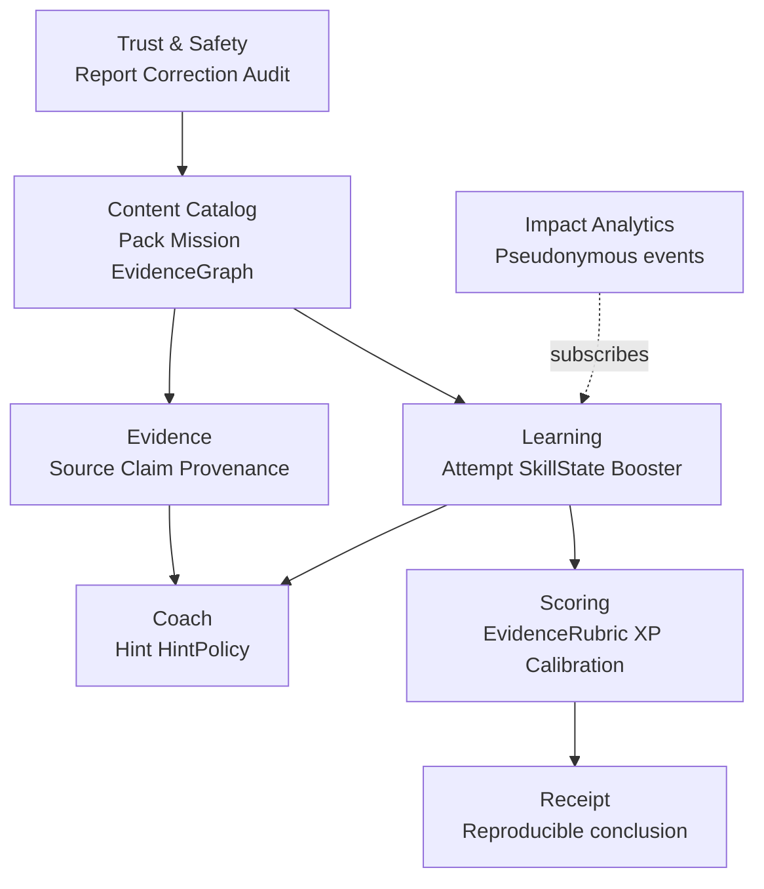

# Domain model

## Bounded contexts

## Core aggregates

### ScenarioPack

Root owns locale, audience, license, review status, semantic version, missions, media manifest, review/expiry dates. Published versions are immutable.

### Mission

Owns claim, presented context, allowed evidence actions, gold evidence graph, accepted conclusion ranges, hints, skill tags and safety/accessibility metadata.

### Attempt

Owns state transition, pre/post confidence, action log references, conclusion, share decision and selected pack version. It cannot silently move to a new mission version.

### Progress

Owns skill mastery and path position. XP is derived from an append-only ledger; cached totals are projections.

### EvidenceReceipt

Snapshot of mission version, learner actions, cited source records, conclusion, confidence delta, rubric and generated timestamp. A receipt is a learning record, not a legal certificate of truth.

## Value objects

- `Confidence`: integer 0–100 with explicit unknown/not-asked handling.
- `AxisAssessment`: label + confidence + rationale reference.
- `SourceRef`: canonical URL/identifier, publisher, retrievedAt, snapshot/hash when lawful.
- `EvidenceAction`: type, input, result references, cost, timestamp.
- `SkillTag`: stable enum with versioned taxonomy.
- `Locale`: BCP 47 tag.
- `ContentRisk`: age suitability, warning codes, reviewer decision.

## Invariants

- Published mission has at least two reviewers for sensitive/real-world content and no unresolved critical report.
- Attempt conclusion references the exact pack/mission version started.
- XP ledger entry is unique by `(attempt_id, rule_code)`.
- AI output cannot mutate gold evidence or scoring rules.
- `insufficient_evidence` is not equivalent to false.
- Authenticity, claim, and context axes remain independent.
