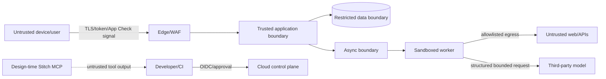

# Threat model

## Assets

Learner identity/consent; learning records and confidence; unpublished/source-pack content; provider/MCP/cloud credentials; integrity of missions, scoring and receipts; service availability; audit evidence; team/repository supply chain; reputation and user safety.

## Trust boundaries

## High-priority abuse cases

| ID | Threat | Impact | Required defenses |
|---|---|---|---|
| T01 | Broken object-level authorization on attempts/receipts | private learning data exposed | server derives subject, ownership checks, negative tests |
| T02 | Account/token theft | impersonation | short token validation, MFA for admins, revoke sessions, no client secrets |
| T03 | Prompt injection in page/document/MCP result | data/tool exfiltration, verdict manipulation | data/instruction separation, tool allowlist, no secrets, output validation |
| T04 | SSRF via Source Checker URL | metadata/internal network access | reject private/special IPs, DNS recheck, egress proxy/allowlist, size/time limits |
| T05 | Malicious media/parser exploit | RCE/resource exhaustion | quarantine, magic bytes, sandbox/no network, malware scan, limits |
| T06 | API/LLM cost DoS | outage/bill shock | per-user/IP/org limits, quotas, concurrency, budgets, circuit breaker |
| T07 | XP/replay/race abuse | integrity loss | idempotency, transaction/unique ledger, server scoring |
| T08 | Content/supply-chain poisoning | harmful or false lessons | schema/hash/signature, two-person review, pinned deps, SBOM |
| T09 | Secret leakage in repo/log/prompt/build | broad compromise | secret scanning, Secret Manager, redaction, rotation drills |
| T10 | CI/dependency compromise | code/cloud takeover | least-privilege OIDC, pinned actions/digests, protected env, provenance |
| T11 | Stored XSS/HTML or deep link abuse | client compromise/phishing | render text safely, sanitize allowlist, no WebView for evidence, deep-link validation |
| T12 | Database/ransomware/destructive admin | loss/unavailability | PITR/backups, isolated accounts, deletion approvals, restore drills |
| T13 | Doxxing/hate/graphic/CSAM uploads | human/legal harm | no UGC MVP, classifier/report/quarantine, specialist escalation, do not retain unnecessarily |
| T14 | Inference/profiling of political susceptibility | discrimination/trust loss | prohibit score, minimize analytics, aggregation thresholds |
| T15 | Hallucinated/forged citation | misinformation | provider cross-check, evidence IDs, `not_found != fabricated`, human gold review |

## Admin/content threats

Admin UI and publication are higher trust: phishing-resistant MFA, separated reviewer/publisher roles, re-authentication for publish/delete/export, immutable audit, break-glass account monitored, no daily use of owner credentials.

## Assumptions to validate

- MVP is 16+; expanding to younger users triggers child-safety/legal redesign.
- User open-URL/upload flow is not P0; enabling it activates T04/T05 controls before launch.
- Stitch is design-time only and receives no learner data.
- AI provider has acceptable data-retention/training configuration.

Review this threat model for every new trust boundary, data class, external API, MCP tool, file format, admin capability or public sharing feature.
